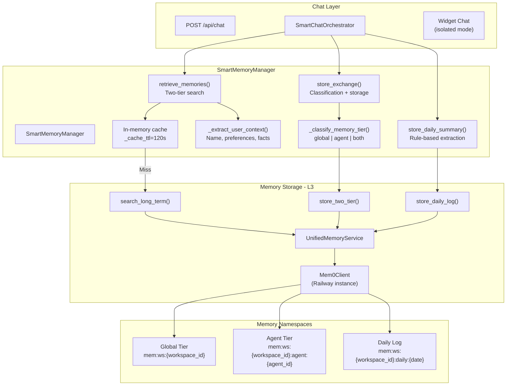
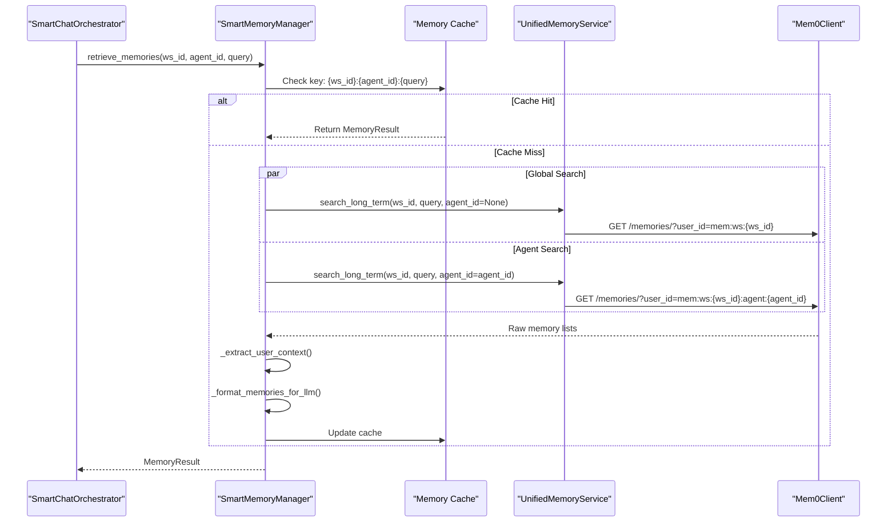
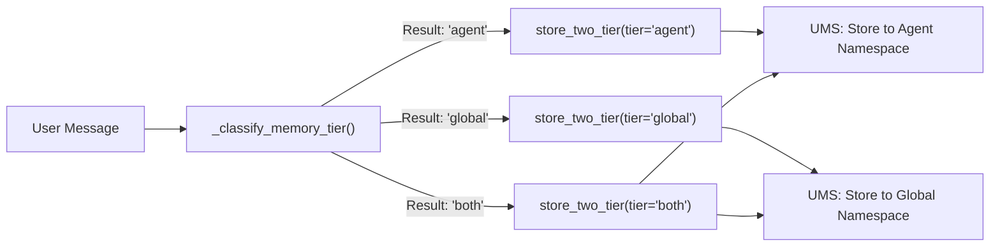

# SmartMemoryManager

Relevant source files

The following files were used as context for generating this wiki page:

- [docs/PRDS/137-AUTO-CHATBOT-RECOVERY.md](docs/PRDS/137-AUTO-CHATBOT-RECOVERY.md)
- [orchestrator/consumers/chatbot/integration.py](orchestrator/consumers/chatbot/integration.py)
- [orchestrator/consumers/chatbot/prompt_analyzer.py](orchestrator/consumers/chatbot/prompt_analyzer.py)
- [orchestrator/consumers/chatbot/smart_memory.py](orchestrator/consumers/chatbot/smart_memory.py)
- [orchestrator/consumers/chatbot/smart_orchestrator.py](orchestrator/consumers/chatbot/smart_orchestrator.py)
- [orchestrator/modules/agents/queries.py](orchestrator/modules/agents/queries.py)
- [orchestrator/modules/context/sections/identity.py](orchestrator/modules/context/sections/identity.py)
- [orchestrator/modules/context/sections/skills.py](orchestrator/modules/context/sections/skills.py)
- [orchestrator/modules/context/sections/task_context.py](orchestrator/modules/context/sections/task_context.py)
- [orchestrator/modules/memory/integrations/mem0_client.py](orchestrator/modules/memory/integrations/mem0_client.py)

The `SmartMemoryManager` provides intelligent memory management for chatbot interactions with two-tier memory retrieval (global workspace memories + agent-specific memories), smart storage classification, and daily activity logging. This system sits between the chat interface and the `UnifiedMemoryService`, orchestrating memory operations with workspace/agent scoping, caching, and user context extraction.

For lower-level memory storage operations, see [UnifiedMemoryService](3.2). For prompt assembly with memory injection, see [Context Service](4). For daily log retrieval in heartbeat operations, see [Heartbeat & Proactive Assistant](11).

---

## Architecture Overview

The `SmartMemoryManager` acts as the primary interface for the `SmartChatOrchestrator` to interact with the multi-layered memory system. It abstracts the complexity of searching across different `MemoryNamespace` scopes and handles the logic for extracting user-specific facts like names and preferences.

### System Data Flow

**Sources:**
- [orchestrator/consumers/chatbot/smart_memory.py:50-80]()
- [orchestrator/modules/memory/integrations/mem0_client.py:77-105]()

---

## Core Classes and Data Structures

### UserContext
A dataclass that holds extracted user facts from memories. This is used to personalize the system prompt.

| Field | Type | Description |
|-------|------|-------------|
| `name` | `Optional[str]` | User's name extracted from memories |
| `preferences` | `List[str]` | User preferences ("I prefer...", "I like...") |
| `facts` | `List[str]` | General facts about the user |
| `recent_topics` | `List[str]` | Recently discussed topics |
| `last_interaction` | `Optional[datetime]` | Timestamp of last interaction |

**Sources:**
- [orchestrator/consumers/chatbot/smart_memory.py:26-38]()

### MemoryResult
The unified return type for retrieval operations, containing both raw data and processed context.

| Field | Type | Description |
|-------|------|-------------|
| `memories` | `List[Dict[str, Any]]` | Raw memory items from Mem0 |
| `user_context` | `UserContext` | Extracted user context |
| `formatted_context` | `str` | LLM-ready formatted string |
| `retrieval_time_ms` | `float` | Query execution time |

**Sources:**
- [orchestrator/consumers/chatbot/smart_memory.py:42-47]()

### SmartMemoryManager
The central class managing chat memory. It uses lazy initialization for the `UnifiedMemoryService` via the `unified_service` property and maintains a 120-second TTL cache to reduce latency.

**Sources:**
- [orchestrator/consumers/chatbot/smart_memory.py:50-80]()

---

## Two-Tier Memory Retrieval

The system performs parallel searches across two distinct tiers to provide both general user context and agent-specific tool patterns.

### Retrieval Logic

1.  **Global Tier**: Searches memories scoped to the `workspace_id`. These contain facts about the user that apply across all agents (e.g., "User's name is Alice").
2.  **Agent Tier**: Searches memories scoped to the `workspace_id` AND `agent_id`. These contain patterns specific to how the user interacts with a particular agent's tools.

### Retrieval Sequence

**Sources:**
- [orchestrator/consumers/chatbot/smart_memory.py:174-193]()
- [orchestrator/modules/memory/integrations/mem0_client.py:215-240]()

### Widget Mode Isolation
When `widget_mode` is enabled (e.g., for embedded customer support bots), the `SmartMemoryManager` strictly restricts retrieval to the **Agent Tier** only. This prevents a widget user from accessing global workspace memories.

**Sources:**
- [orchestrator/consumers/chatbot/smart_memory.py:180-181]()
- [orchestrator/consumers/chatbot/smart_orchestrator.py:91-107]()

---

## Memory Storage Classification

The `_classify_memory_tier()` method determines where a conversation exchange should be stored based on keyword analysis of the user's message. It ignores the assistant's response to prevent tool names mentioned in explanations from causing false positives.

### Tier Selection Rules

| Category | Keywords | Target Tier |
| :--- | :--- | :--- |
| **Strong Agent** | "always cc", "default channel", "send to", "@" | `agent` |
| **Personal** | "my name", "i work at", "i live in" | `global` |
| **Tool/Workflow** | "slack", "github", "jira", "spreadsheet" | `agent` |
| **Preferences** | "prefer", "favorite", "my style" | `both` |
| **Mixed** | Personal + Tool keywords | `both` |

**Sources:**
- [orchestrator/consumers/chatbot/smart_memory.py:92-169]()

### Storage Process

**Sources:**
- [orchestrator/consumers/chatbot/smart_memory.py:155-169]()
- [orchestrator/consumers/chatbot/integration.py:106-129]()

---

## Daily Log System

The `SmartMemoryManager` maintains a temporal record of activities using the "Daily Log" system, identifying topics and tools used during sessions.

### Extraction Logic
The system uses regex to identify topics, tools (platform actions or external apps), and decisions. This is governed by system settings such as `memory_store_max_chars` (default 6000).

**Sources:**
- [orchestrator/consumers/chatbot/smart_memory.py:81-90]()
- [docs/PRDS/137-AUTO-CHATBOT-RECOVERY.md:82-84]()

### Log Storage and Retrieval
Logs are stored in Mem0 using a date-based namespace: `mem:ws:{workspace_id}:daily:{YYYY-MM-DD}`. When the orchestrator prepares a request, it retrieves recent logs to provide temporal context.

**Sources:**
- [orchestrator/consumers/chatbot/smart_orchestrator.py:191-193]()

---

## Circuit Breaker and Resilience

To prevent slow Mem0 responses from hanging the chat interface, the `Mem0Client` implements a circuit breaker and exponential backoff.

### Circuit Breaker Configuration
*   **Failure Threshold**: 3 consecutive failures (configurable via `MEM0_CIRCUIT_THRESHOLD`).
*   **Cooldown**: 300 seconds (configurable via `MEM0_CIRCUIT_COOLDOWN_SECONDS`).
*   **Max Retries**: 1 retry with exponential backoff.
*   **Timeout**: 3.0 seconds (configurable via `MEM0_TIMEOUT_SECONDS`).

**Sources:**
- [orchestrator/modules/memory/integrations/mem0_client.py:22-44]()
- [orchestrator/modules/memory/integrations/mem0_client.py:62-74]()
- [orchestrator/modules/memory/integrations/mem0_client.py:82-87]()
- [docs/PRDS/137-AUTO-CHATBOT-RECOVERY.md:68-68]()

---

## Configuration and Management

Memory behavior is configurable via the `ContextService` and system-wide LLM settings.

### Key Settings

| Setting | Key | Default | Description |
| :--- | :--- | :--- | :--- |
| **Max Chars** | `memory_store_max_chars` | 6000 | Characters sent to Mem0 for extraction |
| **Circuit Threshold** | `MEM0_CIRCUIT_THRESHOLD` | 3 | Failures before opening the breaker |
| **Circuit Cooldown** | `MEM0_CIRCUIT_COOLDOWN_SECONDS` | 300 | Time before retrying Mem0 after failure |
| **API Timeout** | `MEM0_TIMEOUT_SECONDS` | 3.0 | Maximum time for a single Mem0 request |

**Sources:**
- [orchestrator/consumers/chatbot/smart_memory.py:81-90]()
- [orchestrator/modules/memory/integrations/mem0_client.py:62-68]()
- [orchestrator/modules/memory/integrations/mem0_client.py:86-87]()

---

## Implementation Summary Table

| Component | File Path | Role |
| :--- | :--- | :--- |
| `SmartMemoryManager` | `orchestrator/consumers/chatbot/smart_memory.py` | Orchestration, Caching, Classification [orchestrator/consumers/chatbot/smart_memory.py:50-68]() |
| `Mem0Client` | `orchestrator/modules/memory/integrations/mem0_client.py` | Low-level API client, Circuit Breaker [orchestrator/modules/memory/integrations/mem0_client.py:77-105]() |
| `SmartChatIntegration` | `orchestrator/consumers/chatbot/integration.py` | Drop-in replacement for scattered memory logic [orchestrator/consumers/chatbot/integration.py:33-47]() |
| `SmartChatOrchestrator` | `orchestrator/consumers/chatbot/smart_orchestrator.py` | High-level coordinator for chat context [orchestrator/consumers/chatbot/smart_orchestrator.py:74-85]() |

**Sources:**
- [orchestrator/consumers/chatbot/smart_memory.py:50-68]()
- [orchestrator/modules/memory/integrations/mem0_client.py:77-105]()
- [orchestrator/consumers/chatbot/integration.py:33-47]()
- [orchestrator/consumers/chatbot/smart_orchestrator.py:74-85]()

---