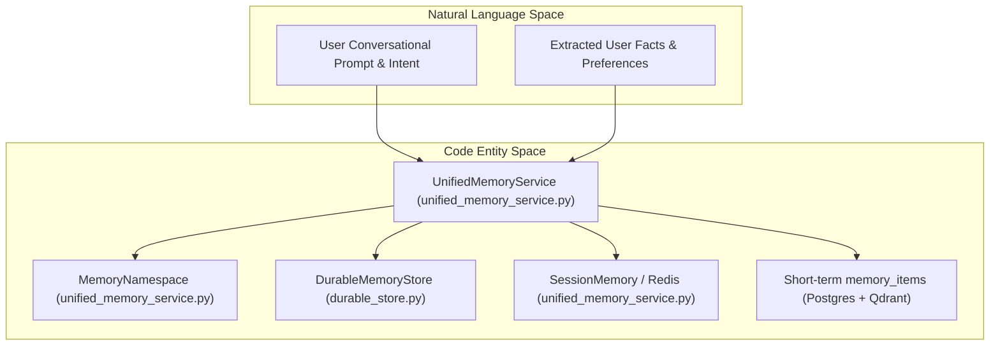
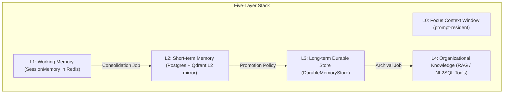
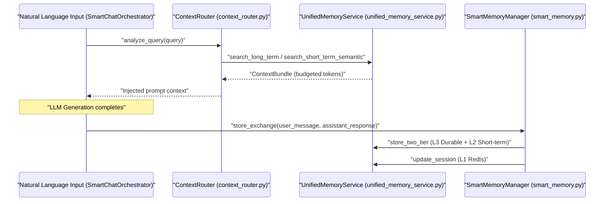

# UnifiedMemoryService

Relevant source files

The following files were used as context for generating this wiki page:

- [.gitleaksignore](.gitleaksignore)
- [Makefile](Makefile)
- [docs/PRDS/PRD-234-SESSION-MODE-SUBSCRIPTION-RUNTIME.md](docs/PRDS/PRD-234-SESSION-MODE-SUBSCRIPTION-RUNTIME.md)
- [docs/getting-started/self-hosting.md](docs/getting-started/self-hosting.md)
- [frontend/components/settings/GeneralSettingsTab.tsx](frontend/components/settings/GeneralSettingsTab.tsx)
- [frontend/components/settings/SessionModeTab.tsx](frontend/components/settings/SessionModeTab.tsx)
- [orchestrator/alembic/versions/prd206_chat_summary.py](orchestrator/alembic/versions/prd206_chat_summary.py)
- [orchestrator/consumers/chatbot/integration.py](orchestrator/consumers/chatbot/integration.py)
- [orchestrator/consumers/chatbot/smart_memory.py](orchestrator/consumers/chatbot/smart_memory.py)
- [orchestrator/consumers/chatbot/smart_orchestrator.py](orchestrator/consumers/chatbot/smart_orchestrator.py)
- [orchestrator/core/models/system_settings.py](orchestrator/core/models/system_settings.py)
- [orchestrator/core/seeds/seed_system_settings.py](orchestrator/core/seeds/seed_system_settings.py)
- [orchestrator/modules/context/sections/memory.py](orchestrator/modules/context/sections/memory.py)
- [orchestrator/modules/memory/context_router.py](orchestrator/modules/memory/context_router.py)
- [orchestrator/modules/memory/recall_ranking.py](orchestrator/modules/memory/recall_ranking.py)
- [orchestrator/modules/memory/thread_checkpoint.py](orchestrator/modules/memory/thread_checkpoint.py)
- [orchestrator/modules/memory/unified_memory_service.py](orchestrator/modules/memory/unified_memory_service.py)
- [orchestrator/modules/memory/write_contract.py](orchestrator/modules/memory/write_contract.py)
- [orchestrator/modules/tools/discovery/handlers_search.py](orchestrator/modules/tools/discovery/handlers_search.py)
- [orchestrator/services/cli_host_service.py](orchestrator/services/cli_host_service.py)
- [orchestrator/services/memory_archival_job.py](orchestrator/services/memory_archival_job.py)
- [orchestrator/services/memory_jobs.py](orchestrator/services/memory_jobs.py)
- [orchestrator/tests/test_l3_distill_input.py](orchestrator/tests/test_l3_distill_input.py)
- [orchestrator/tests/test_memory_restart_and_isolation.py](orchestrator/tests/test_memory_restart_and_isolation.py)
- [orchestrator/tests/test_memory_single_write_path.py](orchestrator/tests/test_memory_single_write_path.py)
- [orchestrator/tests/test_memory_stored_sse.py](orchestrator/tests/test_memory_stored_sse.py)
- [orchestrator/tests/test_p2w1_semantic_l2_recall.py](orchestrator/tests/test_p2w1_semantic_l2_recall.py)
- [orchestrator/tests/test_prd197_substrate.py](orchestrator/tests/test_prd197_substrate.py)
- [orchestrator/tests/test_prd206_recall_ranking.py](orchestrator/tests/test_prd206_recall_ranking.py)
- [orchestrator/tests/test_prd206_thread_checkpoint.py](orchestrator/tests/test_prd206_thread_checkpoint.py)
- [orchestrator/tests/test_prd206_write_contract.py](orchestrator/tests/test_prd206_write_contract.py)
- [orchestrator/tests/test_prd234_s1a_cli_hosts_realdb.py](orchestrator/tests/test_prd234_s1a_cli_hosts_realdb.py)
- [orchestrator/tests/test_recall_relevance_floor.py](orchestrator/tests/test_recall_relevance_floor.py)
- [orchestrator/tests/test_smart_orchestrator_store_exchange.py](orchestrator/tests/test_smart_orchestrator_store_exchange.py)
- [orchestrator/tests/test_system_settings_null_flags.py](orchestrator/tests/test_system_settings_null_flags.py)
- [orchestrator/tests/test_unified_memory.py](orchestrator/tests/test_unified_memory.py)
- [orchestrator/tests/test_us011_context_budgets.py](orchestrator/tests/test_us011_context_budgets.py)
- [services/cli-host/automatos_cli_host/allowlist.py](services/cli-host/automatos_cli_host/allowlist.py)
- [services/cli-host/automatos_cli_host/hook_server.py](services/cli-host/automatos_cli_host/hook_server.py)

The `UnifiedMemoryService` is the centralized memory management service providing a single entry point for all memory operations across the Automatos AI platform. It manages a 5-layer memory stack (L0–L4), ensuring consistent workspace scoping and preventing `user_id` format inconsistencies that previously led to cross-tenant data leaks [orchestrator/modules/memory/unified_memory_service.py:1-21]().

**Scope**: This page covers the `UnifiedMemoryService` API, the `MemoryNamespace` helper, memory tier operations (L1 session, L2 short-term semantic recall, L3 long-term durable store), the single write path contract, and integration with `SmartMemoryManager` and `ContextRouter`.

---

## Overview & Architecture

The `UnifiedMemoryService` holds a shared `DurableMemoryStore` (in-process Qdrant) and a Redis client, acting as the single facade across all tiers [orchestrator/modules/memory/unified_memory_service.py:161-195](). DB sessions are acquired per-request from the session pool — never stored on the singleton to prevent cross-tenant data leaks [orchestrator/modules/memory/unified_memory_service.py:161-169]().

Sources: [orchestrator/modules/memory/unified_memory_service.py:1-21](), [orchestrator/modules/memory/unified_memory_service.py:161-195]()

---

## MemoryNamespace: Standardized Scoping & Write Contract

The `MemoryNamespace` class is a frozen dataclass used to build standardized, scoped `user_id` strings for the durable store and Redis keys [orchestrator/modules/memory/unified_memory_service.py:38-46](). All memory consumers MUST use this helper instead of raw string concatenation.

### Namespace Formats

| Scope | Method | Format | Description |
|-------|--------|--------|-------------|
| Workspace-wide | `workspace()` | `mem:{workspace_id}` | L3 Global facts |
| Agent-specific | `agent(agent_id)` | `mem:{workspace_id}:agent:{agent_id}` | L3 Per-agent memories |
| Recipe learnings | `recipe(recipe_id)` | `mem:{workspace_id}:recipe:{recipe_id}` | L3 Per-recipe learnings |
| Workflow | `workflow(workflow_id)` | `mem:{workspace_id}:workflow:{workflow_id}` | L3 Per-workflow memories |
| Daily logs | `daily()` | `mem:{workspace_id}:daily` | L2 daily activity logs |
| L1 session | `session(conv_id)` | `mem:session:{workspace_id}:{conv_id}` | Redis session cache key |
| L2 Mirror | `l2()` | `mem:{workspace_id}:l2` | Qdrant namespace for L2 mirror |

Sources: [orchestrator/modules/memory/unified_memory_service.py:38-121]()

---

## UnifiedMemoryService API & Implementation

`UnifiedMemoryService` is implemented as a thread-safe singleton managed via `get_instance()` and `reset_instance()` [orchestrator/modules/memory/unified_memory_service.py:161-184](). It provides unified asynchronous methods across memory layers:

- `store_two_tier(...)`: Writes distilled facts to L3 durable store and short-term records to L2.
- `search_long_term(...)`: Queries L3 durable memory with optional agent scoping and Redis caching (`cache_key`) [orchestrator/modules/memory/unified_memory_service.py:88-92]().
- `update_session(...)` / `get_session(...)`: Manages L1 working memory state (`SessionMemory`) stored in Redis [orchestrator/modules/memory/unified_memory_service.py:127-155]().

Sources: [orchestrator/modules/memory/unified_memory_service.py:161-195](), [orchestrator/tests/test_unified_memory.py:143-149]()

---

## Five-Layer Memory Stack Mechanics

Sources: [orchestrator/modules/memory/unified_memory_service.py:8-21](), [orchestrator/services/memory_jobs.py:32-43]()

### L1: Working Memory (Redis Sessions)
Maintains conversation state via `SessionMemory`. Persists across browser refreshes within a 24-hour window, tracking summaries and exchange counts before consolidation into L2 [orchestrator/modules/memory/unified_memory_service.py:127-134]().

### L2: Short-term Semantic Recall
Short-term memory rows are stored in Postgres (`memory_items`) and mirrored into Qdrant under `mem:{ws}:l2` [orchestrator/tests/test_p2w1_semantic_l2_recall.py:1-17](). Retrieved via `search_short_term_semantic`, which increments `access_count` to track promotion eligibility [orchestrator/tests/test_p2w1_semantic_l2_recall.py:8-14]().

### L3: Long-term Durable Store
Stores distilled, typed facts (e.g., `user_fact`, `preference`, `task_learning`) rather than raw transcripts [orchestrator/tests/test_l3_distill_input.py:7-17](). Retrieved with composite ranking (semantic similarity, recency decay, and importance boost) [orchestrator/modules/memory/recall_ranking.py:1-7]().

### L4: Organizational Knowledge
On-demand retrieval layers such as RAG document search (`search_knowledge`) and `query_database` (NL2SQL), accessed via tool calls rather than pre-fetching [orchestrator/modules/memory/unified_memory_service.py:13-14]().

Sources: [orchestrator/modules/memory/unified_memory_service.py:8-21](), [orchestrator/consumers/chatbot/smart_memory.py:30-36](), [orchestrator/tests/test_p2w1_semantic_l2_recall.py:1-17]()

---

## Integration and Data Flow

Sources: [orchestrator/modules/memory/context_router.py:1-24](), [orchestrator/consumers/chatbot/smart_orchestrator.py:161-200](), [orchestrator/consumers/chatbot/smart_memory.py:151-200]()

---

## Background Lifecycle & Consolidation Jobs

The `MemoryJobScheduler` registers periodic background tasks via `UnifiedScheduler` [orchestrator/services/memory_jobs.py:32-43]():
- **Consolidation**: Contradiction-based merging and near-duplicate resolution in L3 [orchestrator/services/memory_jobs.py:6-9]().
- **Decay Scoring**: Hourly Ebbinghaus retention scoring on L2, archiving items below retention thresholds [orchestrator/services/memory_jobs.py:11-13]().
- **L2→L3 Promotion**: Daily promotion of high-importance L2 items into the L3 durable store [orchestrator/services/memory_jobs.py:15-18]().

Sources: [orchestrator/services/memory_jobs.py:1-43]()

---