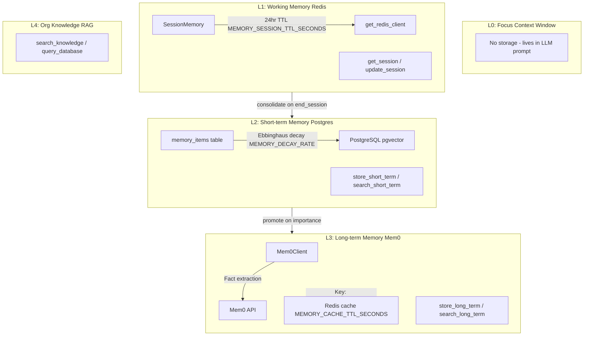
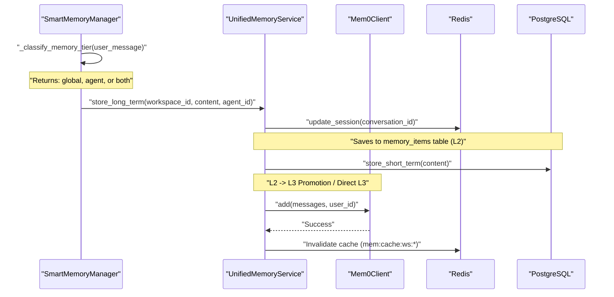

# UnifiedMemoryService

Relevant source files

The following files were used as context for generating this wiki page:

- [docs/PRDS/137-AUTO-CHATBOT-RECOVERY.md](docs/PRDS/137-AUTO-CHATBOT-RECOVERY.md)
- [frontend/tsconfig.tsbuildinfo](frontend/tsconfig.tsbuildinfo)
- [orchestrator/config.py](orchestrator/config.py)
- [orchestrator/consumers/chatbot/integration.py](orchestrator/consumers/chatbot/integration.py)
- [orchestrator/consumers/chatbot/prompt_analyzer.py](orchestrator/consumers/chatbot/prompt_analyzer.py)
- [orchestrator/consumers/chatbot/smart_memory.py](orchestrator/consumers/chatbot/smart_memory.py)
- [orchestrator/consumers/chatbot/smart_orchestrator.py](orchestrator/consumers/chatbot/smart_orchestrator.py)
- [orchestrator/main.py](orchestrator/main.py)
- [orchestrator/modules/agents/queries.py](orchestrator/modules/agents/queries.py)
- [orchestrator/modules/context/sections/identity.py](orchestrator/modules/context/sections/identity.py)
- [orchestrator/modules/context/sections/skills.py](orchestrator/modules/context/sections/skills.py)
- [orchestrator/modules/context/sections/task_context.py](orchestrator/modules/context/sections/task_context.py)
- [orchestrator/modules/memory/context_router.py](orchestrator/modules/memory/context_router.py)
- [orchestrator/modules/memory/integrations/mem0_client.py](orchestrator/modules/memory/integrations/mem0_client.py)
- [orchestrator/modules/memory/unified_memory_service.py](orchestrator/modules/memory/unified_memory_service.py)
- [orchestrator/tests/test_unified_memory.py](orchestrator/tests/test_unified_memory.py)
- [scripts/ralph/IMPLEMENTATION_PLAN.md](scripts/ralph/IMPLEMENTATION_PLAN.md)
- [scripts/ralph/prd.json](scripts/ralph/prd.json)
- [scripts/ralph/progress.txt](scripts/ralph/progress.txt)

The `UnifiedMemoryService` is the centralized memory management service providing a single entry point for all memory operations across the Automatos AI platform. It replaces fragmented `Mem0Client` instances with a shared service managing a 5-layer memory stack (L0–L4), ensuring consistent workspace scoping and preventing the `user_id` format inconsistencies that previously led to cross-tenant data leaks [orchestrator/modules/memory/unified_memory_service.py:1-21]().

**Scope**: This page covers the `UnifiedMemoryService` API, the `MemoryNamespace` helper, memory tier operations (L1 sessions, L2 short-term, L3 long-term), and integration patterns within the `SmartChatOrchestrator`.

---

## Architecture Overview

The `UnifiedMemoryService` orchestrates five memory tiers, each serving a distinct purpose in the agent's cognitive architecture.

### Five-Layer Memory Stack

**Sources**: [orchestrator/modules/memory/unified_memory_service.py:8-21](), [orchestrator/config.py:82-118]()

---

## MemoryNamespace: Standardized Scoping

The `MemoryNamespace` class is a frozen dataclass used to build standardized, scoped `user_id` strings for `Mem0` and `Redis` keys. All memory consumers MUST use this helper to prevent naming inconsistencies documented in PRD-79 [orchestrator/modules/memory/unified_memory_service.py:34-46]().

### Namespace Formats

| Scope | Method | Format | Example |
|-------|--------|--------|---------|
| Workspace-wide | `workspace()` | `mem:{workspace_id}` | `mem:ws-abc` |
| Agent-specific | `agent(agent_id)` | `mem:{workspace_id}:agent:{agent_id}` | `mem:ws-abc:agent:42` |
| Recipe learnings | `recipe(recipe_id)` | `mem:{workspace_id}:recipe:{recipe_id}` | `mem:ws-abc:recipe:10` |
| Workflow | `workflow(workflow_id)` | `mem:{workspace_id}:workflow:{workflow_id}` | `mem:ws-abc:workflow:99` |
| Daily logs | `daily()` | `mem:{workspace_id}:daily` | `mem:ws-abc:daily` |
| L1 session | `session(conversation_id)` | `mem:session:{workspace_id}:{conversation_id}` | `mem:session:ws-abc:c1` |
| L3 cache | `cache_key(agent_id, hash)` | `mem:cache:{workspace_id}:{scope}:{hash}` | `mem:cache:ws-abc:42:abc` |

**Sources**: [orchestrator/modules/memory/unified_memory_service.py:52-103]()

---

## L3: Long-term Memory (Mem0)

L3 stores facts extracted from conversations via Mem0's LLM-powered fact extraction. The `UnifiedMemoryService` manages a shared `Mem0Client` and handles result caching in Redis [orchestrator/modules/memory/unified_memory_service.py:177-187]().

### Mem0 Client Integration
The `Mem0Client` interacts with the Mem0 server using a `_CircuitBreaker` and exponential backoff to ensure reliability [orchestrator/modules/memory/integrations/mem0_client.py:27-63](). It converts message lists into a single text string for fact extraction by joining roles and content [orchestrator/modules/memory/integrations/mem0_client.py:192-198]().

### Reliability Mechanisms
- **Circuit Breaker**: After `MEM0_CIRCUIT_THRESHOLD` failures (default 3), the client skips calls for `MEM0_CIRCUIT_COOLDOWN_SECONDS` (default 300s) [orchestrator/modules/memory/integrations/mem0_client.py:29-60]().
- **Retries**: One retry with backoff is attempted for transient errors (429/5xx) [orchestrator/modules/memory/integrations/mem0_client.py:22-143]().

**Sources**: [orchestrator/modules/memory/integrations/mem0_client.py:143-165](), [orchestrator/modules/memory/unified_memory_service.py:154-187]()

---

## L1: Working Memory (Redis Sessions)

L1 maintains per-conversation session state in Redis, allowing agents to maintain context across browser refreshes [orchestrator/modules/memory/unified_memory_service.py:123-130]().

### SessionMemory Dataclass
Stores the current state of a conversation:
- `summary`: A running summary of the chat.
- `decisions`: A list of agreed-upon points.
- `action_items`: Tasks identified during the session.
- `exchange_count`: Number of messages processed [orchestrator/modules/memory/unified_memory_service.py:132-137]().

---

## Integration with Smart Memory Manager

The `SmartMemoryManager` provides an intelligent retrieval layer over the `UnifiedMemoryService`, implementing intent-based classification to decide which memory tier to query [orchestrator/consumers/chatbot/smart_memory.py:50-60]().

### Memory Storage and Classification Flow

**Sources**: [orchestrator/consumers/chatbot/smart_memory.py:91-168](), [orchestrator/modules/memory/unified_memory_service.py:154-187]()

---

## Chat Orchestration Integration

The `SmartChatOrchestrator` uses the `UnifiedMemoryService` to update session state and store exchange results during the chat loop [orchestrator/consumers/chatbot/smart_orchestrator.py:117-119]().

### Request Preparation Flow
1. **Intent Classification**: `IntentClassifier` determines if the query requires memory [orchestrator/consumers/chatbot/smart_orchestrator.py:161-167]().
2. **Complexity Assessment**: `AutoBrain` assessment can skip memory fetching if the complexity is low, unless the intent explicitly requires it [orchestrator/consumers/chatbot/smart_orchestrator.py:171-183]().
3. **Context Assembly**: `ContextService` invokes the `MemorySection` which calls `UnifiedMemoryService.search_long_term` and `search_short_term` [orchestrator/consumers/chatbot/smart_orchestrator.py:194-205]().

**Sources**: [orchestrator/consumers/chatbot/smart_orchestrator.py:74-205](), [orchestrator/consumers/chatbot/smart_memory.py:174-193]()

---

## Context Routing and Budgeting

Retrieval is budget-constrained per the `Config` settings. The `ContextRouter` (managed within the memory module) ensures that retrieved memories fit within LLM limits [orchestrator/config.py:90-97]().

### Token Budget Allocation

| Memory Layer | Config Variable | Default Tokens |
|--------------|-----------------|----------------|
| L1 Session | `CONTEXT_BUDGET_SESSION` | 500 |
| L3 Long-term | `CONTEXT_BUDGET_LONG_TERM` | 800 |
| L2 Temporal | `CONTEXT_BUDGET_TEMPORAL` | 600 |
| Daily Logs | `CONTEXT_BUDGET_DAILY` | 400 |
| Awareness | `CONTEXT_BUDGET_AWARENESS` | 200 |

**Sources**: [orchestrator/config.py:91-97](), [orchestrator/modules/memory/unified_memory_service.py:91-95]()

---