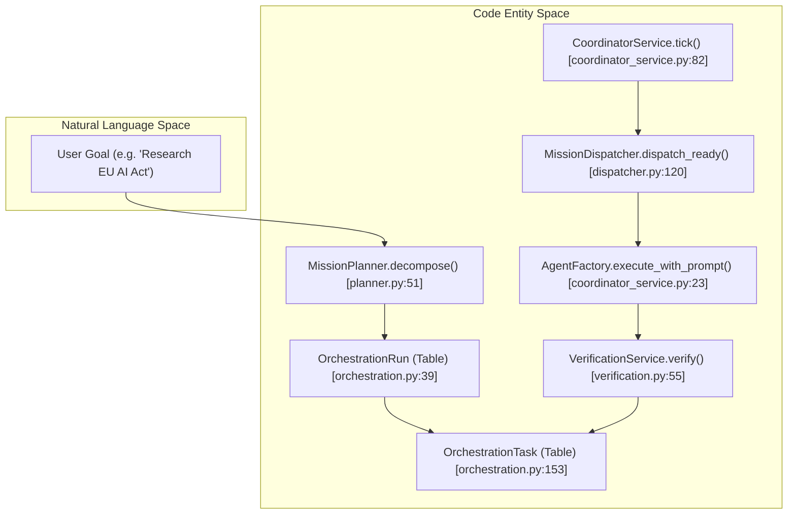
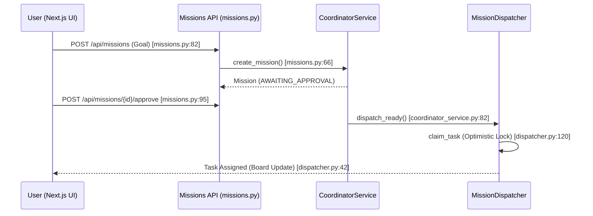

# Missions & Multi-Agent Coordination

Relevant source files

The following files were used as context for generating this wiki page:

- [frontend/components/missions/create-mission-modal.tsx](frontend/components/missions/create-mission-modal.tsx)
- [frontend/components/missions/human-review-panel.tsx](frontend/components/missions/human-review-panel.tsx)
- [frontend/components/missions/mission-field-panel.tsx](frontend/components/missions/mission-field-panel.tsx)
- [frontend/components/missions/mission-field-viz.tsx](frontend/components/missions/mission-field-viz.tsx)
- [frontend/components/missions/mission-results-panel.tsx](frontend/components/missions/mission-results-panel.tsx)
- [frontend/components/tools/tool-actions-modal.tsx](frontend/components/tools/tool-actions-modal.tsx)
- [frontend/components/tools/tool-details-modal.tsx](frontend/components/tools/tool-details-modal.tsx)
- [frontend/components/workflows/templates-tab.tsx](frontend/components/workflows/templates-tab.tsx)
- [frontend/types/missions.ts](frontend/types/missions.ts)
- [orchestrator/api/missions.py](orchestrator/api/missions.py)
- [orchestrator/core/services/mission_memory_service.py](orchestrator/core/services/mission_memory_service.py)
- [orchestrator/modules/coordination/dispatcher.py](orchestrator/modules/coordination/dispatcher.py)
- [orchestrator/modules/coordination/planner.py](orchestrator/modules/coordination/planner.py)
- [orchestrator/modules/coordination/reconciler.py](orchestrator/modules/coordination/reconciler.py)
- [orchestrator/modules/coordination/verification.py](orchestrator/modules/coordination/verification.py)
- [orchestrator/services/coordinator_service.py](orchestrator/services/coordinator_service.py)
- [orchestrator/services/orchestration_state.py](orchestrator/services/orchestration_state.py)
- [orchestrator/tests/test_budget_gate.py](orchestrator/tests/test_budget_gate.py)
- [orchestrator/tests/test_dispatcher_parallel.py](orchestrator/tests/test_dispatcher_parallel.py)

The Mission orchestration layer allows Automatos AI to move beyond single-agent tasks into complex goal execution. It provides a structured framework for decomposing high-level natural language goals into Directed Acyclic Graphs (DAGs) of tasks, which are then executed by specialized agents with integrated verification and human-in-the-loop oversight.

### Core Orchestration Flow

The system operates on a "DB-authoritative" principle, where the state of every mission is persisted in the database, and a stateless coordinator service reconciles this state on every tick [orchestrator/services/coordinator_service.py:9-10]().

The following diagram maps the flow from a user's natural language goal to the underlying code entities responsible for execution:

**Mission Execution Pipeline**

**Sources:** [orchestrator/services/coordinator_service.py:78-86](), [orchestrator/modules/coordination/planner.py:7-12](), [orchestrator/core/models/orchestration.py:39-153]()

---

## Mission Data Model (#22.1)

Missions are modeled as `OrchestrationRun` entities, which contain a collection of `OrchestrationTask` objects [orchestrator/core/models/orchestration.py:41-44](). The system uses a **dual-write pattern**: the current state is denormalized on the row for fast UI queries, while an append-only `OrchestrationEvent` log provides a full audit trail of every transition [orchestrator/services/orchestration_state.py:9-12]().

*   **State Machine:** Transitions through `INITIAL` → `ACTIVE` → `TERMINAL` state types [orchestrator/core/models/orchestration_enums.py:18-22]().
*   **Budgeting:** Tracks `budget_config` and `budget_spent` (JSONB) containing cost, tokens, and API call counts [orchestrator/core/models/orchestration.py:114-116]().
*   **Checkpointing:** Supports session checkpointing via `checkpoint_count` to allow long-running missions to resume from known good states [orchestrator/core/models/orchestration.py:111-112]().

For details, see [Mission Data Model](#22.1).
**Sources:** [orchestrator/core/models/orchestration.py:39-136](), [orchestrator/core/models/orchestration_enums.py:29-60](), [orchestrator/services/orchestration_state.py:9-12]()

---

## Coordinator Service & Dispatcher (#22.2)

The `CoordinatorService` is the heartbeat of the mission layer. It runs a 5-second "tick" loop that dispatches next tasks and reconciles active runs [orchestrator/services/coordinator_service.py:82-83]().

*   **MissionDispatcher:** Supports parallel dispatch up to `max_concurrent` tasks per tick [orchestrator/core/models/orchestration.py:102](). It employs **optimistic locking** via a raw SQL `UPDATE` with a `version_id` check to prevent double-dispatch in concurrent environments [orchestrator/modules/coordination/dispatcher.py:120-130]().
*   **MissionReconciler:** Handles stall detection (e.g., `ASSIGNED` > 60s, `RUNNING` > 300s) and triggers `VerificationService` for completed tasks [orchestrator/modules/coordination/reconciler.py:6-9]().
*   **Synthesis Overrides:** To save costs, synthesis tasks (consolidating prior step outputs) can be forced onto cheaper models like Gemini Flash or Haiku [orchestrator/services/coordinator_service.py:99-113]().

For details, see [Coordinator Service & Dispatcher](#22.2).
**Sources:** [orchestrator/services/coordinator_service.py:78-86](), [orchestrator/modules/coordination/dispatcher.py:120-178](), [orchestrator/modules/coordination/reconciler.py:1-10]()

---

## Mission Planning & Verification (#22.3)

Before a mission begins, the `MissionPlanner` decomposes the user's goal into a task DAG. It attempts **template matching** first (keyword-based) to ensure consistent high-quality graphs for common requests [orchestrator/modules/coordination/planner.py:8-9]().

*   **Complexity Detection:** Scores goal complexity based on word count, deliverable keywords (e.g., "report", "dashboard"), and domain breadth to set appropriate token budgets [orchestrator/modules/coordination/planner.py:158-181]().
*   **Verification Pipeline:** The `VerificationService` provides a two-stage review: deterministic structural checks and a cross-model LLM-as-judge scoring [orchestrator/modules/coordination/verification.py:5-7]().
*   **Cross-Model Principle:** The verifier model is automatically selected from a different family than the executor model to ensure objective critique [orchestrator/modules/coordination/verification.py:101-107]().

For details, see [Mission Planning & Verification](#22.3).
**Sources:** [orchestrator/modules/coordination/planner.py:1-15](), [orchestrator/modules/coordination/verification.py:1-16](), [orchestrator/modules/coordination/planner.py:184-196]()

---

## Mission UI & Human Review (#22.4)

The mission layer provides specialized endpoints and UI components for human-in-the-loop (HITL) interactions, including plan approval, rejection with feedback, and final output review [orchestrator/api/missions.py:15-17]().

**Mission Approval & Dispatch Sequence**

**Sources:** [orchestrator/api/missions.py:82-136](), [orchestrator/modules/coordination/dispatcher.py:120-178](), [frontend/components/missions/create-mission-modal.tsx:215-230]()

For details, see [Mission UI & Human Review](#22.4).

---

## Budget Governance & Telemetry (#22.5)

To prevent runaway costs, the mission layer enforces budget governance through `Power Modes` (light, standard, max) which cap tokens and tool iterations [orchestrator/services/coordinator_service.py:76-80]().

*   **Admission Gate:** The `CoordinatorService` monitors `budget_config` to trigger alerts or stop execution if limits are exceeded [orchestrator/core/models/orchestration.py:114-116]().
*   **Shared Field Visualization:** Active missions generate a "Shared Field" (Qdrant-backed) where agents share patterns and stability metrics, visualized in 3D [frontend/components/missions/mission-field-panel.tsx:157-166]().
*   **Outcome Telemetry:** Every state transition and significant event is logged to the `orchestration_events` table, providing a granular view of mission performance and cost [orchestrator/core/models/orchestration.py:7-9]().

For details, see [Budget Governance & Telemetry](#22.5).
**Sources:** [orchestrator/core/models/orchestration.py:114-116](), [orchestrator/services/coordinator_service.py:76-80](), [frontend/components/missions/mission-field-viz.tsx:35-61]()

---