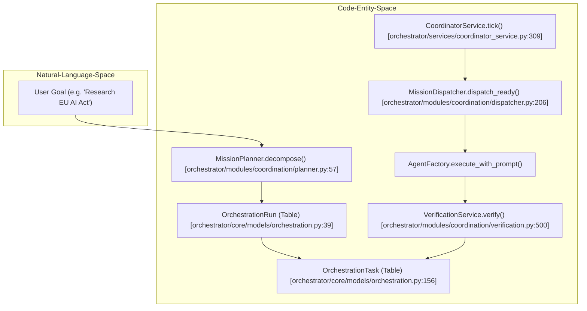
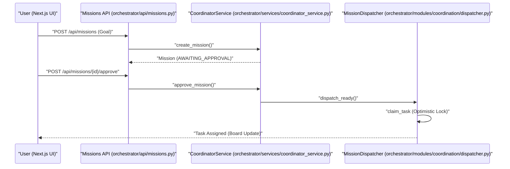

# Missions & Multi-Agent Coordination

Relevant source files

The following files were used as context for generating this wiki page:

- [frontend/components/missions/create-mission-modal.tsx](frontend/components/missions/create-mission-modal.tsx)
- [frontend/components/missions/index.ts](frontend/components/missions/index.ts)
- [frontend/components/missions/mission-card.tsx](frontend/components/missions/mission-card.tsx)
- [frontend/components/missions/mission-detail-page.tsx](frontend/components/missions/mission-detail-page.tsx)
- [frontend/components/missions/mission-field-inspector.tsx](frontend/components/missions/mission-field-inspector.tsx)
- [frontend/components/missions/mission-field-panel.tsx](frontend/components/missions/mission-field-panel.tsx)
- [frontend/components/missions/mission-field-viz.tsx](frontend/components/missions/mission-field-viz.tsx)
- [frontend/hooks/use-missions-api.ts](frontend/hooks/use-missions-api.ts)
- [frontend/types/missions.ts](frontend/types/missions.ts)
- [orchestrator/alembic/versions/prd123_checkpoint_count.py](orchestrator/alembic/versions/prd123_checkpoint_count.py)
- [orchestrator/api/missions.py](orchestrator/api/missions.py)
- [orchestrator/core/models/orchestration.py](orchestrator/core/models/orchestration.py)
- [orchestrator/core/models/orchestration_enums.py](orchestrator/core/models/orchestration_enums.py)
- [orchestrator/modules/context/adapters/vector_field.py](orchestrator/modules/context/adapters/vector_field.py)
- [orchestrator/modules/coordination/dispatcher.py](orchestrator/modules/coordination/dispatcher.py)
- [orchestrator/modules/coordination/planner.py](orchestrator/modules/coordination/planner.py)
- [orchestrator/modules/coordination/primitive_heartbeat.py](orchestrator/modules/coordination/primitive_heartbeat.py)
- [orchestrator/modules/coordination/reconciler.py](orchestrator/modules/coordination/reconciler.py)
- [orchestrator/modules/coordination/verification.py](orchestrator/modules/coordination/verification.py)
- [orchestrator/modules/memory/durable_store.py](orchestrator/modules/memory/durable_store.py)
- [orchestrator/services/coordinator_service.py](orchestrator/services/coordinator_service.py)
- [orchestrator/services/gdpr_service.py](orchestrator/services/gdpr_service.py)
- [orchestrator/tests/test_dispatcher_parallel.py](orchestrator/tests/test_dispatcher_parallel.py)
- [orchestrator/tests/test_mission_final_output_promotion.py](orchestrator/tests/test_mission_final_output_promotion.py)
- [orchestrator/tests/test_mission_retry_feeds_critique.py](orchestrator/tests/test_mission_retry_feeds_critique.py)
- [orchestrator/tests/test_p2w2_gdpr_subject_tags.py](orchestrator/tests/test_p2w2_gdpr_subject_tags.py)
- [orchestrator/tests/test_prd181_gdpr.py](orchestrator/tests/test_prd181_gdpr.py)
- [orchestrator/tests/test_w1s1_hotpath_telemetry.py](orchestrator/tests/test_w1s1_hotpath_telemetry.py)

The Mission orchestration layer allows Automatos AI to move beyond single-agent tasks into complex goal execution. It provides a structured framework for decomposing high-level natural language goals into Directed Acyclic Graphs (DAGs) of tasks, which are then executed by specialized agents with integrated verification and human-in-the-loop oversight.

### Core Orchestration Flow

The system operates on a "DB-authoritative" principle, where the state of every mission is persisted in the database, and a stateless coordinator service reconciles this state on every tick [orchestrator/services/coordinator_service.py:9-10]().

The following diagram maps the flow from a user's natural language goal to the underlying code entities responsible for execution:

**Mission Execution Pipeline**

**Sources:** [orchestrator/services/coordinator_service.py:1-17](), [orchestrator/modules/coordination/planner.py:1-15](), [orchestrator/core/models/orchestration.py:39-153]()

---

## Mission Data Model (#22.1)

Missions are modeled as `OrchestrationRun` entities, which contain a collection of `OrchestrationTask` objects [orchestrator/core/models/orchestration.py:41-44](). The system uses a **dual-write pattern**: the current state is denormalized on the row for fast UI queries, while an append-only `OrchestrationEvent` log provides a full audit trail of every transition [orchestrator/core/models/orchestration.py:7-9]().

*   **State Machine:** `RunState` and `TaskState` enums define the lifecycle, with `StateType` providing coarse-grained categories like `INITIAL`, `ACTIVE`, and `TERMINAL` [orchestrator/core/models/orchestration_enums.py:18-60]().
*   **Budgeting:** `OrchestrationRun` tracks `budget_config` and `budget_spent` (JSONB) containing cost, tokens, and API call counts [orchestrator/core/models/orchestration.py:112-113]().
*   **Optimistic Locking:** Uses `version_id` for concurrency control, ensuring that only one coordinator instance can transition a mission or task at a time [orchestrator/core/models/orchestration.py:137-139]().

For details, see [Mission Data Model](#22.1).
**Sources:** [orchestrator/core/models/orchestration.py:39-136](), [orchestrator/core/models/orchestration_enums.py:18-60]()

---

## Coordinator Service & Dispatcher (#22.2)

The `CoordinatorService` is the heartbeat of the mission layer. It runs a 5-second "tick" loop that dispatches next tasks and reconciles active runs [orchestrator/services/coordinator_service.py:5]().

*   **MissionDispatcher:** Supports parallel dispatch up to `max_concurrent` tasks per tick [orchestrator/core/models/orchestration.py:102](). It employs **optimistic locking** via a raw SQL `UPDATE` with a `version_id` check to prevent double-dispatch in concurrent environments [orchestrator/modules/coordination/dispatcher.py:120-130]().
*   **AgentMatcher:** Selects the best agent for a task based on the `agent_role` defined in the plan, using semantic similarity and role matching [orchestrator/modules/coordination/agent_matcher.py:53-54]().
*   **MissionReconciler:** Handles stall detection (e.g., `ASSIGNED` > 60s, `RUNNING` > 300s) and triggers `VerificationService` for completed tasks [orchestrator/modules/coordination/reconciler.py:6-9]().

For details, see [Coordinator Service & Dispatcher](#22.2).
**Sources:** [orchestrator/services/coordinator_service.py:1-17](), [orchestrator/modules/coordination/dispatcher.py:1-18](), [orchestrator/modules/coordination/reconciler.py:1-17]()

---

## Mission Planning & Verification (#22.3)

Before a mission begins, the `MissionPlanner` decomposes the user's goal into a task DAG. It attempts **template matching** first to ensure consistent high-quality graphs for common requests [orchestrator/modules/coordination/planner.py:8-9]().

*   **Goal Decomposition:** The `MissionPlanner` uses LLM decomposition if no template matches, and validates the resulting DAG for acyclicity and agent existence [orchestrator/modules/coordination/planner.py:9-10]().
*   **Complexity Detection:** Scores goal complexity based on word count, deliverable keywords (e.g., "report", "dashboard"), and domain breadth to set appropriate token budgets [orchestrator/modules/coordination/planner.py:178-186]().
*   **Verification Pipeline:** The `VerificationService` provides a two-stage review via deterministic structural checks and a cross-model LLM-as-judge scoring [orchestrator/modules/coordination/verification.py:5-7]().
*   **Cross-Model Principle:** The verifier model is automatically selected from a different family than the executor model (e.g., if GPT-4o executes, Claude 3.5 Sonnet verifies) to ensure objective critique [orchestrator/modules/coordination/verification.py:101-107]().

For details, see [Mission Planning & Verification](#22.3).
**Sources:** [orchestrator/modules/coordination/planner.py:1-15](), [orchestrator/modules/coordination/verification.py:1-16](), [orchestrator/modules/coordination/planner.py:178-186]()

---

## Mission UI & Human Review (#22.4)

The mission layer provides specialized components like `MissionDetailPage` and `MissionDAGCanvas` for visualization, alongside approval gates for plan review [frontend/components/missions/mission-detail-page.tsx:30-31]().

*   **Mission Detail Page:** Displays mission status, task progress, activity feed, and allows for human interaction such as pausing, resuming, or canceling a mission [frontend/components/missions/mission-detail-page.tsx:134-180]().
*   **Plan Approval:** Users can approve or reject a generated plan, with options to override `max_concurrent` tasks or `token_budget_estimate` [orchestrator/api/missions.py:95-106](). Task fields like `agent_role`, `title`, and `description` can be edited before approval [orchestrator/services/coordinator_service.py:98-101]().
*   **Mission Field Panel:** Visualizes the shared semantic field (`VectorFieldSharedContext`) where agents exchange knowledge, showing patterns, their strength, and access counts [frontend/components/missions/mission-field-panel.tsx:115-128]().

**Mission Approval & Dispatch Sequence**

**Sources:** [orchestrator/api/missions.py:82-136](), [orchestrator/services/coordinator_service.py:98-101](), [orchestrator/modules/coordination/dispatcher.py:120-178](), [frontend/components/missions/create-mission-modal.tsx:153-158](), [frontend/components/missions/mission-detail-page.tsx:134-180](), [frontend/components/missions/mission-field-panel.tsx:115-128]()

For details, see [Mission UI & Human Review](#22.4).

---

## Budget Governance & Telemetry (#22.5)

To prevent runaway costs, the mission layer enforces budget governance through `budget_config` and `budget_spent` tracking [orchestrator/core/models/orchestration.py:112-113]().

*   **Admission Gate:** The `CoordinatorService` monitors `token_budget_estimate` to trigger alerts or stop execution if limits are exceeded [orchestrator/core/models/orchestration.py:97-98]().
*   **Power Modes:** Missions can be run in `light`, `standard`, or `max` modes, which adjust `max_tool_iterations` and `timeout_seconds` [orchestrator/services/coordinator_service.py:91-95](). These are configurable via system settings [orchestrator/services/coordinator_service.py:85-86]().
*   **Mission Memory Service:** Captures task failures and retry recoveries to inform future planning and execution [orchestrator/modules/coordination/reconciler.py:64-89]().
*   **Outcome Telemetry:** Every state transition and significant event is logged to the `orchestration_events` table, providing a granular view of mission performance and cost [orchestrator/core/models/orchestration_enums.py:73-144]().

For details, see [Budget Governance & Telemetry](#22.5).
**Sources:** [orchestrator/core/models/orchestration.py:112-113](), [orchestrator/services/coordinator_service.py:91-95](), [orchestrator/services/coordinator_service.py:85-86](), [orchestrator/modules/coordination/reconciler.py:64-89](), [orchestrator/core/models/orchestration_enums.py:73-144]()

---