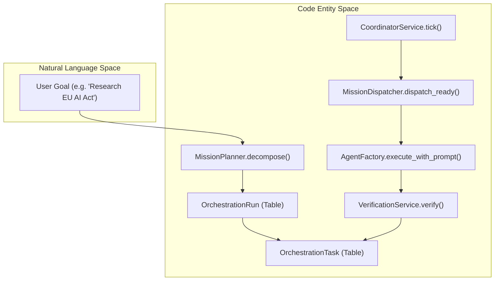
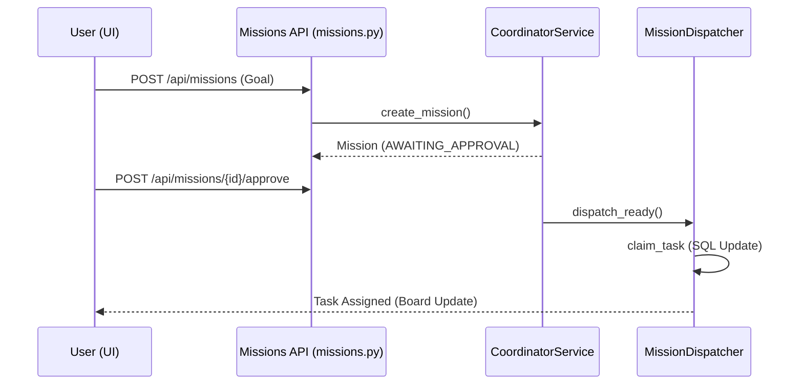

# Missions & Multi-Agent Coordination

Relevant source files

The following files were used as context for generating this wiki page:

- [docs/PRDS/102-COORDINATOR-ARCHITECTURE.md](docs/PRDS/102-COORDINATOR-ARCHITECTURE.md)
- [docs/PRDS/103-VERIFICATION-QUALITY.md](docs/PRDS/103-VERIFICATION-QUALITY.md)
- [frontend/app/missions/[id]/page.tsx](frontend/app/missions/[id]/page.tsx)
- [frontend/components/missions/human-review-panel.tsx](frontend/components/missions/human-review-panel.tsx)
- [frontend/components/missions/index.ts](frontend/components/missions/index.ts)
- [frontend/components/missions/mission-activity-feed.tsx](frontend/components/missions/mission-activity-feed.tsx)
- [frontend/components/missions/mission-card.tsx](frontend/components/missions/mission-card.tsx)
- [frontend/components/missions/mission-dag-canvas.tsx](frontend/components/missions/mission-dag-canvas.tsx)
- [frontend/components/missions/mission-detail-page.tsx](frontend/components/missions/mission-detail-page.tsx)
- [frontend/components/missions/mission-list.tsx](frontend/components/missions/mission-list.tsx)
- [frontend/components/missions/mission-results-panel.tsx](frontend/components/missions/mission-results-panel.tsx)
- [frontend/components/missions/mission-status-badge.tsx](frontend/components/missions/mission-status-badge.tsx)
- [frontend/components/missions/mission-task-node.tsx](frontend/components/missions/mission-task-node.tsx)
- [frontend/hooks/use-missions-api.ts](frontend/hooks/use-missions-api.ts)
- [frontend/types/missions.ts](frontend/types/missions.ts)
- [orchestrator/alembic/versions/prd123_checkpoint_count.py](orchestrator/alembic/versions/prd123_checkpoint_count.py)
- [orchestrator/api/missions.py](orchestrator/api/missions.py)
- [orchestrator/config.py](orchestrator/config.py)
- [orchestrator/core/context_guard.py](orchestrator/core/context_guard.py)
- [orchestrator/core/models/orchestration.py](orchestrator/core/models/orchestration.py)
- [orchestrator/core/models/orchestration_enums.py](orchestrator/core/models/orchestration_enums.py)
- [orchestrator/main.py](orchestrator/main.py)
- [orchestrator/modules/coordination/dispatcher.py](orchestrator/modules/coordination/dispatcher.py)
- [orchestrator/modules/coordination/planner.py](orchestrator/modules/coordination/planner.py)
- [orchestrator/modules/coordination/reconciler.py](orchestrator/modules/coordination/reconciler.py)
- [orchestrator/modules/memory/context_router.py](orchestrator/modules/memory/context_router.py)
- [orchestrator/modules/memory/unified_memory_service.py](orchestrator/modules/memory/unified_memory_service.py)
- [orchestrator/modules/tools/discovery/action_registry.py](orchestrator/modules/tools/discovery/action_registry.py)
- [orchestrator/modules/tools/execution/concurrency.py](orchestrator/modules/tools/execution/concurrency.py)
- [orchestrator/services/checkpoint_service.py](orchestrator/services/checkpoint_service.py)
- [orchestrator/services/coordinator_service.py](orchestrator/services/coordinator_service.py)
- [orchestrator/services/orchestration_state.py](orchestrator/services/orchestration_state.py)
- [orchestrator/tests/test_budget_gate.py](orchestrator/tests/test_budget_gate.py)
- [orchestrator/tests/test_complexity_detection.py](orchestrator/tests/test_complexity_detection.py)
- [orchestrator/tests/test_dispatcher_parallel.py](orchestrator/tests/test_dispatcher_parallel.py)
- [orchestrator/tests/test_unified_memory.py](orchestrator/tests/test_unified_memory.py)
- [scripts/ralph/IMPLEMENTATION_PLAN.md](scripts/ralph/IMPLEMENTATION_PLAN.md)
- [scripts/ralph/progress.txt](scripts/ralph/progress.txt)

The Mission orchestration layer allows Automatos AI to move beyond single-agent tasks into complex goal execution. It provides a structured framework for decomposing high-level natural language goals into Directed Acyclic Graphs (DAGs) of tasks, which are then executed by specialized agents with integrated verification and human-in-the-loop oversight.

### Core Orchestration Flow

The system operates on a "DB-authoritative" principle, where the state of every mission is persisted in the database, and a stateless coordinator service reconciles this state on every tick [orchestrator/services/coordinator_service.py:9-10]().

**Sources:** [orchestrator/services/coordinator_service.py:81-86](), [orchestrator/modules/coordination/planner.py:7-12](), [orchestrator/modules/coordination/dispatcher.py:10-16]()

---

## Mission Data Model (#22.1)

Missions are modeled as `OrchestrationRun` entities, which contain a collection of `OrchestrationTask` objects [orchestrator/core/models/orchestration.py:41-44](). The system uses a **dual-write pattern**: the current state is denormalized on the row for fast UI queries, while an append-only `OrchestrationEvent` log provides a full audit trail of every transition [orchestrator/core/models/orchestration.py:7-9]().

*   **State Machine:** Transitions through `INITIAL` → `ACTIVE` → `TERMINAL` state types [orchestrator/core/models/orchestration_enums.py:18-22]().
*   **Budgeting:** Tracks `budget_config` and `budget_spent` (JSONB) containing cost, tokens, and API call counts [orchestrator/core/models/orchestration.py:114-116]().
*   **Persistence:** All orchestration entities are stored in PostgreSQL using SQLAlchemy models [orchestrator/core/models/orchestration.py:12-25]().

For details, see [Mission Data Model](#22.1).
**Sources:** [orchestrator/core/models/orchestration.py:39-136](), [orchestrator/core/models/orchestration_enums.py:29-60]()

---

## Coordinator Service & Dispatcher (#22.2)

The `CoordinatorService` is the heartbeat of the mission layer. It runs a 5-second "tick" loop that dispatches next tasks and reconciles active runs [orchestrator/services/coordinator_service.py:82-83]().

*   **MissionDispatcher:** Supports parallel dispatch up to `max_concurrent` tasks per tick [orchestrator/modules/coordination/dispatcher.py:6-10](). It employs **optimistic locking** via a raw SQL `UPDATE` with `version_id` checks to prevent double-dispatch in concurrent environments [orchestrator/modules/coordination/dispatcher.py:126-130]().
*   **Agent Matching:** The dispatcher uses `AgentMatcher` to select the best available agent for a task based on `agent_role` [orchestrator/modules/coordination/dispatcher.py:41]().
*   **MissionReconciler:** Handles stall detection and consistency checks, ensuring that missions don't hang indefinitely [orchestrator/services/coordinator_service.py:54-55]().

For details, see [Coordinator Service & Dispatcher](#22.2).
**Sources:** [orchestrator/services/coordinator_service.py:78-86](), [orchestrator/modules/coordination/dispatcher.py:120-178](), [orchestrator/modules/coordination/dispatcher.py:140-160]()

---

## Mission Planning & Verification (#22.3)

Before a mission begins, the `MissionPlanner` decomposes the user's goal into a task DAG. It attempts **template matching** first to ensure consistent high-quality graphs for common requests [orchestrator/modules/coordination/planner.py:8-9]().

*   **Goal Decomposition:** If no template matches, the planner falls back to LLM-based decomposition [orchestrator/modules/coordination/planner.py:9-10]().
*   **Verification Pipeline:** The `VerificationService` provides a deterministic + LLM-as-judge pipeline to validate task outputs [orchestrator/services/coordinator_service.py:55]().
*   **Consistency Checks:** Cross-task consistency is verified to ensure the outputs of parallel tasks align [orchestrator/core/models/orchestration_enums.py:116-117]().

For details, see [Mission Planning & Verification](#22.3).
**Sources:** [orchestrator/modules/coordination/planner.py:1-15](), [orchestrator/services/coordinator_service.py:55](), [orchestrator/core/models/orchestration.py:230-232]()

---

## Mission UI & Human Review (#22.4)

The mission layer provides specialized endpoints for human-in-the-loop (HITL) interactions, including plan approval and output acceptance/rejection [orchestrator/api/missions.py:15-17]().

**Sources:** [orchestrator/api/missions.py:82-136](), [orchestrator/modules/coordination/dispatcher.py:140-160](), [orchestrator/services/coordinator_service.py:56-60]()

For details, see [Mission UI & Human Review](#22.4).

---

## Budget Governance & Telemetry (#22.5)

To prevent runaway costs, the mission layer enforces budget governance. Missions track `tokens_used` and cost-denominated spend [orchestrator/core/models/orchestration.py:98]().

*   **Admission Gate:** The coordinator monitors `BudgetStatus` (Healthy, Warning, Critical, Exceeded) to trigger alerts or stop execution [orchestrator/core/models/orchestration_enums.py:163-171]().
*   **Shared Context:** Missions utilize a shared vector field (PRD-108) to allow agents to share context without re-injecting large outputs into prompts [orchestrator/services/coordinator_service.py:107-112]().
*   **Telemetry:** Every state transition and significant event (e.g., `RUN_BUDGET_WARNING`, `TASK_VERIFICATION_FAILED`) is logged to the `orchestration_events` table [orchestrator/core/models/orchestration_enums.py:67-109]().

For details, see [Budget Governance & Telemetry](#22.5).
**Sources:** [orchestrator/core/models/orchestration.py:114-116](), [orchestrator/core/models/orchestration_enums.py:177-186](), [orchestrator/services/coordinator_service.py:176-181]()

---