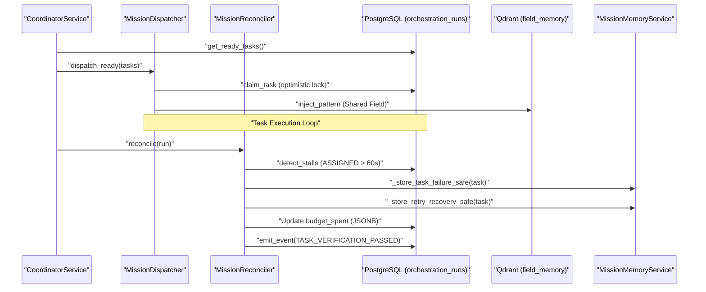

# Budget Governance & Telemetry

<details>
<summary>Relevant source files</summary>

The following files were used as context for generating this wiki page:

- [frontend/components/missions/create-mission-modal.tsx](frontend/components/missions/create-mission-modal.tsx)
- [frontend/components/missions/index.ts](frontend/components/missions/index.ts)
- [frontend/components/missions/mission-card.tsx](frontend/components/missions/mission-card.tsx)
- [frontend/components/missions/mission-detail-page.tsx](frontend/components/missions/mission-detail-page.tsx)
- [frontend/components/missions/mission-field-inspector.tsx](frontend/components/missions/mission-field-inspector.tsx)
- [frontend/components/missions/mission-field-panel.tsx](frontend/components/missions/mission-field-panel.tsx)
- [frontend/components/missions/mission-field-viz.tsx](frontend/components/missions/mission-field-viz.tsx)
- [frontend/hooks/use-missions-api.ts](frontend/hooks/use-missions-api.ts)
- [frontend/types/missions.ts](frontend/types/missions.ts)
- [orchestrator/alembic/versions/prd123_checkpoint_count.py](orchestrator/alembic/versions/prd123_checkpoint_count.py)
- [orchestrator/api/missions.py](orchestrator/api/missions.py)
- [orchestrator/api/widget_memory.py](orchestrator/api/widget_memory.py)
- [orchestrator/core/models/orchestration.py](orchestrator/core/models/orchestration.py)
- [orchestrator/core/models/orchestration_enums.py](orchestrator/core/models/orchestration_enums.py)
- [orchestrator/core/services/mission_memory_service.py](orchestrator/core/services/mission_memory_service.py)
- [orchestrator/modules/context/adapters/vector_field.py](orchestrator/modules/context/adapters/vector_field.py)
- [orchestrator/modules/coordination/dispatcher.py](orchestrator/modules/coordination/dispatcher.py)
- [orchestrator/modules/coordination/planner.py](orchestrator/modules/coordination/planner.py)
- [orchestrator/modules/coordination/primitive_heartbeat.py](orchestrator/modules/coordination/primitive_heartbeat.py)
- [orchestrator/modules/coordination/reconciler.py](orchestrator/modules/coordination/reconciler.py)
- [orchestrator/modules/coordination/verification.py](orchestrator/modules/coordination/verification.py)
- [orchestrator/modules/memory/durable_store.py](orchestrator/modules/memory/durable_store.py)
- [orchestrator/modules/memory/injection_filter.py](orchestrator/modules/memory/injection_filter.py)
- [orchestrator/modules/memory/resume_context.py](orchestrator/modules/memory/resume_context.py)
- [orchestrator/modules/tools/discovery/actions_marketplace.py](orchestrator/modules/tools/discovery/actions_marketplace.py)
- [orchestrator/modules/tools/discovery/actions_monitoring.py](orchestrator/modules/tools/discovery/actions_monitoring.py)
- [orchestrator/modules/tools/discovery/actions_playbooks.py](orchestrator/modules/tools/discovery/actions_playbooks.py)
- [orchestrator/modules/tools/discovery/actions_reports.py](orchestrator/modules/tools/discovery/actions_reports.py)
- [orchestrator/modules/tools/discovery/actions_workspace.py](orchestrator/modules/tools/discovery/actions_workspace.py)
- [orchestrator/modules/tools/discovery/handlers_monitoring.py](orchestrator/modules/tools/discovery/handlers_monitoring.py)
- [orchestrator/modules/tools/discovery/handlers_reports.py](orchestrator/modules/tools/discovery/handlers_reports.py)
- [orchestrator/modules/tools/discovery/handlers_workspace.py](orchestrator/modules/tools/discovery/handlers_workspace.py)
- [orchestrator/services/coordinator_service.py](orchestrator/services/coordinator_service.py)
- [orchestrator/services/gdpr_service.py](orchestrator/services/gdpr_service.py)
- [orchestrator/tests/test_dispatcher_parallel.py](orchestrator/tests/test_dispatcher_parallel.py)
- [orchestrator/tests/test_mission_final_output_promotion.py](orchestrator/tests/test_mission_final_output_promotion.py)
- [orchestrator/tests/test_mission_retry_feeds_critique.py](orchestrator/tests/test_mission_retry_feeds_critique.py)
- [orchestrator/tests/test_p2w2_gdpr_subject_tags.py](orchestrator/tests/test_p2w2_gdpr_subject_tags.py)
- [orchestrator/tests/test_prd181_gdpr.py](orchestrator/tests/test_prd181_gdpr.py)
- [orchestrator/tests/test_prd206_resume_context.py](orchestrator/tests/test_prd206_resume_context.py)
- [orchestrator/tests/test_w1s1_hotpath_telemetry.py](orchestrator/tests/test_w1s1_hotpath_telemetry.py)

</details>


The Budget Governance and Telemetry system provides the economic and observational guardrails for autonomous mission execution. It implements a cost-denominated token bucket for admission control, granular usage attribution to specific mission tasks, and a hybrid telemetry storage model that combines denormalized state with an append-only event log and shared semantic field snapshots.

## 1. Budget Governance & Admission Control

The platform implements a governance layer to prevent runaway costs during autonomous loops. This is managed via the `budget_config` and `budget_spent` fields on the `OrchestrationRun` model [orchestrator/core/models/orchestration.py:111-113]().

### 1.1 Token Bucket & Cost Tracking
Budgets are tracked at both the Mission Run (`OrchestrationRun`) and the individual Task (`OrchestrationTask`) levels.

*   **Budget Configuration:** The `budget_config` JSONB field stores limits such as `max_cost`, `max_tokens`, and `alert_at_pct` [orchestrator/core/models/orchestration.py:112-112]().
*   **Spent Tracking:** The `budget_spent` field provides a live counter of `cost`, `tokens`, and `api_calls` [orchestrator/core/models/orchestration.py:113-113]().
*   **Token Estimates:** The `MissionPlanner` calculates an initial `token_budget_estimate` by summing the complexity-based budgets for all planned tasks [orchestrator/modules/coordination/planner.py:169-175]().
*   **Hard Rejection:** If a mission exceeds its allocated budget, the system can trigger a `RUN_BUDGET_EXCEEDED` state transition [orchestrator/core/models/orchestration_enums.py:89-89]().
*   **Stop Reasons:** Missions that halt due to budget constraints are marked with `StopReason.BUDGET_EXHAUSTED` [orchestrator/core/models/orchestration_enums.py:185-185]().

### 1.2 Mission Power Modes
Governance is further refined by "Power Modes" which set caps for LLM tiers and tool iterations. These are defined in `_POWER_MODE_DEFAULTS` [orchestrator/services/coordinator_service.py:91-95](). These are fallback values, with live values configurable via `system_settings` [orchestrator/services/coordinator_service.py:86-87]().

| Mode | Max Tool Iterations | LLM Tier | Timeout |
| :--- | :--- | :--- | :--- |
| `light` | 5 | `system_llm` | 120s |
| `standard` | 10 | None (Agent Default) | 240s |
| `max` | 50 | `orchestrator_llm` | 600s |

**Sources:** [orchestrator/core/models/orchestration.py:94-116](), [orchestrator/core/models/orchestration_enums.py:162-192](), [orchestrator/services/coordinator_service.py:79-95](), [orchestrator/modules/coordination/planner.py:169-175]().

---

## 2. Telemetry & Outcome Storage

Automatos uses a hybrid storage pattern for telemetry, ensuring high-performance querying for the UI while maintaining a full audit trail.

### 2.1 Hybrid Data Model
1.  **Denormalized State (Task Rows):** Current state, output excerpts, and failure codes are stored on `OrchestrationTask` [orchestrator/core/models/orchestration.py:156-245]().
2.  **Append-only Event Log (`orchestration_events`):** Every transition is recorded as an immutable event in the `OrchestrationEvent` table [orchestrator/core/models/orchestration.py:279-325]().
3.  **Shared Field Memory:** High-fidelity semantic state is persisted in a shared Qdrant collection (`field_memory`), allowing agents to share "resonating" patterns rather than playing telephone [orchestrator/modules/context/adapters/vector_field.py:48-51]().

### 2.2 Event Schema
The `OrchestrationEvent` table captures the "Who, When, and Why" of every mission step using the `EventType` and `ActorType` enums [orchestrator/core/models/orchestration_enums.py:67-143]().

```mermaid
classDiagram
    class "OrchestrationEvent" {
        +UUID id
        +UUID run_id
        +UUID task_id
        +String event_type
        +String actor_type
        +String actor_id
        +String old_state
        +String new_state
        +JSONB payload
        +DateTime created_at
    }
    class "EventType" {
        <<enumeration>>
        TASK_STARTED
        TASK_OUTPUT_SUBMITTED
        RUN_BUDGET_WARNING
        STALL_DETECTED
        COST_SNAPSHOT
        CLARIFICATION_ANSWERED
        CLARIFICATION_ESCALATED
    }
    class "ActorType" {
        <<enumeration>>
        COORDINATOR
        AGENT
        VERIFIER
        HUMAN
        RECONCILER
        SYSTEM
        SCHEDULER
    }
    "OrchestrationEvent" ..> "EventType" : stores
    "OrchestrationEvent" ..> "ActorType" : attributes to
```
**Diagram: Orchestration Event Schema**
Sources: [orchestrator/core/models/orchestration.py:279-325](), [orchestrator/core/models/orchestration_enums.py:67-143]()

### 2.3 Mission Memory Service
The `MissionMemoryService` [orchestrator/core/services/mission_memory_service.py]() is responsible for capturing and storing critical mission-related events into memory. This includes:
*   **Task Failures:** Permanently failed tasks are stored to inform future planning [orchestrator/modules/coordination/reconciler.py:63-75]().
*   **Retry Recoveries:** Successful recoveries after a retry are recorded [orchestrator/modules/coordination/reconciler.py:78-89]().
This service ensures that the system learns from past mission outcomes, improving future performance and planning.

**Sources:** [orchestrator/core/models/orchestration.py:279-325](), [orchestrator/core/models/orchestration_enums.py:67-143](), [orchestrator/core/services/mission_memory_service.py](), [orchestrator/modules/coordination/reconciler.py:63-89]().

---

## 3. Ephemeral Contractor Agents & Roster Matching

For mission tasks, the system utilizes ephemeral configurations assigned to specific `agent_role` requirements.

### 3.1 Role-Based Selection & Claiming
*   **Role Requirements:** The mission plan assigns specific `agent_role` requirements to tasks (e.g., 'researcher') [orchestrator/core/models/orchestration.py:198-198]().
*   **Agent Matching:** `MissionDispatcher` uses `AgentMatcher` to resolve these roles to actual agent instances [orchestrator/modules/coordination/dispatcher.py:41-41]().
*   **Optimistic Claiming:** To prevent double-dispatch in parallel environments, the dispatcher uses a raw SQL `UPDATE` with a `version_id` check to claim tasks [orchestrator/modules/coordination/dispatcher.py:140-160]().
*   **Verification Guardrails:** The `VerificationService` provides advisory review using deterministic checks and "LLM-as-judge" logic [orchestrator/modules/coordination/verification.py:5-12]().

**Sources:** [orchestrator/core/models/orchestration.py:195-219](), [orchestrator/modules/coordination/dispatcher.py:140-160](), [orchestrator/modules/coordination/verification.py:1-16]().

---

## 4. Data Flow: Budget & Telemetry Integration

The coordination loop integrates execution with proactive governance and stall detection.


**Diagram: Mission Coordination Data Flow**
Sources: [orchestrator/modules/coordination/dispatcher.py:76-178](), [orchestrator/modules/coordination/reconciler.py:126-160](), [orchestrator/modules/context/adapters/vector_field.py:69-78](), [orchestrator/core/models/orchestration.py:111-113](), [orchestrator/modules/coordination/reconciler.py:63-89]()

---

## 5. Key Implementation Classes

### `MissionDispatcher`
Handles parallel dispatch logic. It enforces the `max_concurrent` limit and performs optimistic task claiming via raw SQL [orchestrator/modules/coordination/dispatcher.py:76-180]().

### `MissionReconciler`
Detects stalls (e.g., `ASSIGNED` > 60s) and triggers task recovery. It also handles the transition of completed tasks to the verification phase and integrates with `MissionMemoryService` to store outcomes [orchestrator/modules/coordination/reconciler.py:126-160]().

### `VectorFieldSharedContext`
Implements `SharedContextPort` using Qdrant. It manages "resonance" scoring (cosine² × strength) to allow agents to share a unified semantic space [orchestrator/modules/context/adapters/vector_field.py:68-78]().

### `OrchestrationRun`
The central state record. It tracks the `RunState`, `tokens_used`, and `budget_spent` JSONB for governance [orchestrator/core/models/orchestration.py:39-136]().

### `MissionMemoryService`
A dedicated service for capturing and storing mission outcomes, such as task failures and successful retries, to inform future planning and learning [orchestrator/core/services/mission_memory_service.py]().

**Sources:** [orchestrator/modules/coordination/dispatcher.py:76-180](), [orchestrator/modules/coordination/reconciler.py:126-160](), [orchestrator/modules/context/adapters/vector_field.py:68-78](), [orchestrator/core/models/orchestration.py:39-136](), [orchestrator/core/services/mission_memory_service.py]().

---