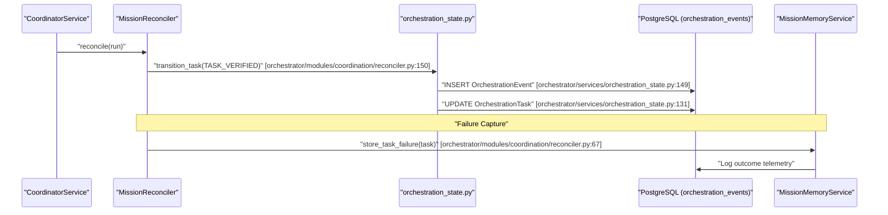

# Budget Governance & Telemetry

<details>
<summary>Relevant source files</summary>

The following files were used as context for generating this wiki page:

- [frontend/components/missions/create-mission-modal.tsx](frontend/components/missions/create-mission-modal.tsx)
- [frontend/components/missions/human-review-panel.tsx](frontend/components/missions/human-review-panel.tsx)
- [frontend/components/missions/mission-results-panel.tsx](frontend/components/missions/mission-results-panel.tsx)
- [frontend/types/missions.ts](frontend/types/missions.ts)
- [orchestrator/alembic/versions/prd139_tool_routing_graph.py](orchestrator/alembic/versions/prd139_tool_routing_graph.py)
- [orchestrator/alembic/versions/prd139_tool_routing_telemetry.py](orchestrator/alembic/versions/prd139_tool_routing_telemetry.py)
- [orchestrator/api/missions.py](orchestrator/api/missions.py)
- [orchestrator/core/models/__init__.py](orchestrator/core/models/__init__.py)
- [orchestrator/core/models/tool_routing.py](orchestrator/core/models/tool_routing.py)
- [orchestrator/core/services/mission_memory_service.py](orchestrator/core/services/mission_memory_service.py)
- [orchestrator/modules/coordination/planner.py](orchestrator/modules/coordination/planner.py)
- [orchestrator/modules/coordination/reconciler.py](orchestrator/modules/coordination/reconciler.py)
- [orchestrator/modules/coordination/verification.py](orchestrator/modules/coordination/verification.py)
- [orchestrator/modules/tools/discovery/graph_router.py](orchestrator/modules/tools/discovery/graph_router.py)
- [orchestrator/modules/tools/execution/exec_composio.py](orchestrator/modules/tools/execution/exec_composio.py)
- [orchestrator/modules/tools/execution/telemetry.py](orchestrator/modules/tools/execution/telemetry.py)
- [orchestrator/services/coordinator_service.py](orchestrator/services/coordinator_service.py)
- [orchestrator/services/orchestration_state.py](orchestrator/services/orchestration_state.py)
- [orchestrator/tests/test_graph_router.py](orchestrator/tests/test_graph_router.py)
- [orchestrator/tests/test_prd139_telemetry.py](orchestrator/tests/test_prd139_telemetry.py)
- [orchestrator/tests/test_seed_telemetry.py](orchestrator/tests/test_seed_telemetry.py)
- [orchestrator/tests/test_tool_routing_models.py](orchestrator/tests/test_tool_routing_models.py)

</details>


The Budget Governance and Telemetry system provides the economic and observational guardrails for autonomous mission execution. It implements a cost-denominated token bucket for admission control, granular usage attribution to specific mission tasks, and a hybrid telemetry storage model that combines denormalized state with an append-only event log and graph-based tool routing telemetry.

## 1. Budget Governance & Admission Control

The platform implements a governance layer to prevent runaway costs during autonomous loops. This is managed via the `budget_config` and `budget_spent` fields on the `OrchestrationRun` model [orchestrator/core/models/orchestration.py:114-116]().

### 1.1 Mission Power Modes
The `CoordinatorService` defines "Power Modes" that apply per-mission caps on model selection, token usage, and tool iterations [orchestrator/services/coordinator_service.py:76-80]().

| Mode | Max Tokens | Max Tool Iterations | LLM Tier |
| :--- | :--- | :--- | :--- |
| `light` | 2,000 | 5 | `system_llm` [orchestrator/services/coordinator_service.py:77]() |
| `standard` | 4,000 | 10 | Agent Default [orchestrator/services/coordinator_service.py:78]() |
| `max` | 16,000 | 50 | `orchestrator_llm` [orchestrator/services/coordinator_service.py:79]() |

### 1.2 Admission Control (Budget Gate)
Before a mission is approved, the `MissionPlanner` estimates the required token budget by summing the expected costs of each task's complexity tier [orchestrator/modules/coordination/planner.py:124-130]().

*   **Complexity Detection:** The system scores goals based on word count, deliverable keywords (e.g., "report", "pipeline"), and domain breadth to assign a `ComplexityTier` [orchestrator/modules/coordination/planner.py:184-210]().
*   **Token Allocation:** Each tier (e.g., `SMALL`, `MEDIUM`, `LARGE`) maps to a specific token budget defined in `COMPLEXITY_TOKEN_BUDGET` [orchestrator/modules/coordination/planner.py:124-130]().
*   **User Overrides:** Users can manually override the `token_budget_override` during the mission approval phase via `POST /api/missions/{id}/approve` [orchestrator/api/missions.py:100-102]().

**Sources:** [orchestrator/services/coordinator_service.py:76-80](), [orchestrator/modules/coordination/planner.py:124-210](), [orchestrator/api/missions.py:95-102]().

---

## 2. Telemetry & Outcome Storage

Automatos uses a hybrid storage pattern for telemetry, ensuring high-performance querying for the UI while maintaining a full audit trail.

### 2.1 Hybrid Data Model
1.  **Denormalized State (Task Rows):** Current state, output excerpts, and failure codes are stored on `OrchestrationTask` [orchestrator/core/models/orchestration.py:153-245]().
2.  **Append-only Event Log (`orchestration_events`):** Every transition is recorded as an immutable event in the `OrchestrationEvent` table [orchestrator/core/models/orchestration.py:276-322]().
3.  **Tool Routing Telemetry:** The system captures `used_after` signals between tool executions to build a probabilistic tool routing graph [orchestrator/core/models/tool_routing.py:53-75]().

### 2.2 Event Schema
The `OrchestrationEvent` table captures the "Who, When, and Why" of every mission step using the `EventType` and `ActorType` enums [orchestrator/core/models/orchestration_enums.py:67-138]().

```mermaid
classDiagram
    class "OrchestrationEvent" {
        +UUID id
        +UUID run_id
        +UUID task_id
        +String event_type
        +String actor_type
        +String actor_id
        +String old_state
        +String new_state
        +JSONB payload
        +DateTime created_at
    }
    class "EventType" {
        <<enumeration>>
        TASK_STARTED
        TASK_OUTPUT_SUBMITTED
        RUN_BUDGET_WARNING
        STALL_DETECTED
    }
    class "ActorType" {
        <<enumeration>>
        COORDINATOR
        AGENT
        VERIFIER
        HUMAN
    }
    "OrchestrationEvent" ..> "EventType" : "stores"
    "OrchestrationEvent" ..> "ActorType" : "attributes to"
```

**Sources:** [orchestrator/core/models/orchestration.py:276-322](), [orchestrator/core/models/orchestration_enums.py:67-138](), [orchestrator/core/models/tool_routing.py:53-75]().

---

## 3. Ephemeral Contractor Agents & Cost Optimization

For mission tasks that require specific capabilities, the system utilizes ephemeral configurations and model overrides to optimize for cost and speed.

### 3.1 Synthesis Model Overrides
The `CoordinatorService` implements a "Synthesis Override" pattern. Since synthesis tasks consolidate prior outputs and don't require premium reasoning, the system biases toward fast, cheap models (e.g., Gemini Flash or Claude Haiku) [orchestrator/services/coordinator_service.py:86-97]().

*   **Resolution:** `_resolve_synthesis_model` checks for active models in the global registry or workspace before applying an override [orchestrator/services/coordinator_service.py:99-113]().
*   **Runtime Mutation:** The `agent_runtime.llm_manager.config` is temporarily mutated for the duration of the task and restored afterward to prevent cache pollution [orchestrator/services/coordinator_service.py:157-185]().

### 3.2 Verification Guardrails
The `VerificationService` implements a cross-model review process. To maintain objectivity, it selects a verifier model from a different family than the executor (e.g., if the agent used GPT-4, the verifier might use Claude) [orchestrator/modules/coordination/verification.py:101-140]().

**Sources:** [orchestrator/services/coordinator_service.py:86-185](), [orchestrator/modules/coordination/verification.py:101-140]().

---

## 4. Data Flow: Coordination & Telemetry Integration

The coordination loop integrates state transitions with event emission. The `transition_task` and `transition_run` functions implement a dual-write pattern where the row update and event log append happen in the same transaction [orchestrator/services/orchestration_state.py:84-98]().



**Sources:** [orchestrator/services/orchestration_state.py:84-185](), [orchestrator/modules/coordination/reconciler.py:63-180](), [orchestrator/core/services/mission_memory_service.py:1-50]().

---

## 5. Key Implementation Classes

### `OrchestrationRun`
The central state record for a mission. It tracks `RunState`, `budget_spent` (JSONB), and `tokens_used` for the entire mission lifecycle [orchestrator/core/models/orchestration.py:39-136]().

### `OrchestrationTask`
Individual unit of work within a mission. It attributes costs (`tokens_used`) and records failure codes (e.g., `STALL`, `LLM_ERROR`) for granular telemetry [orchestrator/core/models/orchestration.py:153-245]().

### `MissionReconciler`
Stateless service that runs on every coordinator tick to detect stalled tasks and verify completions. It triggers the state transitions that generate telemetry events [orchestrator/modules/coordination/reconciler.py:116-140]().

### `UsageTracker` (via Tool Routing)
While not a single class, the `tool_routing_edges` and `tool_routing_affinities` tables act as a telemetry sink for tool usage patterns, tracking `sample_count` and `confidence` of tool chains [orchestrator/core/models/tool_routing.py:53-118]().

**Sources:** [orchestrator/core/models/orchestration.py:39-245](), [orchestrator/modules/coordination/reconciler.py:116-140](), [orchestrator/core/models/tool_routing.py:53-118]().

---