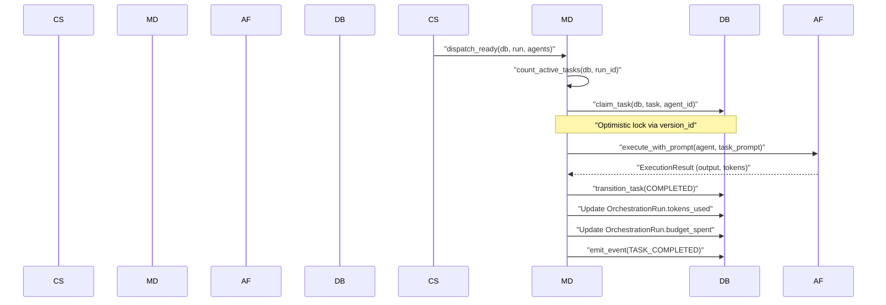

# Budget Governance & Telemetry

<details>
<summary>Relevant source files</summary>

The following files were used as context for generating this wiki page:

- [docs/PRDS/82C-PARALLEL-EXECUTION-BUDGET-DECOMPOSITION.md](docs/PRDS/82C-PARALLEL-EXECUTION-BUDGET-DECOMPOSITION.md)
- [orchestrator/alembic/versions/prd123_checkpoint_count.py](orchestrator/alembic/versions/prd123_checkpoint_count.py)
- [orchestrator/api/missions.py](orchestrator/api/missions.py)
- [orchestrator/config.py](orchestrator/config.py)
- [orchestrator/core/context_guard.py](orchestrator/core/context_guard.py)
- [orchestrator/core/models/orchestration.py](orchestrator/core/models/orchestration.py)
- [orchestrator/core/models/orchestration_enums.py](orchestrator/core/models/orchestration_enums.py)
- [orchestrator/main.py](orchestrator/main.py)
- [orchestrator/modules/coordination/dispatcher.py](orchestrator/modules/coordination/dispatcher.py)
- [orchestrator/modules/coordination/planner.py](orchestrator/modules/coordination/planner.py)
- [orchestrator/modules/coordination/reconciler.py](orchestrator/modules/coordination/reconciler.py)
- [orchestrator/modules/memory/context_router.py](orchestrator/modules/memory/context_router.py)
- [orchestrator/modules/memory/unified_memory_service.py](orchestrator/modules/memory/unified_memory_service.py)
- [orchestrator/modules/tools/discovery/action_registry.py](orchestrator/modules/tools/discovery/action_registry.py)
- [orchestrator/modules/tools/execution/concurrency.py](orchestrator/modules/tools/execution/concurrency.py)
- [orchestrator/services/checkpoint_service.py](orchestrator/services/checkpoint_service.py)
- [orchestrator/services/coordinator_service.py](orchestrator/services/coordinator_service.py)
- [orchestrator/services/orchestration_state.py](orchestrator/services/orchestration_state.py)
- [orchestrator/tests/test_budget_gate.py](orchestrator/tests/test_budget_gate.py)
- [orchestrator/tests/test_dispatcher_parallel.py](orchestrator/tests/test_dispatcher_parallel.py)
- [orchestrator/tests/test_unified_memory.py](orchestrator/tests/test_unified_memory.py)
- [scripts/ralph/IMPLEMENTATION_PLAN.md](scripts/ralph/IMPLEMENTATION_PLAN.md)
- [scripts/ralph/PROMPT_build.md](scripts/ralph/PROMPT_build.md)
- [scripts/ralph/archive/2026-03-21-82b-mission-intelligence/prd.json](scripts/ralph/archive/2026-03-21-82b-mission-intelligence/prd.json)
- [scripts/ralph/archive/2026-03-21-82b-mission-intelligence/progress.txt](scripts/ralph/archive/2026-03-21-82b-mission-intelligence/progress.txt)
- [scripts/ralph/archive/2026-03-24-prd-82c-parallel-budget/IMPLEMENTATION_PLAN.md](scripts/ralph/archive/2026-03-24-prd-82c-parallel-budget/IMPLEMENTATION_PLAN.md)
- [scripts/ralph/archive/2026-03-24-prd-82c-parallel-budget/prd.json](scripts/ralph/archive/2026-03-24-prd-82c-parallel-budget/prd.json)
- [scripts/ralph/archive/2026-03-24-prd-82c-parallel-budget/progress.txt](scripts/ralph/archive/2026-03-24-prd-82c-parallel-budget/progress.txt)
- [scripts/ralph/loop.sh](scripts/ralph/loop.sh)
- [scripts/ralph/prd.json](scripts/ralph/prd.json)
- [scripts/ralph/progress.txt](scripts/ralph/progress.txt)

</details>


The Budget Governance and Telemetry system provides the economic and observational guardrails for autonomous mission execution. It implements a cost-denominated token bucket for admission control, granular usage attribution to specific mission tasks, and a hybrid telemetry storage model that combines denormalized state with an append-only event log.

## 1. Budget Governance & Admission Control

The platform implements a governance layer to prevent runaway costs during autonomous loops. This is managed via the `budget_config` and `budget_spent` fields on the `OrchestrationRun` model [[orchestrator/core/models/orchestration.py:114-116]]().

### 1.1 Token Bucket & Cost Tracking
Budgets are tracked at both the Mission Run (`OrchestrationRun`) and the individual Task (`OrchestrationTask`) levels. 

*   **Budget Configuration:** The `budget_config` JSONB field stores limits such as `max_cost`, `max_tokens`, and `alert_at_pct` [[orchestrator/core/models/orchestration.py:115-115]]().
*   **Spent Tracking:** The `budget_spent` field provides a live counter of `cost`, `tokens`, and `api_calls` [[orchestrator/core/models/orchestration.py:116-116]]().
*   **Hard Rejection:** If a mission exceeds its allocated budget, the system can trigger a `RUN_BUDGET_EXCEEDED` state transition [[orchestrator/core/models/orchestration_enums.py:77-77]]().
*   **Soft Budget Tracking:** The `CoordinatorService` performs soft budget tracking and emits warning events when thresholds are approached [[orchestrator/services/coordinator_service.py:13-15]]().

### 1.2 Usage Attribution
Usage is attributed using a `mission_task_id` context. The system tracks consumption at the task level to enable granular ROI analysis.

| Entity | Field | Purpose |
| :--- | :--- | :--- |
| `OrchestrationRun` | `token_budget_estimate` | Initial estimate for the entire mission [[orchestrator/core/models/orchestration.py:97-97]]() |
| `OrchestrationRun` | `tokens_used` | Aggregate tokens consumed across all tasks [[orchestrator/core/models/orchestration.py:98-98]]() |
| `OrchestrationTask` | `tokens_used` | Specific consumption for one task attempt [[orchestrator/core/models/orchestration.py:240-240]]() |
| `OrchestrationRun` | `budget_spent` | JSONB breakdown of costs, tokens, and API calls [[orchestrator/core/models/orchestration.py:116-116]]() |

**Sources:** [[orchestrator/core/models/orchestration.py:94-116]](), [[orchestrator/services/coordinator_service.py:13-15]](), [[orchestrator/core/models/orchestration_enums.py:76-78]]().

---

## 2. Telemetry & Outcome Storage

Automatos uses a hybrid storage pattern for telemetry, ensuring high-performance querying for the UI while maintaining a full audit trail.

### 2.1 Hybrid Data Model
1.  **Denormalized State (Task Rows):** Current state, output excerpts, and failure codes are stored on `OrchestrationTask` [[orchestrator/core/models/orchestration.py:153-245]]().
2.  **Append-only Event Log (`orchestration_events`):** Every transition is recorded as an immutable event in the `OrchestrationEvent` table [[orchestrator/core/models/orchestration.py:276-322]]().
3.  **Mission History API:** Telemetry is exposed via endpoints like `/api/missions/{id}/events` and `/api/missions/{id}/cost` for detailed breakdowns [[orchestrator/api/missions.py:13-14]]().

### 2.2 Event Schema
The `OrchestrationEvent` table captures the "Who, When, and Why" of every mission step.

Title: Mission Event Telemetry Schema
```mermaid
classDiagram
    class "OrchestrationEvent" {
        +UUID id
        +UUID run_id
        +UUID task_id
        +String event_type
        +String actor_type
        +String actor_id
        +String old_state
        +String new_state
        +JSONB payload
        +DateTime created_at
    }
    class "EventType" {
        <<enumeration>>
        "RUN_BUDGET_WARNING"
        "TASK_CREATED"
        "TASK_COMPLETED"
        "TASK_VERIFICATION_FAILED"
    }
    "OrchestrationEvent" ..> "EventType" : "stores"
```

**Sources:** [[orchestrator/core/models/orchestration.py:276-322]](), [[orchestrator/core/models/orchestration_enums.py:66-113]](), [[orchestrator/api/missions.py:154-193]]().

---

## 3. Ephemeral Contractor Agents

For mission tasks that require specific models or isolated environments, the system utilizes ephemeral "Contractor" configurations.

### 3.1 Contractor Lifecycle & Diversity
*   **Model Selection:** The `MissionPlanner` can assign specific `agent_role` requirements to tasks [[orchestrator/core/models/orchestration.py:195-195]]().
*   **Agent Matching:** The `MissionDispatcher` uses an `AgentMatcher` to select the best active agent for a task role [[orchestrator/modules/coordination/dispatcher.py:41-41]]().
*   **Cognitive Diversity:** Verification criteria are stored in `OrchestrationTask.verification_criteria` [[orchestrator/core/models/orchestration.py:219-219]](), allowing the `VerificationService` to use different models for execution vs. verification.

**Sources:** [[orchestrator/core/models/orchestration.py:195-219]](), [[orchestrator/modules/coordination/dispatcher.py:41-41]]().

---

## 4. Data Flow: Budget & Telemetry Integration

The `CoordinatorService` and `MissionDispatcher` collaborate to update telemetry and enforce budget gates.

Title: Mission Execution & Budget Flow


**Sources:** [[orchestrator/modules/coordination/dispatcher.py:76-180]](), [[orchestrator/services/coordinator_service.py:78-86]](), [[orchestrator/core/models/orchestration.py:133-136]]().

---

## 5. Key Implementation Classes

### `CoordinatorService`
Main orchestration service running a 5s tick loop. It manages the mission lifecycle, handles parallel dispatch via the `MissionDispatcher`, and performs budget tracking [[orchestrator/services/coordinator_service.py:5-17]]().

### `MissionDispatcher`
Handles the atomic claiming of tasks using optimistic locking (`version_id`) and tracks token usage per task and per run [[orchestrator/modules/coordination/dispatcher.py:9-17]]().

### `MissionPlanner`
Decomposes goals into a task DAG. It attempts template matching first before falling back to LLM-based decomposition [[orchestrator/modules/coordination/planner.py:7-12]]().

### `ActionRegistry`
Central registry for platform actions. It manages `ActionDefinition` objects which include metadata for `permission_level`, `admin_only` status, and whether an action is `promoted` to a first-class schema [[orchestrator/modules/tools/discovery/action_registry.py:2-13]]().

**Sources:** [[orchestrator/services/coordinator_service.py:78-86]](), [[orchestrator/modules/coordination/dispatcher.py:76-81]](), [[orchestrator/modules/coordination/planner.py:1-15]](), [[orchestrator/modules/tools/discovery/action_registry.py:27-42]]().

---