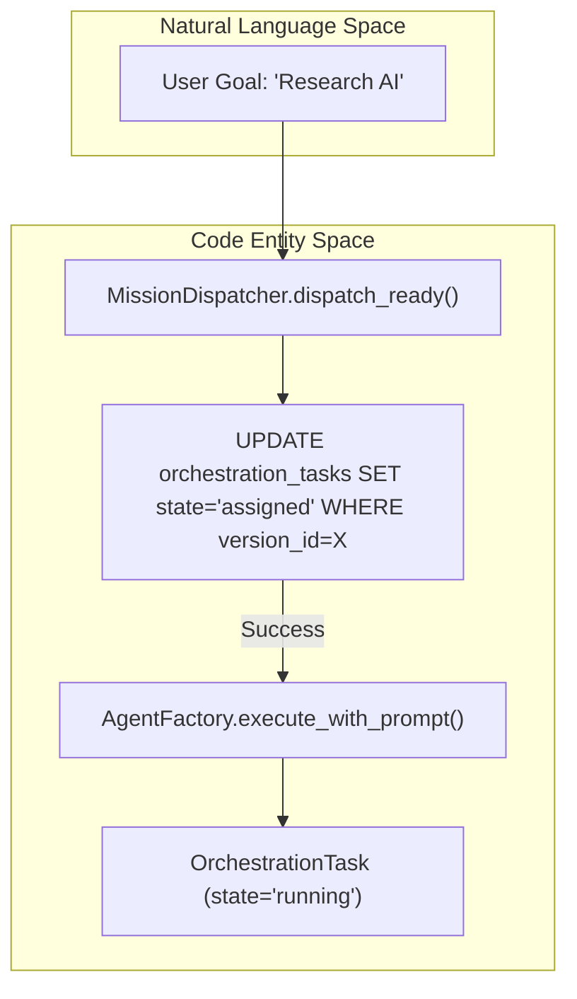
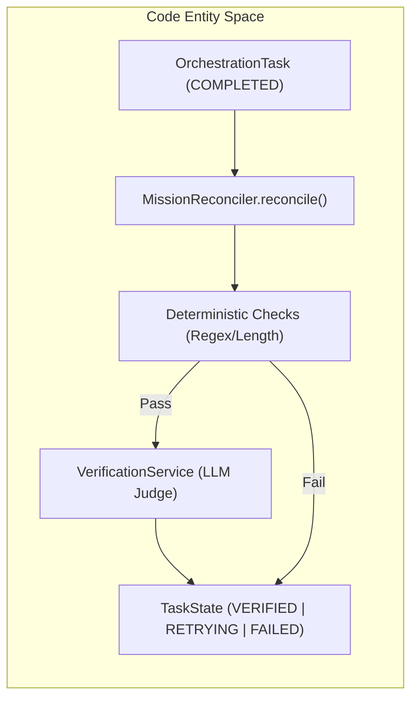

# Coordinator Service & Dispatcher

Relevant source files

The following files were used as context for generating this wiki page:

- [frontend/components/missions/mission-budget-bar.tsx](frontend/components/missions/mission-budget-bar.tsx)
- [frontend/components/missions/mission-field-panel.tsx](frontend/components/missions/mission-field-panel.tsx)
- [frontend/components/missions/mission-field-viz.tsx](frontend/components/missions/mission-field-viz.tsx)
- [frontend/package-lock.json](frontend/package-lock.json)
- [frontend/package.json](frontend/package.json)
- [frontend/yarn.lock](frontend/yarn.lock)
- [orchestrator/alembic/versions/prd123_checkpoint_count.py](orchestrator/alembic/versions/prd123_checkpoint_count.py)
- [orchestrator/api/missions.py](orchestrator/api/missions.py)
- [orchestrator/config.py](orchestrator/config.py)
- [orchestrator/core/context_guard.py](orchestrator/core/context_guard.py)
- [orchestrator/core/models/orchestration.py](orchestrator/core/models/orchestration.py)
- [orchestrator/core/models/orchestration_enums.py](orchestrator/core/models/orchestration_enums.py)
- [orchestrator/main.py](orchestrator/main.py)
- [orchestrator/modules/coordination/dispatcher.py](orchestrator/modules/coordination/dispatcher.py)
- [orchestrator/modules/coordination/planner.py](orchestrator/modules/coordination/planner.py)
- [orchestrator/modules/coordination/reconciler.py](orchestrator/modules/coordination/reconciler.py)
- [orchestrator/modules/coordination/verification.py](orchestrator/modules/coordination/verification.py)
- [orchestrator/modules/memory/context_router.py](orchestrator/modules/memory/context_router.py)
- [orchestrator/modules/memory/unified_memory_service.py](orchestrator/modules/memory/unified_memory_service.py)
- [orchestrator/modules/tools/discovery/action_registry.py](orchestrator/modules/tools/discovery/action_registry.py)
- [orchestrator/modules/tools/execution/concurrency.py](orchestrator/modules/tools/execution/concurrency.py)
- [orchestrator/services/checkpoint_service.py](orchestrator/services/checkpoint_service.py)
- [orchestrator/services/coordinator_service.py](orchestrator/services/coordinator_service.py)
- [orchestrator/services/orchestration_state.py](orchestrator/services/orchestration_state.py)
- [orchestrator/tests/test_82c_wiring.py](orchestrator/tests/test_82c_wiring.py)
- [orchestrator/tests/test_budget_gate.py](orchestrator/tests/test_budget_gate.py)
- [orchestrator/tests/test_dispatcher_parallel.py](orchestrator/tests/test_dispatcher_parallel.py)
- [orchestrator/tests/test_parallel_decomposition.py](orchestrator/tests/test_parallel_decomposition.py)
- [orchestrator/tests/test_unified_memory.py](orchestrator/tests/test_unified_memory.py)
- [scripts/ralph/IMPLEMENTATION_PLAN.md](scripts/ralph/IMPLEMENTATION_PLAN.md)
- [scripts/ralph/progress.txt](scripts/ralph/progress.txt)

The Coordinator Service and Dispatcher form the core execution engine for Missions (multi-agent orchestrations). This layer is responsible for the autonomous lifecycle of a mission, from initial task dispatching to verification and stall recovery. It operates as a stateless, database-authoritative service that ensures task execution across a distributed agent roster.

## Coordinator Service

The `CoordinatorService` is the primary orchestrator that manages the state machine of `OrchestrationRun` and `OrchestrationTask` entities. It runs as a background process within the system scheduler.

### 5-Second Tick Loop
The service implements a "tick" pattern, executing every 5 seconds to process active missions [orchestrator/services/coordinator_service.py:5-17](). This loop ensures that the system remains responsive to task completions and external state changes without maintaining long-lived connections.

**Tick Workflow:**
1.  **Poll Active Runs:** Queries `OrchestrationRun` records where `state` is `RUNNING` [orchestrator/services/coordinator_service.py:82]().
2.  **Dispatch Phase:** Invokes `MissionDispatcher.dispatch_ready()` to identify and start available tasks in the DAG [orchestrator/services/coordinator_service.py:11]().
3.  **Execution:** If tasks are dispatched, it calls `AgentFactory.execute_with_prompt` directly to run the agent logic [orchestrator/services/coordinator_service.py:22-24]().
4.  **Reconcile Phase:** Invokes `MissionReconciler.reconcile()` to detect stalled tasks, process verifications, and advance the mission state [orchestrator/services/coordinator_service.py:54]().

### Shared Mission Context (PRD-108)
Missions utilize a shared vector field (managed by `get_shared_context`) to provide inter-agent context [orchestrator/services/coordinator_service.py:95-105](). When a mission starts, a field is created and seeded with the mission goal [orchestrator/services/coordinator_service.py:132-135](). As tasks complete, their outputs are injected into this field to inform downstream agents [orchestrator/services/coordinator_service.py:188-194]().

**Sources:**
- `orchestrator/services/coordinator_service.py:5-105`()
- `orchestrator/services/coordinator_service.py:132-194`()
- `orchestrator/core/models/orchestration_enums.py:29-40`()

---

## Mission Dispatcher

The `MissionDispatcher` handles the logic of selecting the next task and assigning it to an agent. While originally sequential, it now supports parallel dispatch of tasks whose dependencies are met [orchestrator/modules/coordination/dispatcher.py:2-6]().

### Topological Sort & Dependency Resolution
The dispatcher uses a `DependencyResolver` to determine which tasks are "ready." A task is ready if its `TriggerRule` (e.g., `ALL_SUCCESS`) is satisfied by its upstream dependencies [orchestrator/modules/coordination/dispatcher.py:43-49]().

### Optimistic Locking with `version_id`
To prevent double-dispatching in a multi-node environment, the dispatcher uses a raw SQL optimistic lock pattern in `claim_task`:
- It attempts to update the task state from `queued` to `assigned` only if the `version_id` matches the one read during the current tick [orchestrator/modules/coordination/dispatcher.py:140-151]().
- It atomically increments the `version_id` and sets the `assigned_agent_id` [orchestrator/modules/coordination/dispatcher.py:143-146]().
- If `rowcount > 0`, the claim succeeded; otherwise, another instance claimed the task [orchestrator/modules/coordination/dispatcher.py:160-176]().

### Agent Selection
The `AgentMatcher` resolves the `agent_role` requested in the plan to a specific `Agent` ID within the workspace roster [orchestrator/modules/coordination/dispatcher.py:41](). If no matching agent is found, the task fails with `NO_AGENT_AVAILABLE` [orchestrator/modules/coordination/dispatcher.py:11-12]().

**Code-to-System Mapping: Dispatch Flow**

**Sources:**
- `orchestrator/modules/coordination/dispatcher.py:2-49`()
- `orchestrator/modules/coordination/dispatcher.py:140-176`()
- `orchestrator/core/models/orchestration_enums.py:144-151`()

---

## Mission Reconciler & Stall Detection

The `MissionReconciler` ensures missions do not get stuck due to agent crashes or timeouts.

### Stall Detection Logic
The reconciler identifies tasks that have exceeded their expected duration or heartbeat thresholds:
- **ASSIGNED Stalls:** Tasks stuck in `ASSIGNED` state without transitioning to `RUNNING`.
- **RUNNING Stalls:** Tasks that haven't updated their `updated_at` timestamp within the allowed window.

Stalled tasks are transitioned to `stalled` or `retrying` states, emitting a `STALL_DETECTED` event [orchestrator/core/models/orchestration_enums.py:108-111]().

### Verification Pipeline
When a task moves to `COMPLETED`, the Reconciler triggers the `VerificationService`:
1.  **Deterministic Checks:** Fast, regex-based or structural validation (e.g., `min_length`) [orchestrator/modules/coordination/planner.py:20-21]().
2.  **LLM Judge:** A "Judge" LLM evaluates the output against `verification_criteria` [orchestrator/services/coordinator_service.py:55]().

**Code-to-System Mapping: Verification Flow**

**Sources:**
- `orchestrator/services/coordinator_service.py:54-55`()
- `orchestrator/core/models/orchestration_enums.py:48-60`()
- `orchestrator/core/models/orchestration_enums.py:108-111`()

---

## Data Flow Summary

The coordination system relies on several tables to maintain state across ticks.

| Table | Purpose | Key Fields |
| :--- | :--- | :--- |
| `orchestration_runs` | Top-level mission state | `state`, `version_id`, `token_budget_estimate` [orchestrator/core/models/orchestration.py:72-134]() |
| `orchestration_tasks` | Individual units of work | `state`, `assigned_agent_id`, `version_id` [orchestrator/core/models/orchestration.py:198-231]() |
| `orchestration_task_dependencies` | DAG edges | `task_id`, `depends_on_task_id` [orchestrator/core/models/orchestration.py:7]() |
| `orchestration_events` | Audit log for state changes | `event_type`, `actor_type`, `payload` [orchestrator/core/models/orchestration_enums.py:67-135]() |

### State Transitions
The system strictly follows defined transitions managed by `orchestration_state`. For example, a task cannot move to `VERIFIED` without first passing through `COMPLETED` and `VERIFYING` [orchestrator/core/models/orchestration_enums.py:48-60]().

**Sources:**
- `orchestrator/core/models/orchestration.py:7-231`()
- `orchestrator/core/models/orchestration_enums.py:29-135`()
- `orchestrator/modules/coordination/dispatcher.py:140-160`()

---