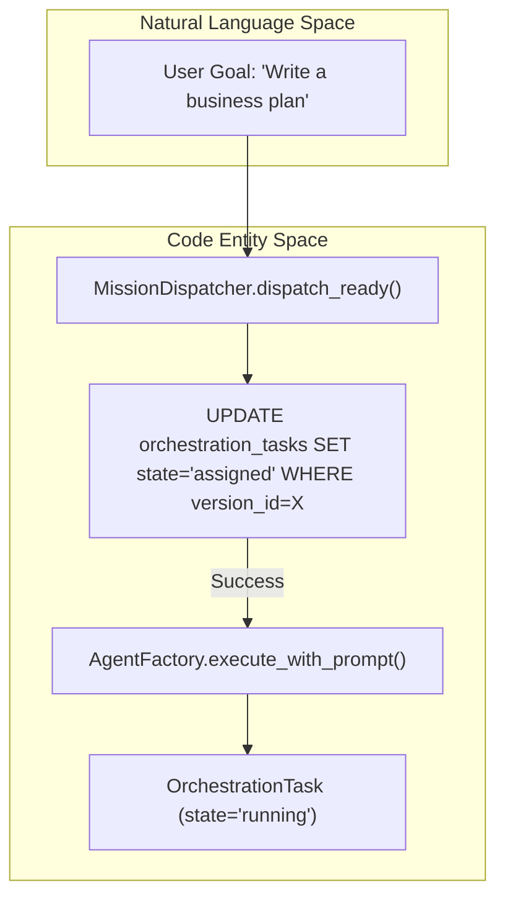
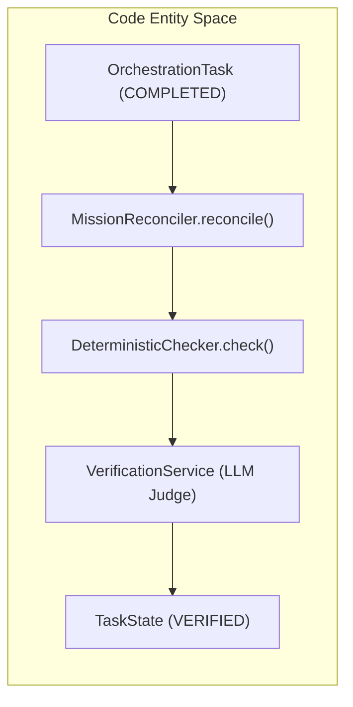

# Coordinator Service & Dispatcher

Relevant source files

The following files were used as context for generating this wiki page:

- [frontend/components/missions/create-mission-modal.tsx](frontend/components/missions/create-mission-modal.tsx)
- [frontend/components/missions/index.ts](frontend/components/missions/index.ts)
- [frontend/components/missions/mission-card.tsx](frontend/components/missions/mission-card.tsx)
- [frontend/components/missions/mission-detail-page.tsx](frontend/components/missions/mission-detail-page.tsx)
- [frontend/components/missions/mission-field-inspector.tsx](frontend/components/missions/mission-field-inspector.tsx)
- [frontend/components/missions/mission-field-panel.tsx](frontend/components/missions/mission-field-panel.tsx)
- [frontend/components/missions/mission-field-viz.tsx](frontend/components/missions/mission-field-viz.tsx)
- [frontend/hooks/use-missions-api.ts](frontend/hooks/use-missions-api.ts)
- [frontend/types/missions.ts](frontend/types/missions.ts)
- [orchestrator/alembic/versions/prd123_checkpoint_count.py](orchestrator/alembic/versions/prd123_checkpoint_count.py)
- [orchestrator/api/missions.py](orchestrator/api/missions.py)
- [orchestrator/core/models/orchestration.py](orchestrator/core/models/orchestration.py)
- [orchestrator/core/models/orchestration_enums.py](orchestrator/core/models/orchestration_enums.py)
- [orchestrator/modules/context/adapters/vector_field.py](orchestrator/modules/context/adapters/vector_field.py)
- [orchestrator/modules/coordination/__init__.py](orchestrator/modules/coordination/__init__.py)
- [orchestrator/modules/coordination/agent_matcher.py](orchestrator/modules/coordination/agent_matcher.py)
- [orchestrator/modules/coordination/dispatcher.py](orchestrator/modules/coordination/dispatcher.py)
- [orchestrator/modules/coordination/planner.py](orchestrator/modules/coordination/planner.py)
- [orchestrator/modules/coordination/primitive_heartbeat.py](orchestrator/modules/coordination/primitive_heartbeat.py)
- [orchestrator/modules/coordination/reconciler.py](orchestrator/modules/coordination/reconciler.py)
- [orchestrator/modules/coordination/templates.py](orchestrator/modules/coordination/templates.py)
- [orchestrator/modules/coordination/verification.py](orchestrator/modules/coordination/verification.py)
- [orchestrator/modules/memory/durable_store.py](orchestrator/modules/memory/durable_store.py)
- [orchestrator/services/coordinator_service.py](orchestrator/services/coordinator_service.py)
- [orchestrator/services/gdpr_service.py](orchestrator/services/gdpr_service.py)
- [orchestrator/tests/test_82c_wiring.py](orchestrator/tests/test_82c_wiring.py)
- [orchestrator/tests/test_agents_api_plugins.py](orchestrator/tests/test_agents_api_plugins.py)
- [orchestrator/tests/test_budget_gate.py](orchestrator/tests/test_budget_gate.py)
- [orchestrator/tests/test_coordinator_parallel.py](orchestrator/tests/test_coordinator_parallel.py)
- [orchestrator/tests/test_dispatcher_parallel.py](orchestrator/tests/test_dispatcher_parallel.py)
- [orchestrator/tests/test_mission_final_output_promotion.py](orchestrator/tests/test_mission_final_output_promotion.py)
- [orchestrator/tests/test_mission_retry_feeds_critique.py](orchestrator/tests/test_mission_retry_feeds_critique.py)
- [orchestrator/tests/test_p2w2_gdpr_subject_tags.py](orchestrator/tests/test_p2w2_gdpr_subject_tags.py)
- [orchestrator/tests/test_parallel_decomposition.py](orchestrator/tests/test_parallel_decomposition.py)
- [orchestrator/tests/test_planner_capability_routing.py](orchestrator/tests/test_planner_capability_routing.py)
- [orchestrator/tests/test_plugin_assignment_api.py](orchestrator/tests/test_plugin_assignment_api.py)
- [orchestrator/tests/test_plugin_runtime_integration.py](orchestrator/tests/test_plugin_runtime_integration.py)
- [orchestrator/tests/test_prd128_notification_dispatcher.py](orchestrator/tests/test_prd128_notification_dispatcher.py)
- [orchestrator/tests/test_prd181_gdpr.py](orchestrator/tests/test_prd181_gdpr.py)
- [orchestrator/tests/test_synthesis_executor.py](orchestrator/tests/test_synthesis_executor.py)
- [orchestrator/tests/test_w1s1_hotpath_telemetry.py](orchestrator/tests/test_w1s1_hotpath_telemetry.py)

The Coordinator Service and Dispatcher form the core execution engine for Missions (multi-agent orchestrations). This layer is responsible for the autonomous lifecycle of a mission, from initial goal decomposition and task dispatching to verification and stall recovery. It operates as a stateless, database-authoritative service that ensures reliable task execution across a distributed agent roster.

## Coordinator Service

The `CoordinatorService` is the primary orchestrator that manages the state machine of `OrchestrationRun` and `OrchestrationTask` entities. It serves as the glue between the planner, dispatcher, reconciler, and verifier [orchestrator/services/coordinator_service.py:5-17]().

### 5-Second Tick Loop
The service implements a "tick" pattern, executing every 5 seconds to process active missions. This loop ensures that the system remains responsive to task completions and external state changes without maintaining long-lived connections [orchestrator/services/coordinator_service.py:5-10]().

**Tick Workflow:**
1.  **Poll Active Runs:** Queries `OrchestrationRun` records where `state` is `ACTIVE` (e.g., `RUNNING`, `PAUSED`) [orchestrator/core/models/orchestration_enums.py:18-22]().
2.  **Dispatch Phase:** Invokes `MissionDispatcher.dispatch_ready` to identify and start available tasks in the DAG [orchestrator/modules/coordination/dispatcher.py:228-245]().
3.  **Execution:** If tasks are dispatched, it calls `AgentFactory.execute_with_prompt` directly to run the agent logic.
4.  **Reconcile Phase:** Invokes `MissionReconciler.reconcile` to detect stalled tasks, process verifications, and advance the mission state [orchestrator/modules/coordination/reconciler.py:126-147]().

### Mission Context & Planning
Missions are initiated via the `MissionCreateRequest` which accepts a natural language goal [orchestrator/api/missions.py:83-95](). The `MissionPlanner` then decomposes this goal into a task DAG [orchestrator/modules/coordination/planner.py:5-12]().
- **Goal Decomposition:** The planner uses either template matching or LLM-based decomposition to create a set of `PlannedTask` objects [orchestrator/modules/coordination/planner.py:7-12]().
- **Complexity Scoring:** Goals are analyzed for word count, deliverables, and domain breadth to assign a `ComplexityTier` (Simple, Moderate, Complex) [orchestrator/modules/coordination/planner.py:184-210]().
- **Budgeting:** Each task is assigned an estimated token budget based on its complexity tier [orchestrator/modules/coordination/planner.py:169-174]().
- **Power Modes:** Mission execution behavior (timeouts, tool iterations) is governed by `light`, `standard`, or `max` power modes [orchestrator/services/coordinator_service.py:91-95]().

**Sources:**
- `orchestrator/services/coordinator_service.py` [5-17, 91-95]()
- `orchestrator/api/missions.py` [83-95]()
- `orchestrator/modules/coordination/planner.py` [5-12, 169-174, 184-210]()
- `orchestrator/core/models/orchestration_enums.py` [18-40]()

---

## Mission Dispatcher

The `MissionDispatcher` handles the logic of selecting the next task and assigning it to an agent. It supports parallel dispatch of tasks whose dependencies are met [orchestrator/modules/coordination/dispatcher.py:2-6]().

### Topological Sort & Dependency Resolution
The dispatcher uses a `DependencyResolver` to determine which tasks are "ready." A task is ready if its upstream dependencies in the DAG are satisfied. It respects the `max_concurrent` limit defined in the mission configuration [orchestrator/modules/coordination/dispatcher.py:228-245]().

### Optimistic Locking with `version_id`
To prevent double-dispatching in multi-node environments, the dispatcher uses a raw SQL optimistic lock pattern in `claim_task`:
- It attempts to update the task state from `queued` or `retrying` to `assigned` only if the `version_id` matches the one read during the current tick [orchestrator/modules/coordination/dispatcher.py:140-151]().
- It atomically increments the `version_id` and sets the `assigned_agent_id` [orchestrator/modules/coordination/dispatcher.py:142-147]().
- If `result.rowcount > 0`, the claim succeeded; otherwise, another instance claimed the task [orchestrator/modules/coordination/dispatcher.py:160-178]().

### Agent Selection
The `AgentMatcher` resolves the `agent_role` requested in the plan to a specific `Agent` ID within the workspace roster [orchestrator/modules/coordination/dispatcher.py:41](). If no matching agent is found, the task fails with a `NO_AGENT_AVAILABLE` code [orchestrator/core/models/orchestration_enums.py:190]().

**Code-to-System Mapping: Dispatch Flow**

Sources:
- `orchestrator/modules/coordination/dispatcher.py` [2-18, 120-178, 228-245]()
- `orchestrator/core/models/orchestration_enums.py` [48-60, 190]()

---

## Mission Reconciler & Stall Detection

The `MissionReconciler` ensures missions do not get stuck due to agent crashes or timeouts.

### Stall Detection Logic
The reconciler identifies tasks that have exceeded their expected duration:
- **ASSIGNED Stalls:** Tasks stuck in `ASSIGNED` state without transitioning to `RUNNING` within 60 seconds [orchestrator/modules/coordination/reconciler.py:7]().
- **RUNNING Stalls:** Tasks that remain in `RUNNING` state for more than 300 seconds [orchestrator/modules/coordination/reconciler.py:7]().

Stalled tasks are transitioned to `stalled` state, emitting a `STALL_DETECTED` event [orchestrator/core/models/orchestration_enums.py:111-114](). The `escalate_stalled_task` service is then called to handle recovery [orchestrator/modules/coordination/reconciler.py:160-184]().

### Verification Pipeline
When a task moves to `COMPLETED`, the Reconciler triggers the `VerificationService`:
1.  **Deterministic Checks:** Fast validation (e.g., structural quality signals) [orchestrator/modules/coordination/verification.py:6-7]().
2.  **LLM Judge:** A cross-model LLM reviewer (different family than the executor) scores the output on relevance, completeness, accuracy, and format compliance [orchestrator/modules/coordination/verification.py:40-41, 102-141]().

**Code-to-System Mapping: Verification Flow**

Sources:
- `orchestrator/modules/coordination/reconciler.py` [1-17, 126-150, 160-184]()
- `orchestrator/modules/coordination/verification.py` [1-16, 40-41, 102-141]()
- `orchestrator/core/models/orchestration_enums.py` [111-114]()

---

## Data Flow & Models

The coordination system relies on `orchestration` models to maintain state across asynchronous ticks.

| Table | Purpose | Key Fields |
| :--- | :--- | :--- |
| `orchestration_runs` | Top-level mission state | `state`, `version_id`, `tokens_used`, `budget_config` |
| `orchestration_tasks` | Individual units of work | `state`, `assigned_agent_id`, `version_id`, `output` |
| `orchestration_events` | Audit log for state changes | `event_type`, `actor_type`, `old_state`, `new_state` |

### State Transitions
The system strictly follows defined transitions managed by `transition_task` and `transition_run`. These functions ensure a dual-write pattern: updating the entity row and appending an event to `orchestration_events` in a single transaction [orchestrator/services/orchestration_state.py:8-12]().

### Vector Field Shared Context
During mission execution, agents share knowledge through a `VectorFieldSharedContext` [orchestrator/modules/context/adapters/vector_field.py:3-17]().
- **Resonance:** Patterns injected by one agent become queryable by others in the same field, with relevance calculated as `cosine_similarity² × decayed_strength` [orchestrator/modules/context/adapters/vector_field.py:15-16, 69-78]().
- **Isolation:** Per-mission isolation is enforced via the `field_id` payload filter in a shared Qdrant collection [orchestrator/modules/context/adapters/vector_field.py:48-50]().

**Sources:**
- `orchestrator/core/models/orchestration.py` [39-154, 156-232]()
- `orchestrator/core/models/orchestration_enums.py` [29-60]()
- `orchestrator/modules/context/adapters/vector_field.py` [3-17, 69-78]()

---