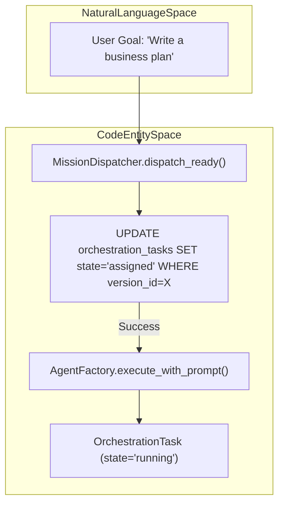
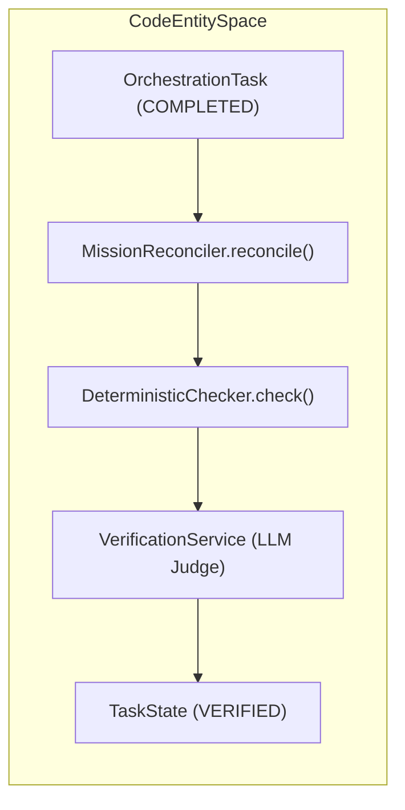

# Coordinator Service & Dispatcher

Relevant source files

The following files were used as context for generating this wiki page:

- [frontend/components/missions/create-mission-modal.tsx](frontend/components/missions/create-mission-modal.tsx)
- [frontend/components/missions/human-review-panel.tsx](frontend/components/missions/human-review-panel.tsx)
- [frontend/components/missions/mission-field-panel.tsx](frontend/components/missions/mission-field-panel.tsx)
- [frontend/components/missions/mission-field-viz.tsx](frontend/components/missions/mission-field-viz.tsx)
- [frontend/components/missions/mission-results-panel.tsx](frontend/components/missions/mission-results-panel.tsx)
- [frontend/components/tools/tool-actions-modal.tsx](frontend/components/tools/tool-actions-modal.tsx)
- [frontend/components/tools/tool-details-modal.tsx](frontend/components/tools/tool-details-modal.tsx)
- [frontend/components/workflows/templates-tab.tsx](frontend/components/workflows/templates-tab.tsx)
- [frontend/types/missions.ts](frontend/types/missions.ts)
- [orchestrator/api/missions.py](orchestrator/api/missions.py)
- [orchestrator/core/services/mission_memory_service.py](orchestrator/core/services/mission_memory_service.py)
- [orchestrator/modules/coordination/dispatcher.py](orchestrator/modules/coordination/dispatcher.py)
- [orchestrator/modules/coordination/planner.py](orchestrator/modules/coordination/planner.py)
- [orchestrator/modules/coordination/reconciler.py](orchestrator/modules/coordination/reconciler.py)
- [orchestrator/modules/coordination/verification.py](orchestrator/modules/coordination/verification.py)
- [orchestrator/services/coordinator_service.py](orchestrator/services/coordinator_service.py)
- [orchestrator/services/orchestration_state.py](orchestrator/services/orchestration_state.py)
- [orchestrator/tests/test_budget_gate.py](orchestrator/tests/test_budget_gate.py)
- [orchestrator/tests/test_dispatcher_parallel.py](orchestrator/tests/test_dispatcher_parallel.py)

The Coordinator Service and Dispatcher form the core execution engine for Missions (multi-agent orchestrations). This layer is responsible for the autonomous lifecycle of a mission, from initial goal decomposition and task dispatching to verification and stall recovery. It operates as a stateless, database-authoritative service that ensures reliable task execution across a distributed agent roster.

## Coordinator Service

The `CoordinatorService` is the primary orchestrator that manages the state machine of `OrchestrationRun` and `OrchestrationTask` entities. It serves as the glue between the planner, dispatcher, reconciler, and verifier [orchestrator/services/coordinator_service.py:5-17]().

### 5-Second Tick Loop
The service implements a "tick" pattern, executing every 5 seconds to process active missions. This loop ensures that the system remains responsive to task completions and external state changes without maintaining long-lived connections [orchestrator/services/coordinator_service.py:11]().

**Tick Workflow:**
1.  **Poll Active Runs:** Queries `OrchestrationRun` records where `state` is not in terminal states (e.g., `RUNNING`, `PLANNING`, `VERIFYING`) [orchestrator/core/models/orchestration_enums.py:45-47]().
2.  **Dispatch Phase:** Invokes `MissionDispatcher.dispatch_ready()` to identify and start available tasks in the DAG [orchestrator/modules/coordination/dispatcher.py:10-11]().
3.  **Execution:** If tasks are dispatched, it calls `AgentFactory.execute_with_prompt` directly to run the agent logic.
4.  **Reconcile Phase:** Invokes `MissionReconciler.reconcile()` to detect stalled tasks, process verifications, and advance the mission state [orchestrator/modules/coordination/reconciler.py:125-140]().

### Mission Context & Planning
Missions are initiated via the `MissionCreateRequest` which accepts a natural language goal [orchestrator/api/missions.py:82-89](). The `MissionPlanner` then decomposes this goal into a task DAG [orchestrator/modules/coordination/planner.py:1-15]().
- **Goal Decomposition:** The planner tries template matching first before falling back to LLM-based decomposition to create a set of `PlannedTask` objects [orchestrator/modules/coordination/planner.py:7-12]().
- **Complexity Scoring:** Goals are analyzed for word count, deliverables, and domain breadth to assign a `ComplexityTier` (Simple, Moderate, Complex) [orchestrator/modules/coordination/planner.py:184-210]().
- **Power Modes:** Missions can run in `light`, `standard`, or `max` modes, which apply caps on tokens and tool iterations [orchestrator/services/coordinator_service.py:76-80]().

**Sources:**
- `orchestrator/services/coordinator_service.py` [5-17, 76-80]()
- `orchestrator/api/missions.py` [82-89]()
- `orchestrator/modules/coordination/planner.py` [1-15, 124-130, 184-210]()
- `orchestrator/core/models/orchestration_enums.py` [45-47]()

---

## Mission Dispatcher

The `MissionDispatcher` handles the logic of selecting the next task and assigning it to an agent. It supports parallel dispatch of tasks whose dependencies are met [orchestrator/modules/coordination/dispatcher.py:2-6]().

### Topological Sort & Dependency Resolution
The dispatcher uses a `DependencyResolver` to determine which tasks are "ready." A task is ready if its upstream dependencies in the DAG are satisfied. It respects the `max_concurrent` limit defined in the mission configuration [orchestrator/modules/coordination/dispatcher.py:84-102]().

### Optimistic Locking with `version_id`
To prevent double-dispatching in multi-node environments, the dispatcher uses a raw SQL optimistic lock pattern in `claim_task`:
- It attempts to update the task state from `queued` or `retrying` to `assigned` only if the `version_id` matches the one read during the current tick [orchestrator/modules/coordination/dispatcher.py:141-151]().
- It atomically increments the `version_id` and sets the `assigned_agent_id` [orchestrator/modules/coordination/dispatcher.py:143-146]().
- If `result.rowcount > 0`, the claim succeeded; otherwise, another instance claimed the task [orchestrator/modules/coordination/dispatcher.py:160-178]().

### Agent Selection
The `AgentMatcher` resolves the `agent_role` requested in the plan to a specific `Agent` ID within the workspace roster [orchestrator/modules/coordination/dispatcher.py:41](). If no matching agent is found, the task fails with a `NO_AGENT_AVAILABLE` code [orchestrator/core/models/orchestration_enums.py:36]().

**Code-to-System Mapping: Dispatch Flow**

**Sources:**
- `orchestrator/modules/coordination/dispatcher.py` [2-18, 84-102, 140-178]()
- `orchestrator/core/models/orchestration_enums.py` [36]()

---

## Mission Reconciler & Stall Detection

The `MissionReconciler` ensures missions do not get stuck due to agent crashes or timeouts.

### Stall Detection Logic
The reconciler identifies tasks that have exceeded their expected duration:
- **ASSIGNED Stalls:** Tasks stuck in `ASSIGNED` state without transitioning to `RUNNING` within 60 seconds [orchestrator/modules/coordination/reconciler.py:7]().
- **RUNNING Stalls:** Tasks that remain in `RUNNING` state for more than 300 seconds [orchestrator/modules/coordination/reconciler.py:7]().

Stalled tasks are transitioned to `stalled` state, emitting a `STALL_DETECTED` event [orchestrator/modules/coordination/reconciler.py:155-158](). The `escalate_stalled_task` service is then called to handle recovery [orchestrator/modules/coordination/reconciler.py:162-182]().

### Verification Pipeline
When a task moves to `COMPLETED`, the Reconciler triggers the `VerificationService`:
1.  **Deterministic Checks:** Fast validation (e.g., structural quality signals) [orchestrator/modules/coordination/verification.py:6-7]().
2.  **LLM Judge:** A cross-model LLM reviewer (different family than the executor) scores the output on relevance, completeness, accuracy, and format compliance [orchestrator/modules/coordination/verification.py:39-41, 101-140]().

**Code-to-System Mapping: Verification Flow**

**Sources:**
- `orchestrator/modules/coordination/reconciler.py` [1-17, 125-182]()
- `orchestrator/modules/coordination/verification.py` [1-16, 39-41, 101-140]()

---

## Data Flow & Models

The coordination system relies on `orchestration` models to maintain state across asynchronous ticks.

| Table | Purpose | Key Fields |
| :--- | :--- | :--- |
| `orchestration_runs` | Top-level mission state | `state`, `version_id`, `tokens_used`, `budget_config` |
| `orchestration_tasks` | Individual units of work | `state`, `assigned_agent_id`, `version_id`, `output` |
| `orchestration_events` | Audit log for state changes | `event_type`, `actor_type`, `old_state`, `new_state` |

### State Transitions
The system strictly follows defined transitions managed by `transition_task` and `transition_run` in `orchestration_state.py` [orchestrator/services/orchestration_state.py:84-202](). These functions ensure a dual-write pattern: updating the entity row and appending an event to `orchestration_events` in a single transaction [orchestrator/services/orchestration_state.py:8-12]().

**Sources:**
- `orchestrator/services/orchestration_state.py` [1-15, 84-202]()
- `orchestrator/core/models/orchestration.py` [31-37, 49-55]()
- `frontend/types/missions.ts` [10-35]()

---