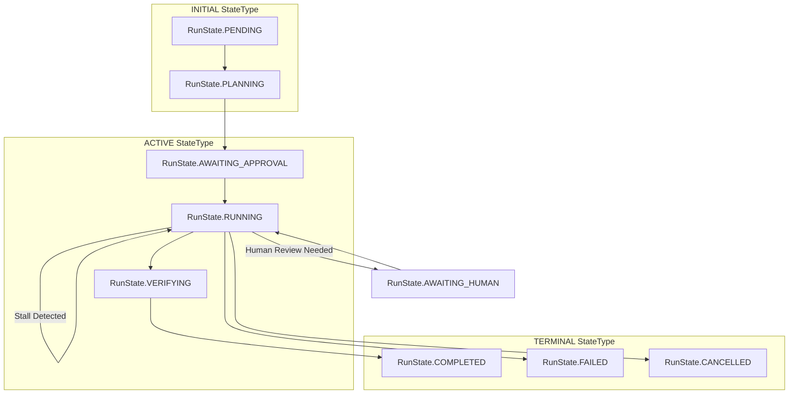
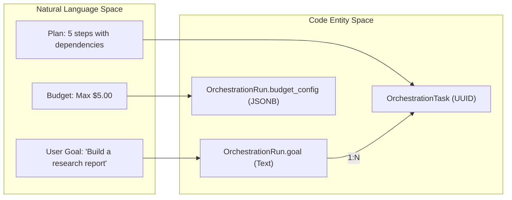
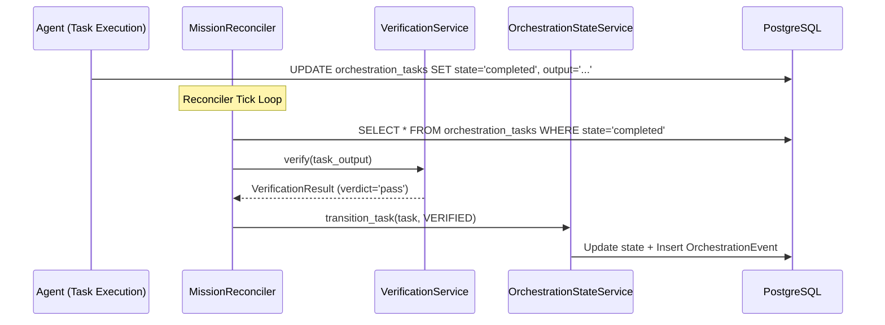

# Mission Data Model

Relevant source files

The following files were used as context for generating this wiki page:

- [frontend/components/missions/create-mission-modal.tsx](frontend/components/missions/create-mission-modal.tsx)
- [frontend/components/missions/human-review-panel.tsx](frontend/components/missions/human-review-panel.tsx)
- [frontend/components/missions/mission-results-panel.tsx](frontend/components/missions/mission-results-panel.tsx)
- [frontend/types/missions.ts](frontend/types/missions.ts)
- [orchestrator/alembic/versions/wave1a_agent_responsibilities.py](orchestrator/alembic/versions/wave1a_agent_responsibilities.py)
- [orchestrator/alembic/versions/wave1b_heartbeat_completion.py](orchestrator/alembic/versions/wave1b_heartbeat_completion.py)
- [orchestrator/alembic/versions/wave1c_report_signals.py](orchestrator/alembic/versions/wave1c_report_signals.py)
- [orchestrator/alembic/versions/wave1d_mission_lifecycle.py](orchestrator/alembic/versions/wave1d_mission_lifecycle.py)
- [orchestrator/api/missions.py](orchestrator/api/missions.py)
- [orchestrator/core/models/orchestration.py](orchestrator/core/models/orchestration.py)
- [orchestrator/core/models/orchestration_enums.py](orchestrator/core/models/orchestration_enums.py)
- [orchestrator/core/services/mission_memory_service.py](orchestrator/core/services/mission_memory_service.py)
- [orchestrator/modules/coordination/planner.py](orchestrator/modules/coordination/planner.py)
- [orchestrator/modules/coordination/reconciler.py](orchestrator/modules/coordination/reconciler.py)
- [orchestrator/modules/coordination/verification.py](orchestrator/modules/coordination/verification.py)
- [orchestrator/services/coordinator_service.py](orchestrator/services/coordinator_service.py)
- [orchestrator/services/orchestration_state.py](orchestrator/services/orchestration_state.py)

The Mission Data Model provides the foundational persistence layer for multi-agent orchestration within Automatos AI. It transitions the system from single-agent task execution to goal-oriented "Missions" by enabling the decomposition of complex objectives into Directed Acyclic Graphs (DAGs) of tasks [orchestrator/core/models/orchestration.py:43-47]().

The data model is built on a **DB-authoritative** and **Dual-Write** pattern. The database serves as the single source of truth from which the `CoordinatorService` and `MissionDispatcher` re-derive the system state on every tick [orchestrator/services/coordinator_service.py:9-10](), while an append-only event log provides a high-fidelity audit trail for debugging and telemetry [orchestrator/services/orchestration_state.py:9-10]().

## Core Entities

The orchestration subsystem introduces three primary tables to manage the lifecycle of a mission, alongside specialized support for session persistence and resource tracking.

### 1. OrchestrationRun
Represents the top-level mission execution record. It stores the user's natural language goal, the LLM-generated execution plan, and global budget configurations [orchestrator/core/models/orchestration.py:39-47]().

*   **Key Fields**:
    *   `goal`: The original user intent [orchestrator/core/models/orchestration.py:67]().
    *   `plan`: JSONB field containing the decomposed task graph [orchestrator/core/models/orchestration.py:68]().
    *   `state` / `state_type`: The current position in the mission state machine [orchestrator/core/models/orchestration.py:72-83]().
    *   `budget_config`: JSONB containing `max_cost`, `max_tokens`, and `alert_at_pct` [orchestrator/core/models/orchestration.py:115]().
    *   `budget_spent`: JSONB tracking `cost`, `tokens`, and `api_calls` [orchestrator/core/models/orchestration.py:116]().
    *   `max_concurrent`: Defines the parallel dispatch limit for the run [orchestrator/core/models/orchestration.py:102]().
    *   `version_id`: Used for optimistic locking to prevent race conditions during coordinator ticks [orchestrator/core/models/orchestration.py:140-142]().

### 2. OrchestrationTask
Individual units of work within a mission. These include specific `verification_criteria` and dependency tracking [orchestrator/core/models/orchestration.py:159-168]().

*   **Key Fields**:
    *   `sequence_number`: Defines the order of execution within the DAG [orchestrator/core/models/orchestration.py:198]().
    *   `agent_role`: The persona required (e.g., "Researcher"), resolved by the `MissionDispatcher` [orchestrator/core/models/orchestration.py:201]().
    *   `verification_criteria`: JSONB config for deterministic and LLM-as-judge validators [orchestrator/core/models/orchestration.py:225]().
    *   `output`: Stores the final text result from the agent [orchestrator/core/models/orchestration.py:229]().
    *   `attempt_number`: Tracks retries; incremented on `RETRYING` transitions [orchestrator/core/models/orchestration.py:237]().

### 3. OrchestrationEvent
An append-only audit log. Every state transition in a run or task triggers a dual-write to this table [orchestrator/services/orchestration_state.py:84-91]().

*   **Key Fields**:
    *   `event_type`: Categorized types such as `RUN_COMPLETED` or `TASK_FAILED` [orchestrator/core/models/orchestration_enums.py:67-109]().
    *   `actor_type`: Identifies the trigger: `SYSTEM`, `COORDINATOR`, `AGENT`, `VERIFIER`, `HUMAN`, or `RECONCILER` [orchestrator/core/models/orchestration_enums.py:130-138]().

**Sources:** [orchestrator/core/models/orchestration.py:39-237](), [orchestrator/core/models/orchestration_enums.py:18-164](), [orchestrator/services/orchestration_state.py:1-43]()

## State Machine Architecture

The system uses a two-level state model: `StateType` (coarse categories: `INITIAL`, `ACTIVE`, `BLOCKED`, `TERMINAL`) [orchestrator/core/models/orchestration_enums.py:18-22]() and specific state names for runs and tasks.

### Run State Transitions
A mission moves from `PENDING` through `PLANNING` to `RUNNING`. It may enter `AWAITING_APPROVAL` for human gates or `REPLANNING` if the goal needs adjustment [orchestrator/core/models/orchestration_enums.py:29-40]().

### Task State Transitions
A critical distinction in this model is that `COMPLETED` is **not** a terminal state for a task. A task must be `VERIFIED` by the `VerificationService` to be considered successful [orchestrator/core/models/orchestration.py:167-168]().

**Mission State Flow Diagram**

**Sources:** [orchestrator/core/models/orchestration_enums.py:18-59](), [orchestrator/core/models/orchestration.py:71-83](), [orchestrator/services/orchestration_state.py:84-113]()

## Budget and Governance

Missions implement soft and hard budget constraints to prevent runaway LLM costs.

*   **Budget Configuration**: The `budget_config` JSONB field stores limits like `max_cost` and `max_tokens` [orchestrator/core/models/orchestration.py:115]().
*   **Token Tracking**: The `budget_spent` field is updated on the `OrchestrationRun` to track aggregate cost, tokens, and API calls [orchestrator/core/models/orchestration.py:116]().
*   **Power Modes**: The UI allows selecting `light`, `standard`, or `max` power modes, which map to specific token caps (2k, 4k, 16k) and tool iteration limits [orchestrator/services/coordinator_service.py:76-80]().

**Natural Language to Code Entity Space**

**Sources:** [orchestrator/core/models/orchestration.py:115-116](), [orchestrator/services/coordinator_service.py:76-80](), [frontend/components/missions/create-mission-modal.tsx:37-59]()

## Implementation Patterns

### Optimistic Locking
The `OrchestrationRun` model uses a `version_id` column for optimistic locking [orchestrator/core/models/orchestration.py:140-142](). When the `MissionReconciler` or `MissionDispatcher` attempts to update a run, SQLAlchemy ensures the version matches, raising a `StaleDataError` (wrapped as `ConflictError`) if another process modified the row [orchestrator/services/orchestration_state.py:67-78]().

### Dual-Write Pattern
The `transition_task` and `transition_run` functions ensure that every significant change to a mission's state is recorded in the `OrchestrationEvent` table alongside the primary record update in the same transaction [orchestrator/services/orchestration_state.py:9-10]().

### Advisory Verification
The `VerificationService` implements a two-stage review (deterministic checks + LLM judge). Notably, verification is advisory; feedback is stored in `output_metadata` for synthesis tasks or humans to incorporate, but tasks are not automatically rejected unless they hit system-level failures [orchestrator/modules/coordination/verification.py:9-12]().

**Data Flow: Task Completion and Reconciliation**

**Sources:** [orchestrator/modules/coordination/reconciler.py:5-10](), [orchestrator/modules/coordination/verification.py:5-12](), [orchestrator/services/orchestration_state.py:84-113](), [orchestrator/core/models/orchestration.py:159-168]()

---