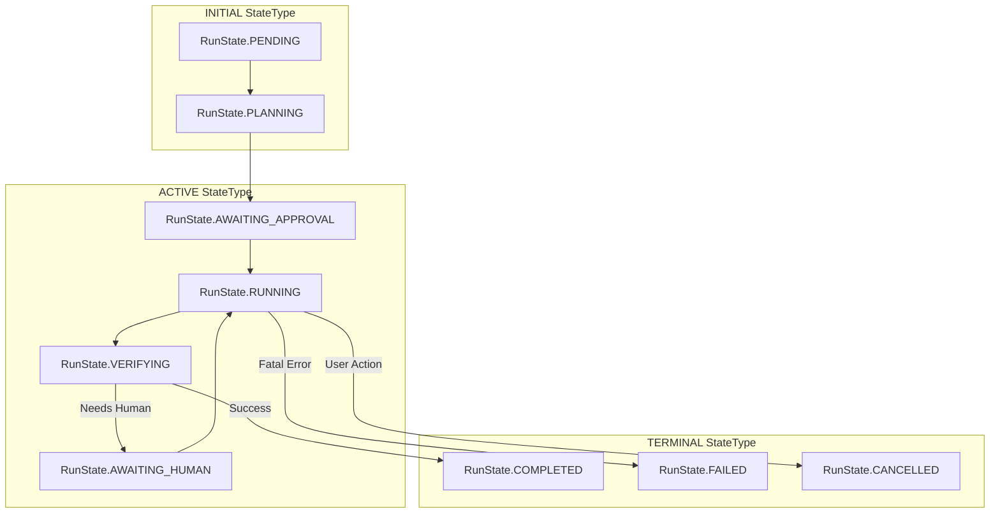
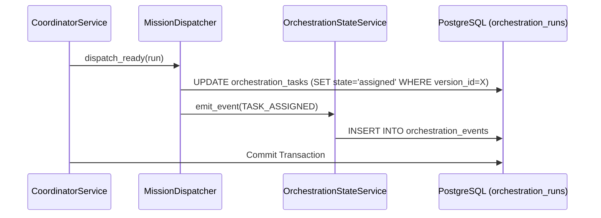

# Mission Data Model

Relevant source files

The following files were used as context for generating this wiki page:

- [docs/PRDS/100-RESEARCH-AUTONOMOUS-OPERATING-LAYER.md](docs/PRDS/100-RESEARCH-AUTONOMOUS-OPERATING-LAYER.md)
- [docs/PRDS/101-MISSION-SCHEMA-DATA-MODEL.md](docs/PRDS/101-MISSION-SCHEMA-DATA-MODEL.md)
- [docs/PRDS/108-MEMORY-FIELD-PROTOTYPE.md](docs/PRDS/108-MEMORY-FIELD-PROTOTYPE.md)
- [docs/PRDS/82-RESEARCH-ORCHESTRATION-READINESS.md](docs/PRDS/82-RESEARCH-ORCHESTRATION-READINESS.md)
- [docs/PRDS/82A-SEQUENTIAL-MISSION-COORDINATOR.md](docs/PRDS/82A-SEQUENTIAL-MISSION-COORDINATOR.md)
- [orchestrator/alembic/versions/prd123_checkpoint_count.py](orchestrator/alembic/versions/prd123_checkpoint_count.py)
- [orchestrator/api/missions.py](orchestrator/api/missions.py)
- [orchestrator/config.py](orchestrator/config.py)
- [orchestrator/core/context_guard.py](orchestrator/core/context_guard.py)
- [orchestrator/core/models/orchestration.py](orchestrator/core/models/orchestration.py)
- [orchestrator/core/models/orchestration_enums.py](orchestrator/core/models/orchestration_enums.py)
- [orchestrator/main.py](orchestrator/main.py)
- [orchestrator/modules/coordination/dispatcher.py](orchestrator/modules/coordination/dispatcher.py)
- [orchestrator/modules/coordination/planner.py](orchestrator/modules/coordination/planner.py)
- [orchestrator/modules/coordination/reconciler.py](orchestrator/modules/coordination/reconciler.py)
- [orchestrator/modules/memory/context_router.py](orchestrator/modules/memory/context_router.py)
- [orchestrator/modules/memory/unified_memory_service.py](orchestrator/modules/memory/unified_memory_service.py)
- [orchestrator/modules/tools/discovery/action_registry.py](orchestrator/modules/tools/discovery/action_registry.py)
- [orchestrator/modules/tools/execution/concurrency.py](orchestrator/modules/tools/execution/concurrency.py)
- [orchestrator/services/checkpoint_service.py](orchestrator/services/checkpoint_service.py)
- [orchestrator/services/coordinator_service.py](orchestrator/services/coordinator_service.py)
- [orchestrator/services/orchestration_state.py](orchestrator/services/orchestration_state.py)
- [orchestrator/tests/test_budget_gate.py](orchestrator/tests/test_budget_gate.py)
- [orchestrator/tests/test_dispatcher_parallel.py](orchestrator/tests/test_dispatcher_parallel.py)
- [orchestrator/tests/test_unified_memory.py](orchestrator/tests/test_unified_memory.py)
- [scripts/ralph/IMPLEMENTATION_PLAN.md](scripts/ralph/IMPLEMENTATION_PLAN.md)
- [scripts/ralph/progress.txt](scripts/ralph/progress.txt)
- [scripts/ralph/research-100/loop-0-design/IMPLEMENTATION_PLAN.md](scripts/ralph/research-100/loop-0-design/IMPLEMENTATION_PLAN.md)
- [scripts/ralph/research-100/loop-1-prd101/IMPLEMENTATION_PLAN.md](scripts/ralph/research-100/loop-1-prd101/IMPLEMENTATION_PLAN.md)
- [scripts/ralph/research-100/meta.json](scripts/ralph/research-100/meta.json)

The Mission Data Model provides the foundational persistence layer for multi-agent orchestration within Automatos AI. It transitions the system from single-agent task execution to goal-oriented "Missions" by enabling the decomposition of complex objectives into Directed Acyclic Graphs (DAGs) of tasks [orchestrator/core/models/orchestration.py:43-47]().

The data model is built on a **DB-authoritative** and **Dual-Write** pattern. The database serves as the single source of truth from which the `CoordinatorService` re-derives the system state on every tick [orchestrator/services/coordinator_service.py:9-10](), while an append-only event log provides a high-fidelity audit trail for debugging and telemetry [orchestrator/services/orchestration_state.py:65-68]().

## Core Entities

The orchestration subsystem introduces three primary tables to manage the lifecycle of a mission, alongside specialized support for session persistence and resource tracking.

### 1. OrchestrationRun
Represents the top-level mission execution record. It stores the user's natural language goal, the LLM-generated execution plan, and global budget configurations [orchestrator/core/models/orchestration.py:39-47]().

*   **Key Fields**:
    *   `goal`: The original natural-language intent [orchestrator/core/models/orchestration.py:67]().
    *   `plan`: JSONB field containing the decomposed task graph [orchestrator/core/models/orchestration.py:68]().
    *   `state` / `state_type`: The current position in the mission state machine [orchestrator/core/models/orchestration.py:72-83]().
    *   `budget_config`: JSONB containing `max_cost`, `max_tokens`, and `alert_at_pct` [orchestrator/core/models/orchestration.py:115]().
    *   `budget_spent`: JSONB tracking `cost`, `tokens`, and `api_calls` [orchestrator/core/models/orchestration.py:116]().
    *   `version_id`: Used for optimistic locking to prevent race conditions during concurrent coordinator ticks [orchestrator/core/models/orchestration.py:134-136]().

### 2. OrchestrationTask
Individual units of work within a mission. These include specific `verification_criteria` and dependency tracking [orchestrator/core/models/orchestration.py:153-162]().

*   **Key Fields**:
    *   `sequence_number`: Defines the order of execution within the DAG [orchestrator/core/models/orchestration.py:192]().
    *   `agent_role`: The persona required (e.g., "researcher"), resolved by the `AgentMatcher` [orchestrator/core/models/orchestration.py:195]().
    *   `verification_criteria`: JSONB config for deterministic and LLM-as-judge validators [orchestrator/core/models/orchestration.py:219]().
    *   `output`: Stores the final text result from the agent [orchestrator/core/models/orchestration.py:223]().
    *   `attempt_number`: Tracks retries; incremented on `RETRYING` transitions [orchestrator/core/models/orchestration.py:231]().

### 3. OrchestrationEvent
An append-only audit log. Every state transition in a run or task triggers a write to this table [orchestrator/services/orchestration_state.py:65-68]().

*   **Key Fields**:
    *   `event_type`: Categorized types such as `TASK_ASSIGNED` or `RUN_COMPLETED` [orchestrator/core/models/orchestration_enums.py:67-108]().
    *   `actor_type`: Identifies the trigger: `SYSTEM`, `COORDINATOR`, `AGENT`, or `HUMAN` [orchestrator/core/models/orchestration_enums.py:130-138]().

**Sources:** [orchestrator/core/models/orchestration.py:39-237](), [orchestrator/core/models/orchestration_enums.py:18-164](), [orchestrator/services/orchestration_state.py:62-68]()

## State Machine Architecture

The system uses a two-level state model: `StateType` (coarse categories: `INITIAL`, `ACTIVE`, `TERMINAL`) and `RunState`/`TaskState` (fine-grained names) [orchestrator/core/models/orchestration_enums.py:18-22]().

### Run State Transitions
A mission moves from `PENDING` through `PLANNING` to `RUNNING`. It may enter `AWAITING_APPROVAL` for human gates before reaching terminal states like `COMPLETED`, `FAILED`, or `CANCELLED` [orchestrator/core/models/orchestration_enums.py:29-40]().

### Task State Transitions
A critical distinction is that `COMPLETED` is **not** a terminal state for a task. A task must be `VERIFIED` by the `VerificationService` to be considered successful [orchestrator/core/models/orchestration.py:160-162]().

**Mission State Flow Diagram**

**Sources:** [orchestrator/core/models/orchestration_enums.py:18-61](), [orchestrator/services/orchestration_state.py:66-68]()

## Budget and Resource Governance

Missions implement soft and hard budget constraints to prevent runaway LLM costs.

*   **Budget Configuration**: The `budget_config` JSONB field stores limits like `max_cost` and `max_tokens` [orchestrator/core/models/orchestration.py:115]().
*   **Token Tracking**: The `budget_spent` field is updated on the `OrchestrationRun` to track aggregate cost, tokens, and API calls [orchestrator/core/models/orchestration.py:116]().
*   **Emission**: Budget warnings and exceeded events are emitted via `emit_event` [orchestrator/core/models/orchestration_enums.py:79-81]().

**Data Flow: Task Execution to State Transition**

**Sources:** [orchestrator/modules/coordination/dispatcher.py:140-158](), [orchestrator/services/coordinator_service.py:82-85](), [orchestrator/services/orchestration_state.py:65-68]()

## Implementation Patterns

### Optimistic Locking (Claim Pattern)
To support high-concurrency where multiple coordinator instances might "tick" simultaneously, the `MissionDispatcher` uses raw SQL with a `version_id` check [orchestrator/modules/coordination/dispatcher.py:140-151](). This ensures that a task is claimed exactly once by a specific agent [orchestrator/modules/coordination/dispatcher.py:160-162]().

### Shared Mission Context (PRD-108)
Missions utilize a shared "field" (context backend) that allows agents within the same mission to share state without manual message passing [orchestrator/services/coordinator_service.py:107-113](). Task outputs are automatically injected into this field upon completion [orchestrator/services/coordinator_service.py:176-182]().

### Stall Detection
The `MissionReconciler` identifies tasks that have been in `ASSIGNED` or `RUNNING` states for too long without updates and marks them as `STALLED` [orchestrator/core/models/orchestration_enums.py:58](). This triggers an event that allows the coordinator to attempt recovery or notify a human [orchestrator/core/models/orchestration_enums.py:108]().

**Sources:** [orchestrator/modules/coordination/dispatcher.py:120-178](), [orchestrator/services/coordinator_service.py:107-113](), [orchestrator/services/coordinator_service.py:176-182]()

---