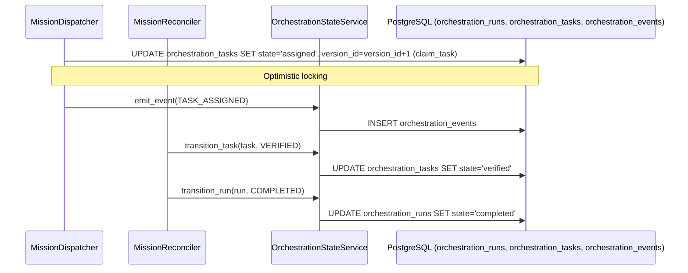
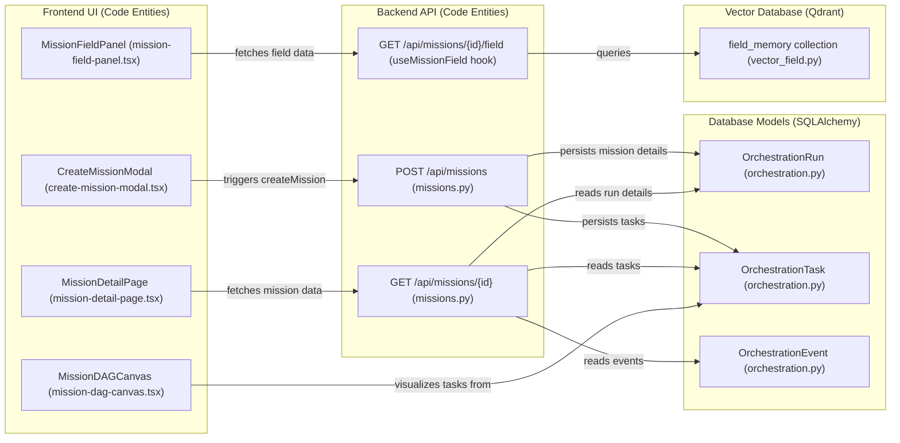

# Mission Data Model

Relevant source files

The following files were used as context for generating this wiki page:

- [frontend/components/missions/create-mission-modal.tsx](frontend/components/missions/create-mission-modal.tsx)
- [frontend/components/missions/index.ts](frontend/components/missions/index.ts)
- [frontend/components/missions/mission-card.tsx](frontend/components/missions/mission-card.tsx)
- [frontend/components/missions/mission-detail-page.tsx](frontend/components/missions/mission-detail-page.tsx)
- [frontend/components/missions/mission-field-inspector.tsx](frontend/components/missions/mission-field-inspector.tsx)
- [frontend/components/missions/mission-field-panel.tsx](frontend/components/missions/mission-field-panel.tsx)
- [frontend/components/missions/mission-field-viz.tsx](frontend/components/missions/mission-field-viz.tsx)
- [frontend/hooks/use-missions-api.ts](frontend/hooks/use-missions-api.ts)
- [frontend/types/missions.ts](frontend/types/missions.ts)
- [orchestrator/alembic/versions/prd123_checkpoint_count.py](orchestrator/alembic/versions/prd123_checkpoint_count.py)
- [orchestrator/api/missions.py](orchestrator/api/missions.py)
- [orchestrator/core/models/orchestration.py](orchestrator/core/models/orchestration.py)
- [orchestrator/core/models/orchestration_enums.py](orchestrator/core/models/orchestration_enums.py)
- [orchestrator/modules/context/adapters/vector_field.py](orchestrator/modules/context/adapters/vector_field.py)
- [orchestrator/modules/coordination/dispatcher.py](orchestrator/modules/coordination/dispatcher.py)
- [orchestrator/modules/coordination/planner.py](orchestrator/modules/coordination/planner.py)
- [orchestrator/modules/coordination/primitive_heartbeat.py](orchestrator/modules/coordination/primitive_heartbeat.py)
- [orchestrator/modules/coordination/reconciler.py](orchestrator/modules/coordination/reconciler.py)
- [orchestrator/modules/coordination/verification.py](orchestrator/modules/coordination/verification.py)
- [orchestrator/modules/memory/durable_store.py](orchestrator/modules/memory/durable_store.py)
- [orchestrator/services/coordinator_service.py](orchestrator/services/coordinator_service.py)
- [orchestrator/services/gdpr_service.py](orchestrator/services/gdpr_service.py)
- [orchestrator/tests/test_dispatcher_parallel.py](orchestrator/tests/test_dispatcher_parallel.py)
- [orchestrator/tests/test_mission_final_output_promotion.py](orchestrator/tests/test_mission_final_output_promotion.py)
- [orchestrator/tests/test_mission_retry_feeds_critique.py](orchestrator/tests/test_mission_retry_feeds_critique.py)
- [orchestrator/tests/test_p2w2_gdpr_subject_tags.py](orchestrator/tests/test_p2w2_gdpr_subject_tags.py)
- [orchestrator/tests/test_prd181_gdpr.py](orchestrator/tests/test_prd181_gdpr.py)
- [orchestrator/tests/test_w1s1_hotpath_telemetry.py](orchestrator/tests/test_w1s1_hotpath_telemetry.py)

The Mission Data Model provides the foundational persistence layer for multi-agent orchestration within Automatos AI. It transitions the system from single-agent task execution to goal-oriented "Missions" by enabling the decomposition of complex objectives into Directed Acyclic Graphs (DAGs) of tasks [orchestrator/core/models/orchestration.py:43-47]().

The data model is built on a **DB-authoritative** and **Dual-Write** pattern. The database serves as the single source of truth from which the `CoordinatorService` and `MissionDispatcher` re-derive the system state on every tick [orchestrator/services/coordinator_service.py:9-10](), while an append-only event log provides a high-fidelity audit trail for debugging and telemetry [orchestrator/services/orchestration_state.py:72-75]().

## Core Entities

The orchestration subsystem introduces three primary tables to manage the lifecycle of a mission, alongside specialized support for session persistence and resource tracking.

### 1. OrchestrationRun
Represents the top-level mission execution record (referred to as a "Mission" in the API) [orchestrator/api/missions.py:5-6](). It stores the user's natural language goal, the execution plan, and global budget configurations [orchestrator/core/models/orchestration.py:39-47]().

*   **Key Fields**:
    *   `goal`: The original natural-language user intent [orchestrator/core/models/orchestration.py:67]().
    *   `plan`: JSONB field containing the decomposed task graph snapshot [orchestrator/core/models/orchestration.py:68](). This plan can be annotated with agent match previews for approval [orchestrator/services/coordinator_service.py:122-145]().
    *   `state` / `state_type`: The current position in the mission state machine [orchestrator/core/models/orchestration.py:72-83]().
    *   `budget_config`: JSONB containing `max_cost`, `max_tokens`, and `alert_at_pct` [orchestrator/core/models/orchestration.py:112]().
    *   `budget_spent`: JSONB tracking `cost`, `tokens`, and `api_calls` [orchestrator/core/models/orchestration.py:113]().
    *   `max_concurrent`: Defines the parallel dispatch limit (default 3) [orchestrator/core/models/orchestration.py:102]().
    *   `version_id`: Used for optimistic locking to prevent race conditions during concurrent coordinator ticks [orchestrator/core/models/orchestration.py:137-139]().

### 2. OrchestrationTask
Individual units of work within a mission. These include specific `verification_criteria` and dependency tracking [orchestrator/core/models/orchestration.py:156-165]().

*   **Key Fields**:
    *   `sequence_number`: Defines the order of execution within the mission [orchestrator/core/models/orchestration.py:195]().
    *   `agent_role`: The persona required (e.g., "researcher"), resolved by the `AgentMatcher` [orchestrator/core/models/orchestration.py:198]().
    *   `verification_criteria`: JSONB config for deterministic and LLM-as-judge validators [orchestrator/core/models/orchestration.py:222]().
    *   `output`: Stores the final text result from the agent [orchestrator/core/models/orchestration.py:226](). This output is sanitized to remove large inline base64 image blobs before being used in dispatch context [orchestrator/services/coordinator_service.py:115-120]().
    *   `attempt_number`: Tracks retries; incremented on `RETRYING` transitions [orchestrator/core/models/orchestration.py:234]().
    *   `depends_on`: A list of task IDs that must complete before this task can start, forming the DAG [orchestrator/core/models/orchestration.py:240]().

### 3. OrchestrationEvent
An append-only audit log. Every state transition in a run or task triggers a write to this table [orchestrator/services/orchestration_state.py:72-75]().

*   **Key Fields**:
    *   `event_type`: Categorized types such as `RUN_COMPLETED` or `TASK_FAILED` [orchestrator/core/models/orchestration_enums.py:67-112]().
    *   `actor_type`: Identifies the trigger: `SYSTEM`, `COORDINATOR`, `AGENT`, `VERIFIER`, `HUMAN`, or `RECONCILER` [orchestrator/core/models/orchestration_enums.py:136-143]().

Sources: [orchestrator/core/models/orchestration.py:39-245](), [orchestrator/core/models/orchestration_enums.py:18-177](), [orchestrator/services/orchestration_state.py:68-75](), [orchestrator/api/missions.py:50-56](), [orchestrator/services/coordinator_service.py:115-145]()

## State Machine Architecture

The system uses a two-level state model: `StateType` (coarse categories: `INITIAL`, `ACTIVE`, `BLOCKED`, `TERMINAL`) [orchestrator/core/models/orchestration_enums.py:18-22]() and specific state names for runs and tasks.

### Run State Transitions
A mission moves from `PENDING` through `PLANNING` to `RUNNING`. It may enter `AWAITING_APPROVAL` for human gates or `REPLANNING` if the goal needs adjustment [orchestrator/core/models/orchestration_enums.py:29-40](). The `TERMINAL_RUN_STATES` constant defines states where a mission is considered finished [orchestrator/core/models/orchestration_enums.py:200]().

### Task State Transitions
A critical distinction in this model is that `COMPLETED` is **not** a terminal state for a task. A task must be `VERIFIED` by the `VerificationService` to be considered successful [orchestrator/core/models/orchestration_enums.py:45-59](). The `DONE_TASK_STATES` constant includes `VERIFIED`, `FAILED`, and `SKIPPED` [orchestrator/core/models/orchestration_enums.py:201](). Tasks can also enter `STALLED` if they remain in `ASSIGNED` or `RUNNING` for too long, and `RETRYING` if they fail verification or crash [orchestrator/core/models/orchestration_enums.py:58-59]().

**Mission State Flow Diagram**

```mermaid
graph TD
  subgraph "OrchestrationRun States"
    PENDING["RunState.PENDING"] --> PLANNING["RunState.PLANNING"]
    PLANNING --> AWAITING_APPROVAL["RunState.AWAITING_APPROVAL"]
    AWAITING_APPROVAL -- "Approved" --> RUNNING["RunState.RUNNING"]
    AWAITING_APPROVAL -- "Rejected" --> FAILED_REJECT["RunState.FAILED (Rejected)"]
    RUNNING --> PAUSED["RunState.PAUSED"]
    PAUSED --> RUNNING
    RUNNING --> REPLANNING["RunState.REPLANNING"]
    REPLANNING --> RUNNING
    RUNNING --> VERIFYING["RunState.VERIFYING"]
    VERIFYING --> COMPLETED["RunState.COMPLETED"]
    RUNNING --> FAILED["RunState.FAILED"]
    RUNNING --> CANCELLED["RunState.CANCELLED"]
    VERIFYING --> FAILED_VERIFY["RunState.FAILED (Verification)"]
    RUNNING -- "Human Review Requested" --> AWAITING_HUMAN["RunState.AWAITING_HUMAN"]
    AWAITING_HUMAN --> RUNNING
  end

  subgraph "OrchestrationTask States"
    TASK_PENDING["TaskState.PENDING"] --> TASK_QUEUED["TaskState.QUEUED"]
    TASK_QUEUED --> TASK_ASSIGNED["TaskState.ASSIGNED"]
    TASK_ASSIGNED --> TASK_RUNNING["TaskState.RUNNING"]
    TASK_RUNNING --> TASK_COMPLETED["TaskState.COMPLETED"]
    TASK_COMPLETED --> TASK_VERIFYING["TaskState.VERIFYING"]
    TASK_VERIFYING -- "Pass" --> TASK_VERIFIED["TaskState.VERIFIED"]
    TASK_VERIFYING -- "Fail" --> TASK_RETRYING["TaskState.RETRYING"]
    TASK_RETRYING --> TASK_QUEUED
    TASK_VERIFYING -- "Fail (Max Retries)" --> TASK_FAILED["TaskState.FAILED"]
    TASK_RUNNING -- "Crash" --> TASK_CRASHED["TaskState.CRASHED"]
    TASK_CRASHED --> TASK_RETRYING
    TASK_RUNNING -- "Stall" --> TASK_STALLED["TaskState.STALLED"]
    TASK_STALLED --> TASK_ASSIGNED
    TASK_QUEUED -- "Skipped" --> TASK_SKIPPED["TaskState.SKIPPED"]
    TASK_ASSIGNED -- "Cancelled" --> TASK_CANCELLED["TaskState.CANCELLED"]
  end

  style PENDING fill:#f9f,stroke:#333,stroke-width:2px
  style PLANNING fill:#f9f,stroke:#333,stroke-width:2px
  style AWAITING_APPROVAL fill:#f9f,stroke:#333,stroke-width:2px
  style RUNNING fill:#f9f,stroke:#333,stroke-width:2px
  style PAUSED fill:#f9f,stroke:#333,stroke-width:2px
  style REPLANNING fill:#f9f,stroke:#333,stroke-width:2px
  style VERIFYING fill:#f9f,stroke:#333,stroke-width:2px
  style AWAITING_HUMAN fill:#f9f,stroke:#333,stroke-width:2px
  style COMPLETED fill:#bfb,stroke:#333,stroke-width:2px
  style FAILED fill:#fbb,stroke:#333,stroke-width:2px
  style FAILED_REJECT fill:#fbb,stroke:#333,stroke-width:2px
  style FAILED_VERIFY fill:#fbb,stroke:#333,stroke-width:2px
  style CANCELLED fill:#ccc,stroke:#333,stroke-width:2px

  style TASK_PENDING fill:#f9f,stroke:#333,stroke-width:2px
  style TASK_QUEUED fill:#f9f,stroke:#333,stroke-width:2px
  style TASK_ASSIGNED fill:#f9f,stroke:#333,stroke-width:2px
  style TASK_RUNNING fill:#f9f,stroke:#333,stroke-width:2px
  style TASK_COMPLETED fill:#f9f,stroke:#333,stroke-width:2px
  style TASK_VERIFYING fill:#f9f,stroke:#333,stroke-width:2px
  style TASK_VERIFIED fill:#bfb,stroke:#333,stroke-width:2px
  style TASK_FAILED fill:#fbb,stroke:#333,stroke-width:2px
  style TASK_CRASHED fill:#fbb,stroke:#333,stroke-width:2px
  style TASK_RETRYING fill:#f9f,stroke:#333,stroke-width:2px
  style TASK_STALLED fill:#f9f,stroke:#333,stroke-width:2px
  style TASK_SKIPPED fill:#ccc,stroke:#333,stroke-width:2px
  style TASK_CANCELLED fill:#ccc,stroke:#333,stroke-width:2px
```

Sources: [orchestrator/core/models/orchestration_enums.py:18-59](), [orchestrator/core/models/orchestration.py:71-83](), [orchestrator/services/orchestration_state.py:72-75](), [orchestrator/core/models/orchestration_enums.py:200-201]()

## Budget and Resource Governance

Missions implement soft and hard budget constraints to prevent runaway LLM costs.

*   **Budget Configuration**: The `budget_config` JSONB field stores limits like `max_cost` and `max_tokens` [orchestrator/core/models/orchestration.py:112]().
*   **Token Tracking**: The `budget_spent` field is updated on the `OrchestrationRun` to track aggregate cost and tokens [orchestrator/core/models/orchestration.py:113]().
*   **Complexity Estimation**: The `MissionPlanner` estimates the token budget based on task complexity tiers (`SIMPLE`, `MODERATE`, `COMPLEX`) [orchestrator/modules/coordination/planner.py:169-174](). The `COMPLEXITY_TOKEN_BUDGET` configuration defines the token limits for each tier [orchestrator/modules/coordination/planner.py:25]().

**Data Flow: Task Execution to State Transition**

Sources: [orchestrator/modules/coordination/dispatcher.py:140-160](), [orchestrator/core/models/orchestration.py:112-113](), [orchestrator/modules/coordination/reconciler.py:126-141](), [orchestrator/modules/coordination/planner.py:25,169-174]()

## Implementation Patterns

### Optimistic Claiming
The `MissionDispatcher` uses a raw SQL `UPDATE` with a `version_id` check in `claim_task` to atomically claim tasks for dispatch. This prevents "double-dispatch" where multiple coordinator ticks might attempt to assign the same task simultaneously [orchestrator/modules/coordination/dispatcher.py:140-157]().

### Power Modes
Missions support different `power_mode` settings (`light`, `standard`, `max`) which scale `max_tool_iterations` and `timeout_seconds` [orchestrator/services/coordinator_service.py:91-95](). These power modes are configured with default values in `_POWER_MODE_DEFAULTS` but can be overridden by system settings [orchestrator/services/coordinator_service.py:89-95](). Users select these during mission creation to balance cost and capability [frontend/components/missions/create-mission-modal.tsx:37-59]().

### Dual-Write Pattern
The `emit_event` function ensures that every significant change to a mission's state is recorded in the `OrchestrationEvent` table alongside the primary record update [orchestrator/services/orchestration_state.py:72-75](). This provides a temporal view of the mission's progress.

### Field Memory Integration
The `VectorFieldSharedContext` (PRD-108) provides a shared semantic field where agent knowledge resonates, decays, and forms attractors. This is implemented using a single Qdrant collection (`field_memory`) where patterns are stored as points with embeddings and payloads. Per-mission isolation is enforced via a `field_id` filter [orchestrator/modules/context/adapters/vector_field.py:48-51](). The `MissionFieldPanel` in the frontend visualizes this shared field [frontend/components/missions/mission-field-panel.tsx:115-117]().

**Code Entity Mapping: UI to Data Model**

Sources: [orchestrator/modules/coordination/dispatcher.py:140-157](), [orchestrator/services/coordinator_service.py:89-95](), [frontend/components/missions/create-mission-modal.tsx:37-59](), [orchestrator/core/models/orchestration.py:137-139](), [orchestrator/api/missions.py:9-12](), [orchestrator/modules/context/adapters/vector_field.py:48-51](), [frontend/components/missions/mission-field-panel.tsx:115-117]()

---