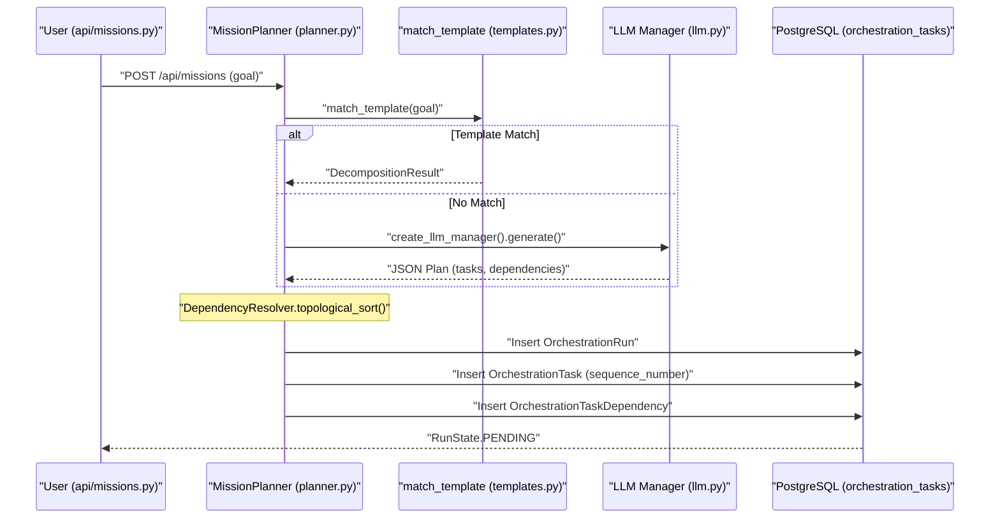
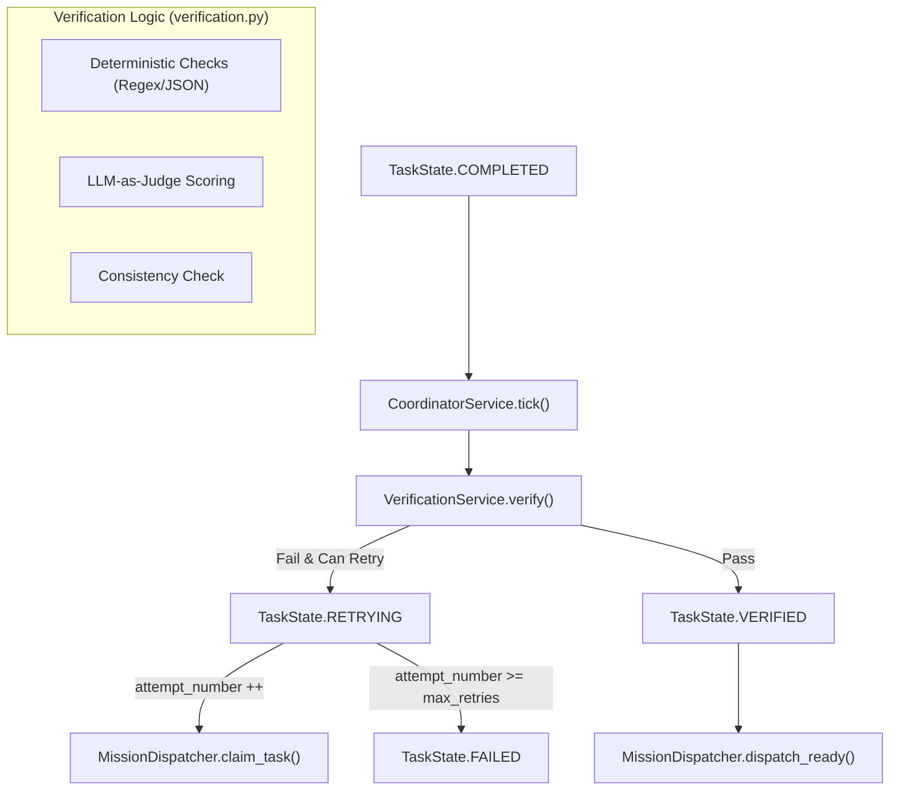

# Mission Planning & Verification

Relevant source files

The following files were used as context for generating this wiki page:

- [frontend/components/missions/mission-budget-bar.tsx](frontend/components/missions/mission-budget-bar.tsx)
- [frontend/components/missions/mission-field-panel.tsx](frontend/components/missions/mission-field-panel.tsx)
- [frontend/components/missions/mission-field-viz.tsx](frontend/components/missions/mission-field-viz.tsx)
- [frontend/package-lock.json](frontend/package-lock.json)
- [frontend/package.json](frontend/package.json)
- [frontend/yarn.lock](frontend/yarn.lock)
- [orchestrator/alembic/versions/prd123_checkpoint_count.py](orchestrator/alembic/versions/prd123_checkpoint_count.py)
- [orchestrator/api/missions.py](orchestrator/api/missions.py)
- [orchestrator/config.py](orchestrator/config.py)
- [orchestrator/core/context_guard.py](orchestrator/core/context_guard.py)
- [orchestrator/core/models/orchestration.py](orchestrator/core/models/orchestration.py)
- [orchestrator/core/models/orchestration_enums.py](orchestrator/core/models/orchestration_enums.py)
- [orchestrator/main.py](orchestrator/main.py)
- [orchestrator/modules/coordination/dispatcher.py](orchestrator/modules/coordination/dispatcher.py)
- [orchestrator/modules/coordination/planner.py](orchestrator/modules/coordination/planner.py)
- [orchestrator/modules/coordination/reconciler.py](orchestrator/modules/coordination/reconciler.py)
- [orchestrator/modules/coordination/verification.py](orchestrator/modules/coordination/verification.py)
- [orchestrator/modules/memory/context_router.py](orchestrator/modules/memory/context_router.py)
- [orchestrator/modules/memory/unified_memory_service.py](orchestrator/modules/memory/unified_memory_service.py)
- [orchestrator/modules/tools/discovery/action_registry.py](orchestrator/modules/tools/discovery/action_registry.py)
- [orchestrator/modules/tools/execution/concurrency.py](orchestrator/modules/tools/execution/concurrency.py)
- [orchestrator/services/checkpoint_service.py](orchestrator/services/checkpoint_service.py)
- [orchestrator/services/coordinator_service.py](orchestrator/services/coordinator_service.py)
- [orchestrator/services/orchestration_state.py](orchestrator/services/orchestration_state.py)
- [orchestrator/tests/test_82c_wiring.py](orchestrator/tests/test_82c_wiring.py)
- [orchestrator/tests/test_budget_gate.py](orchestrator/tests/test_budget_gate.py)
- [orchestrator/tests/test_dispatcher_parallel.py](orchestrator/tests/test_dispatcher_parallel.py)
- [orchestrator/tests/test_parallel_decomposition.py](orchestrator/tests/test_parallel_decomposition.py)
- [orchestrator/tests/test_unified_memory.py](orchestrator/tests/test_unified_memory.py)
- [scripts/ralph/IMPLEMENTATION_PLAN.md](scripts/ralph/IMPLEMENTATION_PLAN.md)
- [scripts/ralph/progress.txt](scripts/ralph/progress.txt)

The Mission Planning and Verification layer is responsible for transforming high-level natural language goals into executable Directed Acyclic Graphs (DAGs) and ensuring that the outputs produced by agents meet strict quality and structural requirements. This system bridges the gap between non-deterministic LLM reasoning and deterministic execution reliability.

## 1. Mission Planner & Goal Decomposition

The `MissionPlanner` is the entry point for mission execution. It utilizes a "Template-Hybrid" approach where the system first attempts to match a goal to a pre-defined template before falling back to LLM-based decomposition.

### Decomposition Pipeline
1.  **Template Matching**: The planner calls `match_template` to check if the goal contains keywords (e.g., "research", "compare", "benchmark") that correspond to a `DecompositionTemplate` [orchestrator/modules/coordination/planner.py:8-9](), [orchestrator/modules/coordination/planner.py:29]().
2.  **Context Assembly**: If no template matches, the planner gathers the natural language goal, any attached document contents from S3 via `_fetch_attachment_contents`, and the available `Agent` roster for the `workspace_id` [orchestrator/modules/coordination/planner.py:67-75](), [orchestrator/modules/coordination/planner.py:102-135]().
3.  **LLM Generation**: It invokes the LLM using `create_llm_manager` with a system prompt that enforces a specific JSON schema, requiring a list of tasks with titles, descriptions, and `agent_role` assignments [orchestrator/modules/coordination/planner.py:26](), [orchestrator/modules/coordination/planner.py:151-157]().
4.  **Plan Validation**: The raw output is parsed and subjected to structural checks by the `PlanValidator` (logic integrated into the planner's validation loop) [orchestrator/modules/coordination/planner.py:10-12]().
5.  **Retry Logic**: If validation fails (e.g., cyclic dependencies or invalid agent roles), the planner retries up to 3 times, feeding the validation errors back into the next prompt [orchestrator/modules/coordination/planner.py:11-12]().

### Plan Validation Logic
The validation process ensures the mission is viable before any execution begins:
*   **Acyclicity**: Uses `DependencyResolver` to perform a topological sort and detect cycles in the task graph via `CyclicDependencyError` checks [orchestrator/modules/coordination/planner.py:30-32]().
*   **Agent Matching**: Verifies that the `agent_role` requested for each task matches the capabilities in the `Agent` roster [orchestrator/modules/coordination/planner.py:27]().
*   **Task Bounds**: Enforces limits on task counts to prevent overly complex or trivial plans [orchestrator/modules/coordination/planner.py:10]().

**Sources:** [orchestrator/modules/coordination/planner.py:1-37](), [orchestrator/modules/coordination/planner.py:67-160]()

## 2. Verification Service & Pipeline

Once an agent completes a task, the `VerificationService` assesses the output. It follows a "Deterministic-First" strategy to minimize LLM costs and latency.

### Verification Stages
| Stage | Component | Description |
| :--- | :--- | :--- |
| **Deterministic** | `DeterministicChecker` | Validates regex, length, JSON schema, and required sections (logic defined in `verification_criteria`) [orchestrator/core/models/orchestration.py:219](). |
| **LLM-as-Judge** | `VerificationService` | Uses a "Judge" model to score the output against specific `verification_criteria` [orchestrator/services/coordinator_service.py:55](). |
| **Consistency** | `ConsistencyResult` | Checks for cross-task alignment (e.g., ensuring a summary matches the data gathered in a previous step) [orchestrator/services/coordinator_service.py:55](). |

### Verification Implementation
The `VerificationService` is integrated into the `CoordinatorService` tick loop. When a task reaches `TaskState.COMPLETED`, the coordinator invokes the verifier to produce a `ConsistencyResult` [orchestrator/services/coordinator_service.py:55](), [orchestrator/core/models/orchestration_enums.py:53-54]().

**Sources:** [orchestrator/services/coordinator_service.py:1-70](), [orchestrator/core/models/orchestration.py:219-224](), [orchestrator/core/models/orchestration_enums.py:48-60]()

## 3. Feedback Loop & Retries

The mission lifecycle is managed by the `CoordinatorService` tick loop (running every 5 seconds), which reconciles task states and triggers retries based on verification outcomes.

### Reconciliation Flow
The `MissionReconciler` transitions tasks through their lifecycle:
1.  **COMPLETED → VERIFYING**: Triggered when an agent submits output via `execute_with_prompt` [orchestrator/core/models/orchestration_enums.py:53-54]().
2.  **VERIFYING → VERIFIED**: Output passed all checks; the mission proceeds to the next task in the DAG [orchestrator/core/models/orchestration_enums.py:54-55]().
3.  **VERIFYING → RETRYING**: If verification returns a failure and `attempt_number < max_retries`, the task is re-queued [orchestrator/core/models/orchestration_enums.py:59](), [orchestrator/core/models/orchestration.py:231-232]().
4.  **VERIFYING → FAILED**: If retries are exhausted or a "must-pass" deterministic check fails, the task transitions to `TaskState.FAILED` [orchestrator/core/models/orchestration_enums.py:56]().

### Stall Detection
The `MissionReconciler` acts as a watchdog for hung tasks:
*   **Stall Identification**: Tasks that remain in `ASSIGNED` or `RUNNING` beyond a threshold without updates are marked as `TaskState.STALLED` [orchestrator/core/models/orchestration_enums.py:58]().
*   **Recovery**: The `CoordinatorService` tick identifies stalled tasks and emits a `STALL_DETECTED` event to trigger recovery logic [orchestrator/core/models/orchestration_enums.py:111]().

**Sources:** [orchestrator/services/coordinator_service.py:78-86](), [orchestrator/core/models/orchestration.py:231-235](), [orchestrator/core/models/orchestration_enums.py:48-60](), [orchestrator/core/models/orchestration_enums.py:111]()

## 4. System Interaction Diagrams

### Goal Decomposition: Natural Language to Task DAG
This diagram illustrates how a user's natural language goal is transformed into code entities within the database using `MissionPlanner`.

Title: Goal Decomposition Sequence

**Sources:** [orchestrator/api/missions.py:82-90](), [orchestrator/modules/coordination/planner.py:102-160](), [orchestrator/modules/coordination/planner.py:29-34](), [orchestrator/core/models/orchestration.py:181-192]()

### Verification Logic Flow
This diagram shows the transition of an `OrchestrationTask` from completion to final verdict, managed by the coordinator and verifier services.

Title: Task Verification Pipeline

**Sources:** [orchestrator/services/coordinator_service.py:78-86](), [orchestrator/core/models/orchestration_enums.py:48-60](), [orchestrator/modules/coordination/dispatcher.py:120-158](), [orchestrator/core/models/orchestration.py:231-235]()

## 5. Mission State Reference

| State | Type | Description |
| :--- | :--- | :--- |
| `PLANNING` | `RunState` | `MissionPlanner` is currently decomposing the goal into tasks [orchestrator/core/models/orchestration_enums.py:31](). |
| `AWAITING_APPROVAL` | `RunState` | Plan is ready; waiting for human review via `POST /api/missions/{id}/approve` [orchestrator/core/models/orchestration_enums.py:32](), [orchestrator/api/missions.py:15](). |
| `VERIFYING` | `TaskState` | `VerificationService` is evaluating the task output against criteria [orchestrator/core/models/orchestration_enums.py:54](). |
| `AWAITING_HUMAN` | `RunState` | A task or plan requires manual human review or feedback [orchestrator/core/models/orchestration_enums.py:37](). |
| `STALLED` | `TaskState` | Task exceeded its execution timeout and requires reconciliation by the coordinator [orchestrator/core/models/orchestration_enums.py:58](). |

**Sources:** [orchestrator/core/models/orchestration_enums.py:29-60](), [orchestrator/api/missions.py:9-23](), [orchestrator/services/coordinator_service.py:78-86]()

---