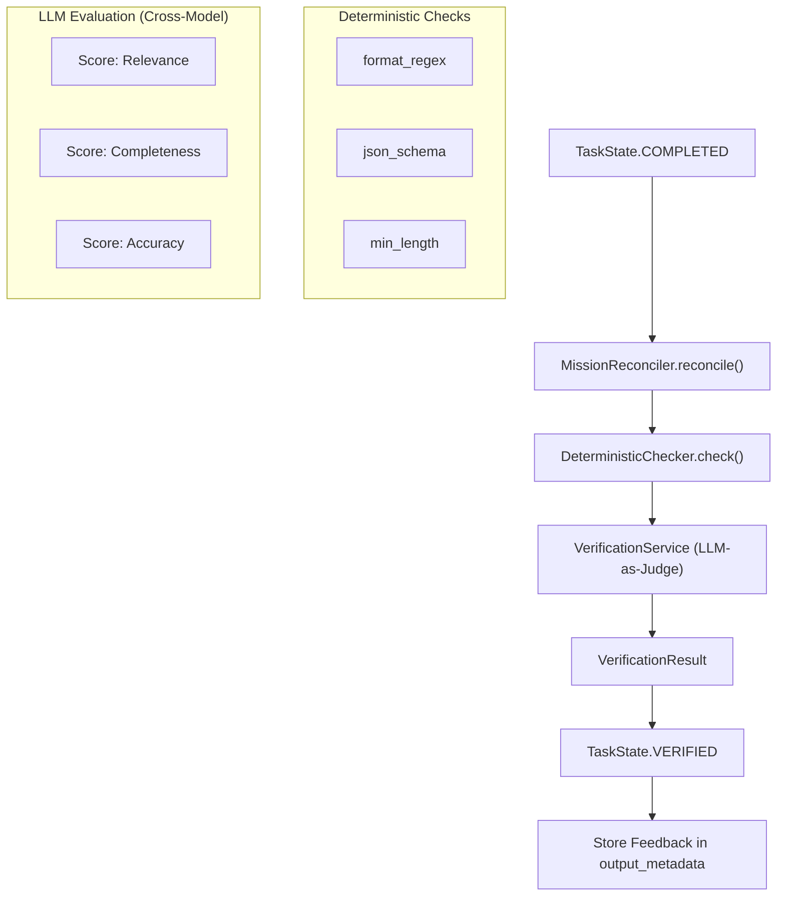
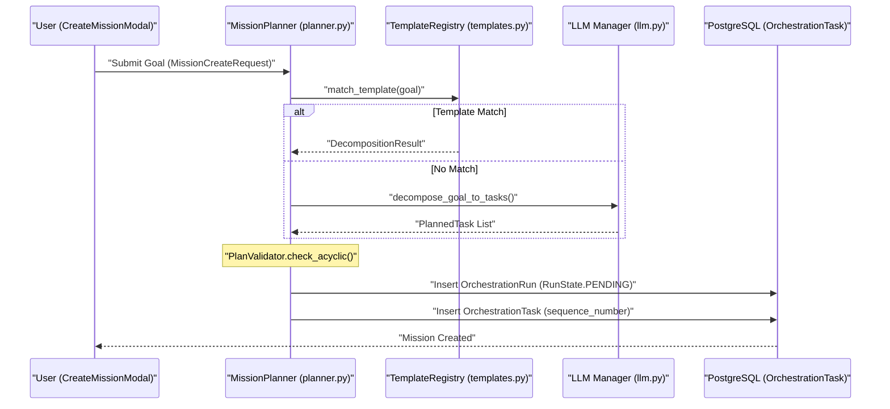

# Mission Planning & Verification

Relevant source files

The following files were used as context for generating this wiki page:

- [frontend/components/missions/create-mission-modal.tsx](frontend/components/missions/create-mission-modal.tsx)
- [frontend/components/missions/human-review-panel.tsx](frontend/components/missions/human-review-panel.tsx)
- [frontend/components/missions/mission-budget-bar.tsx](frontend/components/missions/mission-budget-bar.tsx)
- [frontend/components/missions/mission-results-panel.tsx](frontend/components/missions/mission-results-panel.tsx)
- [frontend/types/missions.ts](frontend/types/missions.ts)
- [orchestrator/api/missions.py](orchestrator/api/missions.py)
- [orchestrator/core/services/mission_memory_service.py](orchestrator/core/services/mission_memory_service.py)
- [orchestrator/modules/coordination/__init__.py](orchestrator/modules/coordination/__init__.py)
- [orchestrator/modules/coordination/agent_matcher.py](orchestrator/modules/coordination/agent_matcher.py)
- [orchestrator/modules/coordination/planner.py](orchestrator/modules/coordination/planner.py)
- [orchestrator/modules/coordination/reconciler.py](orchestrator/modules/coordination/reconciler.py)
- [orchestrator/modules/coordination/templates.py](orchestrator/modules/coordination/templates.py)
- [orchestrator/modules/coordination/verification.py](orchestrator/modules/coordination/verification.py)
- [orchestrator/services/coordinator_service.py](orchestrator/services/coordinator_service.py)
- [orchestrator/services/orchestration_state.py](orchestrator/services/orchestration_state.py)
- [orchestrator/tests/test_82c_wiring.py](orchestrator/tests/test_82c_wiring.py)
- [orchestrator/tests/test_parallel_decomposition.py](orchestrator/tests/test_parallel_decomposition.py)

The Mission Planning and Verification layer is responsible for transforming high-level natural language goals into executable Directed Acyclic Graphs (DAGs) and ensuring that the outputs produced by agents meet strict quality and structural requirements. This system bridges the gap between non-deterministic LLM reasoning and deterministic execution reliability.

## 1. Mission Planner & Goal Decomposition

The `MissionPlanner` is the entry point for mission execution. It utilizes a "Template-Hybrid" approach where the system first attempts to match a goal to a pre-defined template before falling back to LLM-based decomposition [orchestrator/modules/coordination/planner.py:7-12]().

### Decomposition Pipeline
1.  **Template Matching**: The planner calls `match_template` to check if the goal contains keywords (e.g., "research", "compare", "benchmark") that correspond to a `DecompositionTemplate` [orchestrator/modules/coordination/planner.py:29](), [orchestrator/modules/coordination/templates.py:64-75]().
2.  **Complexity Detection**: The system scores goal complexity based on word count, deliverable keywords, domain breadth, and attachment count to assign a `ComplexityTier` [orchestrator/modules/coordination/planner.py:184-196]().
3.  **Context Assembly**: If no template matches, the planner gathers the natural language goal, any attached document contents resolved via `_resolve_attachments_for_planning`, and the available `Agent` roster [orchestrator/modules/coordination/planner.py:44-55](), [orchestrator/modules/coordination/planner.py:67-75]().
4.  **LLM Generation**: It invokes the LLM with a system prompt that enforces a specific JSON schema, requiring a list of tasks with titles, descriptions, and `agent_role` assignments [orchestrator/modules/coordination/planner.py:118-120]().
5.  **Plan Validation**: The raw output is parsed and subjected to structural checks by the `PlanValidator` [orchestrator/modules/coordination/planner.py:5-10]().
6.  **Retry Logic**: If validation fails (e.g., cyclic dependencies or invalid agent roles), the planner retries up to 3 times, feeding the validation errors back into the next prompt [orchestrator/modules/coordination/planner.py:120]().

### Plan Validation Logic
The validation process ensures the mission is viable before any execution begins:
*   **Acyclicity**: Uses `DependencyResolver` to perform a topological sort and detect cycles in the task graph [orchestrator/modules/coordination/planner.py:30-34]().
*   **Agent Matching**: Verifies that the `agent_role` requested for each task matches the capabilities in the `Agent` roster [orchestrator/modules/coordination/planner.py:27-29]().
*   **Task Bounds**: Enforces limits on task counts (minimum 3, maximum 20) to prevent overly complex or trivial plans [orchestrator/modules/coordination/planner.py:118-119]().
*   **Parallel Safety**: Rejects plans where tasks in the same `parallel_group` have cross-dependencies [orchestrator/tests/test_parallel_decomposition.py:141-173]().

**Sources:** [orchestrator/modules/coordination/planner.py:1-216](), [orchestrator/modules/coordination/templates.py:1-181](), [orchestrator/tests/test_parallel_decomposition.py:58-135]()

## 2. Verification Service & Pipeline

Once an agent completes a task, the `VerificationService` assesses the output. Verification is **advisory**; feedback is stored in `task.output_metadata["review_feedback"]` for downstream consumption (e.g., synthesis tasks) [orchestrator/modules/coordination/verification.py:9-12]().

### Verification Stages
| Stage | Component | Description |
| :--- | :--- | :--- |
| **Deterministic** | `DeterministicChecker` | Validates structural quality signals like regex, JSON schema, and length [orchestrator/modules/coordination/verification.py:27](). |
| **LLM-as-Judge** | `VerificationService` | Uses a cross-model judge (different family than the executor) to score relevance, completeness, accuracy, and format [orchestrator/modules/coordination/verification.py:40-45](). |
| **Cross-Task Consistency** | `ConsistencyResult` | Checks for contradictions or misalignments between different task outputs within the same mission [orchestrator/modules/coordination/verification.py:72-80](). |

### Cross-Model Selection Logic
To ensure objective review, the `VerificationService` selects a verifier model from a different family than the one used to execute the task [orchestrator/modules/coordination/verification.py:101-110](). For example, if a task was executed by an OpenAI model, the verifier will be chosen from Anthropic, Google, or Meta families based on the `COORDINATOR_VERIFIER_MODEL_MAPPING` [orchestrator/modules/coordination/verification.py:116-131]().

Title: Task Verification Pipeline

**Sources:** [orchestrator/modules/coordination/reconciler.py:116-119](), [orchestrator/modules/coordination/verification.py:1-140](), [orchestrator/core/models/orchestration_enums.py:48-60]()

## 3. Feedback Loop & Retries

The mission lifecycle is managed by the `CoordinatorService` tick loop, which reconciles task states and handles failures.

### Reconciliation Flow
The `MissionReconciler` transitions tasks through their lifecycle:
1.  **COMPLETED → VERIFYING**: Triggered when an agent submits output [orchestrator/modules/coordination/reconciler.py:149-152]().
2.  **VERIFYING → VERIFIED**: Output evaluated; feedback is attached for downstream synthesis tasks [orchestrator/modules/coordination/reconciler.py:104]().
3.  **Stall Detection**: The reconciler identifies `ASSIGNED` tasks older than 60s or `RUNNING` tasks older than 300s and marks them as `STALLED` [orchestrator/modules/coordination/reconciler.py:155-158]().
4.  **Fatal Failure**: If a task fails and retries are exhausted, the entire `OrchestrationRun` transitions to `FAILED` [orchestrator/modules/coordination/reconciler.py:200-202]().

### Human-in-the-Loop (HITL) Review
Users can review verified tasks in the UI. The `HumanReviewPanel` allows for:
*   **Accept**: Moves the mission forward [orchestrator/api/missions.py:126]().
*   **Reject Flagged**: Rejects specific tasks with feedback, triggering a `RETRYING` state for those specific IDs [orchestrator/api/missions.py:127-130]().
*   **Replan**: Allows for replanning a failed mission [orchestrator/api/missions.py:18]().

**Sources:** [orchestrator/modules/coordination/reconciler.py:116-202](), [orchestrator/api/missions.py:125-152](), [orchestrator/services/orchestration_state.py:84-185]()

## 4. System Interaction Diagrams

### Goal Decomposition: Natural Language to Task DAG
This diagram illustrates how a user's natural language goal is transformed into code entities within the database using `MissionPlanner`.

Title: Goal Decomposition Sequence

**Sources:** [orchestrator/modules/coordination/planner.py:102-216](), [orchestrator/api/missions.py:82-90](), [frontend/components/missions/create-mission-modal.tsx:211-230]()

### Budget Governance & Telemetry
Missions track token usage and complexity to prevent budget overruns.

| Feature | Entity | Purpose |
| :--- | :--- | :--- |
| **Token Estimate** | `token_budget_estimate` | Sum of token budgets based on task complexity tiers [orchestrator/modules/coordination/planner.py:124-130](). |
| **Complexity Tier** | `ComplexityTier` | Scored based on deliverables, domains, and word count [orchestrator/modules/coordination/planner.py:184-196](). |
| **Usage Tracking** | `tokens_used` | Accumulated tokens across all tasks in the run [orchestrator/api/missions.py:204](), [frontend/types/missions.ts:49](). |

**Sources:** [orchestrator/modules/coordination/planner.py:124-196](), [orchestrator/api/missions.py:195-210](), [frontend/types/missions.ts:39-60]()

## 5. Mission State Reference

| State | Type | Description |
| :--- | :--- | :--- |
| `PLANNING` | `RunState` | `MissionPlanner` is decomposing the goal into a DAG [frontend/types/missions.ts:12](). |
| `AWAITING_APPROVAL` | `RunState` | Plan is generated; waiting for user to click 'Approve' in UI [frontend/types/missions.ts:13](). |
| `VERIFYING` | `TaskState` | `VerificationService` is currently running judge/deterministic checks [frontend/types/missions.ts:28](). |
| `STALLED` | `TaskState` | Task has timed out and is waiting for the reconciler to recover it [frontend/types/missions.ts:32](). |
| `RETRYING` | `TaskState` | Task failed or was rejected and is being re-attempted [frontend/types/missions.ts:33](). |

**Sources:** [frontend/types/missions.ts:10-34](), [orchestrator/modules/coordination/reconciler.py:31-39]()

---