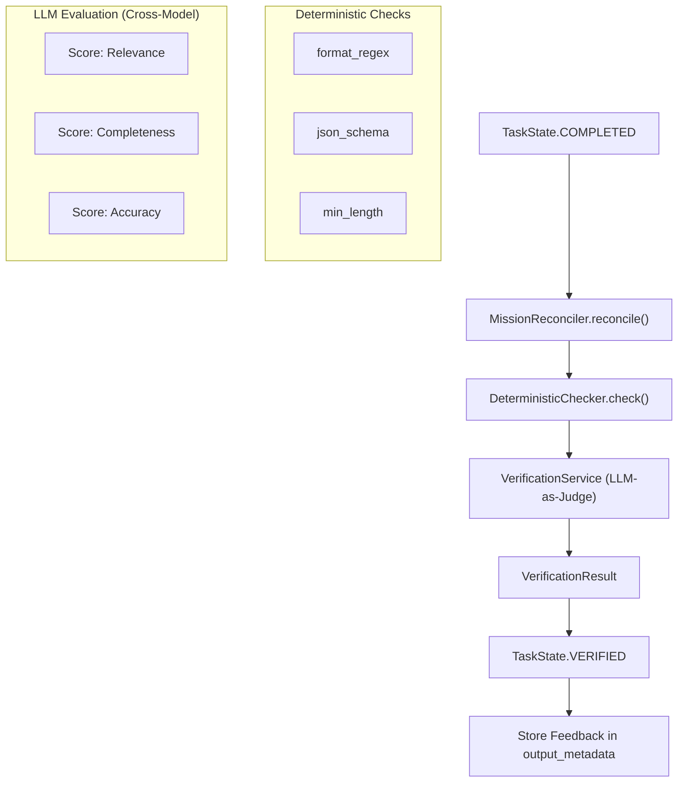
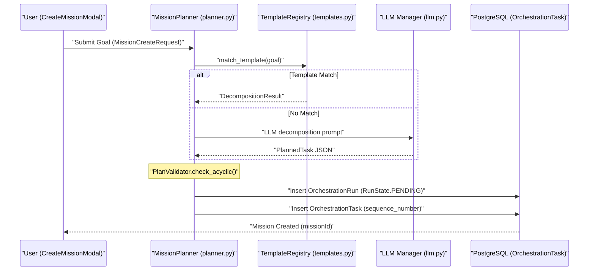

# Mission Planning & Verification

<details>
<summary>Relevant source files</summary>

The following files were used as context for generating this wiki page:

- [frontend/components/missions/create-mission-modal.tsx](frontend/components/missions/create-mission-modal.tsx)
- [frontend/components/missions/index.ts](frontend/components/missions/index.ts)
- [frontend/components/missions/mission-card.tsx](frontend/components/missions/mission-card.tsx)
- [frontend/components/missions/mission-detail-page.tsx](frontend/components/missions/mission-detail-page.tsx)
- [frontend/components/missions/mission-field-inspector.tsx](frontend/components/missions/mission-field-inspector.tsx)
- [frontend/components/missions/mission-field-panel.tsx](frontend/components/missions/mission-field-panel.tsx)
- [frontend/components/missions/mission-field-viz.tsx](frontend/components/missions/mission-field-viz.tsx)
- [frontend/hooks/use-missions-api.ts](frontend/hooks/use-missions-api.ts)
- [frontend/types/missions.ts](frontend/types/missions.ts)
- [orchestrator/alembic/versions/prd123_checkpoint_count.py](orchestrator/alembic/versions/prd123_checkpoint_count.py)
- [orchestrator/api/missions.py](orchestrator/api/missions.py)
- [orchestrator/core/models/orchestration.py](orchestrator/core/models/orchestration.py)
- [orchestrator/core/models/orchestration_enums.py](orchestrator/core/models/orchestration_enums.py)
- [orchestrator/modules/context/adapters/vector_field.py](orchestrator/modules/context/adapters/vector_field.py)
- [orchestrator/modules/coordination/__init__.py](orchestrator/modules/coordination/__init__.py)
- [orchestrator/modules/coordination/agent_matcher.py](orchestrator/modules/coordination/agent_matcher.py)
- [orchestrator/modules/coordination/dispatcher.py](orchestrator/modules/coordination/dispatcher.py)
- [orchestrator/modules/coordination/planner.py](orchestrator/modules/coordination/planner.py)
- [orchestrator/modules/coordination/primitive_heartbeat.py](orchestrator/modules/coordination/primitive_heartbeat.py)
- [orchestrator/modules/coordination/reconciler.py](orchestrator/modules/coordination/reconciler.py)
- [orchestrator/modules/coordination/templates.py](orchestrator/modules/coordination/templates.py)
- [orchestrator/modules/coordination/verification.py](orchestrator/modules/coordination/verification.py)
- [orchestrator/modules/memory/durable_store.py](orchestrator/modules/memory/durable_store.py)
- [orchestrator/services/coordinator_service.py](orchestrator/services/coordinator_service.py)
- [orchestrator/services/gdpr_service.py](orchestrator/services/gdpr_service.py)
- [orchestrator/tests/test_82c_wiring.py](orchestrator/tests/test_82c_wiring.py)
- [orchestrator/tests/test_agents_api_plugins.py](orchestrator/tests/test_agents_api_plugins.py)
- [orchestrator/tests/test_budget_gate.py](orchestrator/tests/test_budget_gate.py)
- [orchestrator/tests/test_coordinator_parallel.py](orchestrator/tests/test_coordinator_parallel.py)
- [orchestrator/tests/test_dispatcher_parallel.py](orchestrator/tests/test_dispatcher_parallel.py)
- [orchestrator/tests/test_mission_final_output_promotion.py](orchestrator/tests/test_mission_final_output_promotion.py)
- [orchestrator/tests/test_mission_retry_feeds_critique.py](orchestrator/tests/test_mission_retry_feeds_critique.py)
- [orchestrator/tests/test_p2w2_gdpr_subject_tags.py](orchestrator/tests/test_p2w2_gdpr_subject_tags.py)
- [orchestrator/tests/test_parallel_decomposition.py](orchestrator/tests/test_parallel_decomposition.py)
- [orchestrator/tests/test_planner_capability_routing.py](orchestrator/tests/test_planner_capability_routing.py)
- [orchestrator/tests/test_plugin_assignment_api.py](orchestrator/tests/test_plugin_assignment_api.py)
- [orchestrator/tests/test_plugin_runtime_integration.py](orchestrator/tests/test_plugin_runtime_integration.py)
- [orchestrator/tests/test_prd128_notification_dispatcher.py](orchestrator/tests/test_prd128_notification_dispatcher.py)
- [orchestrator/tests/test_prd181_gdpr.py](orchestrator/tests/test_prd181_gdpr.py)
- [orchestrator/tests/test_synthesis_executor.py](orchestrator/tests/test_synthesis_executor.py)
- [orchestrator/tests/test_w1s1_hotpath_telemetry.py](orchestrator/tests/test_w1s1_hotpath_telemetry.py)

</details>


The Mission Planning and Verification layer is responsible for transforming high-level natural language goals into executable Directed Acyclic Graphs (DAGs) and ensuring that the outputs produced by agents meet strict quality and structural requirements. This system bridges the gap between non-deterministic LLM reasoning and deterministic execution reliability.

## 1. Mission Planner & Goal Decomposition

The `MissionPlanner` is the entry point for mission execution. It utilizes a "Template-Hybrid" approach where the system first attempts to match a goal to a pre-defined template before falling back to LLM-based decomposition [orchestrator/modules/coordination/planner.py:7-12]().

### Decomposition Pipeline
1.  **Template Matching**: The planner calls `match_template` to check if the goal contains keywords (e.g., "research", "business plan") that correspond to a `DecompositionTemplate` [orchestrator/modules/coordination/planner.py:8-9](), [orchestrator/modules/coordination/templates.py:1-10]().
2.  **Complexity Detection**: The system scores goal complexity based on word count, deliverable keywords (e.g., "report", "app"), and domain clusters to assign a `ComplexityTier` [orchestrator/modules/coordination/planner.py:177-190]().
3.  **Context Assembly**: If no template matches, the planner gathers the natural language goal, any attached document contents resolved via `_resolve_attachments_for_planning` [orchestrator/modules/coordination/planner.py:46-113](), and a planning context pack from `ContextService` [orchestrator/modules/coordination/planner.py:121-153]().
4.  **LLM Generation**: It invokes the LLM to generate a list of tasks with titles, descriptions, `agent_role` assignments, and `depends_on` relationships to form the DAG [orchestrator/modules/coordination/planner.py:9-10]().
5.  **Plan Validation**: The raw output is subjected to structural checks by the `PlanValidator` to ensure it is a valid DAG [orchestrator/modules/coordination/planner.py:5-10](), [orchestrator/modules/coordination/planner.py:58]().
6.  **Retry Logic**: If validation fails (e.g., cyclic dependencies), the planner retries up to 3 times (`MAX_PLAN_RETRIES`) [orchestrator/modules/coordination/planner.py:165]().

### Plan Validation Logic
The validation process ensures the mission is viable before any execution begins:
*   **Acyclicity**: Uses `DependencyResolver` to perform a topological sort and detect cycles in the task graph [orchestrator/modules/coordination/planner.py:32-37]().
*   **Agent Matching**: Verifies that the `agent_role` requested for each task matches the capabilities in the `Agent` roster via `AgentMatcher` [orchestrator/modules/coordination/planner.py:30](), [orchestrator/modules/coordination/agent_matcher.py:1-10]().
*   **Task Bounds**: Enforces limits on task counts (minimum 1, maximum 20) to prevent overly complex or trivial plans [orchestrator/modules/coordination/planner.py:163-164]().

**Sources:** [orchestrator/modules/coordination/planner.py:1-210](), [orchestrator/services/coordinator_service.py:55-59](), [orchestrator/modules/coordination/templates.py:1-10](), [orchestrator/modules/coordination/agent_matcher.py:1-10]()

## 2. Verification Service & Pipeline

Once an agent completes a task, the `VerificationService` assesses the output. Verification is **advisory only**; feedback is stored in `task.output_metadata["review_feedback"]` for downstream consumption [orchestrator/modules/coordination/verification.py:9-12]().

### Verification Stages
| Stage | Component | Description |
| :--- | :--- | :--- |
| **Deterministic** | `DeterministicChecker` | Validates structural quality signals like regex, JSON schema, and length [orchestrator/modules/coordination/verification.py:29](). |
| **LLM-as-Judge** | `VerificationService` | Uses a cross-model judge to score `relevance`, `completeness`, `accuracy`, and `format_compliance` [orchestrator/modules/coordination/verification.py:40-41](). |
| **Cross-Task Consistency** | `ConsistencyResult` | Checks for contradictions or misalignments between different task outputs [orchestrator/modules/coordination/verification.py:73-80](). |

### Cross-Model Selection Logic
To ensure objective review, the `VerificationService` selects a verifier model from a different family than the one used to execute the task [orchestrator/modules/coordination/verification.py:102-107](). For example, if a task was executed by a `gpt-4o` (OpenAI), the verifier will be chosen from Anthropic or Google families based on the `COORDINATOR_VERIFIER_MODEL_MAPPING` [orchestrator/modules/coordination/verification.py:117-132]().

Title: Task Verification Pipeline

**Sources:** [orchestrator/modules/coordination/verification.py:1-161](), [orchestrator/modules/coordination/reconciler.py:151-153](), [orchestrator/core/models/orchestration_enums.py:99-102]()

## 3. Feedback Loop & Retries

The mission lifecycle is managed by the `CoordinatorService` tick loop, which reconciles task states and handles failures.

### Reconciliation Flow
The `MissionReconciler` transitions tasks through their lifecycle:
1.  **COMPLETED → VERIFYING**: Triggered when an agent submits output [orchestrator/modules/coordination/reconciler.py:151]().
2.  **VERIFYING → VERIFIED**: Output evaluated; feedback is attached for downstream synthesis tasks [orchestrator/modules/coordination/reconciler.py:152]().
3.  **Stall Detection**: The reconciler identifies `ASSIGNED` tasks older than 60s or `RUNNING` tasks older than 300s and marks them as `STALLED` [orchestrator/modules/coordination/reconciler.py:7-8]().
4.  **Fatal Failure**: If a task fails and retries are exhausted, the entire `OrchestrationRun` transitions to `FAILED` [orchestrator/modules/coordination/reconciler.py:10]().

### Human-in-the-Loop (HITL) & Approval
Users interact with the mission lifecycle via the `MissionDetailPage` [frontend/components/missions/mission-detail-page.tsx:68]().
*   **Plan Approval**: Missions created with `plan_only=True` await approval via `POST /api/missions/{id}/approve` [orchestrator/api/missions.py:91-94](), [orchestrator/api/missions.py:15]().
*   **Plan Editing**: Before approval, users can PATCH task fields like `agent_role`, `title`, and `description` [orchestrator/services/coordinator_service.py:98-101](), [orchestrator/api/missions.py:109-117]().
*   **Replanning**: Failed missions can be replanned with user feedback using `useReplanMission` [frontend/components/missions/mission-detail-page.tsx:80](), [orchestrator/api/missions.py:18]().

**Sources:** [orchestrator/modules/coordination/reconciler.py:1-110](), [orchestrator/api/missions.py:1-28](), [frontend/components/missions/mission-detail-page.tsx:160-200]()

## 4. System Interaction Diagrams

### Goal Decomposition: Natural Language to Task DAG
This diagram illustrates how a user's natural language goal is transformed into code entities within the database using `MissionPlanner`.

Title: Goal Decomposition Sequence

**Sources:** [orchestrator/modules/coordination/planner.py:7-12](), [orchestrator/api/missions.py:83-95](), [frontend/components/missions/create-mission-modal.tsx:222-230]()

### Mission Field Memory Integration
The `VectorFieldSharedContext` [orchestrator/modules/context/adapters/vector_field.py:68-78]() provides a shared semantic space for agents within a mission. This "field memory" allows agents to resonate with and reinforce patterns, enabling a more cohesive multi-agent collaboration.

Title: Mission Field Memory Data Flow
```mermaid
graph TD
    A[Agent Output] --> B{VectorFieldSharedContext.inject()};
    B --> C[Qdrant Collection: "field_memory"];
    C -- "Payload: field_id, workspace_id, agent_id, content_hash" --> D[FieldPattern];
    D -- "Embedding" --> C;
    E[Agent Input] --> F{VectorFieldSharedContext.query()};
    F --> C;
    C -- "Resonance (cosine_similarity² × decayed_strength)" --> G[Relevant Field Patterns];
    G --> E;
    H[MissionFieldPanel (frontend)] --> I{useMissionField()};
    I --> J[GET /api/missions/{id}/field];
    J --> K[VectorFieldSharedContext.get_all_patterns()];
    K --> H;
```
**Sources:** [orchestrator/modules/context/adapters/vector_field.py:1-100](), [frontend/components/missions/mission-field-panel.tsx:116-128](), [frontend/hooks/use-missions-api.ts:1-10](), [orchestrator/modules/context/adapters/vector_field.py:50-51]()

### Budget Governance & Telemetry
Missions track token usage and complexity to prevent budget overruns.

| Feature | Entity | Purpose |
| :--- | :--- | :--- |
| **Token Estimate** | `token_budget_estimate` | Sum of token budgets based on task complexity tiers [orchestrator/modules/coordination/planner.py:169-174](). |
| **Complexity Tier** | `ComplexityTier` | Categorizes tasks as `SIMPLE`, `MODERATE`, or `COMPLEX` [orchestrator/core/models/orchestration_enums.py:175-179](). |
| **Usage Tracking** | `tokens_used` | Accumulated tokens across all tasks in the run [orchestrator/core/models/orchestration.py:98](). |
| **Budget Config** | `budget_config` | Stored JSON for `max_cost` and `max_tokens` limits [orchestrator/core/models/orchestration.py:112](). |

**Sources:** [orchestrator/core/models/orchestration.py:95-113](), [orchestrator/modules/coordination/planner.py:169-174](), [orchestrator/core/models/orchestration_enums.py:175-179]()

## 5. Mission State Reference

| State | Type | Description |
| :--- | :--- | :--- |
| `PLANNING` | `RunState` | `MissionPlanner` is decomposing the goal into a DAG [orchestrator/core/models/orchestration_enums.py:31](). |
| `AWAITING_APPROVAL` | `RunState` | Plan is generated; waiting for user approval [orchestrator/core/models/orchestration_enums.py:32](). |
| `VERIFYING` | `TaskState` | `VerificationService` is currently running judge/deterministic checks [orchestrator/core/models/orchestration_enums.py:54](). |
| `STALLED` | `TaskState` | Task has timed out and is waiting for recovery [orchestrator/core/models/orchestration_enums.py:58](). |
| `RETRYING` | `TaskState` | Task is being re-attempted after failure or rejection [orchestrator/core/models/orchestration_enums.py:59](). |

**Sources:** [orchestrator/core/models/orchestration_enums.py:29-60](), [orchestrator/modules/coordination/reconciler.py:5-10]()

---