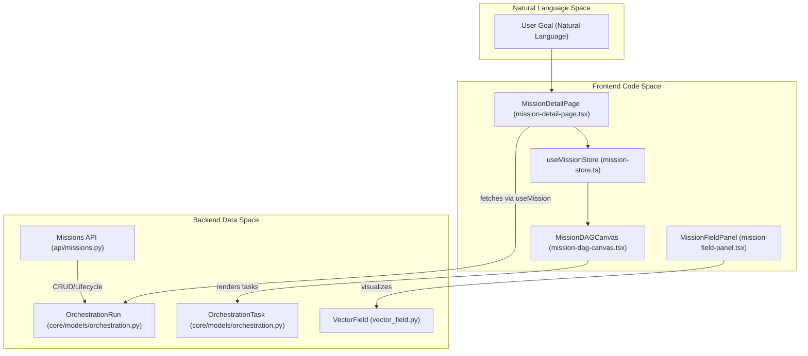
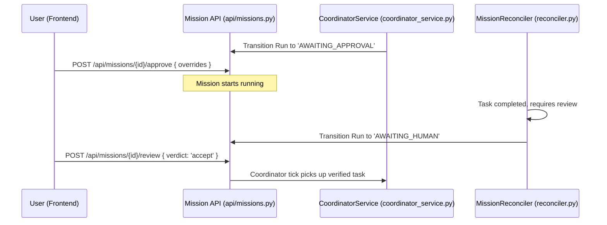

# Mission UI & Human Review

Relevant source files

The following files were used as context for generating this wiki page:

- [frontend/app/assignments/page.tsx](frontend/app/assignments/page.tsx)
- [frontend/components/assignments/assignments-missions-grid.tsx](frontend/components/assignments/assignments-missions-grid.tsx)
- [frontend/components/assignments/assignments-page.tsx](frontend/components/assignments/assignments-page.tsx)
- [frontend/components/assignments/assignments-playbooks-grid.tsx](frontend/components/assignments/assignments-playbooks-grid.tsx)
- [frontend/components/assignments/mission-card-constellation.tsx](frontend/components/assignments/mission-card-constellation.tsx)
- [frontend/components/assignments/studio/assignments-hub.tsx](frontend/components/assignments/studio/assignments-hub.tsx)
- [frontend/components/assignments/studio/entry-grid.tsx](frontend/components/assignments/studio/entry-grid.tsx)
- [frontend/components/assignments/studio/mission-card.tsx](frontend/components/assignments/studio/mission-card.tsx)
- [frontend/components/assignments/studio/missions-body.tsx](frontend/components/assignments/studio/missions-body.tsx)
- [frontend/components/assignments/studio/mkt-card.tsx](frontend/components/assignments/studio/mkt-card.tsx)
- [frontend/components/assignments/studio/playbook-card.tsx](frontend/components/assignments/studio/playbook-card.tsx)
- [frontend/components/assignments/studio/playbooks-body.tsx](frontend/components/assignments/studio/playbooks-body.tsx)
- [frontend/components/assignments/studio/status-head.tsx](frontend/components/assignments/studio/status-head.tsx)
- [frontend/components/context/pattern-details-modal.tsx](frontend/components/context/pattern-details-modal.tsx)
- [frontend/components/context/rag-context-builder.tsx](frontend/components/context/rag-context-builder.tsx)
- [frontend/components/layout/studio-header.tsx](frontend/components/layout/studio-header.tsx)
- [frontend/components/marketplace/marketplace-playbooks-tab.tsx](frontend/components/marketplace/marketplace-playbooks-tab.tsx)
- [frontend/components/missions/create-mission-modal.tsx](frontend/components/missions/create-mission-modal.tsx)
- [frontend/components/missions/index.ts](frontend/components/missions/index.ts)
- [frontend/components/missions/mission-card.tsx](frontend/components/missions/mission-card.tsx)
- [frontend/components/missions/mission-detail-page.tsx](frontend/components/missions/mission-detail-page.tsx)
- [frontend/components/missions/mission-field-inspector.tsx](frontend/components/missions/mission-field-inspector.tsx)
- [frontend/components/missions/mission-field-panel.tsx](frontend/components/missions/mission-field-panel.tsx)
- [frontend/components/missions/mission-field-viz.tsx](frontend/components/missions/mission-field-viz.tsx)
- [frontend/components/missions/mission-list.tsx](frontend/components/missions/mission-list.tsx)
- [frontend/components/missions/mission-results-panel.tsx](frontend/components/missions/mission-results-panel.tsx)
- [frontend/components/workflows/playbook-execution-config.tsx](frontend/components/workflows/playbook-execution-config.tsx)
- [frontend/components/workflows/playbook-preview-panel.tsx](frontend/components/workflows/playbook-preview-panel.tsx)
- [frontend/components/workflows/playbook-schedule-config.tsx](frontend/components/workflows/playbook-schedule-config.tsx)
- [frontend/components/workflows/playbook-step-builder.tsx](frontend/components/workflows/playbook-step-builder.tsx)
- [frontend/components/workflows/playbooks-tab.tsx](frontend/components/workflows/playbooks-tab.tsx)
- [frontend/components/workflows/view-playbook-modal.tsx](frontend/components/workflows/view-playbook-modal.tsx)
- [frontend/hooks/use-assignments-api.ts](frontend/hooks/use-assignments-api.ts)
- [frontend/hooks/use-missions-api.ts](frontend/hooks/use-missions-api.ts)
- [frontend/types/missions.ts](frontend/types/missions.ts)
- [orchestrator/alembic/versions/prd123_checkpoint_count.py](orchestrator/alembic/versions/prd123_checkpoint_count.py)
- [orchestrator/api/assignments.py](orchestrator/api/assignments.py)
- [orchestrator/api/missions.py](orchestrator/api/missions.py)
- [orchestrator/core/models/orchestration.py](orchestrator/core/models/orchestration.py)
- [orchestrator/core/models/orchestration_enums.py](orchestrator/core/models/orchestration_enums.py)
- [orchestrator/modules/context/adapters/vector_field.py](orchestrator/modules/context/adapters/vector_field.py)
- [orchestrator/modules/coordination/dispatcher.py](orchestrator/modules/coordination/dispatcher.py)
- [orchestrator/modules/coordination/planner.py](orchestrator/modules/coordination/planner.py)
- [orchestrator/modules/coordination/primitive_heartbeat.py](orchestrator/modules/coordination/primitive_heartbeat.py)
- [orchestrator/modules/coordination/reconciler.py](orchestrator/modules/coordination/reconciler.py)
- [orchestrator/modules/coordination/verification.py](orchestrator/modules/coordination/verification.py)
- [orchestrator/modules/memory/durable_store.py](orchestrator/modules/memory/durable_store.py)
- [orchestrator/services/coordinator_service.py](orchestrator/services/coordinator_service.py)
- [orchestrator/services/gdpr_service.py](orchestrator/services/gdpr_service.py)
- [orchestrator/tests/test_dispatcher_parallel.py](orchestrator/tests/test_dispatcher_parallel.py)
- [orchestrator/tests/test_mission_final_output_promotion.py](orchestrator/tests/test_mission_final_output_promotion.py)
- [orchestrator/tests/test_mission_retry_feeds_critique.py](orchestrator/tests/test_mission_retry_feeds_critique.py)
- [orchestrator/tests/test_p2w2_gdpr_subject_tags.py](orchestrator/tests/test_p2w2_gdpr_subject_tags.py)
- [orchestrator/tests/test_prd181_gdpr.py](orchestrator/tests/test_prd181_gdpr.py)
- [orchestrator/tests/test_w1s1_hotpath_telemetry.py](orchestrator/tests/test_w1s1_hotpath_telemetry.py)

The Mission UI and Human Review system provides the visual interface for monitoring, approving, and interacting with multi-agent orchestrations. It bridges the gap between the backend `CoordinatorService` and the user, offering a real-time view of goal decomposition, task execution progress via a Directed Acyclic Graph (DAG) visualization, and manual intervention points for plan approval and output verification.

## Mission Visualization & Management

The frontend architecture for missions is centered around the `MissionDetailPage`, which acts as a "Mission Control" center. It integrates live telemetry, status tracking, and the task dependency graph.

### Component Hierarchy
*   **MissionList**: Displays a high-level overview of all `OrchestrationRun` entities using `MissionCard` components.
*   **MissionDetailPage**: The primary view for a specific mission, utilizing a `ResizablePanelGroup` to balance the DAG canvas, task inspector, activity feed, and deliverables [frontend/components/missions/mission-detail-page.tsx:23-35]().
*   **MissionDAGCanvas**: A `reactflow`-based visualization of the mission's `TaskResponse` nodes and their dependencies [frontend/components/missions/mission-detail-page.tsx:30]().
*   **MissionBudgetBar**: Displays real-time mission metrics including `tokens_used` and the `token_budget_estimate` progress [frontend/components/missions/mission-detail-page.tsx:29]().
*   **MissionResultsPanel**: A specialized panel for viewing completed task outputs, offering "Combined" markdown views or "Per Task" breakdowns [frontend/components/missions/mission-results-panel.tsx:1-10]().
*   **MissionFieldPanel**: A 3D visualization and list view of the shared semantic field (PRD-108) where agent knowledge resonates and decays [frontend/components/missions/mission-field-panel.tsx:15-115]().

### Mission Detail Layout
The `MissionDetailPage` utilizes the `useMission` hook to fetch data and `computeMissionStats` to drive the UI state [frontend/components/missions/mission-detail-page.tsx:70-97](). It provides global controls to `pause`, `resume`, or `cancel` the mission run via mutations [frontend/components/missions/mission-detail-page.tsx:73-81]().

| Feature | Implementation | Source |
| :--- | :--- | :--- |
| **State Badges** | `MissionStatusBadge` mapping `RunState` to UI colors | [frontend/types/missions.ts:182-241]() |
| **Budget Tracking** | `MissionBudgetBar` showing token consumption vs estimate | [frontend/components/missions/mission-detail-page.tsx:29]() |
| **Power Modes** | Selection of `light`, `standard`, or `max` execution caps | [orchestrator/services/coordinator_service.py:91-95]() |
| **Layout** | `ResizablePanelGroup` for DAG vs. Side Panels | [frontend/components/missions/mission-detail-page.tsx:24-27]() |

**Sources:** [frontend/components/missions/mission-detail-page.tsx:1-135](), [frontend/hooks/use-missions-api.ts:1-70](), [frontend/types/missions.ts:1-241](), [orchestrator/services/coordinator_service.py:91-95]()

---

## Mission DAG Canvas

The `MissionDAGCanvas` provides a visual representation of the mission plan. It uses `reactflow` to render tasks as nodes and dependencies as edges.

### Logic & Layout
1.  **Node Mapping**: Each `TaskResponse` is mapped to a `MissionTaskNode`. Nodes visually reflect the `TaskState` (e.g., `RUNNING`, `VERIFIED`, `STALLED`) [orchestrator/core/models/orchestration_enums.py:48-60]().
2.  **Sequential Layout**: Tasks are sorted and positioned based on their `sequence_number`. Tasks with the same sequence number are laid out side-by-side to represent parallel execution capability [orchestrator/modules/coordination/dispatcher.py:5-18]().
3.  **Edge Animation**: Edges reflect the flow of data; animated edges indicate active transitions between tasks.
4.  **Interaction**: Clicking a node triggers `setSelectedTaskId` in the `useMissionStore`, opening the `TaskInspector` [frontend/components/missions/mission-detail-page.tsx:99-112]().

### Mission UI Entity Mapping

**Sources:** [frontend/components/missions/mission-detail-page.tsx:1-135](), [orchestrator/core/models/orchestration.py:39-165](), [orchestrator/modules/coordination/dispatcher.py:1-18](), [orchestrator/modules/context/adapters/vector_field.py:1-105]()

---

## Human-in-the-Loop (HITL) Review

The platform implements critical human review gates to ensure safety and quality, specifically for **Plan Approval** and **Task Editing**.

### 1. Plan Approval Gate
After the planning phase handled by `MissionPlanner` [orchestrator/modules/coordination/planner.py:5-15](), the mission transitions to `AWAITING_APPROVAL` [orchestrator/core/models/orchestration_enums.py:32]().
*   **UI Trigger**: The `MissionDetailPage` displays an approval interface when the state is `awaiting_approval`.
*   **Actions**: Users can call `POST /api/missions/{id}/approve` to start execution [orchestrator/api/missions.py:15]().
*   **Plan Editing**: PRD-163 S4 allows users to edit `agent_role`, `title`, and `description` of planned tasks before approval [orchestrator/services/coordinator_service.py:98-101](). Edits are submitted via `MissionPlanEditRequest` [orchestrator/api/missions.py:120-125]().

### 2. Output Verification Gate
Verification is primarily advisory (PRD-103), but the system supports human review requests.
*   **Advisory Review**: `VerificationService` performs deterministic and LLM-as-judge checks, storing feedback in `output_metadata` [orchestrator/modules/coordination/verification.py:5-16]().
*   **Human Review**: If a task requires manual review, the state moves to `AWAITING_HUMAN` [orchestrator/core/models/orchestration_enums.py:89]().
*   **Decision**: Users submit a verdict via `POST /api/missions/{id}/review` [orchestrator/api/missions.py:17]().

### Human Review Data Flow

**Sources:** [orchestrator/api/missions.py:1-125](), [orchestrator/services/coordinator_service.py:98-158](), [orchestrator/modules/coordination/verification.py:1-16](), [orchestrator/core/models/orchestration_enums.py:32](), [orchestrator/core/models/orchestration_enums.py:89]()

---

## Mission Creation & Context

Missions are initiated via the `CreateMissionModal`, which handles goal definition, template selection, and attachment resolution.

### Creation Flow
*   **Templates**: Users select from `MISSION_TEMPLATES` (e.g., `business_plan`, `research_and_report`) which provide structure to the goal [frontend/components/missions/create-mission-modal.tsx:108-151]().
*   **Power Modes**: Users choose execution intensity (`light`, `standard`, `max`), which controls `max_tool_iterations` and `timeout_seconds` [orchestrator/services/coordinator_service.py:91-95]().
*   **Ephemeral Attachments**: PRD-127 allows uploading files. `MissionPlanner` resolves these `attachment_ids` into text content for the decomposition prompt [orchestrator/modules/coordination/planner.py:46-113]().

### Mission Field & Context
Missions utilize a shared vector field (PRD-108) for inter-agent communication.
*   **Resonance**: Relevance in the field is determined by `cosine_similarity² × decayed_strength` [orchestrator/modules/context/adapters/vector_field.py:15-16]().
*   **Visualization**: `MissionFieldPanel` renders these patterns, showing their stability and agent attribution [frontend/components/missions/mission-field-panel.tsx:115-194]().
*   **Isolation**: Per-mission isolation is enforced via the `field_id` payload filter in Qdrant [orchestrator/modules/context/adapters/vector_field.py:75-78]().

**Sources:** [frontend/components/missions/create-mission-modal.tsx:1-200](), [orchestrator/modules/coordination/planner.py:46-175](), [orchestrator/modules/context/adapters/vector_field.py:1-105](), [orchestrator/services/coordinator_service.py:91-95]()

---