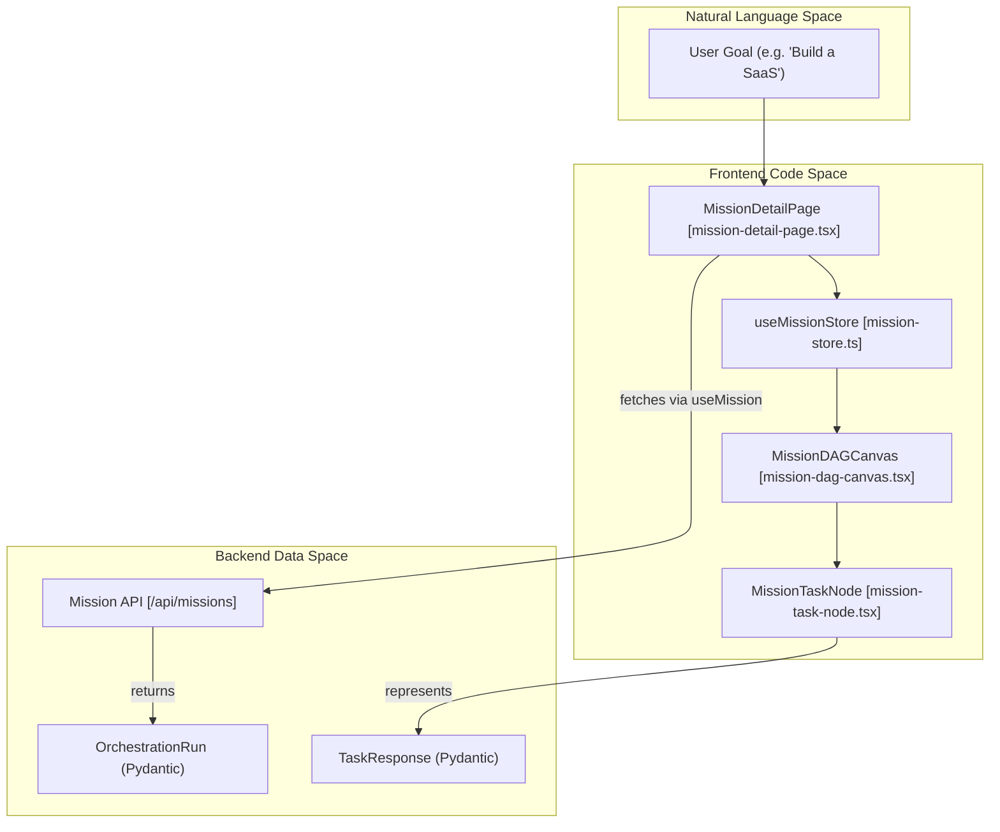
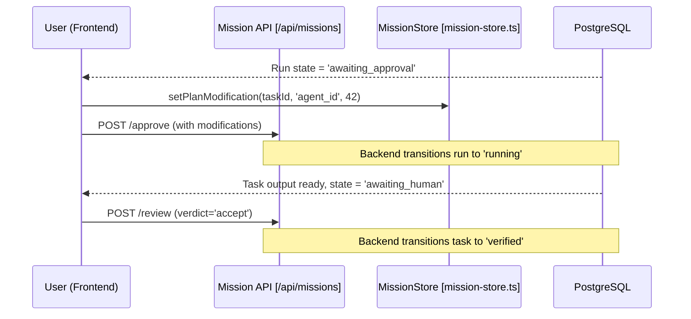

# Mission UI & Human Review

Relevant source files

The following files were used as context for generating this wiki page:

- [docs/PRDS/102-COORDINATOR-ARCHITECTURE.md](docs/PRDS/102-COORDINATOR-ARCHITECTURE.md)
- [docs/PRDS/103-VERIFICATION-QUALITY.md](docs/PRDS/103-VERIFICATION-QUALITY.md)
- [frontend/app/api/chat/route.ts](frontend/app/api/chat/route.ts)
- [frontend/app/missions/[id]/page.tsx](frontend/app/missions/[id]/page.tsx)
- [frontend/components/chatbot/chat-mode-bar.tsx](frontend/components/chatbot/chat-mode-bar.tsx)
- [frontend/components/chatbot/chat.tsx](frontend/components/chatbot/chat.tsx)
- [frontend/components/chatbot/message-actions.tsx](frontend/components/chatbot/message-actions.tsx)
- [frontend/components/chatbot/message.tsx](frontend/components/chatbot/message.tsx)
- [frontend/components/chatbot/mission-suggestion-card.tsx](frontend/components/chatbot/mission-suggestion-card.tsx)
- [frontend/components/missions/create-mission-modal.tsx](frontend/components/missions/create-mission-modal.tsx)
- [frontend/components/missions/human-review-panel.tsx](frontend/components/missions/human-review-panel.tsx)
- [frontend/components/missions/index.ts](frontend/components/missions/index.ts)
- [frontend/components/missions/mission-activity-feed.tsx](frontend/components/missions/mission-activity-feed.tsx)
- [frontend/components/missions/mission-card.tsx](frontend/components/missions/mission-card.tsx)
- [frontend/components/missions/mission-dag-canvas.tsx](frontend/components/missions/mission-dag-canvas.tsx)
- [frontend/components/missions/mission-detail-page.tsx](frontend/components/missions/mission-detail-page.tsx)
- [frontend/components/missions/mission-list.tsx](frontend/components/missions/mission-list.tsx)
- [frontend/components/missions/mission-results-panel.tsx](frontend/components/missions/mission-results-panel.tsx)
- [frontend/components/missions/mission-status-badge.tsx](frontend/components/missions/mission-status-badge.tsx)
- [frontend/components/missions/mission-task-node.tsx](frontend/components/missions/mission-task-node.tsx)
- [frontend/hooks/use-missions-api.ts](frontend/hooks/use-missions-api.ts)
- [frontend/lib/chat/hooks.ts](frontend/lib/chat/hooks.ts)
- [frontend/stores/mission-store.ts](frontend/stores/mission-store.ts)
- [frontend/types/chat.ts](frontend/types/chat.ts)
- [frontend/types/missions.ts](frontend/types/missions.ts)
- [orchestrator/tests/test_complexity_detection.py](orchestrator/tests/test_complexity_detection.py)

The Mission UI and Human Review system provides the visual interface for monitoring, approving, and interacting with multi-agent orchestrations. It bridges the gap between the backend `CoordinatorService` and the user, offering a real-time view of goal decomposition, task execution progress via a Directed Acyclic Graph (DAG) visualization, and manual intervention points for plan approval and output verification.

## Mission Visualization & Management

The frontend architecture for missions is centered around the `MissionDetailPage`, which acts as a "Mission Control" center. It integrates live telemetry, status tracking, and the task dependency graph.

### Component Hierarchy
*   **MissionList**: Displays a high-level overview of all `OrchestrationRun` entities using `MissionCard` components [frontend/components/missions/mission-list.tsx:1-20]().
*   **MissionDetailPage**: The primary view for a specific mission, utilizing a `ResizablePanelGroup` to balance the DAG canvas and the activity feed [frontend/components/missions/mission-detail-page.tsx:24-26]().
*   **MissionDAGCanvas**: A `reactflow`-based visualization of the mission's `OrchestrationTask` nodes and their dependencies [frontend/components/missions/mission-dag-canvas.tsx:215-230]().
*   **MissionBudgetBar**: Displays real-time mission metrics including `tasksDone`, `taskCount`, and financial/token budget consumption [frontend/components/missions/mission-budget-bar.tsx:1-15]().
*   **CreateMissionModal**: A specialized modal for launching missions, supporting file attachments and templates like "Business Plan" or "Research Report" [frontend/components/missions/create-mission-modal.tsx:59-110]().

### Mission Detail Layout
The `MissionDetailPage` utilizes the `useMission` hook to fetch data and `computeMissionStats` to drive the UI state [frontend/components/missions/mission-detail-page.tsx:58-85](). It provides global controls to `pause`, `resume`, or `cancel` the mission run via mutations [frontend/components/missions/mission-detail-page.tsx:61-69]().

| Feature | Implementation | Source |
| :--- | :--- | :--- |
| **State Badges** | `MissionStatusBadge` mapping `RunState` to UI colors | [frontend/components/missions/mission-status-badge.tsx:1-20]() |
| **Budget Tracking** | `MissionBudgetBar` showing `tokens_used` vs `token_budget_estimate` | [frontend/types/missions.ts:48-49]() |
| **Navigation** | `useSearchParams` for tab switching (e.g., `?tab=review`) | [frontend/components/missions/mission-detail-page.tsx:55-56]() |
| **Layout** | `ResizablePanelGroup` for DAG vs. Activity/Field Feed | [frontend/components/missions/mission-detail-page.tsx:24-26]() |

**Sources:** [frontend/components/missions/mission-detail-page.tsx:1-150](), [frontend/hooks/use-missions-api.ts:61-69](), [frontend/types/missions.ts:182-241]()

---

## Mission DAG Canvas

The `MissionDAGCanvas` provides a visual representation of the mission plan. It uses `reactflow` to render tasks as nodes and dependencies as edges.

### Logic & Layout
1.  **Node Mapping**: Each `TaskResponse` is mapped to a `MissionTaskNode` [frontend/components/missions/mission-dag-canvas.tsx:15-28]().
2.  **Sequential Layout**: The `layoutTasks` function groups tasks by `sequence_number`. Tasks with the same sequence number are rendered side-by-side to indicate potential parallel execution [frontend/components/missions/mission-dag-canvas.tsx:40-64]().
3.  **Edge Animation**: Edges reflect the flow of data; animated edges indicate active transitions between tasks [frontend/components/missions/mission-dag-canvas.tsx:132-136]().
4.  **Interaction**: Clicking a node triggers `onTaskSelect`, which updates `selectedTaskId` in the `useMissionStore` [frontend/components/missions/mission-dag-canvas.tsx:208-214]().

### Task Node States
Nodes visually reflect the `TaskState` (PENDING, QUEUED, ASSIGNED, RUNNING, COMPLETED, VERIFYING, VERIFIED, FAILED, SKIPPED, STALLED, RETRYING) using configurations defined in `TASK_STATE_CONFIG` [frontend/types/missions.ts:245-265]().

**Mission UI Entity Mapping**

**Sources:** [frontend/components/missions/mission-dag-canvas.tsx:1-152](), [frontend/types/missions.ts:22-35](), [frontend/stores/mission-store.ts:45-64]()

---

## Human-in-the-Loop (HITL) Review

The platform implements critical human review gates to ensure safety and quality: **Plan Approval** and **Output Acceptance**.

### 1. Plan Approval Gate
After a mission is created, it often enters an `awaiting_approval` state [frontend/types/missions.ts:13]().
*   **UI Trigger**: The `MissionDetailPage` displays an approval interface when the state is `awaiting_approval` [frontend/components/missions/mission-detail-page.tsx:198-202]().
*   **Actions**: Users can `approveMutation` (starts execution) or `rejectMutation` (stops the run) [frontend/hooks/use-missions-api.ts:141-173]().
*   **Modifications**: Users can modify the plan via `planModifications` in the store, allowing for `agent_overrides` or `task_overrides` before execution [frontend/stores/mission-store.ts:65-89]().

### 2. Output Verification Gate
When a task completes, if it requires manual verification, the mission enters `awaiting_human` [frontend/types/missions.ts:17]().
*   **HumanReviewPanel**: Displays the agent's output and allows the user to accept or reject the result [frontend/components/missions/human-review-panel.tsx:1-30]().
*   **Decision Matrix**:
    *   **Accept**: Triggers `useReviewMission` with a verdict of `accept`, moving the task to `verified` [frontend/hooks/use-missions-api.ts:177-191]().
    *   **Reject**: Triggers `useReviewMission` with a verdict of `reject`, typically prompting for feedback to trigger a retry [frontend/types/missions.ts:131-135]().

### Human Review Data Flow

**Sources:** [frontend/components/missions/mission-detail-page.tsx:53-150](), [frontend/hooks/use-missions-api.ts:141-191](), [frontend/stores/mission-store.ts:65-104]()

---

## Mission Results & Context

### Mission Results Panel
The `MissionResultsPanel` provides a consolidated view of all outputs produced during the mission [frontend/components/missions/mission-results-panel.tsx:30-40]().
*   **Combined View**: Aggregates all verified task outputs into a single Markdown document for download or copying [frontend/components/missions/mission-results-panel.tsx:75-85]().
*   **App Builder Integration**: For "app_builder" missions, it provides a direct download link for the generated application bundle [frontend/components/missions/mission-results-panel.tsx:43-73]().

### Mission Field Visualizer
Missions utilize a shared context field to allow agents to share information. The `MissionFieldPanel` visualizes this shared vector space [frontend/hooks/use-missions-api.ts:112-120]().
*   **Patterns**: Lists the specific data patterns injected into the field by agents [frontend/hooks/use-missions-api.ts:73-84]().
*   **Metrics**: Displays stability scores and query latency for the shared mission context [frontend/hooks/use-missions-api.ts:95-102]().

**Sources:** [frontend/components/missions/mission-results-panel.tsx:1-120](), [frontend/hooks/use-missions-api.ts:71-120]()

---