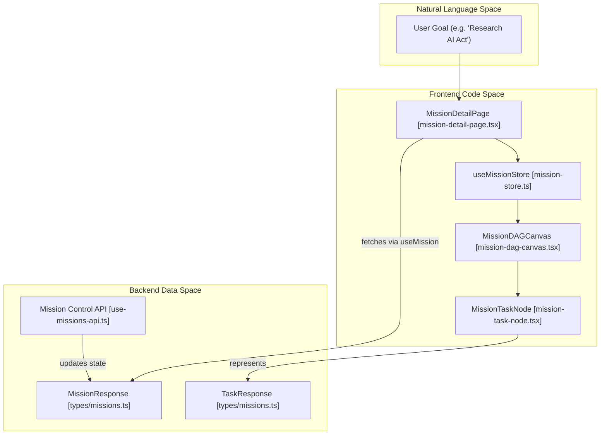
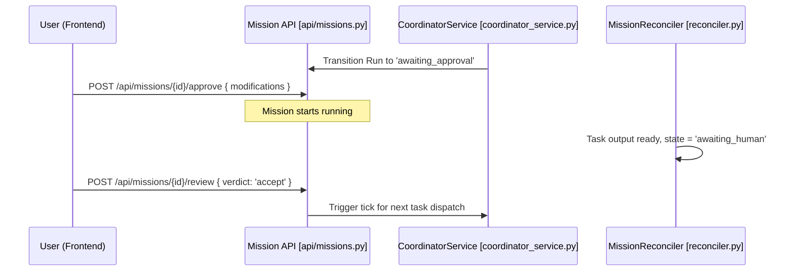

# Mission UI & Human Review

Relevant source files

The following files were used as context for generating this wiki page:

- [docs/PRDS/100-RESEARCH-AUTONOMOUS-OPERATING-LAYER.md](docs/PRDS/100-RESEARCH-AUTONOMOUS-OPERATING-LAYER.md)
- [docs/PRDS/102-COORDINATOR-ARCHITECTURE.md](docs/PRDS/102-COORDINATOR-ARCHITECTURE.md)
- [docs/PRDS/103-VERIFICATION-QUALITY.md](docs/PRDS/103-VERIFICATION-QUALITY.md)
- [docs/PRDS/108-MEMORY-FIELD-PROTOTYPE.md](docs/PRDS/108-MEMORY-FIELD-PROTOTYPE.md)
- [docs/PRDS/82-RESEARCH-ORCHESTRATION-READINESS.md](docs/PRDS/82-RESEARCH-ORCHESTRATION-READINESS.md)
- [docs/PRDS/82A-SEQUENTIAL-MISSION-COORDINATOR.md](docs/PRDS/82A-SEQUENTIAL-MISSION-COORDINATOR.md)
- [frontend/app/missions/[id]/page.tsx](frontend/app/missions/[id]/page.tsx)
- [frontend/components/missions/create-mission-modal.tsx](frontend/components/missions/create-mission-modal.tsx)
- [frontend/components/missions/human-review-panel.tsx](frontend/components/missions/human-review-panel.tsx)
- [frontend/components/missions/index.ts](frontend/components/missions/index.ts)
- [frontend/components/missions/mission-activity-feed.tsx](frontend/components/missions/mission-activity-feed.tsx)
- [frontend/components/missions/mission-card.tsx](frontend/components/missions/mission-card.tsx)
- [frontend/components/missions/mission-dag-canvas.tsx](frontend/components/missions/mission-dag-canvas.tsx)
- [frontend/components/missions/mission-detail-page.tsx](frontend/components/missions/mission-detail-page.tsx)
- [frontend/components/missions/mission-results-panel.tsx](frontend/components/missions/mission-results-panel.tsx)
- [frontend/components/missions/mission-status-badge.tsx](frontend/components/missions/mission-status-badge.tsx)
- [frontend/components/missions/mission-task-node.tsx](frontend/components/missions/mission-task-node.tsx)
- [frontend/hooks/use-missions-api.ts](frontend/hooks/use-missions-api.ts)
- [frontend/types/missions.ts](frontend/types/missions.ts)
- [orchestrator/api/missions.py](orchestrator/api/missions.py)
- [orchestrator/core/services/mission_memory_service.py](orchestrator/core/services/mission_memory_service.py)
- [orchestrator/modules/coordination/planner.py](orchestrator/modules/coordination/planner.py)
- [orchestrator/modules/coordination/reconciler.py](orchestrator/modules/coordination/reconciler.py)
- [orchestrator/modules/coordination/verification.py](orchestrator/modules/coordination/verification.py)
- [orchestrator/services/coordinator_service.py](orchestrator/services/coordinator_service.py)
- [orchestrator/services/orchestration_state.py](orchestrator/services/orchestration_state.py)
- [orchestrator/tests/test_complexity_detection.py](orchestrator/tests/test_complexity_detection.py)

The Mission UI and Human Review system provides the visual interface for monitoring, approving, and interacting with multi-agent orchestrations. It bridges the gap between the backend `CoordinatorService` and the user, offering a real-time view of goal decomposition, task execution progress via a Directed Acyclic Graph (DAG) visualization, and manual intervention points for plan approval and output verification.

## Mission Visualization & Management

The frontend architecture for missions is centered around the `MissionDetailPage`, which acts as a "Mission Control" center. It integrates live telemetry, status tracking, and the task dependency graph.

### Component Hierarchy
*   **MissionList**: Displays a high-level overview of all `OrchestrationRun` entities using `MissionCard` components.
*   **MissionDetailPage**: The primary view for a specific mission, utilizing a `ResizablePanelGroup` to balance the DAG canvas, task inspector, and activity feed [frontend/components/missions/mission-detail-page.tsx:23-35]().
*   **MissionDAGCanvas**: A `reactflow`-based visualization of the mission's `TaskResponse` nodes and their dependencies [frontend/components/missions/mission-dag-canvas.tsx:4-13]().
*   **MissionBudgetBar**: Displays real-time mission metrics including `tokensUsed` and `taskCount` [frontend/components/missions/mission-detail-page.tsx:29]().
*   **MissionResultsPanel**: A specialized panel for viewing completed task outputs, offering "Combined" markdown views or "Per Task" breakdowns [frontend/components/missions/mission-results-panel.tsx:30-35]().

### Mission Detail Layout
The `MissionDetailPage` utilizes the `useMission` hook to fetch data and `computeMissionStats` to drive the UI state [frontend/components/missions/mission-detail-page.tsx:58-85](). It provides global controls to `pause`, `resume`, or `cancel` the mission run via mutations [frontend/components/missions/mission-detail-page.tsx:61-69]().

| Feature | Implementation | Source |
| :--- | :--- | :--- |
| **State Badges** | `MissionStatusBadge` mapping `RunState` to UI colors | [frontend/types/missions.ts:182-241]() |
| **Budget Tracking** | `MissionBudgetBar` showing token consumption | [frontend/components/missions/mission-detail-page.tsx:29]() |
| **Navigation** | `useSearchParams` for tab switching (e.g., `?tab=review`) | [frontend/components/missions/mission-detail-page.tsx:55-56]() |
| **Layout** | `ResizablePanelGroup` for DAG vs. Activity Feed | [frontend/components/missions/mission-detail-page.tsx:24-26]() |

**Sources:** [frontend/components/missions/mission-detail-page.tsx:1-150](), [frontend/hooks/use-missions-api.ts:61-69](), [frontend/types/missions.ts:165-178]()

---

## Mission DAG Canvas

The `MissionDAGCanvas` provides a visual representation of the mission plan. It uses `reactflow` to render tasks as nodes and dependencies as edges.

### Logic & Layout
1.  **Node Mapping**: Each `TaskResponse` is mapped to a `MissionTaskNode` [frontend/components/missions/mission-dag-canvas.tsx:15-28]().
2.  **Sequential Layout**: Tasks are sorted and positioned based on their `sequence_number`. Tasks with the same sequence number are laid out side-by-side to represent parallel execution [frontend/components/missions/mission-dag-canvas.tsx:45-55]().
3.  **Edge Animation**: Edges reflect the flow of data; animated edges indicate active transitions between tasks [frontend/components/missions/mission-dag-canvas.tsx:132-135]().
4.  **Interaction**: Clicking a node triggers `onTaskSelect`, which updates the `selectedTaskId` in the `useMissionStore` [frontend/components/missions/mission-dag-canvas.tsx:208-214]().

### Task Node States
Nodes visually reflect the `TaskState` (PENDING, QUEUED, ASSIGNED, RUNNING, COMPLETED, VERIFYING, VERIFIED, FAILED, SKIPPED, STALLED, RETRYING) defined in the orchestration types [frontend/types/missions.ts:22-34]().

**Mission UI Entity Mapping**

**Sources:** [frontend/components/missions/mission-dag-canvas.tsx:1-120](), [frontend/types/missions.ts:22-34]()

---

## Human-in-the-Loop (HITL) Review

The platform implements two critical human review gates to ensure safety and quality: **Plan Approval** and **Output Acceptance**.

### 1. Plan Approval Gate
After the planning phase handled by `MissionPlanner` [orchestrator/modules/coordination/planner.py:5-15](), the mission transitions to `awaiting_approval` [frontend/types/missions.ts:13]().
*   **UI Trigger**: The `MissionDetailPage` displays an approval interface when the state is `awaiting_approval` [frontend/components/missions/mission-detail-page.tsx:120-121]().
*   **Actions**: Users can `approveMutation` (starts execution) or `rejectMutation` (requires feedback for replanning) [frontend/components/missions/mission-detail-page.tsx:64-65]().
*   **Modifications**: Users can modify the plan via `MissionApproveRequest`, including `agent_overrides` and `task_overrides` [orchestrator/api/missions.py:95-105]().

### 2. Output Verification Gate
When a task completes, if it requires manual review, the mission enters `awaiting_human` [frontend/types/missions.ts:17]().
*   **HumanReviewPanel**: Displays the agent's output for a specific task and allows the user to accept or reject the result.
*   **Decision Matrix**:
    *   **Accept**: Triggers `useReviewMission` with verdict 'accept', moving the task to `verified` and unlocking downstream dependencies [frontend/hooks/use-missions-api.ts:180-191]().
    *   **Reject**: Triggers `useReviewMission` with verdict 'reject', which can include `task_feedback` to re-queue specific tasks [orchestrator/api/missions.py:125-135]().

### Human Review Data Flow

**Sources:** [frontend/components/missions/mission-detail-page.tsx:53-150](), [frontend/hooks/use-missions-api.ts:141-191](), [orchestrator/api/missions.py:95-153]()

---

## Mission Creation & Context

Missions are initiated via the `CreateMissionModal`, which handles goal definition and attachment resolution.

### Creation Flow
*   **Templates**: Users select from predefined `MISSION_TEMPLATES` (e.g., `business_plan`, `research_and_report`) or a custom goal [frontend/components/missions/create-mission-modal.tsx:108-151]().
*   **Power Modes**: The modal supports selecting `PowerMode` ('light', 'standard', 'max'), which dictates token caps and tool iterations [frontend/components/missions/create-mission-modal.tsx:35-59]().
*   **Ephemeral Attachments**: PRD-127 implementation allows users to upload files via `apiClient.uploadAttachment` [frontend/components/missions/create-mission-modal.tsx:201-209](). The `MissionPlanner` resolves these `attachment_ids` into text content for the LLM prompt [orchestrator/modules/coordination/planner.py:44-111]().
*   **Complexity Detection**: The backend automatically scores the goal to determine the `ComplexityTier` (T1-T3) based on word count, deliverables, and domain breadth [orchestrator/modules/coordination/planner.py:184-210]().

### Mission Field & Context
Missions utilize a shared context backend (PRD-108) to allow agents within the same mission to share information.
*   **MissionFieldPanel**: Visualizes the shared vector field, showing `patterns`, `stability`, and `metrics` [frontend/hooks/use-missions-api.ts:104-110]().
*   **Field Patterns**: Lists specific knowledge items injected into the mission's shared memory by various agents, including `decayed_strength` and `access_count` [frontend/hooks/use-missions-api.ts:73-84]().

**Sources:** [frontend/components/missions/create-mission-modal.tsx:1-200](), [frontend/hooks/use-missions-api.ts:71-120](), [orchestrator/modules/coordination/planner.py:44-210]()

---