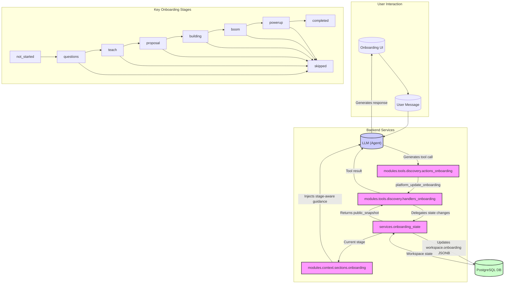

# Onboarding & First-Run Experience

<details>
<summary>Relevant source files</summary>

The following files were used as context for generating this wiki page:

- [frontend/components/__tests__/workspace-provider.onboarding.test.tsx](frontend/components/__tests__/workspace-provider.onboarding.test.tsx)
- [orchestrator/modules/context/sections/onboarding.py](orchestrator/modules/context/sections/onboarding.py)
- [orchestrator/modules/tools/discovery/actions_onboarding.py](orchestrator/modules/tools/discovery/actions_onboarding.py)
- [orchestrator/modules/tools/discovery/handlers_onboarding.py](orchestrator/modules/tools/discovery/handlers_onboarding.py)
- [orchestrator/services/onboarding_state.py](orchestrator/services/onboarding_state.py)
- [orchestrator/services/plan_tiers.py](orchestrator/services/plan_tiers.py)
- [orchestrator/tests/test_prd222_boom_build_evidence.py](orchestrator/tests/test_prd222_boom_build_evidence.py)
- [orchestrator/tests/test_prd222_onboarding_section.py](orchestrator/tests/test_prd222_onboarding_section.py)
- [orchestrator/tests/test_prd222_onboarding_state.py](orchestrator/tests/test_prd222_onboarding_state.py)
- [orchestrator/tests/test_prd222_onboarding_tool.py](orchestrator/tests/test_prd222_onboarding_tool.py)
- [orchestrator/tests/test_prd222_onboarding_tool_arg_shapes.py](orchestrator/tests/test_prd222_onboarding_tool_arg_shapes.py)
- [orchestrator/tests/test_prd222_onboarding_tool_prior.py](orchestrator/tests/test_prd222_onboarding_tool_prior.py)
- [orchestrator/tests/test_prd222_segment_implied_advance.py](orchestrator/tests/test_prd222_segment_implied_advance.py)

</details>


This page provides a high-level overview of Automatos AI's guided onboarding and first-run experience. It covers the core components involved, including the tool-driven onboarding state machine, the mechanisms for first-run seeding, and the user interface that guides new users. Detailed technical specifications for each of these areas are provided in linked child pages.

## Onboarding State Machine & Tools

The onboarding process is driven by a server-side state machine, managed by the `onboarding_state` service. This service is the single source of truth for a workspace's onboarding status, storing it as a JSONB document within the `workspace.onboarding` field [orchestrator/services/onboarding_state.py:3-17](). The state machine enforces a monotonic forward progression through predefined stages, preventing backward or invalid transitions [orchestrator/services/onboarding_state.py:18-22,131-144]().

The primary mechanism for advancing the onboarding state and recording user input is the `platform_update_onboarding` tool [orchestrator/modules/tools/discovery/actions_onboarding.py:1-8](). This tool is exposed to the AI agent, allowing it to programmatically update the onboarding stage (`advance_to`) and capture user segment information (e.g., business, goal, AI comfort level) [orchestrator/modules/tools/discovery/actions_onboarding.py:55-117](). The `handlers_onboarding` module contains the implementation for this tool, which delegates all state changes to the `onboarding_state` service [orchestrator/modules/tools/discovery/handlers_onboarding.py:1-6]().

The onboarding process is conversational, with the AI agent guiding the user through a series of questions and actions. The `OnboardingSection` in the context service dynamically injects stage-aware guidance into the agent's prompt, ensuring the agent always knows the user's current stage and what actions to take next [orchestrator/modules/context/sections/onboarding.py:1-12](). This section is activated when the workspace's onboarding stage is not terminal or when the user explicitly triggers it with specific phrases [orchestrator/modules/context/sections/onboarding.py:13-16,40-46]().

A key feature is the "segment-implied advance," where the state machine can automatically advance the stage based on the completeness of the user's segment answers, even if an explicit `advance_to` is not provided by the agent [orchestrator/tests/test_prd222_segment_implied_advance.py:1-8](). This prevents the onboarding process from stalling if the AI agent fails to explicitly advance the stage after collecting necessary information. The system also includes "reset and evidence tests" to ensure the integrity of the state machine and prevent invalid transitions, such as advancing to a "boom" stage without sufficient "build" evidence [orchestrator/tests/test_prd222_boom_build_evidence.py:1-8]().

For details, see [Onboarding State Machine & Tools](#29.1).

### Onboarding State Machine Flow


Sources:
- [orchestrator/services/onboarding_state.py:3-17]()
- [orchestrator/services/onboarding_state.py:18-22]()
- [orchestrator/services/onboarding_state.py:131-144]()
- [orchestrator/modules/tools/discovery/actions_onboarding.py:1-8]()
- [orchestrator/modules/tools/discovery/actions_onboarding.py:55-117]()
- [orchestrator/modules/tools/discovery/handlers_onboarding.py:1-6]()
- [orchestrator/modules/context/sections/onboarding.py:1-12]()
- [orchestrator/modules/context/sections/onboarding.py:13-16]()
- [orchestrator/modules/context/sections/onboarding.py:40-46]()
- [orchestrator/tests/test_prd222_segment_implied_advance.py:1-8]()
- [orchestrator/tests/test_prd222_boom_build_evidence.py:1-8]()

## First-Run Seeding & Fresh Install

The first-run experience for a new Automatos AI instance involves a series of seeding processes to ensure a functional and guided initial setup. The `seed_local_first_run` function is responsible for populating essential data for a fresh installation, including system settings, default agents, and initial configurations. This ensures that a new user is not presented with an empty system but rather a pre-configured environment ready for interaction.

A critical part of this seeding is the creation of the `Auto` agent and the assignment of platform-management skills. The `Auto` agent is designed to guide the user through the onboarding process, leveraging the `platform_update_onboarding` tool and other platform actions to manage the workspace setup.

Workspace seeding involves populating the new workspace with initial data relevant to the onboarding flow. This includes setting the initial `onboarding.stage` to `not_started` and preparing the necessary structures for recording user segment information.

For users who are not new to the platform (veterans), a "veteran-skip backfill" mechanism might be in place to bypass the initial onboarding stages, allowing them to quickly access their existing functionalities. However, for a truly fresh install, the system is designed to start the onboarding behavior automatically, ensuring every new user receives the guided first-run experience.

For details, see [First-Run Seeding & Fresh Install](#29.2).

### First-Run Seeding Process

```mermaid
graph TD
    A[("Fresh Automatos AI Install")] --> B{Is this a new workspace?}
    B -- Yes --> C[seed_local_first_run()]
    B -- No --> D[Veteran-skip backfill]

    C --> E[Seed System Settings]
    C --> F[Seed Auto Agent]
    C --> G[Assign Platform-Management Skills to Auto]
    C --> H[Workspace Seeding (Initial onboarding state)]

    H --> I{onboarding.stage = "not_started"}
    I --> J[Start Onboarding UI]

    F --> K[Auto Agent guides user]
    K -- "Uses platform_update_onboarding" --> L[Onboarding State Machine]
```
Sources:
- [orchestrator/services/onboarding_state.py]()
- [orchestrator/modules/tools/discovery/actions_onboarding.py]()
- [orchestrator/modules/context/sections/onboarding.py]()

---