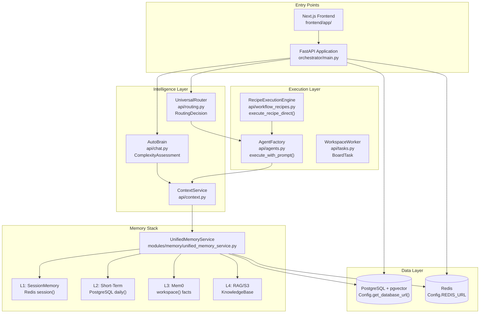
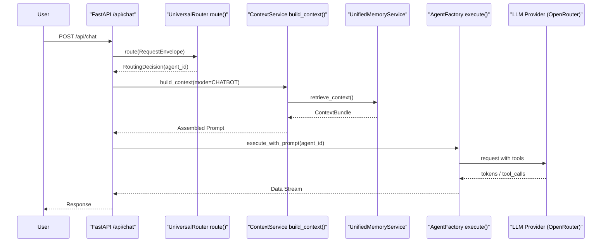
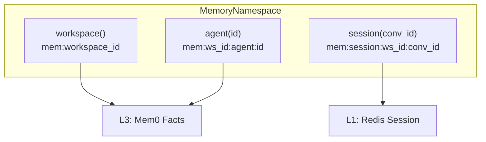

# Overview

Relevant source files

The following files were used as context for generating this wiki page:

- [README.md](README.md)
- [docs/CONTRIBUTING.md](docs/CONTRIBUTING.md)
- [docs/README.md](docs/README.md)
- [frontend/tsconfig.tsbuildinfo](frontend/tsconfig.tsbuildinfo)
- [orchestrator/config.py](orchestrator/config.py)
- [orchestrator/consumers/__init__.py](orchestrator/consumers/__init__.py)
- [orchestrator/consumers/chatbot/__init__.py](orchestrator/consumers/chatbot/__init__.py)
- [orchestrator/main.py](orchestrator/main.py)
- [orchestrator/modules/memory/context_router.py](orchestrator/modules/memory/context_router.py)
- [orchestrator/modules/memory/unified_memory_service.py](orchestrator/modules/memory/unified_memory_service.py)
- [orchestrator/modules/tools/__init__.py](orchestrator/modules/tools/__init__.py)
- [orchestrator/modules/tools/services/__init__.py](orchestrator/modules/tools/services/__init__.py)
- [orchestrator/tests/test_unified_memory.py](orchestrator/tests/test_unified_memory.py)
- [scripts/ralph/IMPLEMENTATION_PLAN.md](scripts/ralph/IMPLEMENTATION_PLAN.md)
- [scripts/ralph/prd.json](scripts/ralph/prd.json)
- [scripts/ralph/progress.txt](scripts/ralph/progress.txt)

## Purpose and Scope

This page provides a high-level introduction to **Automatos AI**, explaining its architecture as an operating system for AI agents. It covers the platform's core purpose, major subsystems, and how they orchestrate to deliver autonomous multi-agent capabilities.

For detailed definitions of fundamental concepts like agents, workflows, and memory tiers, see [Key Concepts](#1.1). For technical architecture diagrams and deployment patterns, see [System Architecture](#1.2).

---

## What is Automatos AI?

Automatos AI is an open-source **multi-agent orchestration platform** that functions as an operating system for AI workforces. Unlike traditional chatbot wrappers, it provides a robust infrastructure for building, deploying, and scheduling autonomous agents that report back through a unified command center [README.md:7-19]().

Key capabilities include:
- **Intelligent routing**: A multi-tier `UniversalRouter` (cache, rules, semantic, LLM) that ensures messages reach the correct agent [README.md:103]().
- **5-layer memory architecture**: Spanning L0 (focus) to L4 (organizational knowledge/RAG), managed by a centralized `UnifiedMemoryService` [orchestrator/modules/memory/unified_memory_service.py:8-13]().
- **Autonomous execution**: Multi-step automation via "Recipes" with scheduling, triggers, and inter-agent coordination [README.md:104]().
- **Sandboxed workspaces**: Isolated environments where agents run code, manage files, and interact with Git repositories via the `WorkspaceWorker` [README.md:106]().
- **1,000+ tool integrations**: Native support for tools like GitHub, Slack, and Jira via Composio [README.md:47-53]().
- **Prompt Optimization**: Scoring and improving agent performance against live traffic [README.md:105]().

The platform is built on **FastAPI** (backend) and **Next.js** (frontend), utilizing PostgreSQL with `pgvector` for data, Redis for caching/pub-sub, and S3 for cloud document synchronization [orchestrator/main.py:1-33](), [orchestrator/config.py:34-79](), [README.md:126-137]().

**Sources:** [README.md:5-20](), [orchestrator/main.py:1-160](), [orchestrator/config.py:1-130]()

---

## Core Architecture

The following diagram maps the major subsystems to their code entry points and associated services.

### System Topology with Code Entities

**Sources:** [orchestrator/main.py:31-158](), [orchestrator/config.py:34-79](), [orchestrator/modules/memory/unified_memory_service.py:38-118](), [orchestrator/modules/memory/context_router.py:58-80]()

---

## Major Subsystems

The platform is composed of several interconnected subsystems:

| Subsystem | Primary Module | Purpose | Details Page |
|-----------|---------------|---------|--------------|
| **Universal Router** | `api/routing.py` | 7-tier intelligent message routing (cache → rules → semantic → LLM) | [Universal Router](#10) |
| **Memory System** | `modules/memory/` | 5-layer stack (L0–L4) managed by `UnifiedMemoryService` | [Memory System](#3) |
| **Context Service** | `api/context.py` | Unified prompt assembly from 10 priority sections with budget logic | [Context Service](#4) |
| **Agent Factory** | `api/agents.py` | Agent lifecycle: create, activate, and execute tool loops | [Agents](#5) |
| **Workflow Engine** | `api/workflows.py` | Multi-phase execution (PLAN, PREPARE, EXECUTE, EVALUATE, LEARN) | [Workflows & Recipes](#6) |
| **Workspace Execution**| `api/tasks.py` | Sandboxed file and command execution for agent tasks | [Workspace Execution](#21) |
| **Knowledge Base** | `api/knowledge.py` | RAG-powered access to documents and knowledge graphs | [Knowledge Base & RAG](#7) |
| **Tool Execution** | `modules/tools/execution.py` | `UnifiedToolExecutor` for routing between Composio and Platform tools | [Tools & Integrations](#8) |

**Sources:** [orchestrator/main.py:35-132](), [orchestrator/modules/memory/unified_memory_service.py:1-21](), [orchestrator/modules/tools/__init__.py:1-44]()

---

## Request Flow: Chat Message

The following sequence shows how a typical chat request flows through the system:

### Chat Request Pipeline

**Sources:** [orchestrator/modules/memory/context_router.py:13-24](), [orchestrator/main.py:82-93](), [orchestrator/modules/memory/unified_memory_service.py:153-170]()

---

## Memory System: 5-Layer Hierarchy

The `UnifiedMemoryService` provides a single entry point for all memory operations, replacing fragmented clients [orchestrator/modules/memory/unified_memory_service.py:1-13]():

| Layer | Storage | Lifecycle | Purpose |
|-------|---------|-----------|---------|
| **L0** | Context Window | Per-request | Immediate focus/context window. |
| **L1** | Redis | 24hr TTL | **Working Memory**: Active session state via `SessionMemory` [orchestrator/modules/memory/unified_memory_service.py:123-137](). |
| **L2** | PostgreSQL | Ebbinghaus Decay | **Short-term**: Recent exchanges with time-based decay [orchestrator/config.py:98-103](). |
| **L3** | Mem0 | Permanent | **Long-term**: Extracted facts and entity mappings [orchestrator/modules/memory/unified_memory_service.py:177-182](). |
| **L4** | RAG / S3 | On-demand | **Org Knowledge**: Large document sets and vector stores [orchestrator/main.py:151-153](). |

### Memory Namespace Mapping

**Sources:** [orchestrator/modules/memory/unified_memory_service.py:38-118](), [orchestrator/config.py:82-123]()

---

## Key Technologies & Deployment

Automatos AI is designed for containerized deployment with a focus on multi-tenancy and workspace isolation [README.md:107-108]().

| Component | Technology | Role |
|-----------|------------|------|
| **Backend** | Python + FastAPI | Core API and Orchestration [orchestrator/main.py:1-6](). |
| **Frontend** | Next.js 14 | Admin Dashboard and Chat UI [README.md:130](). |
| **Database** | PostgreSQL + pgvector | Structured data and vector embeddings [orchestrator/config.py:35-43](). |
| **Cache/Queue** | Redis | L1 Memory, Pub/Sub, and Task Queues [orchestrator/config.py:61-79](). |
| **AI Providers** | Multi-provider | OpenAI, Anthropic, DeepSeek via OpenRouter [README.md:133](). |

**Sources:** [README.md:126-137](), [orchestrator/config.py:1-130](), [orchestrator/main.py:1-160]()

---

This overview establishes the foundational understanding of Automatos AI's architecture. For detailed implementation guides, see the child pages:
- [Key Concepts](#1.1)
- [System Architecture](#1.2)

---