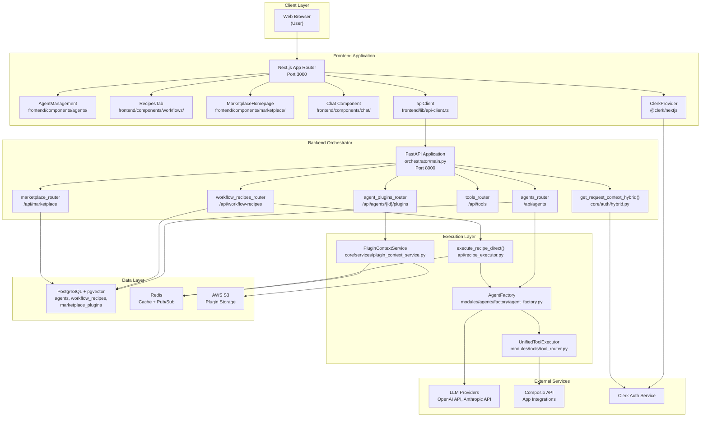
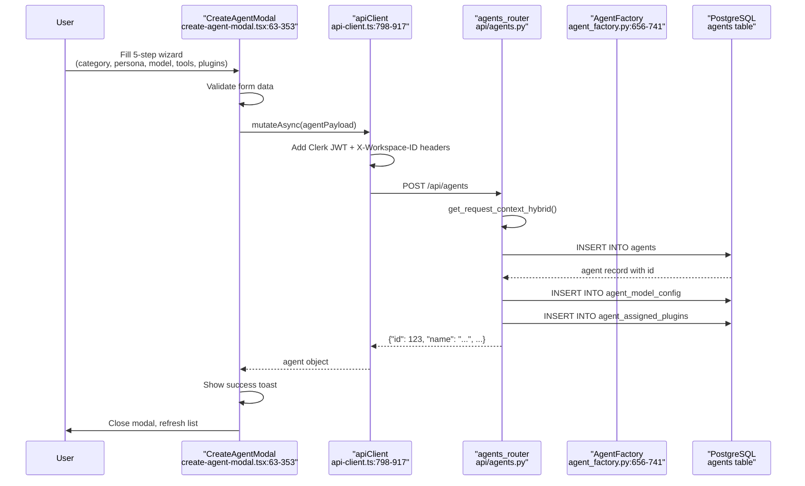
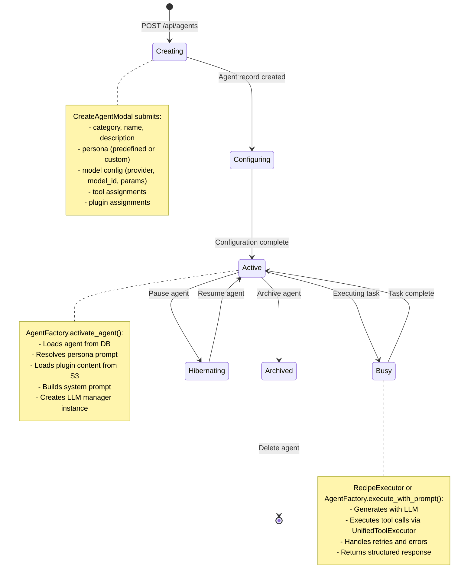
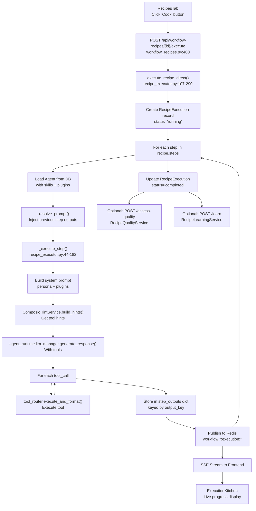
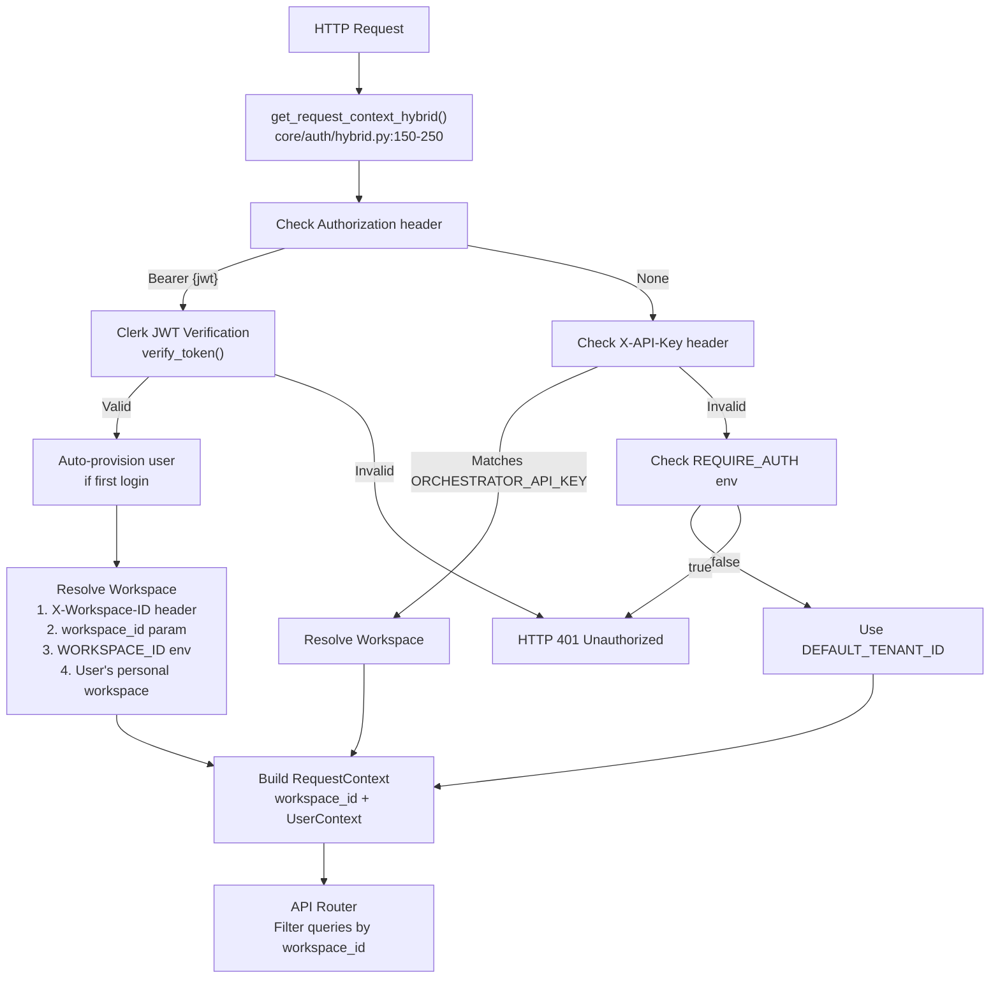

# Overview

Relevant source files

The following files were used as context for generating this wiki page:

- [docker-compose.yml](docker-compose.yml)
- [frontend/.dockerignore](frontend/.dockerignore)
- [frontend/Dockerfile](frontend/Dockerfile)
- [frontend/app/admin/plugins/page.tsx](frontend/app/admin/plugins/page.tsx)
- [frontend/lib/api-client.ts](frontend/lib/api-client.ts)
- [orchestrator/.env.example](orchestrator/.env.example)
- [orchestrator/Dockerfile](orchestrator/Dockerfile)
- [orchestrator/api/agent_plugins.py](orchestrator/api/agent_plugins.py)
- [orchestrator/config.py](orchestrator/config.py)
- [orchestrator/core/database/load_seed_data.py](orchestrator/core/database/load_seed_data.py)
- [orchestrator/core/redis/client.py](orchestrator/core/redis/client.py)
- [orchestrator/core/seeds/seed_personas.py](orchestrator/core/seeds/seed_personas.py)
- [orchestrator/core/seeds/seed_plugin_categories.py](orchestrator/core/seeds/seed_plugin_categories.py)
- [orchestrator/core/services/plugin_cache.py](orchestrator/core/services/plugin_cache.py)
- [orchestrator/main.py](orchestrator/main.py)
- [orchestrator/requirements.txt](orchestrator/requirements.txt)
- [scripts/ralph/prd.json](scripts/ralph/prd.json)

Automatos AI is a multi-agent orchestration platform that enables users to create, configure, and deploy specialized AI agents that work together to execute complex workflows. The platform provides a comprehensive system for agent lifecycle management, plugin-based capability extension, workflow automation, and marketplace-based content sharing.

This page provides a high-level overview of the platform's architecture, core concepts, and capabilities. For detailed information about specific subsystems, see:
- Agent management and configuration: [Agents](#3)
- Workflow and recipe execution: [Workflows & Recipes](#4)
- Plugin marketplace and installation: [Plugins & Marketplace](#5)
- Tool integrations and Composio: [Tools & Integrations](#6)
- Authentication and workspace isolation: [Authentication & Multi-Tenancy](#9)

---

## Core Concepts

Automatos AI is built around several key abstractions that work together to provide flexible agent orchestration:

### Agents

**Agents** are AI-powered workers configured with specific capabilities, personalities, and tools. Each agent has:
- **Category/Type**: Classification like `code_architect`, `security_expert`, `data_analyst`, or `custom`
- **Persona**: Personality and communication style (predefined or custom)
- **Model Configuration**: LLM provider, model ID, and generation parameters
- **Skills**: Git-based capability packages loaded from repositories
- **Plugins**: Marketplace-distributed content packages (skills + commands + agents)
- **Tools**: Composio-integrated app connections (Slack, GitHub, Jira, etc.)

Agents are created via a 5-step wizard and stored in the `agents` table with configuration in `agent_model_config`.

### Workflows & Recipes

**Recipes** (also called Workflow Templates) are multi-step automated processes where different agents collaborate:
- Each step has a `prompt_template` (task description) and `agent_id` (which agent executes it)
- Steps execute sequentially, passing results to subsequent steps via `step_outputs` dictionary
- Execution tracked in `recipe_executions` table with real-time updates via Redis pub/sub
- Quality assessment (5 dimensions) and learning analysis run post-execution

Traditional **Workflows** use a 9-stage execution pipeline, while recipes use a simplified direct executor.

### Plugins

**Plugins** are versioned packages distributed via the marketplace that contain:
- **Skills**: Markdown documentation added to agent prompts
- **Commands**: Executable tool schemas with parameters
- **Agents**: Pre-configured agent definitions
- **Hooks**: Event listeners for system integration

Plugins undergo security scanning (static + LLM-based) before approval. They're enabled at workspace level, then assigned to individual agents.

### Tools

**Tools** are Composio-integrated app connections that agents can invoke:
- Discovered via `ComposioAppCache` and `ComposioActionCache` tables
- Connected per-workspace via OAuth flows managed by `ComposioEntityManager`
- Executed via `UnifiedToolExecutor` which routes to Composio or built-in tools
- Tool hints generated by `ComposioHintService` based on task context

### Workspaces

**Workspaces** provide multi-tenant data isolation:
- All agents, recipes, and executions are scoped to a `workspace_id` (UUID)
- Users authenticated via Clerk JWT with workspace resolved from headers/environment
- Workspace-level plugin enablement tracked in `workspace_enabled_plugins` table

---

## System Architecture

The platform follows a three-tier architecture with clear separation between presentation, orchestration, and execution layers.

### Architecture Overview

**Sources:** [orchestrator/main.py:1-808](), [frontend/lib/api-client.ts:1-1455](), [orchestrator/modules/agents/factory/agent_factory.py:1-1083](), [orchestrator/api/recipe_executor.py:1-419]()

### Request Flow: Agent Creation

**Sources:** [frontend/components/agents/create-agent-modal.tsx:184-353](), [frontend/lib/api-client.ts:798-917](), [orchestrator/api/agents.py:1-500]()

---

## Technology Stack

### Frontend Stack

| Component | Technology | Purpose |
|-----------|-----------|---------|
| **Framework** | Next.js 14 (App Router) | React-based SSR/SSG framework |
| **UI Library** | Radix UI + shadcn/ui | Accessible component primitives |
| **Styling** | Tailwind CSS | Utility-first CSS framework |
| **Authentication** | Clerk (@clerk/nextjs) | User authentication and session management |
| **State Management** | React Query + Zustand | Server state (TanStack Query) + client state |
| **API Client** | Custom typed client | Type-safe HTTP wrapper with Clerk integration |
| **Charts** | Recharts | Data visualization |
| **Forms** | React Hook Form | Form validation and submission |

**Primary Entry Points:**
- [frontend/app/layout.tsx]() - Root layout with provider hierarchy
- [frontend/components/agents/agent-management.tsx]() - Agent management page
- [frontend/components/workflows/workflow-management.tsx]() - Workflow/recipe management
- [frontend/components/marketplace/marketplace-homepage.tsx]() - Marketplace UI

### Backend Stack

| Component | Technology | Purpose |
|-----------|-----------|---------|
| **Framework** | FastAPI | Async Python web framework |
| **ORM** | SQLAlchemy 2.0 | Database abstraction and migrations |
| **Database** | PostgreSQL 15 + pgvector | Relational storage with vector search |
| **Caching** | Redis 7 | Cache and pub/sub for real-time updates |
| **Storage** | AWS S3 | Plugin package storage |
| **LLM Integration** | OpenAI SDK, Anthropic SDK | Multi-provider LLM support |
| **Tool Integration** | Composio SDK | 500+ app integrations |
| **Authentication** | Clerk + API Keys | JWT verification + programmatic access |

**Primary Entry Points:**
- [orchestrator/main.py:1-808]() - FastAPI application with all routers
- [orchestrator/api/agents.py]() - Agent CRUD endpoints
- [orchestrator/api/workflow_recipes.py]() - Recipe CRUD endpoints
- [orchestrator/api/recipe_executor.py]() - Recipe execution logic
- [orchestrator/modules/agents/factory/agent_factory.py]() - Agent runtime instantiation

---

## Key Features

### Agent Lifecycle Management

Agents follow a complete lifecycle from creation to retirement:

**Sources:** [orchestrator/modules/agents/factory/agent_factory.py:656-741](), [frontend/components/agents/create-agent-modal.tsx:184-353]()

### Plugin Marketplace System

The plugin marketplace provides a secure distribution channel for capability packages:

**Upload Pipeline:**
1. Admin uploads plugin package (ZIP) via [frontend/app/admin/plugins/upload/page.tsx]()
2. Backend extracts manifest.json via [orchestrator/api/admin_plugins.py]()
3. Static security scan checks file types, sizes, paths
4. LLM security scan reviews content for malicious code
5. Scan results stored in `plugin_security_scans` table
6. Plugin marked as `pending` if passed scans, else `rejected`

**Approval Flow:**
1. Admins review pending plugins at [frontend/app/admin/plugins/page.tsx]()
2. Approve/reject/deactivate actions via [orchestrator/api/admin_plugins.py]()
3. Approved plugins appear in public marketplace

**Installation:**
1. Users browse marketplace at `MarketplacePluginsTab`
2. Enable plugin for workspace via `POST /api/workspaces/{id}/plugins`
3. Assign plugin to agent via `PUT /api/agents/{id}/plugins`
4. Runtime loads plugin content via `PluginContextService.get_assigned_plugins()`

```mermaid
graph LR
    Upload["Admin Upload<br/>admin/plugins/upload"] --> StaticScan["Static Scan<br/>admin_plugins.py:191-244"]
    StaticScan --> LLMScan["LLM Scan<br/>admin_plugins.py:245-301"]
    LLMScan --> S3Store["Store in S3<br/>marketplace_s3_service.py"]
    S3Store --> DBRecord["marketplace_plugins table"]
    
    DBRecord --> ApprovalQueue["Admin Approval<br/>admin/plugins/page"]
    ApprovalQueue --> Marketplace["Public Marketplace<br/>marketplace-plugins-tab"]
    
    Marketplace --> WorkspaceEnable["Enable for Workspace<br/>POST /api/workspaces/{id}/plugins"]
    WorkspaceEnable --> AgentAssign["Assign to Agent<br/>PUT /api/agents/{id}/plugins"]
    AgentAssign --> Runtime["Load at Runtime<br/>PluginContextService"]
    
    Runtime --> AgentPrompt["Inject in System Prompt<br/>AgentFactory._build_agent_system_prompt()"]
```

**Sources:** [orchestrator/api/admin_plugins.py:1-500](), [orchestrator/core/services/plugin_context_service.py:1-300](), [frontend/components/marketplace/marketplace-plugins-tab.tsx:1-400]()

### Recipe Execution Pipeline

Recipes execute multi-step workflows with agent collaboration:

**Execution Flow:**
1. User clicks "Cook" button in `RecipesTab`
2. Frontend calls `POST /api/workflow-recipes/{id}/execute`
3. Backend calls `execute_recipe_direct()` in [orchestrator/api/recipe_executor.py:107-290]()
4. For each step:
   - Load agent from DB with skills/plugins
   - Resolve prompt template with previous step outputs
   - Execute via `_execute_step()` using chatbot components
   - Store result in `step_outputs` dictionary keyed by `output_key`
   - Publish progress to Redis channel `workflow:{workspace_id}:execution:{execution_id}`
5. Update `recipe_executions` table with final status
6. Optional: Run quality assessment and learning analysis

**Real-time Updates:**
- Frontend subscribes to Redis channel via SSE endpoint
- `ExecutionKitchen` component displays live progress with `RecipeStepProgress`
- Shows current step, agent name, token usage, duration

**Sources:** [orchestrator/api/recipe_executor.py:107-290](), [orchestrator/api/workflow_recipes.py:400-500](), [frontend/components/workflows/execution-kitchen.tsx:1-800]()

---

## Authentication & Authorization

### Hybrid Authentication System

The platform supports three authentication methods with workspace-scoped data isolation:

**Workspace Resolution Priority:**
1. `X-Workspace-ID` HTTP header (highest priority)
2. `workspace_id` query parameter
3. `WORKSPACE_ID` environment variable
4. User's personal workspace (Clerk users)
5. `DEFAULT_TENANT_ID` (fallback: `00000000-0000-0000-0000-000000000000`)

**Data Isolation:**
All queries scoped by workspace: `SELECT * FROM agents WHERE workspace_id = ?`

**Sources:** [orchestrator/core/auth/hybrid.py:150-250](), [frontend/lib/api-client.ts:143-148](), [frontend/lib/api-client.ts:833-849]()

---

## Configuration & Deployment

### Environment Configuration

The platform uses environment variables for all configuration. Key variables:

**Database:**
- `POSTGRES_HOST`, `POSTGRES_PORT`, `POSTGRES_DB`, `POSTGRES_USER`, `POSTGRES_PASSWORD`
- `DATABASE_URL` (connection string, auto-generated if not set)

**Redis:**
- `REDIS_HOST`, `REDIS_PORT`, `REDIS_DB`, `REDIS_PASSWORD`

**Authentication:**
- `CLERK_SECRET_KEY` - Clerk backend API key for JWT verification
- `NEXT_PUBLIC_CLERK_PUBLISHABLE_KEY` - Clerk frontend public key
- `ORCHESTRATOR_API_KEY` - API key for programmatic access
- `REQUIRE_AUTH` - Boolean to enforce authentication (default: true)

**LLM Providers:**
- `OPENAI_API_KEY` - OpenAI API key
- `ANTHROPIC_API_KEY` - Anthropic API key
- `DEFAULT_LLM_PROVIDER` - Default provider (openai/anthropic)
- `DEFAULT_LLM_MODEL` - Default model ID

**Composio:**
- `COMPOSIO_API_KEY` - Composio API key for tool integrations

**AWS S3:**
- `AWS_ACCESS_KEY_ID`, `AWS_SECRET_ACCESS_KEY`
- `AWS_S3_BUCKET` - Bucket for plugin storage
- `AWS_REGION` - AWS region

**Application:**
- `NEXT_PUBLIC_API_URL` - Backend URL for frontend API calls
- `CORS_ALLOW_ORIGINS` - Comma-separated list of allowed origins
- `WORKSPACE_ID` - Default workspace UUID for single-tenant mode

**Sources:** [orchestrator/config.py](), [frontend/lib/api-client.ts:88-138]()

### Docker Compose Architecture

The platform deploys as a multi-container application:

| Service | Image | Purpose | Ports |
|---------|-------|---------|-------|
| **frontend** | Next.js build | React UI | 3000 |
| **backend** | Python FastAPI | API orchestrator | 8000 |
| **postgres** | PostgreSQL 15 + pgvector | Primary database | 5432 |
| **redis** | Redis 7 | Cache + pub/sub | 6379 |

**Initialization:**
1. PostgreSQL starts with init scripts in `orchestrator/core/database/init.sql`
2. Backend runs migrations via `alembic upgrade head`
3. Seed data loaded via `load_seed_data.py` (credential types, personas, plugin categories)
4. Frontend connects to backend via `NEXT_PUBLIC_API_URL`

**Sources:** [docker-compose.yml](), [orchestrator/core/database/init_database.py](), [orchestrator/core/database/load_seed_data.py:1-150]()

---

## Summary

Automatos AI provides a complete platform for building, deploying, and managing AI agent systems. The architecture separates concerns clearly:

- **Frontend (Next.js)** handles user interactions with rich wizards, real-time displays, and marketplace browsing
- **Backend (FastAPI)** orchestrates agent execution, workflow management, and marketplace operations
- **Execution Layer** provides the runtime for agent instantiation, tool execution, and plugin content loading
- **Data Layer** ensures persistence, caching, and real-time updates across distributed components

The plugin marketplace enables community-driven capability distribution with security scanning and approval workflows. Multi-tenant workspace isolation ensures data privacy. Hybrid authentication supports both interactive and programmatic access.

For deep dives into specific subsystems, refer to the specialized wiki pages linked at the top of this document.

**Primary Sources:** [orchestrator/main.py:1-808](), [frontend/lib/api-client.ts:1-1455](), [orchestrator/modules/agents/factory/agent_factory.py:1-1083](), [orchestrator/api/recipe_executor.py:1-419](), [frontend/components/agents/agent-management.tsx:1-279](), [frontend/components/workflows/execution-kitchen.tsx:1-800]()

---