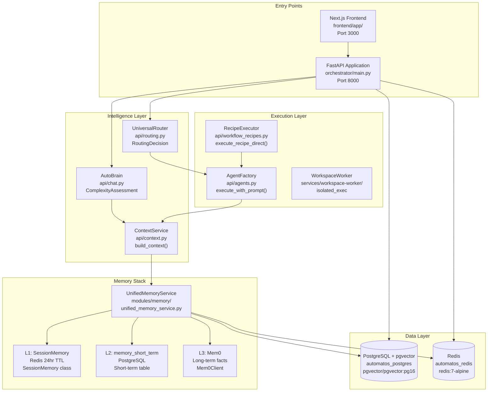
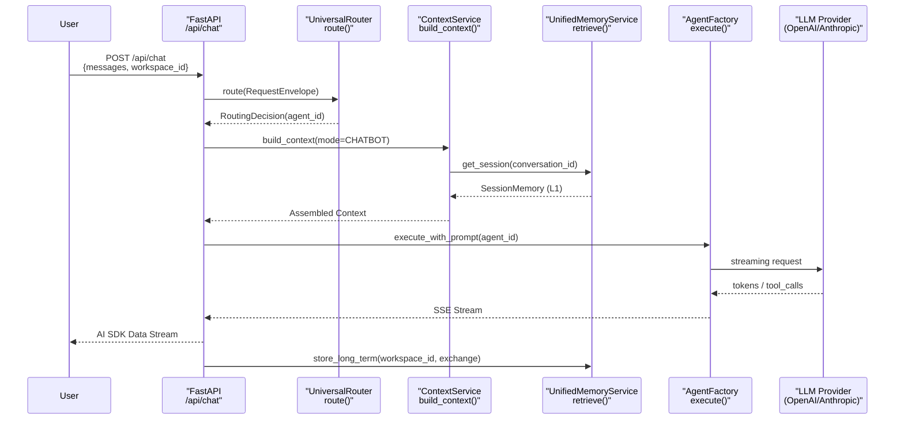
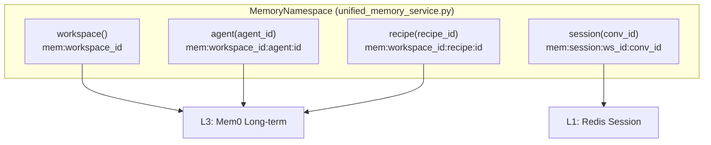

# Overview

Relevant source files

The following files were used as context for generating this wiki page:

- [README.md](README.md)
- [docker-compose.yml](docker-compose.yml)
- [docs/CONTRIBUTING.md](docs/CONTRIBUTING.md)
- [docs/README.md](docs/README.md)
- [frontend/.dockerignore](frontend/.dockerignore)
- [frontend/Dockerfile](frontend/Dockerfile)
- [orchestrator/Dockerfile](orchestrator/Dockerfile)
- [orchestrator/api/cloud_documents.py](orchestrator/api/cloud_documents.py)
- [orchestrator/core/redis/client.py](orchestrator/core/redis/client.py)
- [orchestrator/modules/tools/services/__init__.py](orchestrator/modules/tools/services/__init__.py)
- [orchestrator/requirements.txt](orchestrator/requirements.txt)

## Purpose and Scope

This page provides a high-level introduction to **Automatos AI**, explaining its architecture as an operating system for AI agents. It covers the platform's core purpose, major subsystems, and how they orchestrate to deliver autonomous multi-agent capabilities.

For detailed definitions of fundamental concepts like agents, workflows, and memory tiers, see [Key Concepts](#1.1). For technical architecture diagrams and deployment patterns, see [System Architecture](#1.2).

---

## What is Automatos AI?

Automatos AI is a **multi-agent orchestration platform** that functions as an operating system for AI agents. Unlike traditional chatbot frameworks, it provides:

- **Intelligent routing** that automatically selects the right agent or workflow for each user request using a multi-tier strategy (cache, rules, semantic, LLM) [README.md:87]().
- **5-layer memory architecture** (L0–L4) spanning focus, session, short-term, long-term, and organizational knowledge [orchestrator/modules/memory/unified_memory_service.py:8-13]().
- **Autonomous execution** through recipes (multi-agent workflows), heartbeats (proactive checks), and sandboxed workspace environments [README.md:83-92]().
- **Unified context assembly** that builds prompts from 10 priority sections with token budget management [orchestrator/requirements.txt:72]().
- **500+ tool integrations** via Composio, plus custom platform actions for self-management [README.md:43-46](), [orchestrator/requirements.txt:101-103]().

The platform is built on **FastAPI** (backend) and **Next.js** (frontend), with PostgreSQL + pgvector for data, Redis for caching/pub-sub, and S3 for vectors/logs [orchestrator/Dockerfile:13-33](), [frontend/Dockerfile:14-23](), [docker-compose.yml:18-170]().

**Sources:** [README.md:5-20](), [orchestrator/Dockerfile:1-45](), [docker-compose.yml:1-16]()

---

## Core Architecture

The following diagram maps the major subsystems to their code entry points:

### System Topology with Code Entities

**Sources:** [docker-compose.yml:22-73](), [orchestrator/core/redis/client.py:14-31](), [orchestrator/modules/memory/unified_memory_service.py:1-13]()

---

## Major Subsystems

The platform is composed of several interconnected subsystems:

| Subsystem | Primary Module | Purpose | Details Page |
|-----------|---------------|---------|--------------|
| **Universal Router** | `api/routing.py` | 7-tier intelligent message routing (cache → rules → semantic → LLM) | [Universal Router](#10) |
| **Memory System** | `modules/memory/` | 5-layer stack (L0–L4) managed by `UnifiedMemoryService` | [Memory System](#3) |
| **Context Service** | `api/context.py` | Unified prompt assembly from 10 priority sections with budget logic | [Context Service](#4) |
| **Agent Factory** | `api/agents.py` | Agent lifecycle: create, activate, and execute tool loops | [Agents](#5) |
| **Workflow Engine** | `api/workflows.py` | 5-phase execution (PLAN, PREPARE, EXECUTE, EVALUATE, LEARN) | [Workflows & Recipes](#6) |
| **Workspace Worker** | `services/workspace-worker/` | Sandboxed file and command execution for agent tasks | [Workspace Execution](#21) |
| **Cloud Sync** | `api/cloud_documents.py` | RAG-powered access to external cloud storage (Dropbox, GDrive) | [Knowledge Base & RAG](#7) |

**Sources:** [README.md:83-92](), [orchestrator/api/cloud_documents.py:185-200](), [orchestrator/modules/memory/unified_memory_service.py:1-21]()

---

## Request Flow: Chat Message

The following sequence shows how a typical chat request flows through the system using the AI SDK Data Stream protocol:

### Chat Request Pipeline

**Sources:** [orchestrator/core/redis/client.py:48-64](), [orchestrator/modules/memory/unified_memory_service.py:8-25](), [frontend/Dockerfile:57-60]()

---

## Memory System: 5-Layer Hierarchy

The `UnifiedMemoryService` provides a single entry point for all memory operations, replacing fragmented clients [orchestrator/modules/memory/unified_memory_service.py:1-13]():

| Layer | Storage | Lifecycle | Purpose |
|-------|---------|-----------|---------|
| **L0** | Context Window | Per-request | Immediate focus. |
| **L1** | Redis | 24hr TTL | **Working Memory**: Active session state [docker-compose.yml:57-58](). |
| **L2** | PostgreSQL | Ebbinghaus Decay | **Short-term**: Recent exchanges with importance scoring. |
| **L3** | Mem0 | Permanent | **Long-term**: Extracted facts and entities. |
| **L4** | RAG / S3 | On-demand | **Org Knowledge**: Large document sets and vector stores [orchestrator/api/cloud_documents.py:108-115](). |

### Memory Namespace Mapping

**Sources:** [orchestrator/modules/memory/unified_memory_service.py:1-25](), [docker-compose.yml:54-61]()

---

## Key Technologies & Deployment

Automatos AI is designed for containerized deployment with a focus on security and scalability [orchestrator/Dockerfile:1-130]().

| Component | Technology | Role |
|-----------|------------|------|
| **Backend** | Python 3.11 + FastAPI | Core API and Orchestration [orchestrator/Dockerfile:13](). |
| **Frontend** | Node 20 + Next.js | Admin Dashboard and Chat UI [frontend/Dockerfile:14](). |
| **Database** | PostgreSQL 16 + pgvector | Structured data and vector embeddings [docker-compose.yml:23](). |
| **Cache/Queue** | Redis 7 | L1 Memory, Pub/Sub, and Task Queues [docker-compose.yml:49](). |
| **Sandbox** | Docker/Isolated Filesystem | `workspace-worker` service for safe code execution [docker-compose.yml:178](). |

**Production Hardening:** The system renames dangerous Redis commands (`FLUSHALL`, `FLUSHDB`, `DEBUG`) to prevent data loss if exposed [docker-compose.yml:52-61]() and uses multi-stage Docker builds to minimize production image size [orchestrator/Dockerfile:90-115]().

**Sources:** [orchestrator/Dockerfile:1-130](), [frontend/Dockerfile:1-115](), [docker-compose.yml:1-210](), [orchestrator/requirements.txt:1-20]()

---

This overview establishes the foundational understanding of Automatos AI's architecture. For detailed implementation guides, see the child pages:
- [Key Concepts](#1.1)
- [System Architecture](#1.2)

---