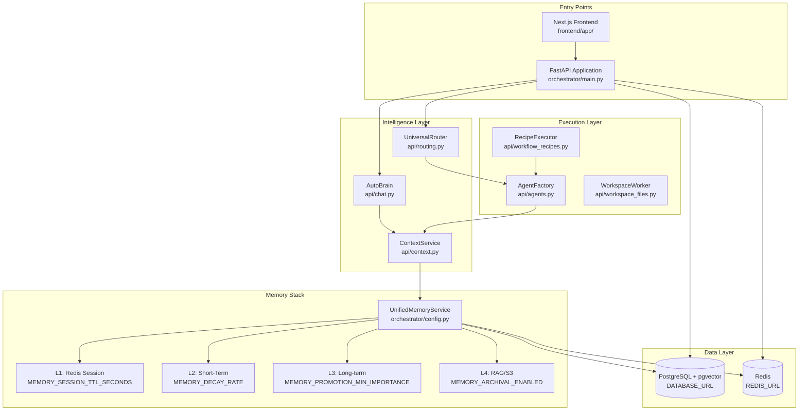
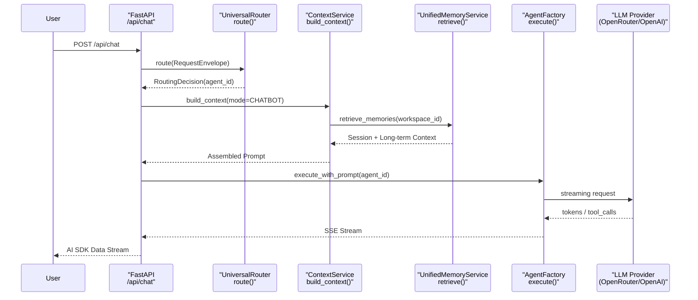

# Overview

Relevant source files

The following files were used as context for generating this wiki page:

- [README.md](README.md)
- [docs/CONTRIBUTING.md](docs/CONTRIBUTING.md)
- [docs/README.md](docs/README.md)
- [frontend/components/__tests__/prd197-substrate-tile.test.tsx](frontend/components/__tests__/prd197-substrate-tile.test.tsx)
- [frontend/components/command-center/is-it-working-strip.tsx](frontend/components/command-center/is-it-working-strip.tsx)
- [frontend/hooks/use-analytics-api.ts](frontend/hooks/use-analytics-api.ts)
- [frontend/lib/api-client.ts](frontend/lib/api-client.ts)
- [orchestrator/api/workflows.py](orchestrator/api/workflows.py)
- [orchestrator/config.py](orchestrator/config.py)
- [orchestrator/core/models/substrate_metrics.py](orchestrator/core/models/substrate_metrics.py)
- [orchestrator/core/observability/substrate_metrics.py](orchestrator/core/observability/substrate_metrics.py)
- [orchestrator/main.py](orchestrator/main.py)
- [orchestrator/modules/tools/services/__init__.py](orchestrator/modules/tools/services/__init__.py)
- [orchestrator/reports/route-manifest.json](orchestrator/reports/route-manifest.json)
- [orchestrator/router_manifest.py](orchestrator/router_manifest.py)
- [orchestrator/tests/authz_sweep_probe.py](orchestrator/tests/authz_sweep_probe.py)
- [orchestrator/tests/test_p2w2_authz_boundary_sweep.py](orchestrator/tests/test_p2w2_authz_boundary_sweep.py)
- [orchestrator/tests/test_prd154_s5_missions.py](orchestrator/tests/test_prd154_s5_missions.py)
- [orchestrator/tests/test_prd222_w2s1_plan_tiers.py](orchestrator/tests/test_prd222_w2s1_plan_tiers.py)

## Purpose and Scope

This page provides a high-level introduction to **Automatos AI**, explaining its architecture as an operating system for AI agents. It covers the platform's core purpose, major subsystems, and how they orchestrate to deliver autonomous multi-agent capabilities.

For detailed definitions of fundamental concepts like agents, workflows, memory tiers, context assembly, routing, tools, and workspaces, see [Key Concepts](#1.1). For technical architecture details covering the FastAPI backend, Next.js frontend, core services, data layer, and external integrations, see [System Architecture](#1.2).

Sources: [README.md:1-18]()

---

## What is Automatos AI?

Automatos AI is an open-source (Apache-2.0) platform for running teams of AI agents. It functions as an operating system for AI workforces, providing infrastructure to build, deploy, and schedule autonomous agents that report back through a unified command center [README.md:10-18]().

Key capabilities include:
- **Intelligent routing**: A multi-tier `UniversalRouter` (cache, rules, semantic, LLM) that ensures messages reach the correct agent [README.md:111](), [orchestrator/main.py:69]().
- **5-layer memory architecture**: Spanning L0 (focus) to L4 (organizational knowledge/RAG), managed by a centralized `UnifiedMemoryService` [orchestrator/config.py:84-137]().
- **Autonomous execution**: Multi-step automation via playbooks and recipes with scheduling, triggers, and inter-agent coordination [README.md:112]().
- **Sandboxed workspaces**: Isolated environments where agents run code, manage files, and interact with Git repositories via the `WorkspaceWorker` [README.md:114]().
- **Tool integrations**: Native support for over 1,000 tools through the Composio catalogue and platform actions [README.md:55-58]().
- **Prompt Optimization**: Scoring and improving agent performance against live traffic using `FutureAGI` [README.md:113]().

The platform is built on a FastAPI backend (`orchestrator/main.py`) and a Next.js frontend, utilizing PostgreSQL with `pgvector` for data storage and Redis for caching and Pub/Sub [README.md:120-127](), [orchestrator/main.py:1-125]().

Sources: [README.md:10-28](), [orchestrator/main.py:1-125](), [orchestrator/config.py:84-137]()

---

## Core Architecture

The following diagram bridges natural language functional concepts to code entity spaces, illustrating how core backend modules and routers interact within the system topology.

### System Topology with Code Entities

Sources: [orchestrator/main.py:32-125](), [orchestrator/config.py:35-137](), [orchestrator/router_manifest.py:51-91]()

---

## Major Subsystems

The platform is organized into distinct subsystems, each managed by dedicated router modules and service components:

| Subsystem | Primary Module | Purpose | Details Page |
|-----------|---------------|---------|--------------|
| **Universal Router** | `api/routing.py` | Multi-tier intelligent message routing (cache → rules → semantic → LLM) | [Universal Router](#10) |
| **Memory System** | `orchestrator/config.py` | 5-layer stack (L0–L4) managed by `UnifiedMemoryService` | [Memory System](#3) |
| **Context Service** | `api/context.py` | Unified prompt assembly from priority sections with token budgeting | [Context Service](#4) |
| **Agent Factory** | `api/agents.py` | Agent lifecycle management: create, activate, and execute tool loops | [Agents](#5) |
| **Workflow Engine** | `api/workflows.py` | Multi-phase execution (PLAN, PREPARE, EXECUTE, EVALUATE, LEARN) | [Workflows & Recipes](#6) |
| **Workspace Execution** | `api/workspace_files.py` | Sandboxed file operations and command execution for agent tasks | [Workspace Execution](#21) |
| **Knowledge Base** | `api/knowledge.py` | RAG-powered document ingestion, chunking, and cloud synchronization | [Knowledge Base & RAG](#7) |
| **Tool Execution** | `api/tools.py` | Unified execution routing between Composio, platform actions, and custom tools | [Tools & Integrations](#8) |

Sources: [orchestrator/main.py:37-120](), [orchestrator/router_manifest.py:51-91]()

---

## Request Flow: Chat Message

The sequence below illustrates how a chat request moves from the API ingress through routing, context building, memory retrieval, and agent execution.

### Chat Request Pipeline

Sources: [orchestrator/main.py:107](), [orchestrator/api/routing.py:69](), [orchestrator/config.py:84-100]()

---

## Workspace Onboarding

Every workspace is initialized with a default system agent (`Auto`) that serves as the primary assistant interface [README.md:17](). New workspaces invoke intake guards and onboarding wizards to establish user context and seed initial operational capabilities.

- **Auto Agent**: Acts as the default orchestrator and conversational entry point for workspaces.
- **Business Intake Wizard**: Guides operators through domain scanning, website ingestion, knowledge graph construction, and Mission Zero planning.

Sources: [README.md:17-28](), [frontend/lib/api-client.ts:1-50]()

---

This overview establishes the foundational understanding of Automatos AI's architecture. For deeper technical specifications, refer to the child pages:
- [Key Concepts](#1.1)
- [System Architecture](#1.2)

---