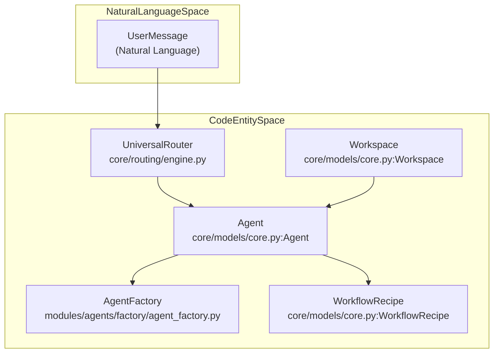
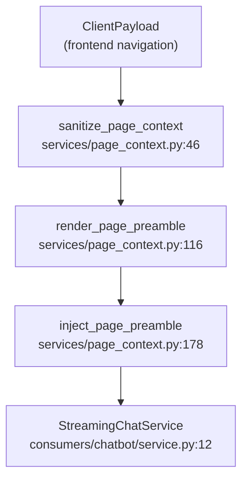

# Key Concepts

Relevant source files

The following files were used as context for generating this wiki page:

- [orchestrator/api/chat.py](orchestrator/api/chat.py)
- [orchestrator/api/routing.py](orchestrator/api/routing.py)
- [orchestrator/consumers/chatbot/auto.py](orchestrator/consumers/chatbot/auto.py)
- [orchestrator/consumers/chatbot/service.py](orchestrator/consumers/chatbot/service.py)
- [orchestrator/core/llm/manager.py](orchestrator/core/llm/manager.py)
- [orchestrator/core/routing/engine.py](orchestrator/core/routing/engine.py)
- [orchestrator/modules/agents/factory/agent_factory.py](orchestrator/modules/agents/factory/agent_factory.py)
- [orchestrator/modules/tools/discovery/platform_actions.py](orchestrator/modules/tools/discovery/platform_actions.py)
- [orchestrator/modules/tools/discovery/platform_executor.py](orchestrator/modules/tools/discovery/platform_executor.py)
- [orchestrator/scripts/setup_jira_trigger.py](orchestrator/scripts/setup_jira_trigger.py)
- [orchestrator/services/heartbeat_service.py](orchestrator/services/heartbeat_service.py)
- [orchestrator/services/page_context.py](orchestrator/services/page_context.py)
- [orchestrator/tests/test_prd221_page_context.py](orchestrator/tests/test_prd221_page_context.py)
- [orchestrator/tests/test_prd221_page_prior_tools.py](orchestrator/tests/test_prd221_page_prior_tools.py)

This document defines the fundamental terminology, architectural building blocks, and data structures used throughout Automatos AI. Understanding these concepts is essential for working with any part of the system, from agent instantiation to multi-agent orchestration, context engineering, tool routing, and multi-tenant isolation.

For system architecture details, see **1.2 System Architecture**. For specific implementation guides, see **5. Agents**, **6. Workflows & Recipes**, **3. Memory System**, and **8. Tools & Integrations**.

---

## 1. Overview of Core Entities

Automatos AI is structured around core domain entities that map directly to SQLAlchemy database models, FastAPI routers, and backend services. 

### Core Entity Architecture

**Sources:** [orchestrator/core/models/core.py:202-260](), [orchestrator/modules/agents/factory/agent_factory.py:1-11](), [orchestrator/core/routing/engine.py:58-70]()

---

## 2. Agents

An **Agent** is an autonomous execution unit powered by an LLM, customized via personality personas, assigned skills, tools, and resource limits [orchestrator/core/models/core.py:202-260](). Agents are managed by `AgentFactory` and scoped strictly to a workspace for multi-tenancy [orchestrator/modules/agents/factory/agent_factory.py:1-11]().

### Agent Implementation Structure
Agents encapsulate runtime states (`AgentLifecycle`), model configurations (`ModelConfiguration`), and performance metrics [orchestrator/modules/agents/factory/agent_factory.py:53-178]().

| Field / Component | Class / File | Description |
|---|---|---|
| `Agent` Model | `core.models.core.Agent` | SQLAlchemy persistence model in `agents` table |
| `AgentFactory` | `modules.agents.factory.agent_factory.AgentFactory` | Instantiates and executes agent loops |
| `AgentRuntime` | `modules.agents.factory.agent_factory.AgentRuntime` | Active execution state, tokens, and execution count |
| `ModelConfiguration` | `modules.agents.factory.agent_factory.ModelConfiguration` | Temperature, provider, model ID, and fallback rules |

**Sources:** [orchestrator/core/models/core.py:202-260](), [orchestrator/modules/agents/factory/agent_factory.py:53-178]()

---

## 3. Workflows & Recipes

Automatos AI separates static playbooks (`WorkflowRecipe`) from dynamic agentic executions:
* **Recipes**: Predefined linear or branched sequences of steps executed via `execute_recipe_direct`, handling step loops and tool bindings [orchestrator/modules/tools/discovery/platform_executor.py:30-42]().
* **Dynamic Workflows**: Execute through a 5-phase pipeline (**PLAN**, **PREPARE**, **EXECUTE**, **EVALUATE**, **LEARN**) managed by coordinator services.

**Sources:** [orchestrator/modules/tools/discovery/platform_executor.py:30-42]()

---

## 4. Memory Tiers

The system uses a 5-layer memory stack (PRD-79) to manage context across different persistence and temporal scales:
* **L0 (Focus)**: Immediate conversation tokens managed via `ContextService`.
* **L1 (Working)**: Redis-backed session cache per conversation [orchestrator/config.py:84-85]().
* **L2 (Short-term)**: PostgreSQL-backed history with Ebbinghaus decay [orchestrator/config.py:103-106]().
* **L3 (Long-term)**: Cross-session durable facts and preference extraction store [orchestrator/config.py:111-124]().
* **L4 (Knowledge)**: Organizational vector store and knowledge graphs (`Graphify`) [orchestrator/config.py:133-136]().

**Sources:** [orchestrator/config.py:82-137]()

---

## 5. Context Assembly & Page Context

Context assembly merges identity, skills, tools, and memory into token-budgeted prompts. The page context subsystem (`services/page_context.py`) injects sanitized client navigation telemetry without leaking authorization details [orchestrator/services/page_context.py:1-20]().

### Context Sanitization and Injection Flow

**Sources:** [orchestrator/services/page_context.py:46-187](), [orchestrator/consumers/chatbot/service.py:10-13]()

---

## 6. Routing & Universal Router

Messages and events are directed through a tiered routing engine (`UniversalRouter`) that evaluates requests before hitting LLM inference [orchestrator/core/routing/engine.py:58-70]().

### Routing Tiers
1. **Tier 0**: User Overrides (explicit `agent_id` or `workflow_id`) [orchestrator/core/routing/engine.py:95-100]()
2. **Tier 1**: Cache Lookup (`RoutingCache`) [orchestrator/core/routing/engine.py:102-107]()
3. **Tier 2a**: Routing Rules (`source_pattern` matching) [orchestrator/core/routing/engine.py:109-114]()
4. **Tier 2b**: Trigger Subscriptions (e.g., Jira webhooks) [orchestrator/core/routing/engine.py:116-121]()
5. **Tier 2.5**: Semantic Similarity (cosine similarity on agent embeddings) [orchestrator/core/routing/engine.py:123-136]()
6. **Tier 2c**: Intent Classifier (keyword matching) [orchestrator/core/routing/engine.py:138-146]()
7. **Tier 3**: LLM Classification Fallback [orchestrator/core/routing/engine.py:148-158]()

**Sources:** [orchestrator/core/routing/engine.py:58-164]()

---

## 7. Tools & Platform Actions

Tools are exposed to agents through a unified execution framework. Platform actions allow agents to introspect and manage the platform itself via `PlatformActionExecutor` and specialized handlers under `modules/tools/discovery/handlers_*.py` [orchestrator/modules/tools/discovery/platform_executor.py:1-10]().

* **ActionRegistry**: Central registry for platform-level capabilities [orchestrator/modules/tools/discovery/platform_actions.py:12-12]().
* **UnifiedToolExecutor**: Dispatches third-party calls (Composio) and workspace file operations.

**Sources:** [orchestrator/modules/tools/discovery/platform_executor.py:1-10](), [orchestrator/modules/tools/discovery/platform_actions.py:1-12]()

---

## 8. Workspaces & Multi-Tenancy

A **Workspace** is the primary isolation boundary for multi-tenancy. Every database query, memory collection, and tool execution is scoped to a `workspace_id` resolved via hybrid request contexts [orchestrator/api/chat.py:110-126]().

* **Data Isolation**: Foreign keys, Redis namespacing, and Qdrant collections maintain strict workspace boundaries.
* **Seed Auto Agent**: Each workspace automatically provisions an "Auto" agent instance as its default orchestration interface.

**Sources:** [orchestrator/api/chat.py:110-126](), [orchestrator/core/models/core.py:202-260]()

---