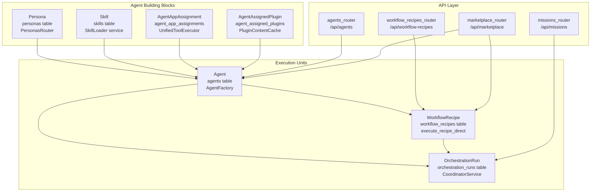
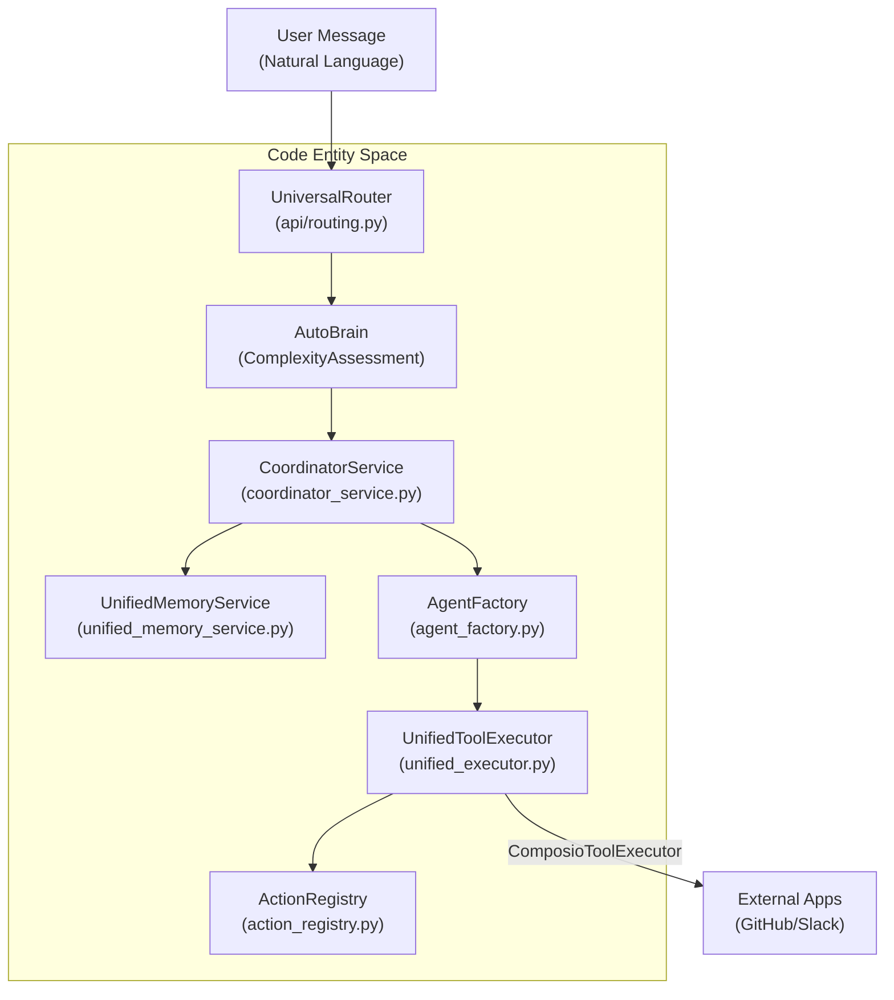

# Key Concepts

<details>
<summary>Relevant source files</summary>

The following files were used as context for generating this wiki page:

- [README.md](README.md)
- [docker-compose.yml](docker-compose.yml)
- [docs/README.md](docs/README.md)
- [frontend/.dockerignore](frontend/.dockerignore)
- [frontend/Dockerfile](frontend/Dockerfile)
- [orchestrator/Dockerfile](orchestrator/Dockerfile)
- [orchestrator/alembic/versions/prd123_checkpoint_count.py](orchestrator/alembic/versions/prd123_checkpoint_count.py)
- [orchestrator/api/cloud_documents.py](orchestrator/api/cloud_documents.py)
- [orchestrator/api/missions.py](orchestrator/api/missions.py)
- [orchestrator/config.py](orchestrator/config.py)
- [orchestrator/core/context_guard.py](orchestrator/core/context_guard.py)
- [orchestrator/core/models/orchestration.py](orchestrator/core/models/orchestration.py)
- [orchestrator/core/models/orchestration_enums.py](orchestrator/core/models/orchestration_enums.py)
- [orchestrator/core/redis/client.py](orchestrator/core/redis/client.py)
- [orchestrator/main.py](orchestrator/main.py)
- [orchestrator/modules/coordination/dispatcher.py](orchestrator/modules/coordination/dispatcher.py)
- [orchestrator/modules/coordination/planner.py](orchestrator/modules/coordination/planner.py)
- [orchestrator/modules/coordination/reconciler.py](orchestrator/modules/coordination/reconciler.py)
- [orchestrator/modules/memory/context_router.py](orchestrator/modules/memory/context_router.py)
- [orchestrator/modules/memory/unified_memory_service.py](orchestrator/modules/memory/unified_memory_service.py)
- [orchestrator/modules/tools/discovery/action_registry.py](orchestrator/modules/tools/discovery/action_registry.py)
- [orchestrator/modules/tools/execution/concurrency.py](orchestrator/modules/tools/execution/concurrency.py)
- [orchestrator/modules/tools/services/__init__.py](orchestrator/modules/tools/services/__init__.py)
- [orchestrator/requirements.txt](orchestrator/requirements.txt)
- [orchestrator/services/checkpoint_service.py](orchestrator/services/checkpoint_service.py)
- [orchestrator/services/coordinator_service.py](orchestrator/services/coordinator_service.py)
- [orchestrator/services/orchestration_state.py](orchestrator/services/orchestration_state.py)
- [orchestrator/tests/test_budget_gate.py](orchestrator/tests/test_budget_gate.py)
- [orchestrator/tests/test_dispatcher_parallel.py](orchestrator/tests/test_dispatcher_parallel.py)
- [orchestrator/tests/test_unified_memory.py](orchestrator/tests/test_unified_memory.py)
- [scripts/ralph/IMPLEMENTATION_PLAN.md](scripts/ralph/IMPLEMENTATION_PLAN.md)
- [scripts/ralph/progress.txt](scripts/ralph/progress.txt)

</details>


This document defines the core terminology and data structures used throughout Automatos AI. Understanding these concepts is essential for working with any part of the system.

For system architecture details, see **1.2 System Architecture**. For specific implementation guides, see the respective sections: **5. Agents**, **6. Workflows & Recipes**, **3. Memory System**, and **8. Tools & Integrations**.

---

## Overview of Core Entities

Automatos AI is built around several primary concepts that work together to create a flexible multi-agent orchestration platform. Each concept maps to specific database tables, API routers, and service classes.

### Core Entity Architecture


**Sources:** [orchestrator/services/coordinator_service.py:31-37](), [orchestrator/modules/tools/discovery/action_registry.py:27-42](), [orchestrator/main.py:36-41]()

---

## Agents

An **Agent** is an AI-powered entity that can execute tasks using a configured LLM, personality profile, skills, tools, and plugins. Agents are the fundamental execution units in the system.

### Agent Structure
An Agent is instantiated by `AgentFactory.activate_agent()`, which loads configuration from the database and creates an `AgentRuntime` instance with all capabilities.

| Field | Type | Description |
|-------|------|-------------|
| `id` | integer | Primary Key |
| `workspace_id` | UUID | Foreign Key to workspace |
| `slug` | string | Unique identifier |
| `model_config` | JSONB | LLM provider and model settings |
| `persona_id` | UUID | FK to predefined persona |
| `configuration` | JSONB | General agent settings including heartbeat [orchestrator/config.py:114-114]() |

**Sources:** [orchestrator/core/models/core.py:30-30](), [orchestrator/modules/coordination/agent_matcher.py:41-41]()

---

## Missions & Multi-Agent Coordination

Automatos AI uses a "Mission" system for complex, multi-step agent orchestration. This replaces legacy sequential workflows with dynamic, dependency-aware execution.

### Mission Lifecycle
The `CoordinatorService` manages the lifecycle of an `OrchestrationRun` through a 5-second tick loop [orchestrator/services/coordinator_service.py:78-86]().

1.  **PLANNING**: The `MissionPlanner` decomposes a goal into a Directed Acyclic Graph (DAG) of `OrchestrationTask` entities [orchestrator/modules/coordination/planner.py:1-15]().
2.  **DISPATCHING**: The `MissionDispatcher` claims queued tasks using optimistic locking (`version_id`) and assigns them to the best-fit agents via `AgentMatcher` [orchestrator/modules/coordination/dispatcher.py:120-178]().
3.  **EXECUTION**: Agents execute tasks, potentially using tools or generating LLM content.
4.  **VERIFICATION**: The `VerificationService` assesses task outputs against success criteria [orchestrator/services/coordinator_service.py:55-55]().

### Shared Mission Context (PRD-108)
Missions utilize a shared vector field (often Qdrant) that acts as a "blackboard" for agents to share intermediate results and maintain state across the DAG [orchestrator/services/coordinator_service.py:107-151]().

**Sources:** [orchestrator/services/coordinator_service.py:5-17](), [orchestrator/core/models/orchestration_enums.py:29-40](), [orchestrator/modules/coordination/dispatcher.py:76-81]()

---

## Memory System (5-Layer Stack)

Automatos AI implements a 5-layer memory architecture managed by the `UnifiedMemoryService`. This provides a single entry point for all memory operations [orchestrator/modules/memory/unified_memory_service.py:1-21]().

### Memory Tiers
| Tier | Name | Implementation | Purpose |
|------|------|----------------|---------|
| **L0** | Focus | Context Window | Immediate conversation tokens. |
| **L1** | Working | Redis | Session cache per conversation (24h TTL) [orchestrator/modules/memory/unified_memory_service.py:123-138](). |
| **L2** | Short-term | Postgres | Time-based decay (Ebbinghaus) and daily logs [orchestrator/config.py:100-105](). |
| **L3** | Long-term | Mem0 | Fact extraction and cross-session recall [orchestrator/modules/memory/unified_memory_service.py:178-182](). |
| **L4** | Knowledge | RAG/Tools | Organizational knowledge and document search. |

### Memory Namespace Resolution
The `MemoryNamespace` class ensures standardized, scoped keys for memory storage to prevent cross-tenant data leaks [orchestrator/modules/memory/unified_memory_service.py:38-46]().

```python
# Example namespace resolution
namespace = MemoryNamespace(workspace_id="ws-123")
agent_key = namespace.agent(agent_id=45) # "mem:ws-123:agent:45"
session_key = namespace.session(conv_id="chat-88") # "mem:session:ws-123:chat-88"
```

**Sources:** [orchestrator/modules/memory/unified_memory_service.py:52-117](), [orchestrator/config.py:82-117]()

---

## Tools & Platform Actions

### Tool Execution
Tools are external application integrations (via Composio) or internal capabilities. The system uses a unified execution chain to handle permissions and routing.

### Platform Actions (PRD-64)
**Platform Actions** are specialized tools that allow agents to manage the Automatos platform itself (e.g., `platform_create_agent`).
*   **Action Registry**: Central catalog of all platform operations [orchestrator/modules/tools/discovery/action_registry.py:55-65]().
*   **Promoted Actions**: High-value actions (like agent management) that are exposed as first-class OpenAI tool schemas instead of generic dispatchers [orchestrator/modules/tools/discovery/action_registry.py:119-134]().
*   **Permission Gating**: Actions are categorized by `permission_level` (read, write, destructive) and can be restricted to admins only [orchestrator/modules/tools/discovery/action_registry.py:28-42]().
*   **Admin Enforcement**: Admin-only actions (e.g., `platform_query_loki_logs`) require the caller to have an `admin` or `owner` role in the `caller_context` [scripts/ralph/progress.txt:21-31]().

**Sources:** [scripts/ralph/IMPLEMENTATION_PLAN.md:1-20](), [scripts/ralph/progress.txt:3-10](), [orchestrator/modules/tools/discovery/action_registry.py:136-157]()

---

## System Interaction Diagram

This diagram bridges the Natural Language space (User Input) to the Code Entity space (System Services).


**Sources:** [orchestrator/services/coordinator_service.py:78-86](), [orchestrator/modules/tools/discovery/action_registry.py:55-65](), [orchestrator/modules/memory/unified_memory_service.py:154-161]()

---