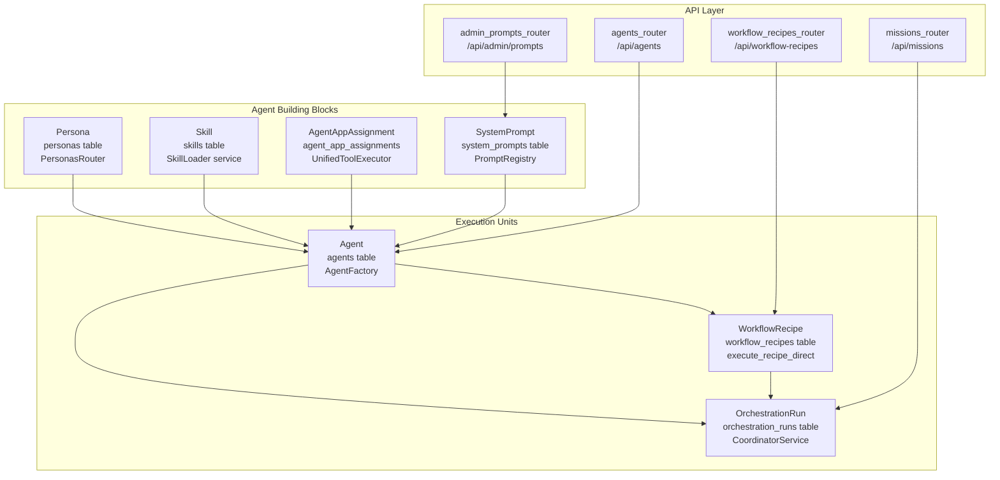
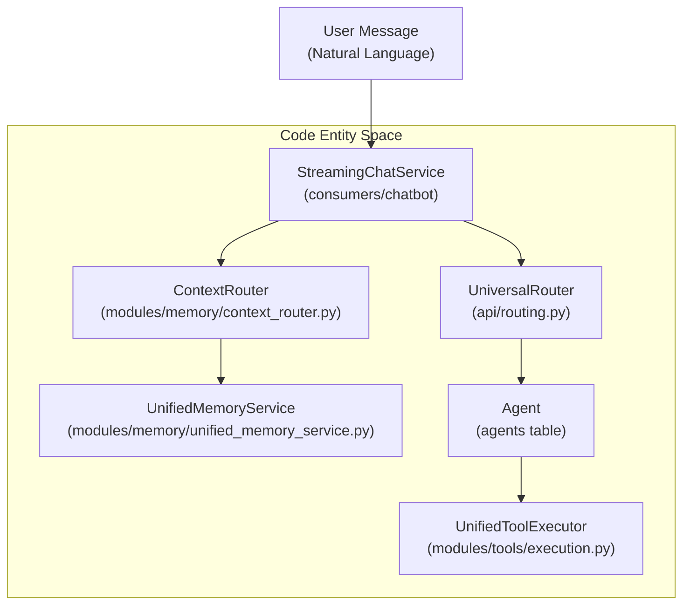

# Key Concepts

Relevant source files

The following files were used as context for generating this wiki page:

- [README.md](README.md)
- [docs/CONTRIBUTING.md](docs/CONTRIBUTING.md)
- [docs/README.md](docs/README.md)
- [frontend/tsconfig.tsbuildinfo](frontend/tsconfig.tsbuildinfo)
- [orchestrator/config.py](orchestrator/config.py)
- [orchestrator/consumers/__init__.py](orchestrator/consumers/__init__.py)
- [orchestrator/consumers/chatbot/__init__.py](orchestrator/consumers/chatbot/__init__.py)
- [orchestrator/main.py](orchestrator/main.py)
- [orchestrator/modules/memory/context_router.py](orchestrator/modules/memory/context_router.py)
- [orchestrator/modules/memory/unified_memory_service.py](orchestrator/modules/memory/unified_memory_service.py)
- [orchestrator/modules/tools/__init__.py](orchestrator/modules/tools/__init__.py)
- [orchestrator/modules/tools/services/__init__.py](orchestrator/modules/tools/services/__init__.py)
- [orchestrator/tests/test_unified_memory.py](orchestrator/tests/test_unified_memory.py)
- [scripts/ralph/IMPLEMENTATION_PLAN.md](scripts/ralph/IMPLEMENTATION_PLAN.md)
- [scripts/ralph/prd.json](scripts/ralph/prd.json)
- [scripts/ralph/progress.txt](scripts/ralph/progress.txt)

This document defines the core terminology and data structures used throughout Automatos AI. Understanding these concepts is essential for working with any part of the system, from agent creation to multi-agent orchestration.

For system architecture details, see **1.2 System Architecture**. For specific implementation guides, see the respective sections: **5. Agents**, **6. Workflows & Recipes**, **3. Memory System**, and **8. Tools & Integrations**.

---

## Overview of Core Entities

Automatos AI is built around several primary concepts that work together to create a flexible multi-agent orchestration platform. Each concept maps to specific database tables, API routers, and service classes.

### Core Entity Architecture

**Sources:** [orchestrator/main.py:36-41](), [orchestrator/modules/tools/execution.py:30-32](), [orchestrator/main.py:86-88](), [orchestrator/main.py:92-93]()

---

## Agents

An **Agent** is an AI-powered entity that can execute tasks using a configured LLM, personality profile, skills, tools, and plugins. Agents are the fundamental execution units in the system.

### Agent Structure
An Agent is instantiated by the `AgentFactory`, which loads configuration from the database. Each agent is scoped to a `workspace_id` for multi-tenancy.

| Field | Type | Description |
|-------|------|-------------|
| `id` | integer | Primary Key for the agent record. |
| `workspace_id` | UUID | Foreign Key for multi-tenant isolation. |
| `slug` | string | Per-workspace unique identifier used for routing. |
| `model_config` | JSONB | LLM provider and model settings (model name, temperature, etc.). |
| `agent_type` | string | Defines role and behavior profile. |

**Sources:** [orchestrator/main.py:36-36](), [orchestrator/main.py:92-93](), [orchestrator/config.py:21-22]()

---

## Workflows & Recipes

Automatos AI distinguishes between static "Recipes" and dynamic "Workflows".

### Recipes
A **Recipe** (`WorkflowRecipe`) is a predefined sequence of steps. It is often used for repeatable business processes. The execution is handled by `execute_recipe_direct`, which manages step loops and agent activation.

### Workflow Pipeline
Modern workflows utilize the `WorkflowStageTracker`, which supports a dynamic 5-phase pipeline:
1.  **PLAN**: Task decomposition and agent selection.
2.  **PREPARE**: Context engineering and prompt optimization.
3.  **EXECUTE**: Agent execution and inter-agent coordination.
4.  **EVALUATE**: Result aggregation and quality assessment.
5.  **LEARN**: Memory storage and response generation.

**Sources:** [orchestrator/main.py:39-39](), [scripts/ralph/IMPLEMENTATION_PLAN.md:51-51]()

---

## Memory System (5-Layer Stack)

The system uses a 5-layer memory architecture managed by the `UnifiedMemoryService` to maintain context across different temporal and semantic scales.

| Tier | Name | Implementation | Purpose |
|------|------|----------------|---------|
| **L0** | Focus | Context Window | Immediate conversation tokens managed during prompt assembly. |
| **L1** | Working | Redis | Session cache (`SessionMemory`) per conversation with a 24-hour TTL [orchestrator/modules/memory/unified_memory_service.py:124-130](). |
| **L2** | Short-term | Postgres | Persistent history with Ebbinghaus decay [orchestrator/config.py:98-103](). |
| **L3** | Long-term | Mem0 | Cross-session fact extraction and agent-specific memories [orchestrator/modules/memory/unified_memory_service.py:56-58](). |
| **L4** | Knowledge | RAG/Tools | Organizational knowledge, document vector search, and Graphify knowledge graphs [orchestrator/modules/memory/unified_memory_service.py:13-13](). |

**Sources:** [orchestrator/modules/memory/unified_memory_service.py:8-13](), [orchestrator/modules/memory/unified_memory_service.py:39-46](), [orchestrator/config.py:82-123]()

---

## Context Assembly & Routing

### Context Router
The `ContextRouter` acts as an intelligent pre-LLM layer. It performs **Signal Detection** via regex to identify user intent (temporal, personal facts, etc.) and performs **Context Assembly** to fetch relevant data from memory layers within a token budget.

### Universal Router
The `UniversalRouter` handles message distribution using a 7-tier strategy, ranging from simple cache lookups to LLM-based classification, ensuring the most appropriate agent or workflow is activated for a given input.

**Sources:** [orchestrator/modules/memory/context_router.py:5-12](), [orchestrator/modules/memory/context_router.py:41-56](), [orchestrator/main.py:82-82]()

---

## Tools & Workspaces

### Tools & Composio
The system utilizes a `UnifiedToolExecutor` to route agent requests to various tool providers. Integration with **Composio** provides access to thousands of third-party apps. Tools are assigned via `AgentAppAssignment`.

### Workspace Execution
Agents operate within sandboxed environments. The `WorkspaceWorker` handles file operations, command execution, and GitHub integration (cloning and repo management) to ensure safe and isolated task completion.

**Sources:** [orchestrator/modules/tools/__init__.py:30-32](), [orchestrator/modules/tools/services/__init__.py:11-12](), [orchestrator/main.py:138-141]()

---

## System Interaction Diagram

This diagram bridges the Natural Language space (User Input) to the Code Entity space (System Services and Models).

**Sources:** [orchestrator/main.py:82-82](), [orchestrator/modules/memory/unified_memory_service.py:154-161](), [orchestrator/modules/memory/context_router.py:5-12](), [orchestrator/modules/tools/execution.py:30-32]()

---