# Key Concepts

<details>
<summary>Relevant source files</summary>

The following files were used as context for generating this wiki page:

- [frontend/app/admin/plugins/page.tsx](frontend/app/admin/plugins/page.tsx)
- [frontend/lib/api-client.ts](frontend/lib/api-client.ts)
- [frontend/tsconfig.tsbuildinfo](frontend/tsconfig.tsbuildinfo)
- [orchestrator/.env.example](orchestrator/.env.example)
- [orchestrator/api/agent_plugins.py](orchestrator/api/agent_plugins.py)
- [orchestrator/api/workflows.py](orchestrator/api/workflows.py)
- [orchestrator/config.py](orchestrator/config.py)
- [orchestrator/consumers/chatbot/service.py](orchestrator/consumers/chatbot/service.py)
- [orchestrator/core/database/load_seed_data.py](orchestrator/core/database/load_seed_data.py)
- [orchestrator/core/llm/manager.py](orchestrator/core/llm/manager.py)
- [orchestrator/core/seeds/seed_personas.py](orchestrator/core/seeds/seed_personas.py)
- [orchestrator/core/seeds/seed_plugin_categories.py](orchestrator/core/seeds/seed_plugin_categories.py)
- [orchestrator/core/services/plugin_cache.py](orchestrator/core/services/plugin_cache.py)
- [orchestrator/main.py](orchestrator/main.py)
- [orchestrator/modules/agents/factory/agent_factory.py](orchestrator/modules/agents/factory/agent_factory.py)
- [orchestrator/modules/orchestrator/pipeline.py](orchestrator/modules/orchestrator/pipeline.py)
- [orchestrator/modules/orchestrator/service.py](orchestrator/modules/orchestrator/service.py)
- [scripts/ralph/prd.json](scripts/ralph/prd.json)

</details>


This document defines the core terminology and data structures used throughout Automatos AI. Understanding these concepts is essential for working with any part of the system.

For system architecture details, see [System Architecture](#1.2). For specific implementation guides, see the respective sections: [Agents](#3), [Workflows & Recipes](#4), [Plugins & Marketplace](#5), [Tools & Integrations](#6), and [Skills](#7).

---

## Overview of Core Entities

Automatos AI is built around eight primary concepts that work together to create a flexible multi-agent orchestration platform. Each concept maps to specific database tables, API routers, and service classes.

### Core Entity Architecture

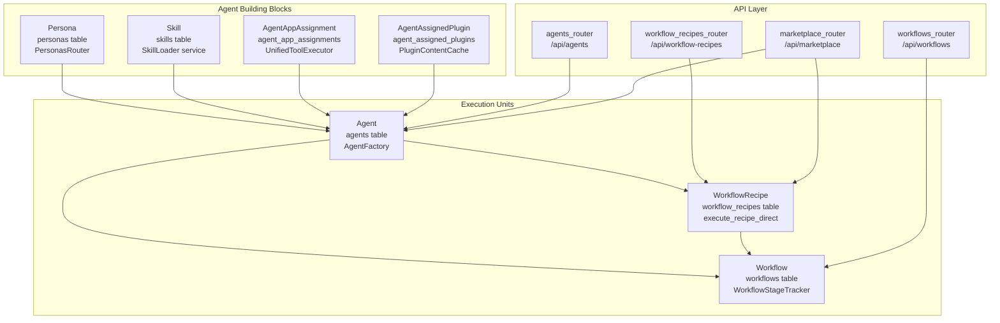

**Sources:** [orchestrator/core/models/__init__.py:1-39](), [orchestrator/main.py:691-799](), [orchestrator/modules/agents/factory/agent_factory.py:1-50]()

### Router Registration in FastAPI

The main application registers all API routers in `main.py`:

```python
# Core entity routers
app.include_router(agents_router)              # /api/agents
app.include_router(workflows_router)           # /api/workflows
app.include_router(workflow_recipes_router)    # /api/workflow-recipes
app.include_router(marketplace_router)         # /api/marketplace
app.include_router(tools_router)               # /api/tools
app.include_router(skills_router)              # /api/v1/skills
app.include_router(personas_router)            # /api/personas
```

**Sources:** [orchestrator/main.py:691-773]()

---

## Agents

An **Agent** is an AI-powered entity that can execute tasks using a configured LLM, personality profile, skills, tools, and plugins. Agents are the fundamental execution units in the system.

### Agent Structure

An Agent is instantiated by `AgentFactory.activate_agent()`, which loads configuration from the database and creates an `AgentRuntime` instance with all capabilities.

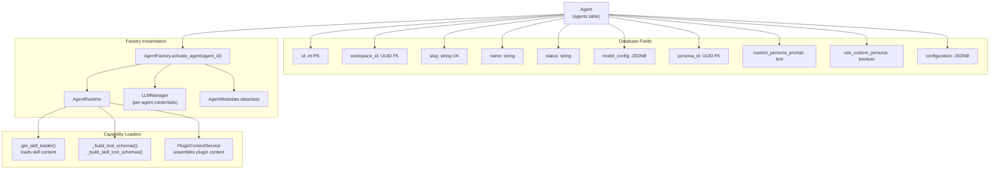

**Sources:** [orchestrator/modules/agents/factory/agent_factory.py:376-530](), [orchestrator/core/models/core.py]()

### Agent Model Configuration

The `model_config` JSONB field stores LLM provider and model settings. It is parsed into a `ModelConfiguration` dataclass at runtime:

| Field | Type | Description | Default |
|-------|------|-------------|---------|
| `provider` | string | LLM provider (e.g., "openai", "anthropic") | From `config.LLM_PROVIDER` |
| `model_id` | string | Model identifier (e.g., "gpt-4", "claude-3-opus") | From `config.LLM_MODEL` |
| `temperature` | float | Sampling temperature (0.0-2.0) | 0.7 |
| `max_tokens` | integer | Maximum response tokens | 2000 |
| `top_p` | float | Nucleus sampling parameter | 1.0 |
| `frequency_penalty` | float | Repetition penalty | 0.0 |
| `presence_penalty` | float | Topic diversity penalty | 0.0 |
| `fallback_model_id` | string | Fallback model if primary fails | null |

**Code Mapping:**

```python
# orchestrator/modules/agents/factory/agent_factory.py:322-374
@dataclass
class ModelConfiguration:
    provider: str
    model_id: str
    temperature: float = 0.7
    max_tokens: int = 2000
    top_p: float = 1.0
    frequency_penalty: float = 0.0
    presence_penalty: float = 0.0
    fallback_model_id: Optional[str] = None
```

**Sources:** [orchestrator/modules/agents/factory/agent_factory.py:322-374](), [orchestrator/api/agents.py:138-237]()

### Agent API Endpoints

| Endpoint | Method | Purpose |
|----------|--------|---------|
| `/api/agents` | GET | List agents with filtering |
| `/api/agents` | POST | Create new agent |
| `/api/agents/{agent_id}` | GET | Get agent details |
| `/api/agents/{agent_id}` | PUT | Update agent configuration |
| `/api/agents/{agent_id}/plugins` | PUT | Assign plugins to agent |
| `/api/agents/{agent_id}/assembled-context` | GET | Get runtime system prompt |

**Sources:** [orchestrator/api/agents.py:31-237](), [orchestrator/api/agent_plugins.py:68-338]()

---

## Workflows

A **Workflow** represents an orchestrated sequence of tasks executed by agents. Workflows are executed by `execute_workflow_with_progress()` which uses `WorkflowStageTracker` for SSE streaming and dynamic phase selection via `PhaseSelector`.

### Workflow Execution Architecture

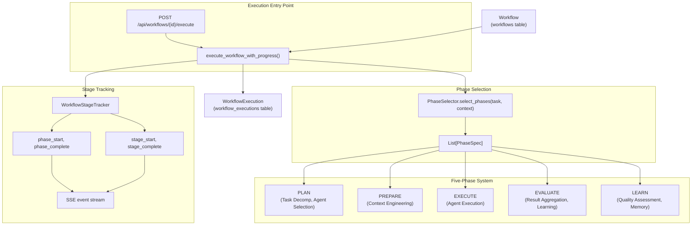

**Sources:** [orchestrator/api/workflows.py:40-185](), [orchestrator/modules/orchestrator/pipeline.py:1-250]()

### Workflow States

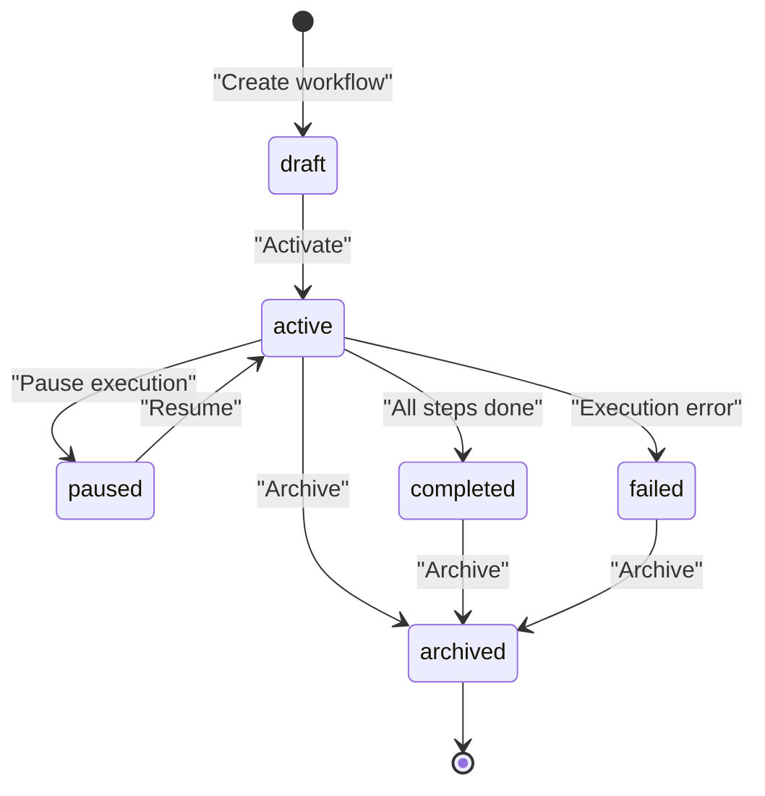

### Workflow Structure

Workflows are stored in the `workflows` table with the following key fields:

| Field | Type | Description |
|-------|------|-------------|
| `name` | string | Workflow display name |
| `description` | text | Purpose and overview |
| `status` | enum | Current state (draft/active/archived) |
| `steps` | JSONB | Array of step definitions |
| `agents` | array | List of assigned agent IDs |
| `config` | JSONB | Execution configuration |
| `workspace_id` | UUID | Owning workspace |

**Sources:** [frontend/components/workflows/workflow-management.tsx:172-446](), [orchestrator/api/workflows.py]()

---

## Recipes

A **Recipe** is a reusable workflow template with predefined steps, agent assignments, and execution configuration. Recipes support quality assessment and continuous learning from execution history.

### Recipe vs Workflow

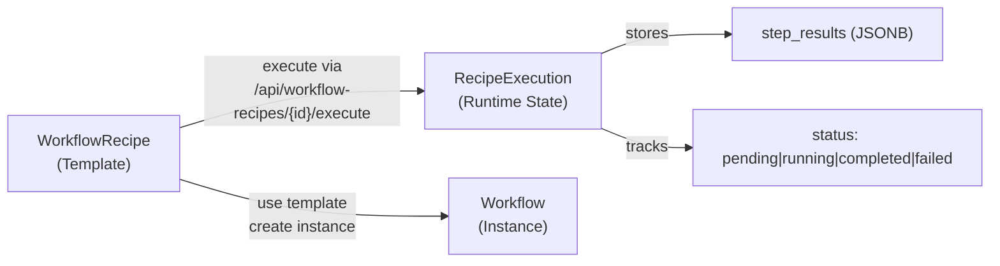

### Recipe Model

Recipes are stored in the `workflow_recipes` table (aliased as `WorkflowTemplate` in code for backward compatibility):

| Field | Type | Description |
|-------|------|-------------|
| `template_id` | string | Unique recipe identifier (slug) |
| `name` | string | Display name |
| `steps` | JSONB | Array of step definitions |
| `execution_config` | JSONB | Runtime behavior settings |
| `schedule_config` | JSONB | Scheduling configuration |
| `quality_score` | float | 0.0-1.0 quality metric |
| `learning_data` | JSONB | Pattern analysis results |
| `use_count` | integer | Number of executions |

**Sources:** [orchestrator/api/workflow_recipes.py:22-26](), [orchestrator/api/workflow_recipes.py:171-299]()

### Recipe Step Structure

Each step in `recipe.steps` has this structure:

```json
{
  "step_id": "step-1",
  "order": 1,
  "agent_id": 123,
  "prompt_template": "Review the code for security issues",
  "pass_to": ["step-2"],
  "error_handling": "stop"
}
```

**Sources:** [orchestrator/api/workflow_recipes.py:253-266]()

### Recipe Execution Configuration

The `execution_config` JSONB field controls runtime behavior:

| Field | Type | Default | Description |
|-------|------|---------|-------------|
| `mode` | string | "sequential" | Execution mode (sequential/parallel) |
| `max_retries` | integer | 1 | Maximum retry attempts per step |
| `retry_delay` | integer | 5 | Delay between retries (seconds) |
| `per_step_timeout` | integer | 300 | Timeout per step (seconds) |
| `total_timeout` | integer | 1800 | Total recipe timeout (seconds) |
| `quality_threshold` | float | 0.7 | Minimum quality score (0.0-1.0) |
| `auto_learn` | boolean | true | Enable learning from executions |
| `memory_isolation` | string | "shared" | Memory isolation mode |

**Sources:** [orchestrator/api/workflow_recipes.py:217-227](), [frontend/components/workflows/recipes-tab.tsx:203-214]()

### Recipe Execution Flow

Recipes are executed by the `execute_recipe_direct()` function, which orchestrates step-by-step execution with agent activation, tool loading, and memory integration.

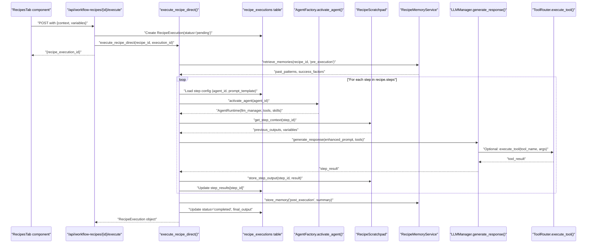

**Sources:** [orchestrator/api/recipe_executor.py](), [orchestrator/api/workflow_recipes.py:542-660]()

---

## Plugins

A **Plugin** is a packaged collection of skills, commands, and agent configurations that can be installed from the marketplace and assigned to agents. Plugins enhance agent capabilities with domain-specific knowledge.

### Plugin Lifecycle

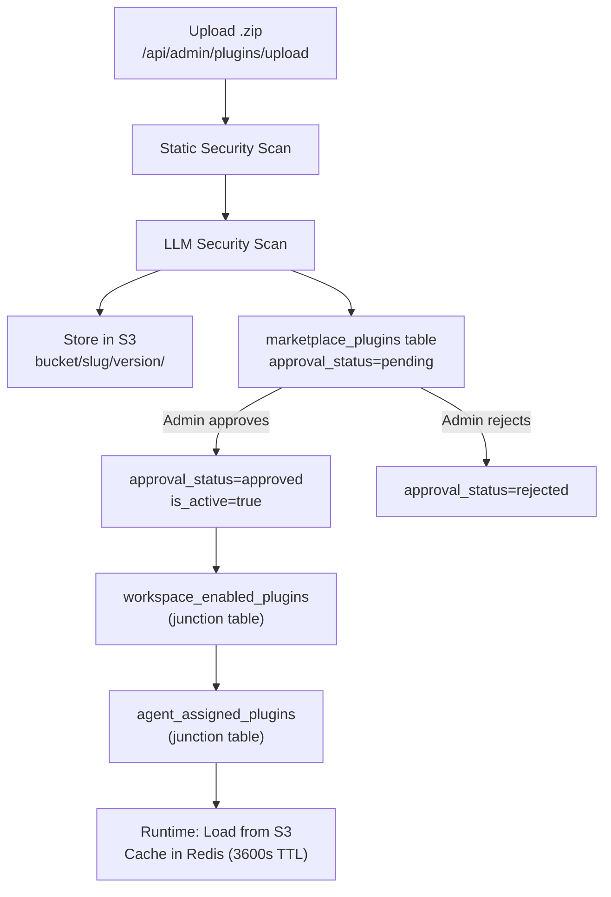

### Plugin Database Schema

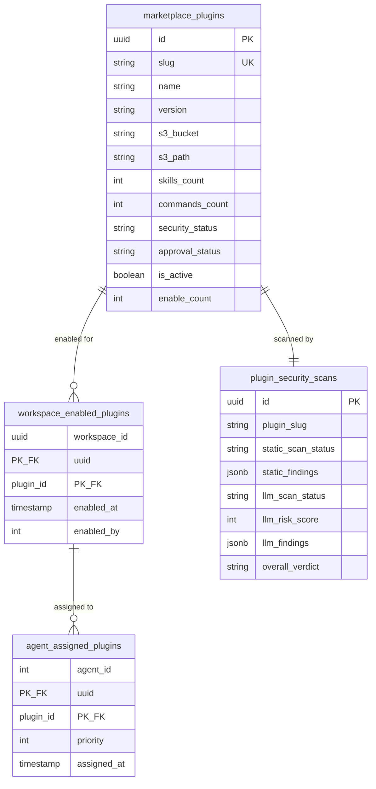

**Sources:** [orchestrator/core/models/marketplace_plugins.py:1-235]()

### Plugin Content Structure

A plugin package is a `.zip` file with this structure:

```
plugin-name.zip
├── manifest.json          # Plugin metadata
├── skills/                # Tier 1: Skill summaries
│   ├── skill-1.md
│   └── skill-2.md
├── commands/              # Tier 2: Command documentation
│   ├── command-1.md
│   └── command-2.md
└── agents/                # Optional: Agent configurations
    └── agent-config.json
```

### Plugin Context Assembly

At runtime, the `PluginContentCache` and `PluginContextService` assemble plugin content into the agent's system prompt. Content is cached in Redis to reduce S3 latency.

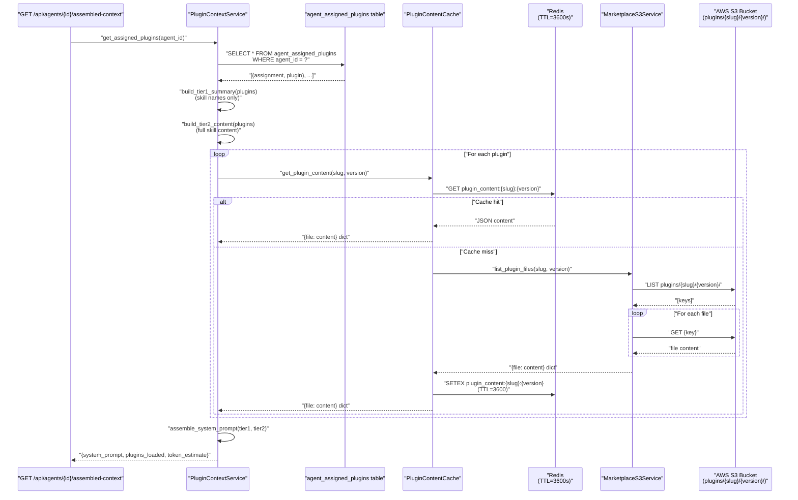

**Sources:** [orchestrator/api/agent_plugins.py:211-337](), [orchestrator/core/services/plugin_cache.py:1-250](), [orchestrator/core/services/marketplace_s3.py]()

---

## Tools

**Tools** are external application integrations provided by Composio (500+ apps like GitHub, Slack, Jira). Tools give agents the ability to execute actions in external systems.

### Tool Assignment Architecture

Tools are provided by Composio (external apps) and platform-native actions. The `ToolRouter` dispatches tool calls to the appropriate executor based on the tool name prefix.

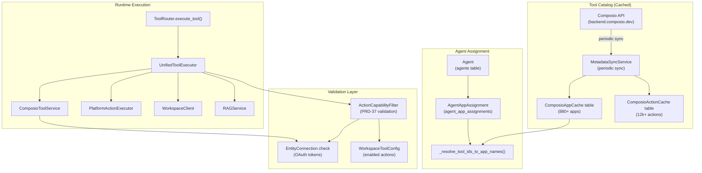

**Sources:** [orchestrator/modules/tools/tool_router.py:1-575](), [orchestrator/modules/tools/execution/unified_executor.py:1-800](), [orchestrator/api/agents.py:63-107]()

### Tool Database Schema

The `agent_app_assignments` table stores which Composio apps are assigned to which agents:

| Field | Type | Description |
|-------|------|-------------|
| `agent_id` | integer | FK to agents.id |
| `app_name` | string | Composio app name (e.g., "GITHUB") |
| `app_type` | string | "EXTERNAL" for Composio apps |
| `is_active` | boolean | Assignment enabled status |
| `priority` | integer | Loading order |
| `config` | JSONB | App-specific configuration |
| `assigned_at` | timestamp | Assignment timestamp |

**Sources:** [orchestrator/core/models/composio_cache.py](), [orchestrator/api/agents.py:404-418]()

### Tool Resolution Flow

When creating or updating an agent via `/api/agents`, the `tool_ids` array is resolved to `app_name` values using `_resolve_tool_ids_to_app_names()`:

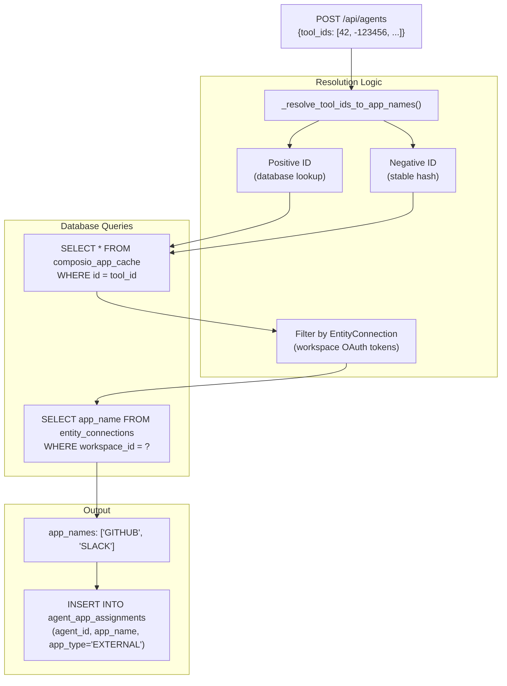

**Code Reference:**

```python
# orchestrator/api/agents.py:63-107
def _resolve_tool_ids_to_app_names(
    tool_ids: List[int], 
    workspace_id: str, 
    db: Session
) -> List[str]:
    # Maps both DB IDs and stable hashes to app_name
    # Filters by EntityConnection.connected = True
    # Returns list of app_name strings
```

**Sources:** [orchestrator/api/agents.py:63-107](), [orchestrator/core/models/composio_cache.py]()

---

## Skills

**Skills** are Git-based knowledge repositories that provide agents with domain expertise. Skills use progressive content loading to optimize token usage. The `SkillLoader` service handles Git repository cloning, indexing, and content extraction.

### Skill Source Management

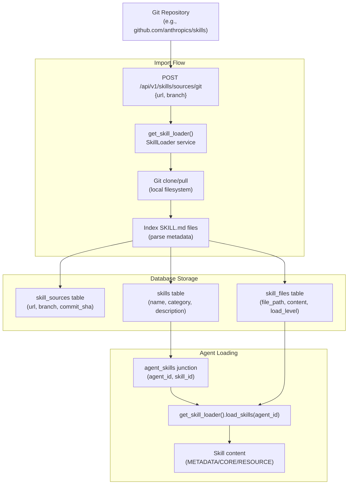

**Sources:** [orchestrator/api/skills.py:1-258](), [orchestrator/modules/agents/services/skill_loader.py]()

### Skill Database Schema

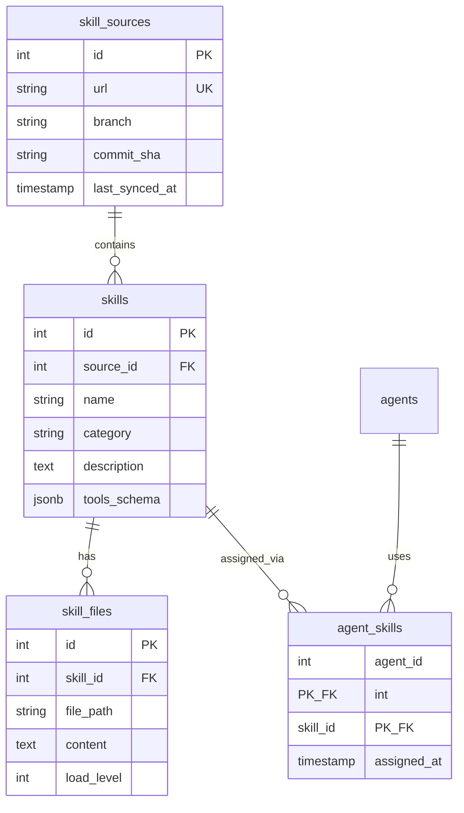

**Sources:** [orchestrator/api/skills.py:1-258](), [orchestrator/core/models/core.py]()

### Progressive Content Loading

Skills support three loading levels to optimize context window usage. The `SkillLoader` service loads content based on the `load_level` parameter:

| Level | Constant | Content | Token Estimate | Code Path |
|-------|----------|---------|----------------|-----------|
| 1 | `METADATA` | Name, description, category | ~50 tokens | `load_skills(load_level=1)` |
| 2 | `CORE` | Main SKILL.md content | ~500-2000 tokens | `load_skills(load_level=2)` |
| 3 | `RESOURCE` | Referenced files, examples | Variable | `load_skills(load_level=3)` |

**API Usage:**

```python
# GET /api/v1/skills/{id}/content?load_level=2
# Returns skill content at specified level
```

**Sources:** [orchestrator/api/skills.py:36-40](), [orchestrator/api/skills.py:72-84]()

### Skill Tools Schema

Skills can define executable tools via the `tools_schema` JSONB field. These tools are extracted and provided to agents at runtime by `_build_skill_tool_schemas()`:

```python
# orchestrator/modules/agents/factory/agent_factory.py:234-296
def _build_skill_tool_schemas(agent_skills: List) -> List[Dict]:
    """Extract tool schemas from skill.tools_schema field"""
    tools = []
    for skill in agent_skills:
        if skill.tools_schema and isinstance(skill.tools_schema, dict):
            skill_tools = skill.tools_schema.get('tools', [])
            for tool_def in skill_tools:
                tools.append({
                    "type": "function",
                    "function": {
                        "name": tool_def.get('name'),
                        "description": tool_def.get('description'),
                        "parameters": tool_def.get('parameters', {})
                    }
                })
    return tools
```

**Sources:** [orchestrator/modules/agents/factory/agent_factory.py:234-296]()

### Skill API Endpoints

| Endpoint | Method | Purpose |
|----------|--------|---------|
| `/api/v1/skills/sources/git` | POST | Import Git repository |
| `/api/v1/skills/sources` | GET | List skill sources |
| `/api/v1/skills` | GET | List skills with filtering |
| `/api/v1/skills/{id}/content` | GET | Get skill content (with load_level) |
| `/api/v1/skills/recommend` | POST | Get skill recommendations for task |

**Sources:** [orchestrator/api/skills.py:180-258]()

---

## Personas

A **Persona** is a predefined personality profile that defines an agent's communication style, tone, and approach. Personas provide consistent system prompts and suggested model parameters.

### Persona Structure

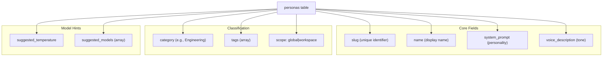

### Persona Types

Personas come in two scopes:

1. **Global Personas** (`scope='global'`): System-wide predefined personas seeded during installation
2. **Workspace Personas** (`scope='workspace'`): Custom personas created by workspace users

**Sources:** [orchestrator/core/models/personas.py:1-74](), [orchestrator/core/seeds/seed_personas.py:1-194]()

### Predefined Persona Categories

Personas are seeded during initial setup via `seed_personas()` in the database seed scripts. They are organized into four categories:

| Category | Examples | Purpose | Code Reference |
|----------|----------|---------|----------------|
| Engineering | Senior Engineer, Code Reviewer, DevOps/SRE | Technical analysis and development | `seed_personas.py:19-75` |
| Sales | SDR, Account Executive | Outreach and deal management | `seed_personas.py:76-110` |
| Marketing | Content Strategist, SEO Specialist | Content and campaign optimization | `seed_personas.py:111-145` |
| Support | Support Engineer, Escalation Manager | Customer assistance and issue resolution | `seed_personas.py:146-194` |

**Seeding Process:**

```python
# orchestrator/core/seeds/seed_personas.py:170-194
def seed_personas(db: Session):
    """Upserts predefined personas on slug"""
    for data in PREDEFINED_PERSONAS:
        existing = db.query(Persona).filter(Persona.slug == data["slug"]).first()
        if existing:
            # Update fields
            for key, value in data.items():
                setattr(existing, key, value)
            updated_count += 1
        else:
            # Create new
            persona = Persona(**data, id=uuid.uuid4())
            db.add(persona)
            created_count += 1
    db.commit()
```

**Sources:** [orchestrator/core/seeds/seed_personas.py:19-194]()

### Persona Assignment

Agents can use personas in two ways: predefined personas via `persona_id` FK, or custom prompts via `custom_persona_prompt`. The choice is controlled by the `use_custom_persona` boolean flag.

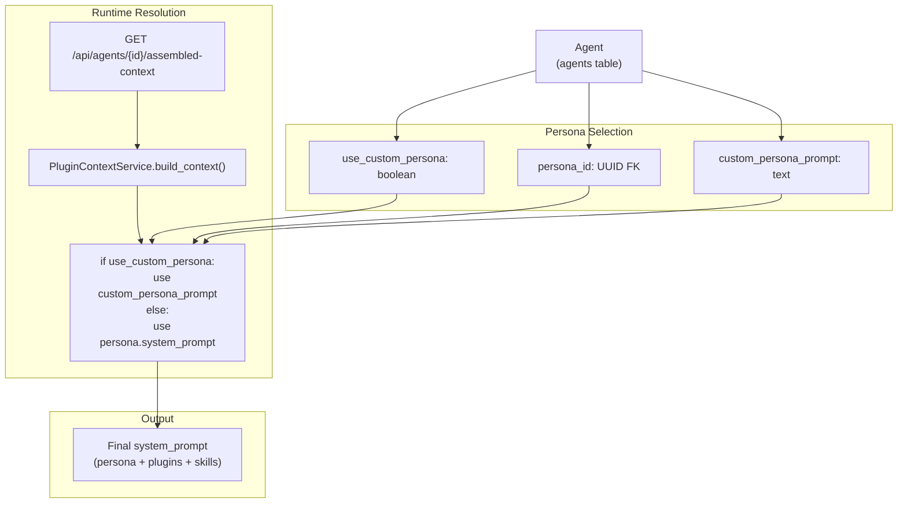

**Code Reference:**

```python
# orchestrator/api/agent_plugins.py:242-261
if agent.use_custom_persona and agent.custom_persona_prompt:
    persona_section = agent.custom_persona_prompt
else:
    persona_obj = db.query(Persona).filter(
        Persona.id == agent.persona_id
    ).first()
    if persona_obj:
        persona_section = persona_obj.system_prompt
```

**Sources:** [orchestrator/api/agent_plugins.py:242-261]()

---

## Marketplace

The **Marketplace** is a community-driven platform for sharing and discovering agents, recipes, and plugins. All marketplace items go through an approval workflow.

### Marketplace Entity Types

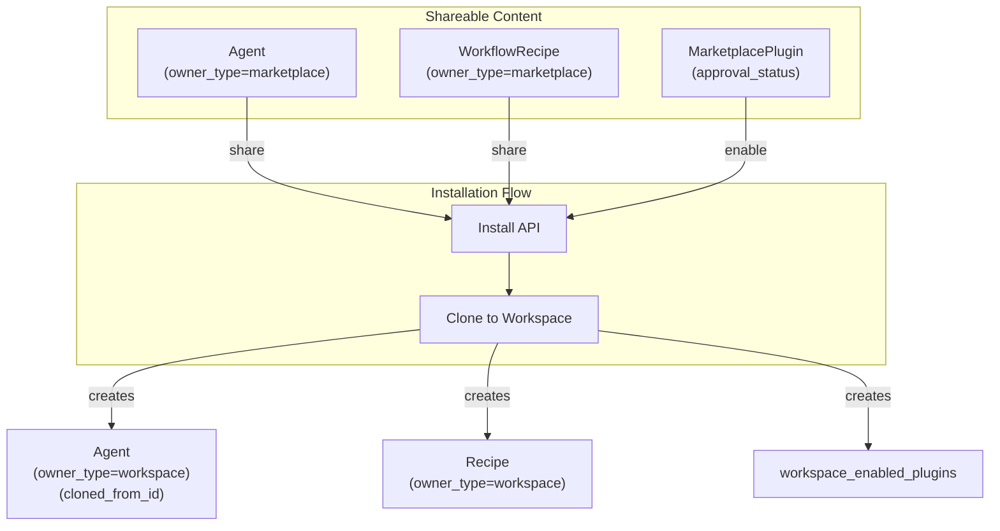

### Marketplace Approval States

| State | Description | Visibility |
|-------|-------------|------------|
| `pending` | Awaiting admin review | Admin only |
| `approved` | Passed review, publicly available | All users |
| `rejected` | Failed review, blocked | Admin only |

**Sources:** [orchestrator/api/marketplace.py](), [orchestrator/core/models/marketplace_plugins.py:98-104]()

### Marketplace API Endpoints

| Endpoint | Method | Purpose |
|----------|--------|---------|
| `/api/marketplace/agents` | GET | List marketplace agents |
| `/api/marketplace/recipes` | GET | List marketplace recipes |
| `/api/marketplace/plugins` | GET | List marketplace plugins |
| `/api/marketplace/install/{id}` | POST | Install item to workspace |
| `/api/marketplace/submit` | POST | Submit item for approval |

**Sources:** [orchestrator/api/marketplace.py](), [frontend/lib/api-client.ts]()

---

## Entity Relationships Summary

This diagram shows how all core concepts relate to each other in the database, with table names and key foreign key relationships.

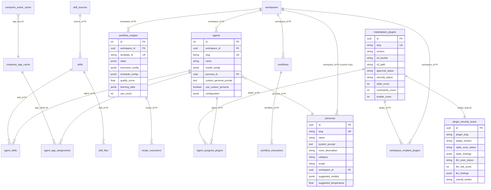

**Sources:** [orchestrator/core/models/__init__.py:1-39](), [orchestrator/core/models/core.py](), [orchestrator/core/models/marketplace_plugins.py:1-235](), [orchestrator/core/models/personas.py:1-74](), [orchestrator/core/models/composio_cache.py]()

---

## Data Isolation and Multi-Tenancy

All core entities are scoped to workspaces for data isolation:

| Entity | Workspace Field | Isolation Mechanism |
|--------|----------------|---------------------|
| Agent | `workspace_id` (UUID FK) | Direct foreign key to `workspaces.id` |
| WorkflowRecipe | `workspace_id` (UUID FK) + `owner_type` | FK + owner_type='workspace' filter |
| Workflow | `workspace_id` (UUID FK) | Direct foreign key |
| Skills | Shared globally | No workspace isolation |
| Personas | `workspace_id` (UUID FK, nullable) | Global (null) or workspace-custom |
| Plugins | Junction isolation | `workspace_enabled_plugins` controls access |

The `RequestContext` object from hybrid authentication middleware contains the resolved `workspace_id` for all API requests, ensuring queries are automatically filtered.

**Sources:** [orchestrator/core/auth/hybrid.py](), [orchestrator/api/agents.py:450-451](), [orchestrator/api/workflow_recipes.py:88-92]()

---