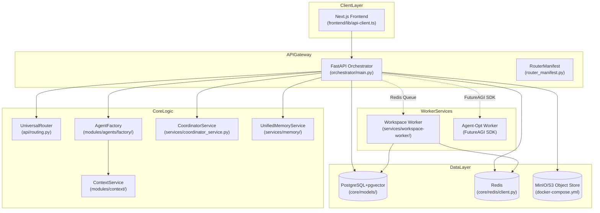
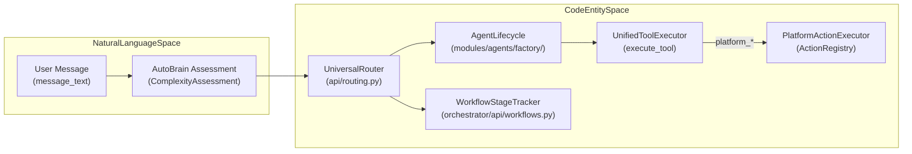
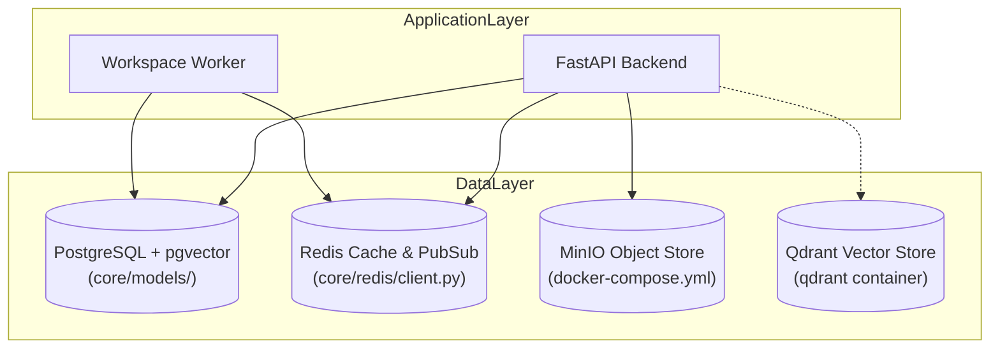

# System Architecture

Relevant source files

The following files were used as context for generating this wiki page:

- [.github/workflows/test.yml](.github/workflows/test.yml)
- [docker-compose.yml](docker-compose.yml)
- [frontend/.dockerignore](frontend/.dockerignore)
- [frontend/Dockerfile](frontend/Dockerfile)
- [frontend/components/__tests__/prd197-substrate-tile.test.tsx](frontend/components/__tests__/prd197-substrate-tile.test.tsx)
- [frontend/components/command-center/is-it-working-strip.tsx](frontend/components/command-center/is-it-working-strip.tsx)
- [frontend/hooks/use-analytics-api.ts](frontend/hooks/use-analytics-api.ts)
- [frontend/lib/api-client.ts](frontend/lib/api-client.ts)
- [infrastructure/.env.example](infrastructure/.env.example)
- [infrastructure/railway-manifest.json](infrastructure/railway-manifest.json)
- [orchestrator/Dockerfile](orchestrator/Dockerfile)
- [orchestrator/api/workflows.py](orchestrator/api/workflows.py)
- [orchestrator/config.py](orchestrator/config.py)
- [orchestrator/core/models/substrate_metrics.py](orchestrator/core/models/substrate_metrics.py)
- [orchestrator/core/observability/substrate_metrics.py](orchestrator/core/observability/substrate_metrics.py)
- [orchestrator/core/redis/client.py](orchestrator/core/redis/client.py)
- [orchestrator/main.py](orchestrator/main.py)
- [orchestrator/reports/route-manifest.json](orchestrator/reports/route-manifest.json)
- [orchestrator/requirements.txt](orchestrator/requirements.txt)
- [orchestrator/router_manifest.py](orchestrator/router_manifest.py)
- [orchestrator/tests/authz_sweep_probe.py](orchestrator/tests/authz_sweep_probe.py)
- [orchestrator/tests/test_dockerfile_prod_parity.py](orchestrator/tests/test_dockerfile_prod_parity.py)
- [orchestrator/tests/test_p2w2_authz_boundary_sweep.py](orchestrator/tests/test_p2w2_authz_boundary_sweep.py)
- [orchestrator/tests/test_prd154_s5_missions.py](orchestrator/tests/test_prd154_s5_missions.py)
- [orchestrator/tests/test_prd222_w2s1_plan_tiers.py](orchestrator/tests/test_prd222_w2s1_plan_tiers.py)

## Purpose and Scope

Automatos AI is designed as an operating system for AI agents, providing autonomous capabilities, multi-agent orchestration, and intelligent routing. This page documents the high-level technical architecture of the platform, detailing the FastAPI backend, Next.js frontend, core services, database and vector layers, and external integrations.

For configuration variables and environment setup, see [orchestrator/config.py:1-46]() and [2.2 Configuration Guide](). For API routing details, see [orchestrator/reports/route-manifest.json:1-40]().

---

## High-Level System Topology

The platform follows a multi-tier service architecture separating the client layer, API gateway, core logic engines, worker runtimes, and persistent data stores.

Title: "Platform Service Topology"

**Sources**: [orchestrator/main.py:1-125](), [docker-compose.yml:18-187](), [orchestrator/config.py:37-80](), [orchestrator/Dockerfile:95-140]()

---

## Backend Application (FastAPI)

The backend application is orchestrated via a central FastAPI instance initialized in `orchestrator/main.py`. It uses a modular router structure registered through `mount_manifest_routers` [orchestrator/main.py:30-30]() and handles runtime dependencies and lifecycle management.

### Application Lifecycle & Boot Sequence
1. **Environment & Config Loading**: Loads environment variables exclusively via `Config` in `orchestrator/config.py:1-35`[()](orchestrator/config.py:1-35).
2. **Database Initialization**: Runs `init_database` to connect SQLAlchemy to PostgreSQL with pgvector support [orchestrator/main.py:33-33]().
3. **Router Mounting**: Registers modular API routers spanning agents, workflows, marketplace, memory stats, analytics, and webhooks [orchestrator/main.py:37-120]().
4. **Middleware Stack**: Enforces CORS middleware [orchestrator/main.py:14-14](), hybrid authentication via `get_request_context_hybrid` [orchestrator/main.py:17-17](), and rate-limiting where applicable.

**Sources**: [orchestrator/main.py:1-120](), [orchestrator/config.py:1-46]()

---

## Bridge: Natural Language to Execution

The platform translates high-level user intentions expressed in natural language into concrete executions across agents, workflows, and platform actions.

Title: "Request to Execution Bridge"

### Execution Mechanics
- **`UniversalRouter`**: Inspects request envelopes and decides routing tiers (overrides, cache, rules, semantic similarity, or LLM classification) [orchestrator/api/routing.py:69-70]().
- **`WorkflowStageTracker`**: Tracks multi-stage execution phases (`PLAN`, `PREPARE`, `EXECUTE`, `EVALUATE`, `LEARN`) and emits Server-Sent Events (SSE) [orchestrator/api/workflows.py:38-70]().
- **`PlatformActionExecutor`**: Dispatches self-management platform commands through the `ActionRegistry` [orchestrator/core/seeds/seed_auto_agent.py:128-135]().

**Sources**: [orchestrator/api/routing.py:69-70](), [orchestrator/api/workflows.py:38-70](), [orchestrator/core/seeds/seed_auto_agent.py:104-140]()

---

## Data Layer & Infrastructure

The data layer consists of PostgreSQL with `pgvector` for relational and vector workloads, Redis for caching and pub/sub messaging, MinIO for S3-compatible local object storage, and Qdrant for dedicated vector field memory.

Title: "Data Layer and Storage Topology"

### Infrastructure Components & Services
- **PostgreSQL**: Stores relational models, agent definitions, workspace states, and vector embeddings via `pgvector` [docker-compose.yml:30-51]().
- **Redis**: Manages L1 session states, caching layer TTLs, task queues, and pub/sub events [docker-compose.yml:55-80]().
- **MinIO**: Provides an S3-compliant object store locally via `S3_ENDPOINT_URL` [docker-compose.yml:90-111]().
- **Qdrant**: Optional vector store profile for advanced shared vector field memory (`--profile memory`) [docker-compose.yml:123-134]().

**Sources**: [docker-compose.yml:30-134](), [orchestrator/Dockerfile:63-120](), [frontend/lib/api-client.ts:3-14]()

---