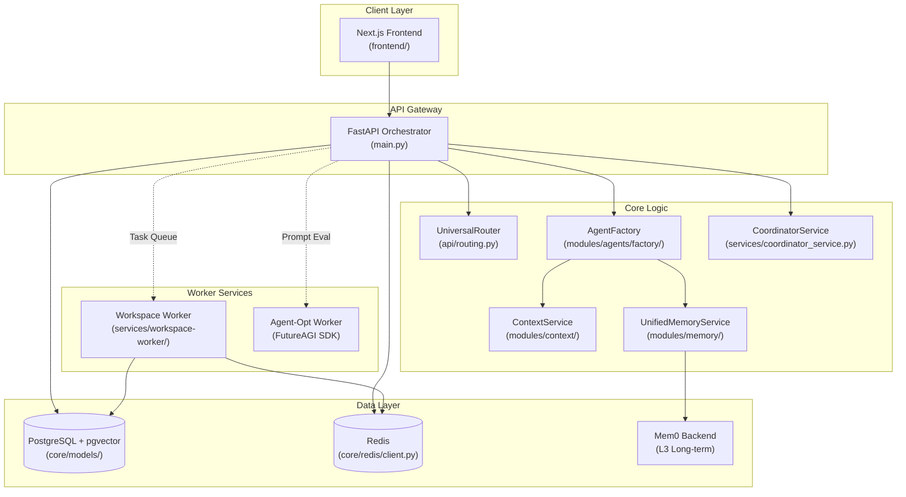
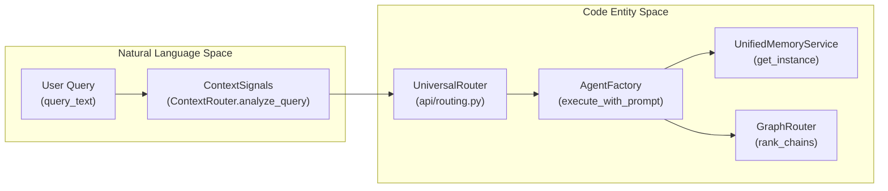

# System Architecture

Relevant source files

The following files were used as context for generating this wiki page:

- [docker-compose.yml](docker-compose.yml)
- [frontend/.dockerignore](frontend/.dockerignore)
- [frontend/Dockerfile](frontend/Dockerfile)
- [frontend/tsconfig.tsbuildinfo](frontend/tsconfig.tsbuildinfo)
- [orchestrator/Dockerfile](orchestrator/Dockerfile)
- [orchestrator/api/cloud_documents.py](orchestrator/api/cloud_documents.py)
- [orchestrator/config.py](orchestrator/config.py)
- [orchestrator/core/redis/client.py](orchestrator/core/redis/client.py)
- [orchestrator/main.py](orchestrator/main.py)
- [orchestrator/modules/memory/context_router.py](orchestrator/modules/memory/context_router.py)
- [orchestrator/modules/memory/unified_memory_service.py](orchestrator/modules/memory/unified_memory_service.py)
- [orchestrator/requirements.txt](orchestrator/requirements.txt)
- [orchestrator/tests/test_unified_memory.py](orchestrator/tests/test_unified_memory.py)
- [scripts/ralph/IMPLEMENTATION_PLAN.md](scripts/ralph/IMPLEMENTATION_PLAN.md)
- [scripts/ralph/prd.json](scripts/ralph/prd.json)
- [scripts/ralph/progress.txt](scripts/ralph/progress.txt)

This document provides a technical overview of the Automatos AI platform architecture, covering the service topology, component interactions, data layer design, and the orchestration bridge between natural language goals and executable code entities.

## Purpose and Scope

Automatos AI is designed as an "operating system for AI agents." This page describes the structural organization of the platform, including:

- High-level system topology and service relationships.
- Core backend services and their responsibilities (FastAPI, Next.js).
- Data layer architecture (PostgreSQL, Redis).
- The 5-Layer Memory System implementation.
- The Mission and Recipe execution engines.
- Deployment and containerization strategy.

---

## High-Level System Topology

The system follows a multi-tier architecture centered around a FastAPI orchestrator that manages communication between the user interface, persistent storage, and specialized worker services.

Title: Platform Service Topology

**Sources**: [orchestrator/main.py:1-156](), [docker-compose.yml:18-217](), [orchestrator/modules/memory/unified_memory_service.py:154-188](), [orchestrator/requirements.txt:1-50]()

---

## Backend Application (FastAPI)

The backend is a modular FastAPI application initialized in `orchestrator/main.py`. It serves as the primary integration point for all AI capabilities.

### Application Lifecycle
The application utilizes a `lifespan` manager and modular routing:
1. **Database Initialization**: Runs `init_database` and sets up SQLAlchemy sessions [orchestrator/main.py:32-34]().
2. **Modular Routing**: Includes over 80 specialized routers. Key routers include `agents_router`, `workflows_router`, `memory_router`, and `routing_router` [orchestrator/main.py:36-156]().
3. **Configuration**: Centralized in `Config` class, enforcing SSL for production database connections and managing Redis/Postgres URLs [orchestrator/config.py:28-58]().

### Core Data Models
| Class Name | Table Name | Purpose |
|:---|:---|:---|
| `Agent` | `agents` | Core agent configuration and capabilities [orchestrator/main.py:36](). |
| `OrchestrationRun` | `orchestration_runs` | Tracks a multi-agent Mission [scripts/ralph/IMPLEMENTATION_PLAN.md:51-51](). |
| `BoardTask` | `board_tasks` | Individual tasks executed by agents [scripts/ralph/IMPLEMENTATION_PLAN.md:51-51](). |
| `SessionMemory` | N/A (Redis) | L1 working memory for active conversations [orchestrator/modules/memory/unified_memory_service.py:123-137](). |

**Sources**: [orchestrator/main.py:1-156](), [orchestrator/config.py:28-80](), [orchestrator/modules/memory/unified_memory_service.py:123-149]()

---

## Bridge: Natural Language to Execution

The platform translates user intent into specific code entities and tool executions via a structured routing and assembly pipeline.

Title: Request to Code Entity Bridge

### Implementation Details
- **`ContextRouter`**: Uses regex patterns like `_TEMPORAL_PATTERNS` and `_PERSONAL_FACT_PATTERNS` to detect intent signals (e.g., `is_temporal`) before LLM invocation [orchestrator/modules/memory/context_router.py:40-56](), [orchestrator/modules/memory/context_router.py:85-121]().
- **`UnifiedMemoryService`**: Acts as a singleton provider for the 5-layer memory stack, resolving `MemoryNamespace` for workspace-scoped data [orchestrator/modules/memory/unified_memory_service.py:38-75](), [orchestrator/modules/memory/unified_memory_service.py:154-176]().
- **`GraphRouter`**: Specialized tool discovery service that expands entry nodes through `tool_routing_edges` to provide multi-action sequence hints to agents [scripts/ralph/progress.txt:98-112]().

**Sources**: [orchestrator/modules/memory/context_router.py:1-170](), [orchestrator/modules/memory/unified_memory_service.py:1-118](), [scripts/ralph/progress.txt:92-122]()

---

## 5-Layer Memory Architecture

The `UnifiedMemoryService` implements a tiered memory strategy to manage context density and relevance.

| Layer | Type | Implementation | Purpose |
|:---|:---|:---|:---|
| **L0** | Focus | Context Window | Immediate token-based context. |
| **L1** | Working | Redis | Active session state and conversation summaries [orchestrator/modules/memory/unified_memory_service.py:123-130](). |
| **L2** | Short-term | Postgres | Historical exchanges with Ebbinghaus decay logic [orchestrator/modules/memory/unified_memory_service.py:11-11](). |
| **L3** | Long-term | Mem0 | Extracted facts and semantic preferences [orchestrator/modules/memory/unified_memory_service.py:178-182](). |
| **L4** | Knowledge | RAG/Graph | Organizational documents and Business Knowledge Graphs [orchestrator/modules/memory/unified_memory_service.py:13-13](). |

**Sources**: [orchestrator/modules/memory/unified_memory_service.py:1-21](), [orchestrator/config.py:82-123]()

---

## Infrastructure and Deployment

Automatos AI uses a multi-stage Docker configuration to support development and production environments.

### Service Stack
| Service | Technology | Role |
|:---|:---|:---|
| `backend` | Python 3.11-slim | FastAPI API server with Alembic for migrations [orchestrator/Dockerfile:13-90](). |
| `frontend` | Node 20-alpine | Next.js 14 application with standalone build optimization [frontend/Dockerfile:14-115](). |
| `postgres` | pgvector/pgvector:pg16 | Vector-enabled relational database [docker-compose.yml:22-43](). |
| `redis` | redis:7-alpine | Caching, session store, and Pub/Sub [docker-compose.yml:48-73](). |
| `workspace-worker` | Python 3.11 | Isolated agent task execution environment [docker-compose.yml:178-200](). |

### Deployment Security
- **Production Migrations**: Containers run `alembic upgrade heads` on startup to ensure schema alignment [orchestrator/Dockerfile:132-140]().
- **Redis Hardening**: Dangerous commands like `FLUSHALL` are renamed/disabled in the `docker-compose.yml` configuration [docker-compose.yml:54-61]().

**Sources**: [orchestrator/Dockerfile:1-141](), [frontend/Dockerfile:1-115](), [docker-compose.yml:1-217]()

---