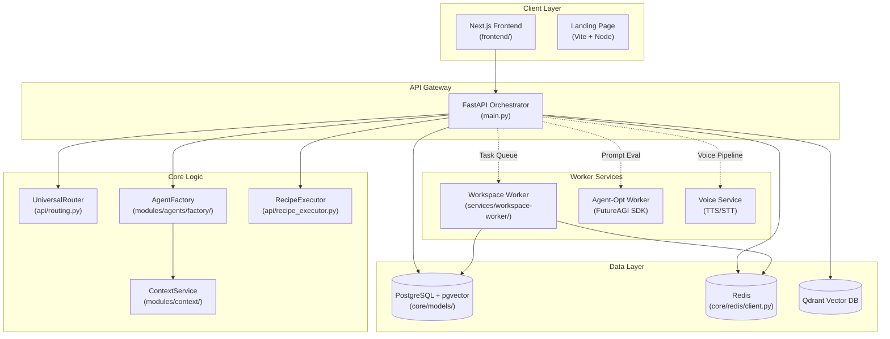
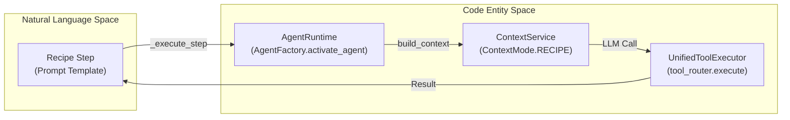

# System Architecture

Relevant source files

The following files were used as context for generating this wiki page:

- [README.md](README.md)
- [docker-compose.yml](docker-compose.yml)
- [docs/CONTRIBUTING.md](docs/CONTRIBUTING.md)
- [docs/README.md](docs/README.md)
- [frontend/.dockerignore](frontend/.dockerignore)
- [frontend/Dockerfile](frontend/Dockerfile)
- [infrastructure/.env.example](infrastructure/.env.example)
- [infrastructure/docker-compose.core.yml](infrastructure/docker-compose.core.yml)
- [infrastructure/docker-compose.data.yml](infrastructure/docker-compose.data.yml)
- [infrastructure/docker-compose.landing.yml](infrastructure/docker-compose.landing.yml)
- [infrastructure/docker-compose.memory.yml](infrastructure/docker-compose.memory.yml)
- [infrastructure/docker-compose.monitoring.yml](infrastructure/docker-compose.monitoring.yml)
- [infrastructure/docker-compose.voice.yml](infrastructure/docker-compose.voice.yml)
- [infrastructure/docker-compose.yml](infrastructure/docker-compose.yml)
- [infrastructure/railway-manifest.json](infrastructure/railway-manifest.json)
- [orchestrator/Dockerfile](orchestrator/Dockerfile)
- [orchestrator/api/cloud_documents.py](orchestrator/api/cloud_documents.py)
- [orchestrator/core/redis/client.py](orchestrator/core/redis/client.py)
- [orchestrator/modules/tools/services/__init__.py](orchestrator/modules/tools/services/__init__.py)
- [orchestrator/requirements.txt](orchestrator/requirements.txt)

This document provides a technical overview of the Automatos AI platform architecture, covering the service topology, component interactions, data layer design, and the orchestration bridge between natural language goals and executable code entities.

## Purpose and Scope

Automatos AI is designed as an "operating system for AI agents." This page describes the structural organization of the platform, including:

- High-level system topology and service relationships.
- Core backend services and their responsibilities.
- Data layer architecture (PostgreSQL, Redis, S3, Qdrant).
- The Workflow and Recipe execution engines.
- Deployment and containerization strategy across multiple service groups.

For configuration details, see [Configuration Guide](). For API endpoint documentation, see the respective API reference sections.

---

## High-Level System Topology

The system follows a multi-tier architecture centered around a FastAPI orchestrator that manages communication between the user interface, persistent storage, and specialized worker services. In production, this topology expands into 19 distinct services across 6 functional groups.

Title: Platform Service Topology

**Sources**: [orchestrator/main.py:1-156](), [docker-compose.yml:1-217](), [README.md:110-121](), [infrastructure/railway-manifest.json:14-44]()

---

## Backend Application (FastAPI)

The backend is a single FastAPI application that acts as the central hub. It is initialized in `orchestrator/main.py` and uses a modular router structure to handle different domain logic.

### Application Lifecycle
The `lifespan` context manager in `main.py` handles the following:
1. **Database Initialization**: Runs `init_database` and sets up SQLAlchemy sessions [orchestrator/main.py:32-34]().
2. **Modular Routing**: Includes over 50 specialized routers covering agents, workflows, marketplace, and system settings [orchestrator/main.py:36-156]().
3. **CORS & Middleware**: Configures `CORSMiddleware` to allow frontend communication and `get_request_context_hybrid` for Clerk/API Key authentication [orchestrator/main.py:14-17]().

### Core Models and Schemas
The data layer is defined using SQLAlchemy models in `core/models/`.

| Class Name | Table Name | Purpose |
|:---|:---|:---|
| `Agent` | `agents` | Core agent configuration, persona, and skills [orchestrator/api/recipe_executor.py:35](). |
| `WorkflowTemplate` | `workflow_templates` | Blueprint for multi-agent recipes [orchestrator/api/workflow_recipes.py:25](). |
| `RecipeExecution` | `recipe_executions` | Tracking instance for a running recipe [orchestrator/api/recipe_executor.py:36](). |
| `TriggerSubscription` | `trigger_subscriptions` | Webhook and Composio trigger mappings [orchestrator/api/workflow_recipes.py:28](). |

**Sources**: [orchestrator/main.py:1-156](), [orchestrator/api/recipe_executor.py:21-38](), [orchestrator/api/workflow_recipes.py:1-31]()

---

## Bridge: Recipe to Execution

The system translates high-level "Recipes" (blueprints) into sequential agent executions. This bridges the "Natural Language Space" (instructions) to "Code Entity Space" (LLM managers and tool routers).

Title: Recipe Execution Flow

**Implementation Details**:
- **`AgentFactory.activate_agent`**: Hydrates an agent's configuration and prepares its specific LLM provider [orchestrator/api/recipe_executor.py:118-125]().
- **`ContextService(RECIPE)`**: Builds the system prompt using `RECIPE` mode, which injects `recipe_step_dict` containing instructions and previous step outputs [orchestrator/api/recipe_executor.py:143-149]().
- **`RecipeScratchpad`**: Replaces verbose text dumps with a structured inter-step memory, reducing token usage by up to 90% [orchestrator/api/recipe_executor.py:15-19]().

**Sources**: [orchestrator/api/recipe_executor.py:66-163](), [orchestrator/api/workflows.py:40-71]()

---

## Workflow Orchestration Architecture

Workflows utilize a multi-stage tracking system that supports both legacy pipelines and dynamic phases.

### WorkflowStageTracker
The `WorkflowStageTracker` manages execution state and emits real-time updates via SSE (Server-Sent Events) [orchestrator/api/workflows.py:40-42]().

- **Legacy 9-Stage Pipeline**: Includes Task Decomposition, Agent Selection, Context Engineering, etc. [orchestrator/api/workflows.py:44-54]().
- **PRD-59 Dynamic Phases**: Groups stages into five major phases: `PLAN`, `PREPARE`, `EXECUTE`, `EVALUATE`, and `LEARN` [orchestrator/api/workflows.py:65-71]().

**Sources**: [orchestrator/api/workflows.py:40-110](), [frontend/components/workflows/execution-kitchen.tsx:74-84]()

---

## Infrastructure and Deployment

The platform is containerized using Docker and orchestrated via a modular Docker Compose strategy.

### Service Definition
| Service Group | Role | Primary Technology |
|:---|:---|:---|
| `core` | API, Frontend, Workers | FastAPI, Next.js, Python [infrastructure/docker-compose.core.yml:14-167]() |
| `data` | Persistent Storage | PostgreSQL 18, Redis 8.2, Qdrant [infrastructure/docker-compose.data.yml:13-98]() |
| `voice` | Audio Processing | TTS (Chatterbox), STT (Whisper) [infrastructure/docker-compose.voice.yml:12-85]() |
| `monitoring` | Observability | Prometheus, Grafana, Loki [infrastructure/docker-compose.monitoring.yml:16-183]() |

### Security and Sandboxing
- **Workspace Isolation**: Agents execute code in physical workspace directories managed by `agent-workspace-worker`. The `backend` mounts these directories as read-only for the Code Viewer widget [docker-compose.yml:129-130](), [infrastructure/railway-manifest.json:123-144]().
- **Redis Hardening**: Dangerous commands like `FLUSHALL` and `FLUSHDB` are renamed to empty strings to prevent accidental data loss [docker-compose.yml:59-60]().
- **Non-Root Users**: Both backend and frontend containers run as non-privileged users (`automatos` and `nextjs`) to ensure host security [orchestrator/Dockerfile:112-113](), [frontend/Dockerfile:93-94]().

**Sources**: [docker-compose.yml:1-217](), [orchestrator/Dockerfile:1-130](), [frontend/Dockerfile:1-115](), [infrastructure/railway-manifest.json:1-44]()

---