# System Architecture

<details>
<summary>Relevant source files</summary>

The following files were used as context for generating this wiki page:

- [docker-compose.yml](docker-compose.yml)
- [frontend/.dockerignore](frontend/.dockerignore)
- [frontend/Dockerfile](frontend/Dockerfile)
- [frontend/app/admin/plugins/page.tsx](frontend/app/admin/plugins/page.tsx)
- [frontend/lib/api-client.ts](frontend/lib/api-client.ts)
- [orchestrator/.env.example](orchestrator/.env.example)
- [orchestrator/Dockerfile](orchestrator/Dockerfile)
- [orchestrator/api/agent_plugins.py](orchestrator/api/agent_plugins.py)
- [orchestrator/config.py](orchestrator/config.py)
- [orchestrator/core/database/load_seed_data.py](orchestrator/core/database/load_seed_data.py)
- [orchestrator/core/redis/client.py](orchestrator/core/redis/client.py)
- [orchestrator/core/seeds/seed_personas.py](orchestrator/core/seeds/seed_personas.py)
- [orchestrator/core/seeds/seed_plugin_categories.py](orchestrator/core/seeds/seed_plugin_categories.py)
- [orchestrator/core/services/plugin_cache.py](orchestrator/core/services/plugin_cache.py)
- [orchestrator/main.py](orchestrator/main.py)
- [orchestrator/requirements.txt](orchestrator/requirements.txt)
- [scripts/ralph/prd.json](scripts/ralph/prd.json)

</details>


## Purpose and Scope

This document explains the three-tier architecture of Automatos AI and how the major components interact to provide multi-agent orchestration capabilities. It covers:

- High-level architectural layers (frontend, orchestrator, data)
- Core services and their responsibilities
- Request flow patterns and routing mechanisms
- Multi-tenancy isolation strategy
- Containerization and deployment structure

For terminology and definitions (agents, workflows, plugins, etc.), see [Key Concepts](#1.1). For detailed configuration options, see [Configuration Guide](#2.2). For deployment specifics, see [Docker Compose Setup](#15.2).

---

## Architectural Overview

Automatos AI follows a **layered architecture** with clear separation between client, orchestrator, workers, and data:

### System Architecture Diagram

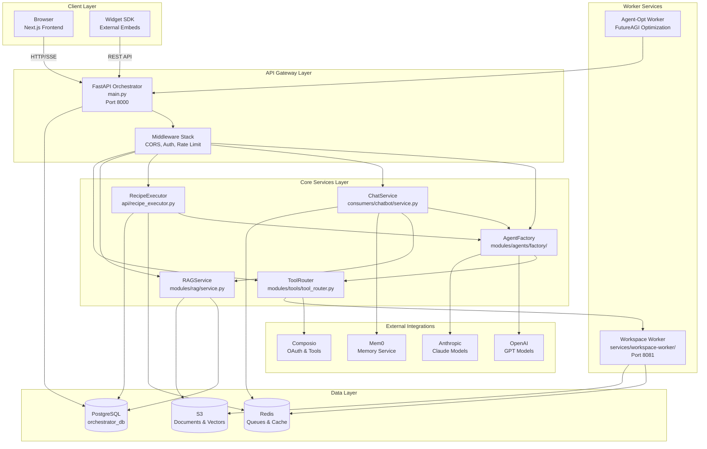

**Key architectural patterns**:

- **Orchestrator never imports heavy SDKs**: The FastAPI backend delegates to workers via HTTP/Redis for isolated execution (workspace operations, agent-opt FutureAGI)
- **Three-tier data partitioning**: PostgreSQL for metadata/state, Redis for ephemeral queues/cache, S3 for large blobs
- **Service isolation**: Workers run in separate containers with their own dependency trees
- **Streaming responses**: Chat and workflow execution use Server-Sent Events (SSE) for real-time updates

**Sources**: [orchestrator/main.py:1-1341](), [docker-compose.yml:1-282](), [services/workspace-worker/]()

---

## Technology Stack

| Layer | Technology | Purpose |
|-------|-----------|---------|
| **Frontend** | Next.js 14 (App Router) | React-based UI with SSR |
| | TypeScript | Type-safe client code |
| | React Query | State management and caching |
| | Clerk | Authentication provider |
| **Backend** | FastAPI | Async Python web framework |
| | Uvicorn | ASGI server |
| | SQLAlchemy 2.0 | ORM with async support |
| | Pydantic 2.x | Data validation |
| **Data** | PostgreSQL 16 + pgvector | Primary database with vector support |
| | Redis 7 | Caching and pub/sub |
| | AWS S3 | Object storage for plugins and logs |
| **ML/AI** | OpenAI SDK | GPT models |
| | Anthropic SDK | Claude models |
| | Composio SDK | Tool integration framework |
| | LangChain | LLM orchestration utilities |
| **Deployment** | Docker + Docker Compose | Containerization |
| | Railway | Production hosting |

**Sources**: [orchestrator/requirements.txt:1-112](), [frontend/package.json](), [docker-compose.yml:1-218]()

---

## Client Layer (Frontend)

### Next.js Application Structure

The frontend uses **Next.js 14 App Router** with a component-based architecture:

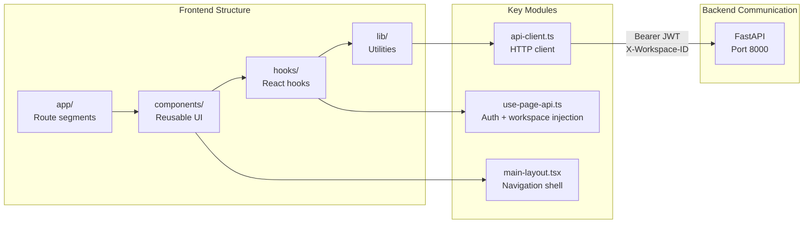

**Sources**: [frontend/Dockerfile:1-119](), [frontend/lib/api-client.ts:1-820]()

### API Client Architecture

The `ApiClient` class ([frontend/lib/api-client.ts:93-817]()) provides:

- **Workspace-aware requests**: Injects `X-Workspace-ID` header from localStorage or admin override
- **Clerk JWT authentication**: Obtains JWT token via `getClerkToken()` callback
- **Hybrid auth support**: Falls back gracefully if Clerk token unavailable
- **Admin workspace override**: Module-level `_adminWorkspaceOverride` for platform-wide queries

Key methods:

```typescript
async request<T>(endpoint: string, options: RequestInit): Promise<T>
getAuthHeaders(): Promise<Record<string, string>>
setCurrentPage(pageName: string): void
```

**Sources**: [frontend/lib/api-client.ts:93-817]()

---

## Application Layer (Orchestrator)

### Request Processing Pipeline

Every API request flows through a standardized pipeline before reaching business logic:

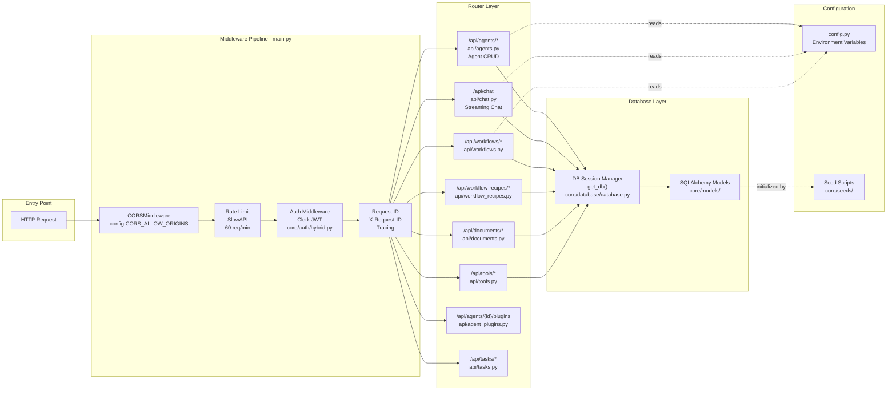

**Middleware responsibilities** ([orchestrator/main.py:560-597]()):

1. **CORSMiddleware**: Validates origins from `config.CORS_ALLOW_ORIGINS`, exposes routing headers (`X-Routing-Agent-ID`, `X-Routing-Confidence`)
2. **Rate Limiting**: Enforces `60/minute` per IP using `SlowAPI`, respects `X-Forwarded-For` for proxy awareness
3. **Authentication**: Validates Clerk JWT via `get_request_context_hybrid()`, injects workspace context
4. **Request ID**: Generates or forwards `X-Request-ID` for distributed tracing

**Router organization** ([orchestrator/main.py:691-799]()):

All routers are mounted with path prefixes (`/api/agents`, `/api/chat`, etc.) and depend on `get_db()` session factory. The `config.py` singleton provides centralized access to environment variables, and seed scripts ensure baseline data exists on startup.

**Sources**: [orchestrator/main.py:560-642](), [orchestrator/config.py:1-423]()

### Configuration Management

The `Config` class ([orchestrator/config.py:28-303]()) centralizes all environment variables:

| Category | Variables | Usage |
|----------|-----------|-------|
| **Database** | `POSTGRES_HOST`, `POSTGRES_PORT`, `POSTGRES_DB`, `POSTGRES_USER`, `POSTGRES_PASSWORD`, `DATABASE_URL` | PostgreSQL connection |
| **Redis** | `REDIS_HOST`, `REDIS_PORT`, `REDIS_PASSWORD`, `REDIS_URL` | Caching and pub/sub |
| **Security** | `API_KEY`, `REQUIRE_API_KEY`, `CLERK_SECRET_KEY`, `CLERK_JWKS_URL` | Authentication |
| **LLM** | `OPENAI_API_KEY`, `ANTHROPIC_API_KEY`, `LLM_PROVIDER`, `LLM_MODEL` | AI model access |
| **AWS** | `AWS_ACCESS_KEY_ID`, `AWS_SECRET_ACCESS_KEY`, `AWS_REGION`, `MARKETPLACE_S3_BUCKET` | S3 storage |
| **Routing** | `ROUTING_CACHE_TTL_HOURS`, `ROUTING_LLM_CONFIDENCE_THRESHOLD` | Universal Router |
| **Features** | `HEARTBEAT_ENABLED`, `CHANNELS_ENABLED`, `S3_VECTORS_ENABLED` | Feature flags |

**Property-based dynamic config**:

```python
@property
def LLM_PROVIDER(self) -> str:
    """Get LLM provider from system settings (database) or environment"""
    try:
        from core.llm.manager import get_system_setting
        return get_system_setting("orchestrator_llm", "provider", os.getenv("LLM_PROVIDER"))
    except Exception:
        return os.getenv("LLM_PROVIDER")
```

This allows database-level configuration overrides without redeployment.

**Sources**: [orchestrator/config.py:28-303]()

### Core Service Architecture

The orchestrator delegates to specialized services for agent management, routing, tool execution, and workflow orchestration:

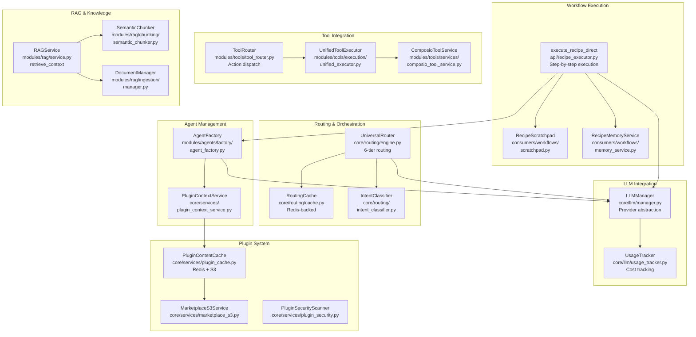

**Key design patterns**:

- **AgentFactory**: Creates agent runtime instances with 6-level credential fallback strategy ([modules/agents/factory/agent_factory.py:200-650]())
- **UniversalRouter**: 6-tier routing cascade (user override → cache → rules → triggers → intent → LLM) ([core/routing/engine.py:57-541]())
- **RecipeScratchpad**: Redis-backed context storage achieving 80-90% token savings over verbose text dumps ([consumers/workflows/scratchpad.py]())
- **ToolRouter**: Validates actions at selection time (capability filtering) and execution time (intent verification) ([modules/tools/tool_router.py:1-575]())

**Sources**: [orchestrator/core/routing/engine.py:1-541](), [orchestrator/modules/agents/factory/agent_factory.py:1-650](), [orchestrator/api/recipe_executor.py:1-900]()

---

## Data Layer

### PostgreSQL Database

The primary data store uses **PostgreSQL 16 with pgvector extension** for both structured data and vector embeddings.

**Schema initialization** ([orchestrator/database/init_complete_schema.sql]()):

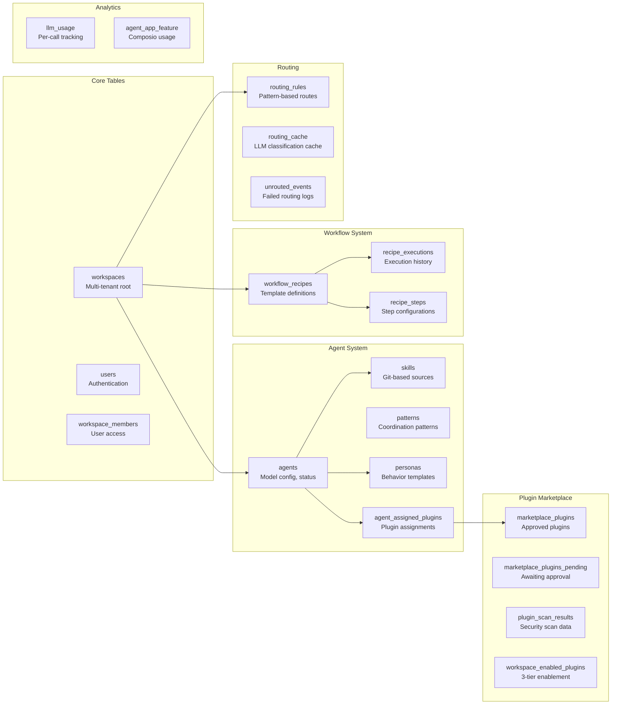

**Key design patterns**:

- **Multi-tenancy**: `workspace_id` UUID foreign key on all tenant-scoped tables
- **Soft deletes**: Most tables use `status` enum or `is_active` boolean
- **JSONB configuration**: `model_config`, `execution_config` allow flexible settings
- **Vector support**: `embedding` columns with pgvector type for RAG features

**Sources**: [orchestrator/database/init_complete_schema.sql](), [docker-compose.yml:22-43]()

### Redis Caching and Pub/Sub

Redis serves two primary roles:

#### 1. Caching Layer

The `RedisClient` class ([orchestrator/core/redis/client.py:14-199]()) provides connection pooling:

```python
class RedisClient:
    def __init__(self, host: str, port: int, password: Optional[str], db: int):
        self.pool = redis.ConnectionPool(
            host=host, port=port, password=password, db=db,
            decode_responses=True, max_connections=50
        )
```

**Cache use cases**:

| Service | Cache Keys | TTL | Purpose |
|---------|-----------|-----|---------|
| `PluginContentCache` | `plugin_content:{slug}:{version}` | 1 hour | S3 plugin files |
| `RoutingCache` | `routing:{workspace}:{content_hash}` | 24 hours | LLM routing decisions |
| `RecipeScratchpad` | `scratchpad:{execution_id}` | 1 hour | Step-by-step context |
| `PromptRegistry` | `prompt:{slug}` | 60 seconds | System prompts |

#### 2. Real-Time Updates

The `publish()` method ([orchestrator/core/redis/client.py:66-89]()) broadcasts events:

```python
def publish(self, channel: str, message: Dict[str, Any]) -> bool:
    message_str = json.dumps(message)
    redis_client.publish(channel, message_str)
```

**Pub/Sub channels**:

- `workflow:{workflow_id}:execution:{execution_id}` - Workflow step progress
- `agent:{agent_id}:chat:{session_id}` - Chat streaming (deprecated, now uses SSE)

**Sources**: [orchestrator/core/redis/client.py:1-199](), [orchestrator/core/services/plugin_cache.py:1-263]()

### AWS S3 Storage

S3 buckets store large/infrequently accessed data:

| Bucket | Content | Access Pattern |
|--------|---------|---------------|
| `automatos-marketplace` | Plugin ZIP files, extracted content | Read-heavy with cache layer |
| `automatos-ai` | Recipe execution logs (full detail) | Write-once, lazy-load via pre-signed URLs |
| Workspace-specific buckets | Document vectors (PRD-42) | Per-workspace isolation |

The `MarketplaceS3Service` ([orchestrator/core/services/marketplace_s3.py]()) handles:

- Plugin upload/download
- Directory listing
- Pre-signed URL generation
- Atomic file operations

**Sources**: [orchestrator/config.py:159-194]()

---

## Request Flow and Authentication

### Hybrid Authentication System

The platform supports **two authentication methods**:

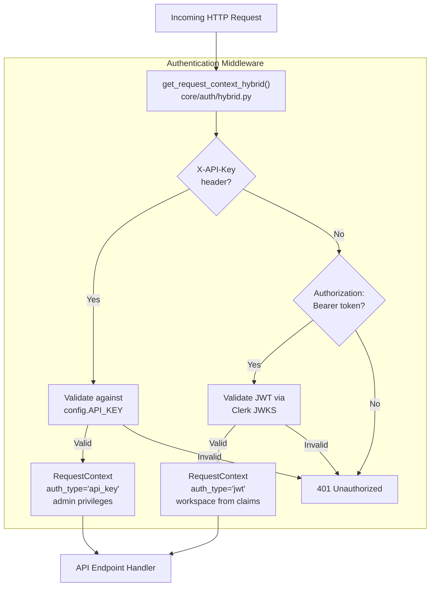

**RequestContext** ([orchestrator/core/auth/dependencies.py]()):

```python
@dataclass
class RequestContext:
    workspace_id: UUID
    user: Optional[User]
    auth_type: Literal["jwt", "api_key"]
    admin_all_workspaces: bool = False  # Admin override flag
```

**Sources**: [orchestrator/core/auth/hybrid.py](), [frontend/lib/api-client.ts:819-877]()

### Workspace Resolution Flow

The `X-Workspace-ID` header controls multi-tenant isolation:

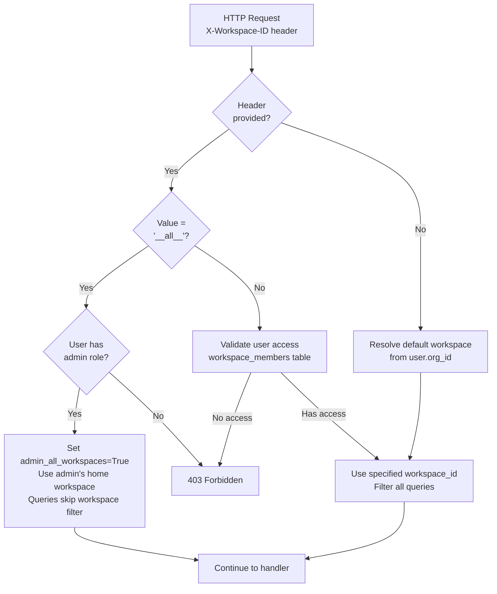

**Database query filtering** (automatic via SQLAlchemy filters):

```python
# Normal user queries
agents = db.query(Agent).filter(Agent.workspace_id == ctx.workspace_id).all()

# Admin override queries (no workspace filter)
if ctx.admin_all_workspaces:
    agents = db.query(Agent).all()  # Platform-wide
```

**Sources**: [orchestrator/core/auth/workspace_resolution.py](), [frontend/lib/api-client.ts:80-92]()

### Universal Router (Tiered Request Classification)

The `UniversalRouter` ([orchestrator/core/routing/engine.py:57-541]()) routes incoming requests through a **4-tier cascade**:

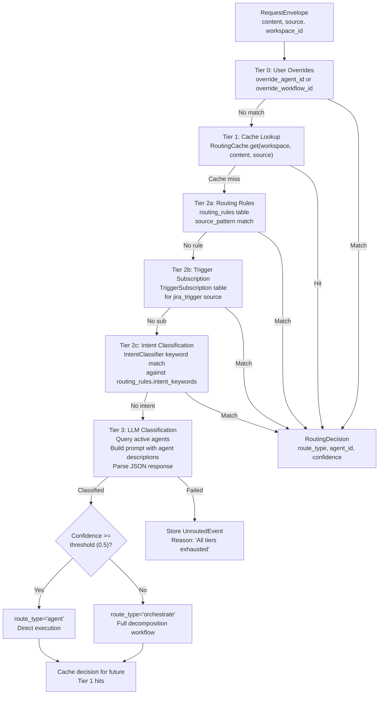

**Tier implementations**:

- **Tier 0** ([orchestrator/core/routing/engine.py:150-165]()): Immediate return if override present
- **Tier 1** ([orchestrator/core/routing/engine.py:171-177]()): Redis cache lookup (`routing:{workspace}:{hash}`)
- **Tier 2a** ([orchestrator/core/routing/engine.py:182-214]()): Database query on `routing_rules` with `source_pattern`
- **Tier 2b** ([orchestrator/core/routing/engine.py:220-278]()): Composio trigger subscriptions
- **Tier 2c** ([orchestrator/core/routing/engine.py:284-326]()): Keyword-based intent matching
- **Tier 3** ([orchestrator/core/routing/engine.py:332-433]()): LLM classification with agent descriptions

**Cost optimization**: Cache hit rate (Tier 1) typically 60-80%, avoiding repeated LLM calls.

**Sources**: [orchestrator/core/routing/engine.py:1-541]()

---

## Tool Integration Architecture

The tool system integrates 880+ Composio applications with 12k+ actions through a multi-tier architecture:

### Tool Discovery and Execution

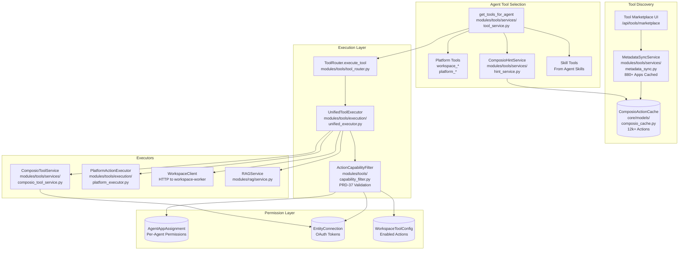

**Metadata caching** ([modules/tools/services/metadata_sync.py]()):

The `MetadataSyncService` periodically syncs Composio metadata into local cache tables, eliminating 48+ API calls per marketplace page load. The cache stores app metadata, action schemas, and trigger definitions in the `composio_app_cache` and `composio_action_cache` tables.

**Action capability filtering** ([modules/tools/capability_filter.py]()):

The `ActionCapabilityFilter` provides defense-in-depth validation:
- **Selection time**: Filters actions based on intent capabilities defined in agent configuration
- **Execution time**: Validates again to prevent capability drift between selection and execution

**Permission enforcement**:

Three tables control access ([core/models/composio_cache.py]()):
- `AgentAppAssignment`: Which agents can use which apps
- `EntityConnection`: Workspace OAuth tokens for external services
- `WorkspaceToolConfig`: Which actions are enabled per workspace

**Sources**: [orchestrator/modules/tools/tool_router.py:1-575](), [orchestrator/modules/tools/execution/unified_executor.py:1-800](), [orchestrator/modules/tools/services/composio_tool_service.py:1-360]()

## Plugin System Architecture

The plugin marketplace uses a **three-tier enablement model** with security scanning:

### Plugin Approval and Enablement Flow

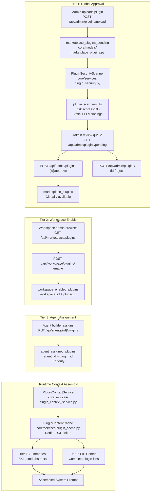

**Security scanning** ([core/services/plugin_security.py]()):

1. **Static analysis**: Pattern matching for dangerous code (`eval`, `exec`, `os.system`, file operations)
2. **LLM review**: Claude Haiku analyzes code structure and flags risks
3. **Risk scoring**: 0-100 scale (< 20 = safe, 20-69 = review, >= 70 = blocked)
4. **Admin verdict**: Approve, reject, or manual review required

**Content caching** ([core/services/plugin_cache.py:119-159]()):

```python
async def get_plugin_content(self, slug: str, version: str) -> Dict[str, str]:
    cache_key = f"{self.CONTENT_PREFIX}{slug}:{version}"
    
    # 1. Try Redis cache (1-hour TTL)
    cached = self._cache_get(cache_key)
    if cached:
        return json.loads(cached)
    
    # 2. Fetch from S3
    s3 = self._get_s3()
    file_keys = await s3.list_plugin_files(slug, version)
    files = {key: await s3.get_file(key) for key in file_keys}
    
    # 3. Populate cache
    self._cache_set(cache_key, json.dumps(files))
    
    return files
```

**Sources**: [orchestrator/api/agent_plugins.py:1-338](), [orchestrator/core/services/plugin_cache.py:1-263](), [frontend/app/admin/plugins/page.tsx:1-800]()

---

## Containerization and Deployment

### Docker Multi-Stage Builds

Both frontend and backend use **multi-stage Dockerfiles** for development/production separation:

#### Backend Dockerfile ([orchestrator/Dockerfile:1-121]()):

```dockerfile
# Stage 1: Base - Common dependencies
FROM python:3.11-slim as base
# Install system deps + Python packages
RUN apt-get update && apt-get install -y gcc g++ curl git postgresql-client
COPY requirements.txt .
RUN pip install --no-cache-dir -r requirements.txt && \
    pip install --no-cache-dir --no-deps futureagi==0.6.0

# Stage 2: Development - Hot reload
FROM base as development
COPY . .
CMD ["uvicorn", "main:app", "--host", "0.0.0.0", "--port", "8000", "--reload"]

# Stage 3: Production - Optimized
FROM base as production
COPY . .
RUN useradd -m -u 1000 automatos && chown -R automatos:automatos /app
USER automatos
CMD sh -c "uvicorn main:app --host 0.0.0.0 --port ${PORT:-8000} --workers 4"
```

**Key optimizations**:

- **Layer caching**: Dependencies installed before source code copy
- **Non-root user**: Production stage runs as `automatos` user (UID 1000)
- **Health checks**: `/health` endpoint polled every 30s
- **Graceful shutdown**: `SIGTERM` handling for zero-downtime deploys

#### Frontend Dockerfile ([frontend/Dockerfile:1-119]()):

```dockerfile
# Stage 1: Base - Dependencies
FROM node:20-alpine as base
COPY package*.json ./
# No RUN npm install here - deferred to later stages

# Stage 2: Development - Hot reload
FROM base as development
RUN npm install --legacy-peer-deps
COPY . .
CMD ["npm", "run", "dev"]

# Stage 3: Builder - Production build
FROM base as builder
RUN npm install --legacy-peer-deps
COPY . .
RUN npm run build

# Stage 4: Production - Minimal runtime
FROM node:20-alpine as production
RUN npm ci --legacy-peer-deps --only=production
COPY --from=builder /app/.next ./.next
CMD ["npm", "start"]
```

**Build-time env injection**:

```dockerfile
ARG NEXT_PUBLIC_API_URL
ENV NEXT_PUBLIC_API_URL=${NEXT_PUBLIC_API_URL}
```

`NEXT_PUBLIC_*` variables are **baked into the client bundle** during `npm run build`.

**Sources**: [orchestrator/Dockerfile:1-121](), [frontend/Dockerfile:1-119]()

### Docker Compose Orchestration

The `docker-compose.yml` ([docker-compose.yml:1-282]()) defines a **multi-service stack** with profiles:

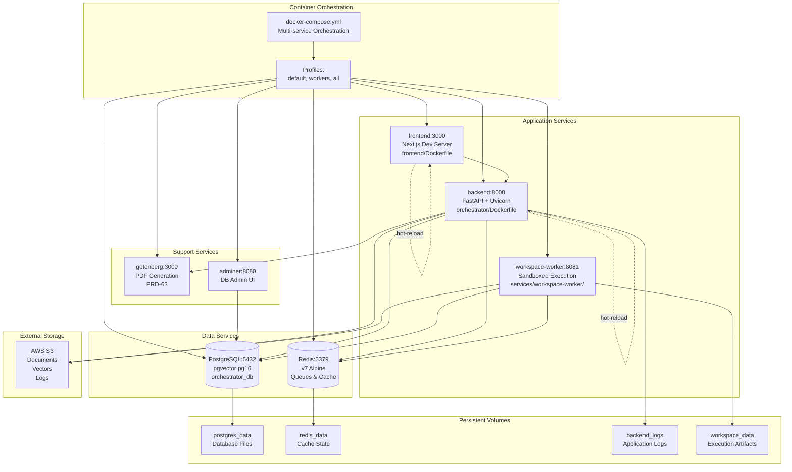

**Profile-based deployment** ([docker-compose.yml:17-254]()):

- **default**: Core services (postgres, redis, backend, frontend)
- **workers**: Adds workspace-worker for sandboxed code execution
- **all**: Includes admin tools (adminer, gotenberg)

**Service health checks** ([docker-compose.yml:36-41](), [docker-compose.yml:67-71]()):

```yaml
postgres:
  healthcheck:
    test: ["CMD-SHELL", "pg_isready -U postgres"]
    interval: 10s
    timeout: 5s
    retries: 5

redis:
  healthcheck:
    test: ["CMD", "redis-cli", "--no-auth-warning", "-a", "${REDIS_PASSWORD}", "ping"]
    interval: 10s
    timeout: 3s
    retries: 5
```

**Data partitioning**:

- **Named volumes**: `postgres_data`, `workspace_data` for persistence
- **Anonymous volumes**: `node_modules`, `.next` for build artifacts
- **S3**: Large blobs (documents, vectors, execution logs)

The workspace-worker has both read-only (code viewer) and read-write (task execution) access to `workspace_data` volume.

**Sources**: [docker-compose.yml:1-282](), [orchestrator/Dockerfile:1-130](), [frontend/Dockerfile:1-115]()

---

## Cross-Cutting Concerns

### Rate Limiting

The `SlowAPI` middleware ([orchestrator/main.py:448-461]()) enforces **60 requests/minute per IP**:

```python
from slowapi import Limiter
from slowapi.util import get_remote_address

def _get_real_client_ip(request) -> str:
    """Extract real client IP, respecting X-Forwarded-For behind reverse proxy."""
    forwarded = request.headers.get("X-Forwarded-For")
    if forwarded:
        return forwarded.split(",")[0].strip()
    return get_remote_address(request)

limiter = Limiter(key_func=_get_real_client_ip, default_limits=["60/minute"])
app.state.limiter = limiter
```

**X-Forwarded-For awareness**: Works correctly behind Nginx/Cloudflare proxies.

**Sources**: [orchestrator/main.py:448-461]()

### Security Headers

The `add_security_headers` middleware ([orchestrator/main.py:464-474]()) applies:

| Header | Value | Purpose |
|--------|-------|---------|
| `X-Content-Type-Options` | `nosniff` | Prevent MIME type sniffing |
| `X-Frame-Options` | `DENY` | Prevent clickjacking |
| `Referrer-Policy` | `strict-origin-when-cross-origin` | Control referrer leakage |
| `Permissions-Policy` | `camera=(), microphone=(), geolocation=()` | Restrict browser features |
| `Content-Security-Policy` | `default-src 'none'; frame-ancestors 'none'` | XSS protection |
| `Strict-Transport-Security` | `max-age=63072000; includeSubDomains; preload` | HTTPS enforcement (prod only) |

**Sources**: [orchestrator/main.py:464-474]()

### Request ID Tracking

The `add_request_id_middleware` ([orchestrator/main.py:479-488]()) injects unique IDs:

```python
@app.middleware("http")
async def add_request_id_middleware(request, call_next):
    inbound = request.headers.get("X-Request-ID")
    token = set_request_id(inbound or uuid.uuid4().hex[:12])
    try:
        response = await call_next(request)
        response.headers["X-Request-ID"] = request_id_var.get()
        return response
    finally:
        clear_request_id(token)
```

**Context propagation**: The `request_id_var` is a `ContextVar` that flows through async call stacks, enabling correlated logging across services.

**Sources**: [orchestrator/main.py:479-488](), [orchestrator/core/utils/logging_adapter.py]()

### API Call Tracking

The `api_tracking_middleware` ([orchestrator/main.py:490-534]()) collects metrics:

```python
api_call_stats = defaultdict(lambda: {
    "call_count": 0,
    "total_time": 0,
    "avg_time": 0,
    "min_time": float('inf'),
    "max_time": 0,
    "recent_times": deque(maxlen=100),
    "error_count": 0,
    "last_called": None,
    "status_codes": defaultdict(int)
})
```

**Exposed via** `/api/health/endpoints` for monitoring dashboards.

**Memory safety**: Caps at 500 unique endpoints to prevent unbounded growth.

**Sources**: [orchestrator/main.py:182-193](), [orchestrator/main.py:490-534](), [orchestrator/main.py:731-813]()

---

## Seed Data and Bootstrap

### Database Initialization

The `init_complete_schema.sql` ([orchestrator/database/init_complete_schema.sql]()) runs on first startup via Docker entrypoint:

```yaml
postgres:
  volumes:
    - ./orchestrator/database/init_complete_schema.sql:/docker-entrypoint-initdb.d/01-schema.sql:ro
```

**Schema creation order**:

1. Core tables (workspaces, users, workspace_members)
2. Agent system (agents, skills, patterns, personas)
3. Plugin marketplace (marketplace_plugins, plugin_scan_results)
4. Workflow system (workflow_recipes, recipe_executions)
5. Routing tables (routing_rules, routing_cache, unrouted_events)
6. Analytics tables (llm_usage, agent_app_feature)

### Seed Data Loaders

The `load_seed_data.py` script ([orchestrator/core/database/load_seed_data.py:1-191]()) populates:

| Seed Module | Table | Count | Idempotency |
|-------------|-------|-------|-------------|
| `seed_credentials.json` | `credential_types` | ~20 types | `ON CONFLICT (name) DO NOTHING` |
| `seed_system_settings.py` | `system_settings` | ~15 settings | Upsert on `(category, key)` |
| `seed_models.py` | `models` | ~50 LLM models | Upsert on `model_id` |
| `seed_personas.py` ([orchestrator/core/seeds/seed_personas.py:1-257]()) | `personas` | 10 personas | Upsert on `slug` |
| `seed_plugin_categories.py` ([orchestrator/core/seeds/seed_plugin_categories.py:1-214]()) | `plugin_categories` | 18 categories | Upsert on `slug` |

**Predefined personas** ([orchestrator/core/seeds/seed_personas.py:19-204]()):

- **Engineering**: Senior Engineer, Code Reviewer, DevOps/SRE
- **Sales**: SDR, Account Executive, Customer Success Manager
- **Marketing**: Content Strategist, SEO Specialist
- **Support**: Technical Support Engineer, Customer Advocate

**Predefined categories** ([orchestrator/core/seeds/seed_plugin_categories.py:19-167]()):

- **Development**: Code Review, Testing, Documentation
- **DevOps**: Deployment, Monitoring, CI/CD
- **Marketing**: SEO, Content, Analytics
- **Sales**: Outreach, CRM, Prospecting
- **Support**: Ticketing, Knowledge Base
- **Data**: Analysis, Visualization, ETL
- **Security**: Scanning, Compliance, Audit

**Sources**: [orchestrator/core/database/load_seed_data.py:1-191](), [orchestrator/core/seeds/seed_personas.py:1-257](), [orchestrator/core/seeds/seed_plugin_categories.py:1-214]()

---

## Summary

The Automatos AI system architecture demonstrates:

- **Clear separation of concerns** across three tiers (client, application, data)
- **Multi-tenancy by design** with workspace-scoped queries and admin overrides
- **Hybrid authentication** supporting both user sessions (Clerk JWT) and programmatic access (API keys)
- **Tiered routing intelligence** that minimizes LLM costs through caching and rule-based classification
- **Plugin marketplace security** with multi-stage scanning and approval workflow
- **Redis-backed performance** for caching frequently accessed data and routing decisions
- **Docker-native deployment** with health checks, graceful shutdown, and environment-based configuration

For detailed subsystem documentation, see:
- [Agents](#3) - Agent lifecycle and configuration
- [Workflows & Recipes](#4) - Multi-agent orchestration
- [Plugins & Marketplace](#5) - Plugin system architecture
- [Universal Router](#9) - Intelligent request routing
- [Analytics & Monitoring](#10) - Usage tracking and cost analysis

---