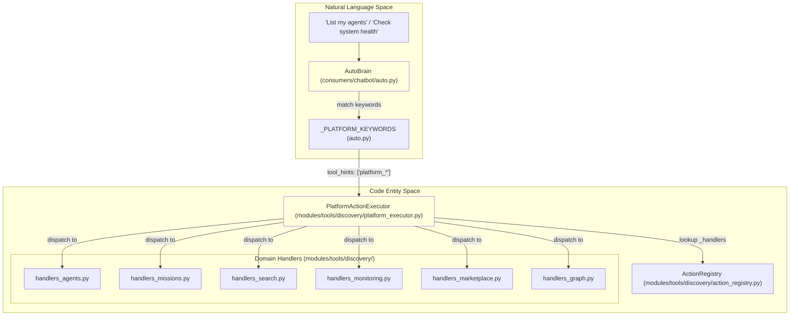
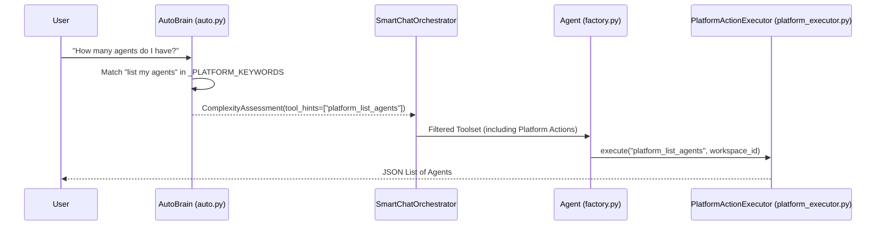

# Platform Actions

Relevant source files

The following files were used as context for generating this wiki page:

- [orchestrator/api/chat.py](orchestrator/api/chat.py)
- [orchestrator/api/routing.py](orchestrator/api/routing.py)
- [orchestrator/consumers/chatbot/auto.py](orchestrator/consumers/chatbot/auto.py)
- [orchestrator/consumers/chatbot/service.py](orchestrator/consumers/chatbot/service.py)
- [orchestrator/consumers/chatbot/tool_router.py](orchestrator/consumers/chatbot/tool_router.py)
- [orchestrator/core/llm/manager.py](orchestrator/core/llm/manager.py)
- [orchestrator/core/routing/engine.py](orchestrator/core/routing/engine.py)
- [orchestrator/modules/agents/factory/agent_factory.py](orchestrator/modules/agents/factory/agent_factory.py)
- [orchestrator/modules/context/sections/platform_actions.py](orchestrator/modules/context/sections/platform_actions.py)
- [orchestrator/modules/context/sections/tools.py](orchestrator/modules/context/sections/tools.py)
- [orchestrator/modules/tools/discovery/action_registry.py](orchestrator/modules/tools/discovery/action_registry.py)
- [orchestrator/modules/tools/discovery/action_semantic_index.py](orchestrator/modules/tools/discovery/action_semantic_index.py)
- [orchestrator/modules/tools/discovery/platform_actions.py](orchestrator/modules/tools/discovery/platform_actions.py)
- [orchestrator/modules/tools/discovery/platform_executor.py](orchestrator/modules/tools/discovery/platform_executor.py)
- [orchestrator/modules/tools/execution/unified_executor.py](orchestrator/modules/tools/execution/unified_executor.py)
- [orchestrator/modules/tools/registry/tool_registry.py](orchestrator/modules/tools/registry/tool_registry.py)
- [orchestrator/modules/tools/services/composio_hint_service.py](orchestrator/modules/tools/services/composio_hint_service.py)
- [orchestrator/modules/tools/services/composio_tool_service.py](orchestrator/modules/tools/services/composio_tool_service.py)
- [orchestrator/modules/tools/tool_router.py](orchestrator/modules/tools/tool_router.py)
- [orchestrator/scripts/setup_jira_trigger.py](orchestrator/scripts/setup_jira_trigger.py)
- [orchestrator/services/heartbeat_service.py](orchestrator/services/heartbeat_service.py)
- [orchestrator/services/page_context.py](orchestrator/services/page_context.py)
- [orchestrator/tests/test_action_registry_filtered.py](orchestrator/tests/test_action_registry_filtered.py)
- [orchestrator/tests/test_action_semantic_index.py](orchestrator/tests/test_action_semantic_index.py)
- [orchestrator/tests/test_platform_actions_section.py](orchestrator/tests/test_platform_actions_section.py)
- [orchestrator/tests/test_prd221_page_context.py](orchestrator/tests/test_prd221_page_context.py)
- [orchestrator/tests/test_prd221_page_prior_tools.py](orchestrator/tests/test_prd221_page_prior_tools.py)
- [orchestrator/tests/test_tool_router_semantic.py](orchestrator/tests/test_tool_router_semantic.py)

**Purpose:** Platform Actions are a curated set of 47+ self-management tools that allow agents to introspect and manage the Automatos platform itself. This page documents the action registry, executor, permission system, and integration with the routing and context layers.

**Scope:** This page covers the platform action definitions, execution engine, permission controls, rate limiting, and discovery mechanisms.

---

## Overview

Platform Actions enable agents to operate on workspace resources (agents, recipes, documents, tasks) directly through tool calls. Unlike external integrations that connect to third-party services via Composio, platform actions query and modify the Automatos database and internal services directly.

**Key characteristics:**
- **Self-awareness**: Agents can list other agents, inspect configurations, and understand workspace capabilities [orchestrator/modules/tools/discovery/platform_executor.py:20-28]().
- **Write operations**: Agents can create/update resources, such as creating agents, missions, or updating settings [orchestrator/modules/tools/discovery/platform_executor.py:205-215]().
- **Multi-tenant isolation**: All actions are strictly scoped to the requesting `workspace_id` passed to the executor [orchestrator/modules/tools/discovery/platform_executor.py:8-9]().
- **Domain-Specific Handlers**: Execution logic is decoupled into specialized handler modules (e.g., `handlers_agents.py`, `handlers_monitoring.py`, `handlers_missions.py`) [orchestrator/modules/tools/discovery/platform_executor.py:19-231]().

### Platform System Architecture
The following diagram bridges the Natural Language queries handled by `AutoBrain` to the specific code entities in the `PlatformActionExecutor`.

**Sources:** [orchestrator/consumers/chatbot/auto.py:121-176](), [orchestrator/modules/tools/discovery/platform_executor.py:19-246](), [orchestrator/modules/tools/discovery/platform_actions.py:53-96]()

---

## Platform Action System
The core system consists of an `ActionRegistry` that stores `ActionDefinition` objects, and a `PlatformActionExecutor` that routes calls to specific handler modules. Definitions include metadata for categorization, parameter schemas, and permission levels.

For details, see [Platform Action System](#13.1).

**Sources:** [orchestrator/modules/tools/discovery/platform_actions.py:12-51](), [orchestrator/modules/tools/discovery/platform_executor.py:5-9](), [orchestrator/modules/tools/discovery/action_registry.py:1-20]()

---

## Action Categories
The platform supports over 47 distinct actions categorized by domain. These range from simple read operations to complex infrastructure monitoring and graph analysis.

| Category | Key Code Handlers | Example Actions |
|----------|-------------------|-----------------|
| **Agents** | `handlers_agents.py` | `platform_list_agents`, `platform_create_agent` |
| **Missions** | `handlers_missions.py` | `platform_create_mission`, `platform_approve_mission` |
| **Search/Memory**| `handlers_search.py` | `platform_search_memory`, `platform_browse_memories` |
| **Monitoring** | `handlers_monitoring.py` | `platform_get_system_health`, `platform_query_loki_logs` |
| **Graph** | `handlers_graph.py` | `handle_query_graph`, `handle_graph_impact` |
| **Governance** | `handlers_governance.py` | `platform_check_budget`, `platform_validate_agent` |

For a complete breakdown of all actions, including "Promoted" actions like `platform_store_memory` that are frequently injected into agent context, see [Action Categories](#13.2).

**Sources:** [orchestrator/modules/tools/discovery/platform_executor.py:19-246](), [orchestrator/modules/tools/discovery/platform_actions.py:53-96]()

---

## Confirmation, Approvals & Rate Limiting
To prevent accidental destruction of resources or API abuse, the platform implements a tiered safety and permission system defined within each `ActionDefinition`.

- **Admin Enforcement**: Infrastructure tools (e.g., `platform_query_prometheus`, `platform_get_alerts`) are restricted to administrative roles [orchestrator/modules/tools/discovery/platform_executor.py:91-97]().
- **Permission Levels**: Actions are categorized as `read`, `write`, or `destructive` [orchestrator/modules/tools/discovery/action_registry.py:35]().
- **Confirmation**: Destructive actions (e.g., `platform_delete_agent`, `platform_cancel_mission`) explicitly require a user approval gate before execution [orchestrator/modules/tools/discovery/platform_executor.py:24-212]().

For details on the `PlatformActionExecutor` gatekeeper logic and the interaction between permission levels and UI confirmation dialogs, see [Confirmation, Approvals & Rate Limiting](#13.3).

**Sources:** [orchestrator/modules/tools/discovery/platform_executor.py:24-212](), [orchestrator/modules/tools/discovery/handlers_missions.py:204-215](), [orchestrator/modules/tools/discovery/action_registry.py:35]()

---

## Platform Actions Discovery
Discovery is the process by which `AutoBrain` determines if a user's natural language request should be handled by a platform action based on complexity and keyword heuristics.

### Discovery Flow
This diagram shows how `AutoBrain` detects intent via `_PLATFORM_KEYWORDS` and how the complexity assessment influences tool selection.

For an explanation of the 3-tier assessment (Cache, Heuristics, LLM) and how `tool_hints` injection ensures platform self-management capabilities are prioritized during relevant user queries, see [Platform Actions Discovery](#13.4).

**Sources:** [orchestrator/consumers/chatbot/auto.py:121-176](), [orchestrator/api/chat.py:19-25](), [orchestrator/consumers/chatbot/service.py:43-46]()

---

## Self-Management Harness
The platform includes a self-management harness, exposed via `harness_service` and a dedicated API. This harness allows for internal platform management, governance gates, power mode adjustments, and even the mutation of routing rules from within the product itself. This capability is crucial for autonomous operation and adaptive system behavior.

For more details on the `harness_service` and its functionalities, see [Self-Management Harness](#13.5).

**Sources:** [orchestrator/modules/tools/discovery/handlers_harness.py:92](), [orchestrator/modules/tools/discovery/handlers_routing.py:81](), [orchestrator/modules/tools/discovery/handlers_power.py:101]()

---