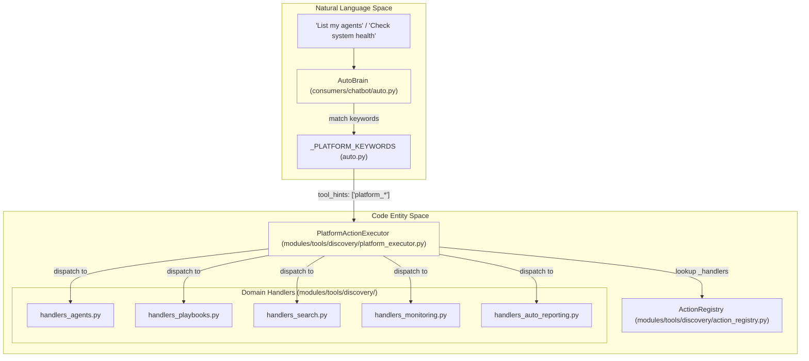
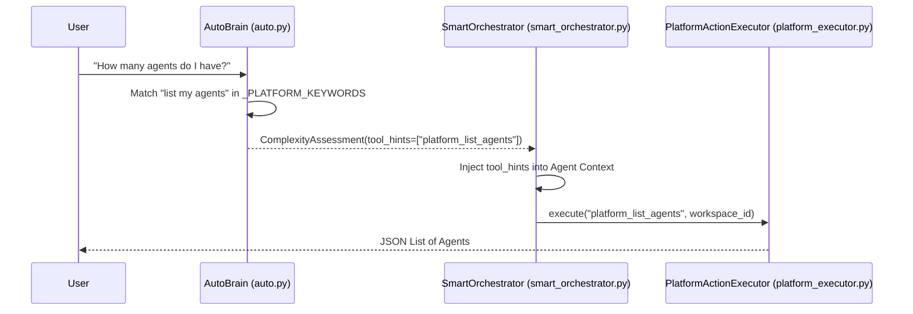

# Platform Actions

Relevant source files

The following files were used as context for generating this wiki page:

- [orchestrator/consumers/chatbot/auto.py](orchestrator/consumers/chatbot/auto.py)
- [orchestrator/core/security/rate_limiter.py](orchestrator/core/security/rate_limiter.py)
- [orchestrator/core/services/auto_reporting.py](orchestrator/core/services/auto_reporting.py)
- [orchestrator/core/services/notification_dispatcher.py](orchestrator/core/services/notification_dispatcher.py)
- [orchestrator/modules/tools/discovery/actions_auto_reporting.py](orchestrator/modules/tools/discovery/actions_auto_reporting.py)
- [orchestrator/modules/tools/discovery/handlers_auto_reporting.py](orchestrator/modules/tools/discovery/handlers_auto_reporting.py)
- [orchestrator/modules/tools/discovery/platform_actions.py](orchestrator/modules/tools/discovery/platform_actions.py)
- [orchestrator/modules/tools/discovery/platform_executor.py](orchestrator/modules/tools/discovery/platform_executor.py)
- [orchestrator/tests/test_prd128_notification_dispatcher.py](orchestrator/tests/test_prd128_notification_dispatcher.py)

**Purpose:** Platform Actions are a curated set of 47+ self-management tools that allow agents to introspect and manage the Automatos platform itself. This page documents the action registry, executor, permission system, and integration with the routing and context layers.

**Scope:** This page covers the platform action definitions, execution engine, permission controls, rate limiting, and discovery mechanisms.

---

## Overview

Platform Actions enable agents to operate on workspace resources (agents, recipes, documents, tasks) directly through tool calls. Unlike external integrations that connect to third-party services via Composio, platform actions query and modify the Automatos database and internal services directly.

**Key characteristics:**
- **Self-awareness**: Agents can list other agents, inspect configurations, and understand workspace capabilities [orchestrator/modules/tools/discovery/platform_executor.py:20-101]().
- **Write operations**: Agents can create/update resources, such as creating agents or updating recipes [orchestrator/modules/tools/discovery/platform_executor.py:22-40]().
- **Multi-tenant isolation**: All actions are strictly scoped to the requesting `workspace_id` passed to the executor [orchestrator/modules/tools/discovery/platform_executor.py:8-9]().
- **Domain-Specific Handlers**: Execution logic is decoupled into specialized handler modules (e.g., `handlers_agents.py`, `handlers_monitoring.py`, `handlers_auto_reporting.py`) [orchestrator/modules/tools/discovery/platform_executor.py:19-177]().

### Platform System Architecture
The following diagram bridges the Natural Language queries handled by `AutoBrain` to the specific code entities in the `PlatformActionExecutor`.

**Sources:** [orchestrator/consumers/chatbot/auto.py:116-180](), [orchestrator/modules/tools/discovery/platform_executor.py:19-177](), [orchestrator/modules/tools/discovery/platform_actions.py:38-66]()

---

## Platform Action System
The core system consists of an `ActionRegistry` that stores `ActionDefinition` objects, and a `PlatformActionExecutor` that routes calls to specific handler modules. Definitions include metadata for categorization, parameter schemas, and permission levels.

- **[Platform Action System](#13.1)**: Details on the registry architecture, `ActionDefinition` metadata (including `permission_level` and `requires_confirmation` flags), and the `PlatformActionExecutor` dispatch logic.
- **Hierarchy Permissions**: Mutating actions (e.g., `platform_update_agent`) are checked against a target-based hierarchy to ensure the actor has sufficient authority [orchestrator/modules/tools/discovery/platform_executor.py:209-225]().

**Sources:** [orchestrator/modules/tools/discovery/platform_actions.py:1-12](), [orchestrator/modules/tools/discovery/platform_executor.py:1-9](), [orchestrator/modules/tools/discovery/action_registry.py:1-20]()

---

## Action Categories
The platform supports over 47 distinct actions categorized by domain. These range from simple read operations to complex infrastructure monitoring and proactive notifications.

| Category | Key Code Handlers | Example Actions |
|----------|-------------------|-----------------|
| **Agents** | `handlers_agents.py` | `platform_list_agents`, `platform_create_agent` |
| **Recipes** | `handlers_playbooks.py` | `platform_execute_recipe`, `platform_update_playbook` |
| **Notifications**| `handlers_auto_reporting.py` | `platform_send_notification`, `platform_get_auto_reporting_prefs` |
| **Monitoring** | `handlers_monitoring.py` | `platform_get_system_health`, `platform_query_loki_logs` |
| **Marketplace** | `handlers_marketplace.py` | `platform_browse_marketplace_agents`, `platform_install_skill` |
| **Governance** | `handlers_governance.py` | `platform_check_budget`, `platform_validate_agent` |

- **[Action Categories](#13.2)**: A complete breakdown of all actions, including new proactive tools like `platform_send_notification` which interfaces with the `NotificationDispatcher` [orchestrator/modules/tools/discovery/actions_auto_reporting.py:95-154]().

**Sources:** [orchestrator/modules/tools/discovery/platform_executor.py:19-177](), [orchestrator/modules/tools/discovery/actions_auto_reporting.py:11-154](), [orchestrator/core/services/notification_dispatcher.py:87-111]()

---

## Confirmation & Rate Limiting
To prevent accidental destruction of resources or API abuse, the platform implements a tiered safety and permission system.

- **Rate Limiting**: Uses Redis sliding window counters. Standard `platform_write` operations are limited to 60 per minute per subject (agent) to prevent starvation of parallel tasks [orchestrator/core/security/rate_limiter.py:45-57]().
- **Permission Levels**: Actions are categorized as `read`, `write`, or `destructive`. Destructive actions like `platform_delete_agent` require explicit confirmation [orchestrator/modules/tools/discovery/platform_executor.py:212-225]().
- **Quiet Hours**: Proactive notifications via `platform_send_notification` respect workspace "quiet hours," funneling non-urgent traffic to in-app delivery only [orchestrator/core/services/auto_reporting.py:99-124]().

- **[Confirmation & Rate Limiting](#13.3)**: Details on the `PlatformActionExecutor` gatekeeper logic and the interaction between permission levels and UI confirmation dialogs.

**Sources:** [orchestrator/core/security/rate_limiter.py:72-127](), [orchestrator/core/services/auto_reporting.py:99-124](), [orchestrator/modules/tools/discovery/actions_auto_reporting.py:86-147]()

---

## Platform Actions Discovery
Discovery is the process by which `AutoBrain` determines if a user's natural language request should be handled by a platform action based on complexity and keyword heuristics.

### Discovery Flow
This diagram shows how `AutoBrain` detects intent via `_PLATFORM_KEYWORDS` and triggers the complexity assessment.

- **[Platform Actions Discovery](#13.4)**: Explanation of the 3-tier assessment (Cache, Heuristics, LLM) and how `_PLATFORM_KEYWORDS` maps common phrases to specific tool hints [orchestrator/consumers/chatbot/auto.py:14-22, 116-180]().

**Sources:** [orchestrator/consumers/chatbot/auto.py:116-180](), [orchestrator/modules/tools/discovery/platform_executor.py:179-181]()

---