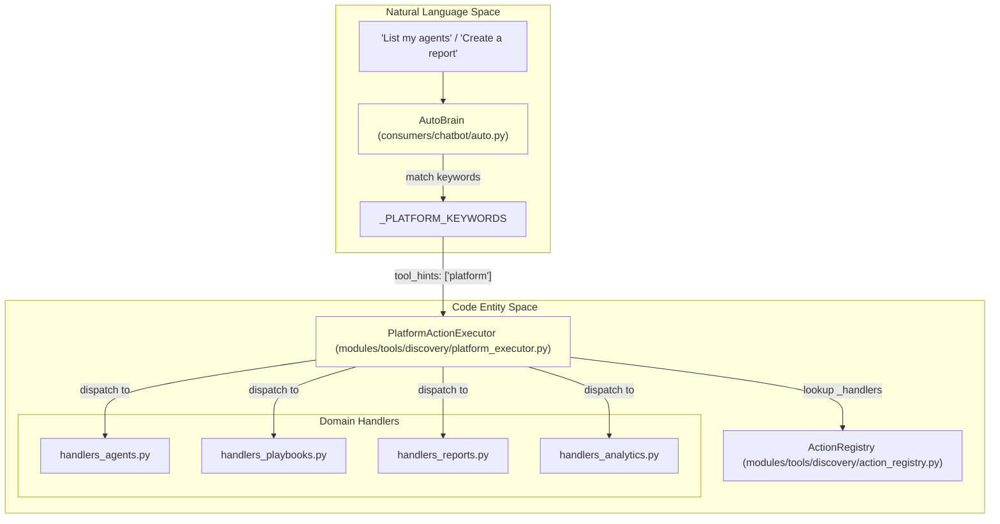
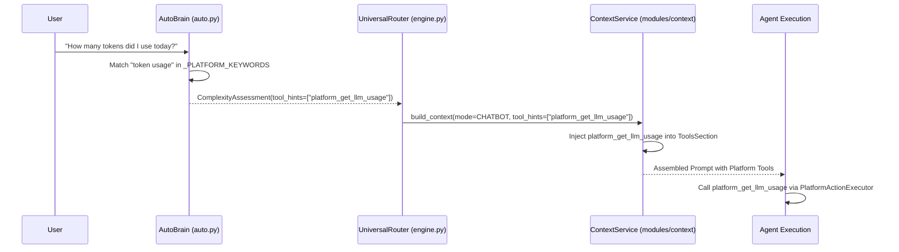

# Platform Actions

Relevant source files

The following files were used as context for generating this wiki page:

- [docs/reviews/COMPOSIO-TOOL-REGRESSION-REVIEW.md](docs/reviews/COMPOSIO-TOOL-REGRESSION-REVIEW.md)
- [orchestrator/api/chat.py](orchestrator/api/chat.py)
- [orchestrator/api/chat_voice.py](orchestrator/api/chat_voice.py)
- [orchestrator/consumers/chatbot/auto.py](orchestrator/consumers/chatbot/auto.py)
- [orchestrator/consumers/chatbot/intent_classifier.py](orchestrator/consumers/chatbot/intent_classifier.py)
- [orchestrator/consumers/chatbot/personality.py](orchestrator/consumers/chatbot/personality.py)
- [orchestrator/consumers/chatbot/service.py](orchestrator/consumers/chatbot/service.py)
- [orchestrator/consumers/chatbot/smart_tool_router.py](orchestrator/consumers/chatbot/smart_tool_router.py)
- [orchestrator/core/llm/manager.py](orchestrator/core/llm/manager.py)
- [orchestrator/core/routing/engine.py](orchestrator/core/routing/engine.py)
- [orchestrator/modules/orchestrator/service.py](orchestrator/modules/orchestrator/service.py)
- [orchestrator/modules/tools/discovery/actions_agents.py](orchestrator/modules/tools/discovery/actions_agents.py)
- [orchestrator/modules/tools/discovery/actions_analytics_enhanced.py](orchestrator/modules/tools/discovery/actions_analytics_enhanced.py)
- [orchestrator/modules/tools/discovery/actions_assignments.py](orchestrator/modules/tools/discovery/actions_assignments.py)
- [orchestrator/modules/tools/discovery/actions_documents.py](orchestrator/modules/tools/discovery/actions_documents.py)
- [orchestrator/modules/tools/discovery/actions_marketplace.py](orchestrator/modules/tools/discovery/actions_marketplace.py)
- [orchestrator/modules/tools/discovery/actions_missions.py](orchestrator/modules/tools/discovery/actions_missions.py)
- [orchestrator/modules/tools/discovery/actions_monitoring.py](orchestrator/modules/tools/discovery/actions_monitoring.py)
- [orchestrator/modules/tools/discovery/actions_playbooks.py](orchestrator/modules/tools/discovery/actions_playbooks.py)
- [orchestrator/modules/tools/discovery/actions_reports.py](orchestrator/modules/tools/discovery/actions_reports.py)
- [orchestrator/modules/tools/discovery/actions_scheduling.py](orchestrator/modules/tools/discovery/actions_scheduling.py)
- [orchestrator/modules/tools/discovery/actions_search.py](orchestrator/modules/tools/discovery/actions_search.py)
- [orchestrator/modules/tools/discovery/actions_workspace.py](orchestrator/modules/tools/discovery/actions_workspace.py)
- [orchestrator/modules/tools/discovery/handlers_agents.py](orchestrator/modules/tools/discovery/handlers_agents.py)
- [orchestrator/modules/tools/discovery/handlers_analytics_enhanced.py](orchestrator/modules/tools/discovery/handlers_analytics_enhanced.py)
- [orchestrator/modules/tools/discovery/handlers_reports.py](orchestrator/modules/tools/discovery/handlers_reports.py)
- [orchestrator/modules/tools/discovery/handlers_search.py](orchestrator/modules/tools/discovery/handlers_search.py)
- [orchestrator/modules/tools/discovery/platform_actions.py](orchestrator/modules/tools/discovery/platform_actions.py)
- [orchestrator/modules/tools/discovery/platform_executor.py](orchestrator/modules/tools/discovery/platform_executor.py)
- [orchestrator/modules/tools/tool_router.py](orchestrator/modules/tools/tool_router.py)

**Purpose:** Platform Actions are a curated set of 47+ self-management tools that allow agents to introspect and manage the Automatos platform itself. This page documents the action registry, executor, permission system, and integration with the routing and context layers.

**Scope:** This page covers the platform action definitions, execution engine, permission controls, rate limiting, and discovery mechanisms.

---

## Overview

Platform Actions enable agents to operate on workspace resources (agents, recipes, documents, tasks) directly through tool calls. Unlike external integrations that connect to third-party services via Composio, platform actions query and modify the Automatos database and internal services.

**Key characteristics:**
- **Self-awareness**: Agents can list other agents, inspect configurations, and understand workspace capabilities [orchestrator/modules/tools/discovery/platform_executor.py:175-184]().
- **Write operations**: Agents can create/update resources, such as creating agents or updating recipes [orchestrator/modules/tools/discovery/platform_executor.py:186-194]().
- **Multi-tenant isolation**: All actions are strictly scoped to the requesting `workspace_id` passed to the `PlatformActionExecutor` [orchestrator/modules/tools/discovery/platform_executor.py:170-172]().
- **Domain-Specific Handlers**: Execution logic is decoupled into specialized handler modules (e.g., `handlers_agents.py`, `handlers_reports.py`, `handlers_analytics.py`) [orchestrator/modules/tools/discovery/platform_executor.py:19-159]().

### Platform System Architecture
The following diagram bridges the Natural Language queries handled by `AutoBrain` to the specific code entities in the `PlatformActionExecutor`.

**Sources:** [orchestrator/consumers/chatbot/auto.py:5-22](), [orchestrator/modules/tools/discovery/platform_executor.py:173-225](), [orchestrator/modules/tools/discovery/platform_actions.py:36-57]()

---

## Platform Action System
The core system consists of an `ActionRegistry` that stores `ActionDefinition` objects, and a `PlatformActionExecutor` that routes calls to specific handler modules. All actions are registered via `register_all_actions()` which aggregates definitions from domain-specific modules [orchestrator/modules/tools/discovery/platform_actions.py:36-61]().

- **[Platform Action System](#13.1)**: Details on the registry architecture, definition schemas, and the thin dispatcher pattern used by the executor.

**Sources:** [orchestrator/modules/tools/discovery/platform_actions.py:1-10](), [orchestrator/modules/tools/discovery/platform_executor.py:1-9](), [orchestrator/modules/tools/discovery/platform_executor.py:164-173]()

---

## Action Categories
The platform supports over 47 distinct actions categorized by domain. These range from simple read operations to complex system management and governance.

| Category | Key Code Handlers | Example Actions |
|----------|-------------------|-----------------|
| **Agents** | `handlers_agents.py` | `platform_list_agents`, `platform_create_agent` |
| **Recipes** | `handlers_playbooks.py` | `platform_execute_recipe`, `platform_update_recipe` |
| **Analytics** | `handlers_analytics.py` | `platform_get_llm_usage`, `platform_workspace_stats` |
| **Reports** | `handlers_reports.py` | `platform_submit_report`, `platform_get_latest_report` |
| **Monitoring** | `handlers_monitoring.py` | `platform_get_system_health`, `platform_query_loki_logs` |
| **Marketplace** | `handlers_marketplace.py` | `platform_install_plugin`, `platform_browse_marketplace_skills` |
| **Search** | `handlers_search.py` | `platform_search_chat_history`, `platform_search_memory` |

- **[Action Categories](#13.2)**: A complete breakdown of all 47+ actions and their specific parameters.

**Sources:** [orchestrator/modules/tools/discovery/platform_executor.py:173-225](), [orchestrator/modules/tools/discovery/platform_actions.py:14-33](), [orchestrator/consumers/chatbot/auto.py:116-180]()

---

## Confirmation & Rate Limiting
To prevent accidental destruction of resources or API abuse, the platform implements a tiered safety system.

- **Permission Levels**: Actions are categorized to distinguish between simple `read` operations and more sensitive `write` or `destructive` operations.
- **User Confirmation**: The system can require explicit user confirmation for destructive actions before the `PlatformActionExecutor` proceeds with the handler call.
- **Rate Limiting**: The platform enforces a rate limit (typically 10/min per workspace) to prevent infinite tool loops, managed by the `ToolExecutionTracker` which monitors exact and semantic deduplication [orchestrator/consumers/chatbot/service.py:78-104]().

- **[Confirmation & Rate Limiting](#13.3)**: Details on how the system intercepts sensitive calls and enforces quotas.

**Sources:** [orchestrator/consumers/chatbot/service.py:114-139](), [orchestrator/modules/tools/discovery/platform_executor.py:164-168]()

---

## Platform Actions Discovery
Discovery is the process by which the system determines if a user's natural language request should be handled by a platform action.

### Discovery Flow
This diagram shows how `AutoBrain` detects intent via `_PLATFORM_KEYWORDS` and injects `tool_hints` to guide the agent toward using platform tools.

- **[Platform Actions Discovery](#13.4)**: Explanation of `_PLATFORM_KEYWORDS` matching [orchestrator/consumers/chatbot/auto.py:116-180](), `AutoBrain` complexity assessment [orchestrator/consumers/chatbot/auto.py:59-72](), and how `tool_hints` are used during context assembly.

**Sources:** [orchestrator/consumers/chatbot/auto.py:116-181](), [orchestrator/core/routing/engine.py:129-158](), [orchestrator/modules/tools/discovery/platform_executor.py:1-9]()

---