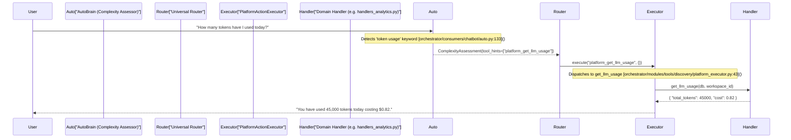

# Action Categories

Relevant source files

The following files were used as context for generating this wiki page:

- [frontend/components/command-center/__tests__/watchlist-tab.test.tsx](frontend/components/command-center/__tests__/watchlist-tab.test.tsx)
- [frontend/components/command-center/watchlist-tab.tsx](frontend/components/command-center/watchlist-tab.tsx)
- [frontend/hooks/use-watches-api.ts](frontend/hooks/use-watches-api.ts)
- [orchestrator/api/watches.py](orchestrator/api/watches.py)
- [orchestrator/api/widget_memory.py](orchestrator/api/widget_memory.py)
- [orchestrator/consumers/chatbot/empty_completion.py](orchestrator/consumers/chatbot/empty_completion.py)
- [orchestrator/core/services/mission_memory_service.py](orchestrator/core/services/mission_memory_service.py)
- [orchestrator/core/services/playbook_memory_service.py](orchestrator/core/services/playbook_memory_service.py)
- [orchestrator/modules/memory/injection_filter.py](orchestrator/modules/memory/injection_filter.py)
- [orchestrator/modules/memory/resume_context.py](orchestrator/modules/memory/resume_context.py)
- [orchestrator/modules/tools/discovery/actions_agents.py](orchestrator/modules/tools/discovery/actions_agents.py)
- [orchestrator/modules/tools/discovery/actions_board_tasks.py](orchestrator/modules/tools/discovery/actions_board_tasks.py)
- [orchestrator/modules/tools/discovery/actions_marketplace.py](orchestrator/modules/tools/discovery/actions_marketplace.py)
- [orchestrator/modules/tools/discovery/actions_missions.py](orchestrator/modules/tools/discovery/actions_missions.py)
- [orchestrator/modules/tools/discovery/actions_monitoring.py](orchestrator/modules/tools/discovery/actions_monitoring.py)
- [orchestrator/modules/tools/discovery/actions_playbooks.py](orchestrator/modules/tools/discovery/actions_playbooks.py)
- [orchestrator/modules/tools/discovery/actions_reports.py](orchestrator/modules/tools/discovery/actions_reports.py)
- [orchestrator/modules/tools/discovery/actions_watches.py](orchestrator/modules/tools/discovery/actions_watches.py)
- [orchestrator/modules/tools/discovery/actions_workspace.py](orchestrator/modules/tools/discovery/actions_workspace.py)
- [orchestrator/modules/tools/discovery/handlers_agents.py](orchestrator/modules/tools/discovery/handlers_agents.py)
- [orchestrator/modules/tools/discovery/handlers_board_tasks.py](orchestrator/modules/tools/discovery/handlers_board_tasks.py)
- [orchestrator/modules/tools/discovery/handlers_missions.py](orchestrator/modules/tools/discovery/handlers_missions.py)
- [orchestrator/modules/tools/discovery/handlers_monitoring.py](orchestrator/modules/tools/discovery/handlers_monitoring.py)
- [orchestrator/modules/tools/discovery/handlers_playbooks.py](orchestrator/modules/tools/discovery/handlers_playbooks.py)
- [orchestrator/modules/tools/discovery/handlers_reports.py](orchestrator/modules/tools/discovery/handlers_reports.py)
- [orchestrator/modules/tools/discovery/handlers_watches.py](orchestrator/modules/tools/discovery/handlers_watches.py)
- [orchestrator/modules/tools/discovery/handlers_workspace.py](orchestrator/modules/tools/discovery/handlers_workspace.py)
- [orchestrator/tests/test_board_task_handlers.py](orchestrator/tests/test_board_task_handlers.py)
- [orchestrator/tests/test_p2w1_playbook_write_dedup.py](orchestrator/tests/test_p2w1_playbook_write_dedup.py)
- [orchestrator/tests/test_prd206_resume_context.py](orchestrator/tests/test_prd206_resume_context.py)
- [orchestrator/tests/test_prd222_empty_completion.py](orchestrator/tests/test_prd222_empty_completion.py)
- [orchestrator/tests/test_prd222_unknown_model_error_names_the_way_out.py](orchestrator/tests/test_prd222_unknown_model_error_names_the_way_out.py)
- [orchestrator/tests/test_prd224_assign_lane.py](orchestrator/tests/test_prd224_assign_lane.py)

Platform actions in Automatos AI are organized into **13 distinct categories** that group 47+ self-management operations. These categories enable agents to introspect, query, configure, and control the platform itself, providing operational autonomy for tasks ranging from resource management to infrastructure monitoring.

For the overall platform action system architecture, see [Platform Action System](#13.1). For execution mechanics and permissions, see [Confirmation, Approvals & Rate Limiting](#13.3).

---

## Overview

Platform actions follow a structured taxonomy defined by three layers:
1.  **Permission Tiers**: `read`, `write`, and `destructive`. These control risk and determine if user confirmation is required [orchestrator/modules/tools/discovery/action_registry.py:15-18]().
2.  **Functional Categories**: Logical groupings such as `agents`, `memory`, `monitoring`, `missions`, and `analytics` [orchestrator/modules/tools/discovery/platform_actions.py:14-20]().
3.  **Individual Actions**: Discrete operations defined via `ActionDefinition` objects (e.g., `platform_query_loki_logs`, `platform_create_mission`) [orchestrator/modules/tools/discovery/platform_executor.py:94-205]().

This organization allows the **AutoBrain** complexity assessor to inject specific `tool_hints` when it detects platform-related keywords in natural language, such as "token usage" or "list my agents" [orchestrator/consumers/chatbot/auto.py:122-173]().

**Sources:** [orchestrator/modules/tools/discovery/platform_actions.py:1-53](), [orchestrator/modules/tools/discovery/platform_executor.py:1-110](), [orchestrator/consumers/chatbot/auto.py:1-173]().

---

## Category Taxonomy

The following diagram maps the logical categories to specific code-level action identifiers registered in the `ActionRegistry` and dispatched via `PlatformActionExecutor`.

### Platform Action Entity Map

```mermaid
graph TB
    subgraph "Agents"
        A1["platform_list_agents<br/>(handlers_agents:list_agents)"]
        A2["platform_get_agent<br/>(handlers_agents:get_agent)"]
        A3["platform_create_agent<br/>(handlers_agents:create_agent)"]
        A4["platform_recommend_agent<br/>(handlers_agents:recommend_agent)"]
    end
    
    subgraph "Board Tasks"
        BT1["platform_create_task<br/>(handlers_board_tasks:create_task)"]
        BT2["platform_list_tasks<br/>(handlers_board_tasks:list_tasks)"]
        BT3["platform_get_task<br/>(handlers_board_tasks:get_task)"]
        BT4["platform_update_task_status<br/>(handlers_board_tasks:update_task_status)"]
        BT5["platform_assign_task<br/>(handlers_board_tasks:assign_task)"]
        BT6["platform_board_summary<br/>(handlers_board_tasks:board_summary)"]
    end

    subgraph "Playbooks"
        P1["platform_list_playbooks<br/>(handlers_playbooks:list_playbooks)"]
        P2["platform_get_playbook<br/>(handlers_playbooks:get_playbook)"]
        P3["platform_create_playbook<br/>(handlers_playbooks:create_playbook)"]
        P4["platform_update_playbook<br/>(handlers_playbooks:update_playbook)"]
        P5["platform_run_playbook<br/>(handlers_playbooks:run_playbook)"]
    end

    subgraph "Missions"
        M1["platform_create_mission<br/>(handlers_missions:create_mission)"]
        M2["platform_list_missions<br/>(handlers_missions:list_missions)"]
        M3["platform_get_mission<br/>(handlers_missions:get_mission)"]
        M4["platform_approve_mission_plan<br/>(handlers_missions:approve_mission_plan)"]
        M5["platform_reject_mission_plan<br/>(handlers_missions:reject_mission_plan)"]
    end

    subgraph "Documents"
        D1["platform_list_documents<br/>(handlers_documents:list_documents)"]
        D2["platform_get_document<br/>(handlers_documents:get_document)"]
        D3["platform_upload_document<br/>(handlers_documents:upload_document)"]
        D4["platform_search_documents<br/>(handlers_documents:search_documents)"]
    end

    subgraph "Graph"
        G1["platform_query_graph<br/>(handlers_graph:query_graph)"]
        G2["platform_graph_neighbors<br/>(handlers_graph:graph_neighbors)"]
        G3["platform_graph_impact<br/>(handlers_graph:graph_impact)"]
        G4["platform_graph_path<br/>(handlers_graph:graph_path)"]
    end

    subgraph "Code Graph"
        CG1["platform_query_codegraph<br/>(handlers_codegraph:query_codegraph)"]
        CG2["platform_codegraph_neighbors<br/>(handlers_codegraph:codegraph_neighbors)"]
    end

    subgraph "Marketplace"
        MP1["platform_list_marketplace_items<br/>(handlers_marketplace:list_marketplace_items)"]
        MP2["platform_get_marketplace_item<br/>(handlers_marketplace:get_marketplace_item)"]
        MP3["platform_install_marketplace_item<br/>(handlers_marketplace:install_marketplace_item)"]
    end

    subgraph "Monitoring"
        MO1["platform_get_logs<br/>(handlers_monitoring:get_logs)"]
        MO2["platform_list_services<br/>(handlers_monitoring:list_services)"]
        MO3["platform_query_loki_logs<br/>(handlers_monitoring:query_loki_logs)"]
        MO4["platform_query_prometheus<br/>(handlers_monitoring:query_prometheus)"]
        MO5["platform_get_alerts<br/>(handlers_monitoring:get_alerts)"]
    end

    subgraph "Reports"
        R1["platform_submit_report<br/>(handlers_reports:submit_report)"]
        R2["platform_acknowledge_report<br/>(handlers_reports:acknowledge_report)"]
        R3["platform_link_report_to_task<br/>(handlers_reports:link_report_to_task)"]
    end

    subgraph "Scheduling"
        S1["platform_schedule_task<br/>(handlers_scheduling:schedule_task)"]
        S2["platform_list_scheduled_tasks<br/>(handlers_scheduling:list_scheduled_tasks)"]
        S3["platform_cancel_scheduled_task<br/>(handlers_scheduling:cancel_scheduled_task)"]
    end

    subgraph "Members"
        MEB1["platform_list_members<br/>(handlers_members:list_members)"]
        MEB2["platform_invite_member<br/>(handlers_members:invite_member)"]
    end

    subgraph "API Keys"
        AK1["platform_list_api_keys<br/>(handlers_api_keys:list_api_keys)"]
        AK2["platform_create_api_key<br/>(handlers_api_keys:create_api_key)"]
        AK3["platform_revoke_api_key<br/>(handlers_api_keys:revoke_api_key)"]
    end

    subgraph "Autonomy"
        AU1["platform_create_watch<br/>(handlers_watches:create_watch)"]
        AU2["platform_list_watches<br/>(handlers_watches:list_watches)"]
        AU3["platform_get_watch<br/>(handlers_watches:get_watch)"]
        AU4["platform_update_watch<br/>(handlers_watches:update_watch)"]
        AU5["platform_delete_watch<br/>(handlers_watches:delete_watch)"]
    end

    subgraph "Governance"
        GO1["platform_list_approvals<br/>(handlers_governance:list_approvals)"]
        GO2["platform_approve_action<br/>(handlers_governance:approve_action)"]
        GO3["platform_reject_action<br/>(handlers_governance:reject_action)"]
    end

    subgraph "Onboarding"
        ON1["platform_get_onboarding_status<br/>(handlers_onboarding:get_onboarding_status)"]
        ON2["platform_advance_onboarding<br/>(handlers_onboarding:advance_onboarding)"]
    end

    subgraph "Workspace"
        W1["platform_get_workspace_info<br/>(handlers_workspace:get_workspace_info)"]
        W2["platform_get_memory_stats<br/>(handlers_workspace:get_memory_stats)"]
        W3["platform_store_memory<br/>(handlers_workspace:store_memory)"]
        W4["platform_resume_context<br/>(handlers_workspace:resume_context)"]
        W5["platform_list_connected_apps<br/>(handlers_workspace:list_connected_apps)"]
    end

    subgraph "Analytics"
        AN1["platform_get_llm_usage<br/>(handlers_analytics:get_llm_usage)"]
        AN2["platform_get_cost_breakdown<br/>(handlers_analytics:get_cost_breakdown)"]
        AN3["platform_workspace_stats<br/>(handlers_analytics:workspace_stats)"]
    end

    subgraph "System"
        SY1["platform_get_system_health<br/>(handlers_system:get_system_health)"]
        SY2["platform_get_system_config<br/>(handlers_system:get_system_config)"]
    end

    subgraph "Search"
        SE1["platform_search_memory<br/>(handlers_search:search_memory)"]
        SE2["platform_search_chat_history<br/>(handlers_search:search_chat_history)"]
        SE3["platform_search_documents<br/>(handlers_search:search_documents)"]
    end

    style A1 fill:#f9f,stroke:#333,stroke-width:2px
    style BT1 fill:#f9f,stroke:#333,stroke-width:2px
    style P1 fill:#f9f,stroke:#333,stroke-width:2px
    style M1 fill:#f9f,stroke:#333,stroke-width:2px
    style D1 fill:#f9f,stroke:#333,stroke-width:2px
    style G1 fill:#f9f,stroke:#333,stroke-width:2px
    style CG1 fill:#f9f,stroke:#333,stroke-width:2px
    style MP1 fill:#f9f,stroke:#333,stroke-width:2px
    style MO1 fill:#f9f,stroke:#333,stroke-width:2px
    style R1 fill:#f9f,stroke:#333,stroke-width:2px
    style S1 fill:#f9f,stroke:#333,stroke-width:2px
    style MEB1 fill:#f9f,stroke:#333,stroke-width:2px
    style AK1 fill:#f9f,stroke:#333,stroke-width:2px
    style AU1 fill:#f9f,stroke:#333,stroke-width:2px
    style GO1 fill:#f9f,stroke:#333,stroke-width:2px
    style ON1 fill:#f9f,stroke:#333,stroke-width:2px
    style W1 fill:#f9f,stroke:#333,stroke-width:2px
    style AN1 fill:#f9f,stroke:#333,stroke-width:2px
    style SY1 fill:#f9f,stroke:#333,stroke-width:2px
    style SE1 fill:#f9f,stroke:#333,stroke-width:2px
```

**Sources:** [orchestrator/modules/tools/discovery/platform_executor.py:19-246](), [orchestrator/modules/tools/discovery/platform_actions.py:53-96]().

---

## Detailed Category Breakdown

### 1. Agents
These actions manage the creation, listing, retrieval, and configuration of AI agents within a workspace.
- `platform_list_agents`: Lists all agents in the current workspace, including their status, type, and basic configuration [orchestrator/modules/tools/discovery/handlers_agents.py:13-92]().
- `platform_get_agent`: Retrieves detailed configuration for a specific agent by name or ID [orchestrator/modules/tools/discovery/handlers_agents.py:95-178]().
- `platform_create_agent`: Provisions a new agent with specified name, type, model, and other parameters. Handles cases where an unknown model ID is provided by falling back to the workspace default [orchestrator/modules/tools/discovery/actions_agents.py:117-164](), [orchestrator/tests/test_prd222_unknown_model_error_names_the_way_out.py:22-29]().
- `platform_recommend_agent`: Ranks and recommends agents best suited for a given objective, considering skills, tools, and model fit [orchestrator/modules/tools/discovery/actions_agents.py:13-52]().

**Sources:** [orchestrator/modules/tools/discovery/actions_agents.py:1-412](), [orchestrator/modules/tools/discovery/handlers_agents.py:1-690](), [orchestrator/tests/test_prd222_unknown_model_error_names_the_way_out.py:1-44]().

### 2. Board Tasks
These actions allow agents to interact with the task board, creating, listing, updating, and assigning tasks.
- `platform_create_task`: Creates a new task on the board, optionally assigning it to an agent, setting priority, and defining approval actions [orchestrator/modules/tools/discovery/actions_board_tasks.py:23-93]().
- `platform_list_tasks`: Lists tasks on the board with filters for status, priority, and assigned agent. It ensures `tags` and `description` are surfaced for harness commands [orchestrator/modules/tools/discovery/actions_board_tasks.py:97-141](), [orchestrator/tests/test_board_task_handlers.py:1-169]().
- `platform_get_task`: Retrieves details of a specific task.
- `platform_update_task_status`: Updates the status of one or more tasks. This handler includes logic to notify the board SSE and dispatch loop for real-time updates [orchestrator/modules/tools/discovery/handlers_board_tasks.py:4-62]().
- `platform_assign_task`: Assigns a task to a specific agent.
- `platform_board_summary`: Provides an overview of the task board, including counts by status and priority [orchestrator/modules/tools/discovery/actions_board_tasks.py:144-159]().

**Sources:** [orchestrator/modules/tools/discovery/actions_board_tasks.py:1-274](), [orchestrator/modules/tools/discovery/handlers_board_tasks.py:1-689](), [orchestrator/tests/test_board_task_handlers.py:1-1683]().

### 3. Playbooks
Actions for managing and executing automated multi-step workflows (recipes).
- `platform_list_playbooks`: Lists all playbooks in the workspace [orchestrator/modules/tools/discovery/handlers_playbooks.py:12-39]().
- `platform_get_playbook`: Retrieves detailed information about a specific playbook, including its steps and execution count [orchestrator/modules/tools/discovery/handlers_playbooks.py:42-98]().
- `platform_create_playbook`: Creates a new playbook with a given name and description [orchestrator/modules/tools/discovery/handlers_playbooks.py:101-138]().
- `platform_update_playbook`: Modifies an existing playbook's properties like name, description, tags, and configuration [orchestrator/modules/tools/discovery/handlers_playbooks.py:141-187]().
- `platform_run_playbook`: Initiates the execution of a playbook.

**Sources:** [orchestrator/modules/tools/discovery/actions_playbooks.py:1-160](), [orchestrator/modules/tools/discovery/handlers_playbooks.py:1-708]().

### 4. Missions
These actions enable the creation and management of multi-agent coordination efforts, often involving goal decomposition and verification.
- `platform_create_mission`: Creates a new mission with a specified goal. It attaches recent chat context for the planner and handles narration origin for tracking [orchestrator/modules/tools/discovery/handlers_missions.py:94-158]().
- `platform_list_missions`: Lists active and completed missions.
- `platform_get_mission`: Retrieves details of a specific mission.
- `platform_approve_mission_plan`: Approves a mission plan, allowing it to proceed.
- `platform_reject_mission_plan`: Rejects a mission plan.

**Sources:** [orchestrator/modules/tools/discovery/actions_missions.py:1-120](), [orchestrator/modules/tools/discovery/handlers_missions.py:1-465]().

### 5. Documents
Actions related to managing knowledge base documents, including listing, retrieving, uploading, and searching.
- `platform_list_documents`: Lists documents in the workspace.
- `platform_get_document`: Retrieves the content of a specific document.
- `platform_upload_document`: Uploads a new document to the knowledge base.
- `platform_search_documents`: Searches across documents using semantic retrieval.

**Sources:** [orchestrator/modules/tools/discovery/actions_documents.py:1-100]().

### 6. Graph
Actions for querying and interacting with the business knowledge graph.
- `platform_query_graph`: Executes a query against the knowledge graph.
- `platform_graph_neighbors`: Finds neighbors of a node in the graph.
- `platform_graph_impact`: Analyzes the impact of changes related to a graph entity.
- `platform_graph_path`: Finds paths between two nodes in the graph.

**Sources:** [orchestrator/modules/tools/discovery/actions_graph.py:1-100]().

### 7. Code Graph
Actions for querying and interacting with the code graph.
- `platform_query_codegraph`: Executes a query against the code graph.
- `platform_codegraph_neighbors`: Finds neighbors of a code entity in the graph.

**Sources:** [orchestrator/modules/tools/discovery/actions_codegraph.py:1-50]().

### 8. Marketplace
Actions for browsing, retrieving, and installing items from the Automatos AI Marketplace.
- `platform_list_marketplace_items`: Lists items available in the marketplace.
- `platform_get_marketplace_item`: Retrieves details of a specific marketplace item.
- `platform_install_marketplace_item`: Installs an item (agent, playbook, tool) from the marketplace into the workspace.

**Sources:** [orchestrator/modules/tools/discovery/actions_marketplace.py:1-70]().

### 9. Monitoring
These actions provide deep visibility into the system's runtime state and logs.
- `platform_get_logs`: Fetches deployment logs from a Railway service. Can list available services or filter logs by service and text [orchestrator/modules/tools/discovery/handlers_monitoring.py:14-62]().
- `platform_list_services`: Lists all Railway services in the project [orchestrator/modules/tools/discovery/handlers_monitoring.py:65-84]().
- `platform_query_loki_logs`: Queries application logs from Loki, with fallback to direct Loki access if Grafana proxy fails [orchestrator/modules/tools/discovery/handlers_monitoring.py:87-184]().
- `platform_query_prometheus`: Queries metrics from Prometheus.
- `platform_get_alerts`: Retrieves active alerts from the infrastructure.

**Sources:** [orchestrator/modules/tools/discovery/actions_monitoring.py:1-120](), [orchestrator/modules/tools/discovery/handlers_monitoring.py:1-508]().

### 10. Reports
Actions for submitting and managing structured reports generated by agents.
- `platform_submit_report`: Submits a new report with title, content, type, and status. It resolves the calling agent's context and integrates with the `ReportService` [orchestrator/modules/tools/discovery/handlers_reports.py:14-89]().
- `platform_acknowledge_report`: Marks a report as acknowledged by a user [orchestrator/modules/tools/discovery/handlers_reports.py:92-127]().
- `platform_link_report_to_task`: Links a report to an existing task by adding the task ID to its `linked_task_ids` [orchestrator/modules/tools/discovery/handlers_reports.py:130-180]().

**Sources:** [orchestrator/modules/tools/discovery/actions_reports.py:1-100](), [orchestrator/modules/tools/discovery/handlers_reports.py:1-366]().

### 11. Scheduling
Actions for scheduling and managing one-time or recurring tasks.
- `platform_schedule_task`: Schedules a task to run at a specified time or interval.
- `platform_list_scheduled_tasks`: Lists currently scheduled tasks.
- `platform_cancel_scheduled_task`: Cancels a scheduled task.

**Sources:** [orchestrator/modules/tools/discovery/actions_scheduling.py:1-70]().

### 12. Members
Actions for managing workspace members and invitations.
- `platform_list_members`: Lists members of the current workspace.
- `platform_invite_member`: Invites a new member to the workspace.

**Sources:** [orchestrator/modules/tools/discovery/actions_members.py:1-50]().

### 13. API Keys
Actions for managing API keys within the workspace.
- `platform_list_api_keys`: Lists API keys configured for the workspace.
- `platform_create_api_key`: Creates a new API key.
- `platform_revoke_api_key`: Revokes an existing API key.

**Sources:** [orchestrator/modules/tools/discovery/actions_api_keys.py:1-70]().

### 14. Autonomy (Watches)
Actions related to creating and managing autonomous monitoring "watches" that can trigger actions based on conditions.
- `platform_create_watch`: Creates a new watch to monitor specific conditions [orchestrator/modules/tools/discovery/actions_watches.py:13-52]().
- `platform_list_watches`: Lists all watches in the workspace [orchestrator/modules/tools/discovery/actions_watches.py:55-70]().
- `platform_get_watch`: Retrieves details of a specific watch [orchestrator/modules/tools/discovery/actions_watches.py:73-90]().
- `platform_update_watch`: Modifies an existing watch [orchestrator/modules/tools/discovery/actions_watches.py:93-110]().
- `platform_delete_watch`: Deletes a watch [orchestrator/modules/tools/discovery/actions_watches.py:113-128]().

**Sources:** [orchestrator/modules/tools/discovery/actions_watches.py:1-128](), [orchestrator/modules/tools/discovery/handlers_watches.py:1-400]().

### 15. Governance
Actions for managing approval flows and governance policies.
- `platform_list_approvals`: Lists pending approvals.
- `platform_approve_action`: Approves a pending action.
- `platform_reject_action`: Rejects a pending action.

**Sources:** [orchestrator/modules/tools/discovery/actions_governance.py:1-70]().

### 16. Onboarding
Actions to manage the user onboarding process.
- `platform_get_onboarding_status`: Retrieves the current status of the onboarding process.
- `platform_advance_onboarding`: Advances the onboarding state machine.

**Sources:** [orchestrator/modules/tools/discovery/actions_onboarding.py:1-50]().

### 17. Workspace
General workspace-level actions, including information, memory statistics, and connected applications.
- `platform_get_workspace_info`: Retrieves metadata about the current workspace, such as name, member count, and resource counts [orchestrator/modules/tools/discovery/handlers_workspace.py:35-58]().
- `platform_get_memory_stats`: Provides statistics on memory usage, including global and agent-specific memories [orchestrator/modules/tools/discovery/handlers_workspace.py:61-129]().
- `platform_store_memory`: Stores a curated fact into workspace long-term memory, with options for type, importance, scope, and provenance [orchestrator/modules/tools/discovery/actions_workspace.py:60-143](), [orchestrator/modules/tools/discovery/handlers_workspace.py:166-179]().
- `platform_resume_context`: Retrieves recent threads, decisions, and open loops to help users resume work [orchestrator/modules/tools/discovery/actions_workspace.py:146-157]().
- `platform_list_connected_apps`: Lists applications connected to the workspace and assigned to agents [orchestrator/modules/tools/discovery/handlers_workspace.py:135-163]().

**Sources:** [orchestrator/modules/tools/discovery/actions_workspace.py:1-414](), [orchestrator/modules/tools/discovery/handlers_workspace.py:1-505]().

### 18. Analytics
Actions for retrieving usage and cost analytics.
- `platform_get_llm_usage`: Retrieves LLM usage statistics.
- `platform_get_cost_breakdown`: Provides a breakdown of costs.
- `platform_workspace_stats`: Retrieves general workspace statistics.

**Sources:** [orchestrator/modules/tools/discovery/actions_analytics.py:1-70]().

### 19. System
Actions for retrieving system-level information.
- `platform_get_system_health`: Retrieves the overall health status of the system.
- `platform_get_system_config`: Retrieves system configuration details.

**Sources:** [orchestrator/modules/tools/discovery/actions_system.py:1-50]().

### 20. Search
Actions for searching various data sources within the platform.
- `platform_search_memory`: Performs a semantic search across global and agent-specific memories.
- `platform_search_chat_history`: Searches past conversations.
- `platform_search_documents`: Searches across uploaded documents.

**Sources:** [orchestrator/modules/tools/discovery/actions_search.py:1-70]().

---

## Natural Language to Platform Action Flow

The `AutoBrain` service acts as the first tier of detection. It uses regex patterns and keyword matching to identify when a user is asking for platform-level information, subsequently injecting `tool_hints` that guide the LLM toward using `platform_*` actions.

### NL to Platform Execution Sequence

**Sources:** [orchestrator/consumers/chatbot/auto.py:121-173](), [orchestrator/modules/tools/discovery/platform_executor.py:42-47](), [orchestrator/api/chat.py:18-24]().

### Implementation Summary

1.  **`platform_actions.py`**: The central registry where all 47+ actions are categorized and registered [orchestrator/modules/tools/discovery/platform_actions.py:53-96]().
2.  **`platform_executor.py`**: The thin dispatcher that maps action strings to their specific Python handler functions [orchestrator/modules/tools/discovery/platform_executor.py:19-246]().
3.  **`auto.py`**: The heuristic engine that translates user intent into platform action hints [orchestrator/consumers/chatbot/auto.py:121-173]().

**Sources:** [orchestrator/modules/tools/discovery/platform_actions.py:1-96](), [orchestrator/modules/tools/discovery/platform_executor.py:1-246](), [orchestrator/consumers/chatbot/auto.py:1-173]().

---