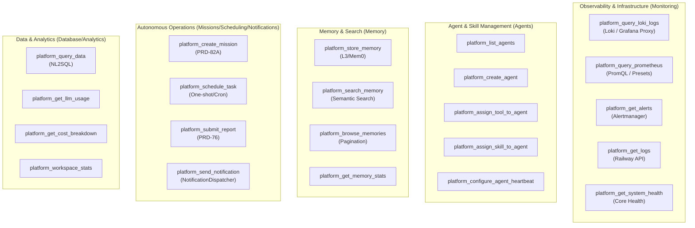
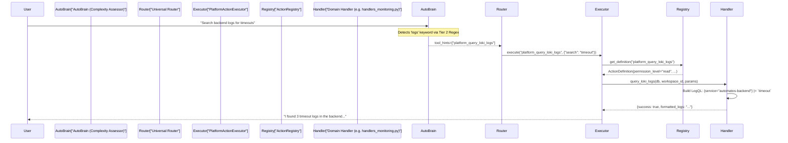

# Action Categories

Relevant source files

The following files were used as context for generating this wiki page:

- [orchestrator/consumers/chatbot/auto.py](orchestrator/consumers/chatbot/auto.py)
- [orchestrator/core/security/rate_limiter.py](orchestrator/core/security/rate_limiter.py)
- [orchestrator/core/services/auto_reporting.py](orchestrator/core/services/auto_reporting.py)
- [orchestrator/core/services/notification_dispatcher.py](orchestrator/core/services/notification_dispatcher.py)
- [orchestrator/modules/tools/discovery/actions_agents.py](orchestrator/modules/tools/discovery/actions_agents.py)
- [orchestrator/modules/tools/discovery/actions_analytics.py](orchestrator/modules/tools/discovery/actions_analytics.py)
- [orchestrator/modules/tools/discovery/actions_assignments.py](orchestrator/modules/tools/discovery/actions_assignments.py)
- [orchestrator/modules/tools/discovery/actions_auto_reporting.py](orchestrator/modules/tools/discovery/actions_auto_reporting.py)
- [orchestrator/modules/tools/discovery/actions_documents.py](orchestrator/modules/tools/discovery/actions_documents.py)
- [orchestrator/modules/tools/discovery/actions_marketplace.py](orchestrator/modules/tools/discovery/actions_marketplace.py)
- [orchestrator/modules/tools/discovery/actions_missions.py](orchestrator/modules/tools/discovery/actions_missions.py)
- [orchestrator/modules/tools/discovery/actions_monitoring.py](orchestrator/modules/tools/discovery/actions_monitoring.py)
- [orchestrator/modules/tools/discovery/actions_scheduling.py](orchestrator/modules/tools/discovery/actions_scheduling.py)
- [orchestrator/modules/tools/discovery/actions_search.py](orchestrator/modules/tools/discovery/actions_search.py)
- [orchestrator/modules/tools/discovery/handlers_agents.py](orchestrator/modules/tools/discovery/handlers_agents.py)
- [orchestrator/modules/tools/discovery/handlers_auto_reporting.py](orchestrator/modules/tools/discovery/handlers_auto_reporting.py)
- [orchestrator/modules/tools/discovery/handlers_missions.py](orchestrator/modules/tools/discovery/handlers_missions.py)
- [orchestrator/modules/tools/discovery/handlers_monitoring.py](orchestrator/modules/tools/discovery/handlers_monitoring.py)
- [orchestrator/modules/tools/discovery/platform_actions.py](orchestrator/modules/tools/discovery/platform_actions.py)
- [orchestrator/modules/tools/discovery/platform_executor.py](orchestrator/modules/tools/discovery/platform_executor.py)
- [orchestrator/scripts/seed_blog_playbook.py](orchestrator/scripts/seed_blog_playbook.py)
- [orchestrator/tests/test_prd128_notification_dispatcher.py](orchestrator/tests/test_prd128_notification_dispatcher.py)

Platform actions in Automatos AI are organized into **15 distinct categories** that group 47+ self-management operations. These categories enable agents to introspect, query, configure, and control the platform itself, providing operational autonomy for tasks ranging from resource management to infrastructure monitoring.

For the overall platform action system architecture, see [Platform Action System](#13.1). For execution mechanics and permissions, see [Confirmation & Rate Limiting](#13.3).

---

## Overview

Platform actions follow a structured taxonomy defined by three layers:
1.  **Permission Tiers**: `read`, `write`, and `destructive`. These control risk and determine if user confirmation is required [orchestrator/modules/tools/discovery/action_registry.py:15-18]().
2.  **Functional Categories**: Logical groupings such as `agents`, `memory`, `monitoring`, `missions`, `analytics`, and `auto_reporting` [orchestrator/modules/tools/discovery/platform_actions.py:14-35]().
3.  **Individual Actions**: Discrete operations defined via `ActionDefinition` objects (e.g., `platform_query_loki_logs`, `platform_send_notification`) [orchestrator/modules/tools/discovery/actions_monitoring.py:11-12](), [orchestrator/modules/tools/discovery/actions_auto_reporting.py:57-61]().

This organization allows the **AutoBrain** complexity assessor to inject specific `tool_hints` when it detects platform-related keywords in natural language, such as "token usage" mapping to `platform_get_llm_usage` [orchestrator/consumers/chatbot/auto.py:116-132]().

**Sources:** [orchestrator/modules/tools/discovery/action_registry.py:1-40](), [orchestrator/modules/tools/discovery/platform_actions.py:1-66](), [orchestrator/consumers/chatbot/auto.py:1-175]().

---

## Category Taxonomy

The following diagram maps the logical categories to specific code-level action identifiers registered in the `ActionRegistry`.

### Platform Action Entity Map

**Sources:** [orchestrator/modules/tools/discovery/actions_monitoring.py:1-150](), [orchestrator/modules/tools/discovery/actions_agents.py:1-150](), [orchestrator/modules/tools/discovery/actions_auto_reporting.py:1-109](), [orchestrator/modules/tools/discovery/actions_missions.py:1-110]().

---

## Detailed Category Breakdown

### 1. Monitoring & Infrastructure
These actions provide deep visibility into the system's runtime state. Many are restricted to `admin_only=True` [orchestrator/modules/tools/discovery/actions_monitoring.py:55-55]().

| Action | Handler | Data Source |
| :--- | :--- | :--- |
| `platform_query_loki_logs` | `query_loki_logs` | Loki via Grafana Proxy or Direct [orchestrator/modules/tools/discovery/handlers_monitoring.py:87-147]() |
| `platform_query_prometheus` | `query_prometheus` | Prometheus PromQL [orchestrator/modules/tools/discovery/actions_monitoring.py:69-75]() |
| `platform_get_logs` | `get_logs` | Railway Client (Deploy Logs) [orchestrator/modules/tools/discovery/handlers_monitoring.py:14-40]() |
| `platform_get_alerts` | `get_alerts` | Infrastructure Alertmanager [orchestrator/modules/tools/discovery/actions_monitoring.py:113-120]() |

**Sources:** [orchestrator/modules/tools/discovery/handlers_monitoring.py:14-175](), [orchestrator/modules/tools/discovery/actions_monitoring.py:1-160]().

### 2. Agent Management
Controls the lifecycle and capabilities of AI agents within the workspace.

| Action | Permission | Key Parameters |
| :--- | :--- | :--- |
| `platform_create_agent` | `write` | `name`, `agent_type`, `model_id`, `system_prompt` [orchestrator/modules/tools/discovery/actions_agents.py:74-113]() |
| `platform_update_agent` | `write` | `agent_id`, `new_name`, `status`, `temperature` [orchestrator/modules/tools/discovery/actions_agents.py:153-182]() |
| `platform_assign_tool_to_agent` | `write` | `agent_id`, `app_name` (Composio) [orchestrator/modules/tools/discovery/actions_assignments.py:126-126]() |
| `platform_configure_agent_heartbeat` | `write` | `agent_id`, `enabled`, `interval_minutes` [orchestrator/modules/tools/discovery/actions_agents.py:1-10]() |

**Sources:** [orchestrator/modules/tools/discovery/actions_agents.py:1-185](), [orchestrator/modules/tools/discovery/handlers_agents.py:1-186](), [orchestrator/modules/tools/discovery/platform_executor.py:125-130]().

### 3. Memory & Search
Interfaces with the L3 (Long-term) memory tier and historical chat data.

| Action | Logic |
| :--- | :--- |
| `platform_store_memory` | Curates facts into workspace long-term memory (<200 chars) [orchestrator/modules/tools/discovery/handlers_workspace.py:57-57]() |
| `platform_search_memory` | Semantic search across global and agent-specific Mem0 stores [orchestrator/modules/tools/discovery/handlers_search.py:69-69]() |
| `platform_search_chat_history` | Keyword search across past conversations (up to 365 days) [orchestrator/modules/tools/discovery/handlers_search.py:68-68]() |

**Sources:** [orchestrator/modules/tools/discovery/platform_executor.py:53-72](), [orchestrator/modules/tools/discovery/handlers_search.py:1-72]().

### 4. Notifications & Auto-Reporting (PRD-128)
Enables agents to trigger platform-wide events and manage notification preferences.

*   **`platform_send_notification`**: Fires an event through the `NotificationDispatcher`, which handles fan-out to in-app, Telegram, or Slack based on workspace preferences [orchestrator/modules/tools/discovery/handlers_auto_reporting.py:57-104]().
*   **`platform_update_auto_reporting_prefs`**: Allows agents to configure "Quiet Hours" and primary/fallback notification channels [orchestrator/core/services/auto_reporting.py:6-23]().
*   **Event Types**: Supports `heartbeat_complete`, `task_complete`, `mission_complete`, and `agent_error` [orchestrator/core/services/notification_dispatcher.py:45-57]().

**Sources:** [orchestrator/core/services/notification_dispatcher.py:1-111](), [orchestrator/modules/tools/discovery/handlers_auto_reporting.py:1-109](), [orchestrator/core/services/auto_reporting.py:1-55]().

---

## Registration & Execution Flow

The `PlatformActionExecutor` serves as the central dispatcher. During startup, `register_all_actions` re-exports and populates the `ActionRegistry` with definitions from all domain-specific files [orchestrator/modules/tools/discovery/platform_actions.py:38-66]().

### Natural Language to Platform Action Flow

**Sources:** [orchestrator/modules/tools/discovery/handlers_monitoring.py:87-126](), [orchestrator/modules/tools/discovery/actions_monitoring.py:11-64](), [orchestrator/consumers/chatbot/auto.py:116-175]().

### Key Implementation Entities

1.  **`PlatformActionExecutor`**: Thin dispatcher that routes to handlers in `modules/tools/discovery/handlers_*.py` [orchestrator/modules/tools/discovery/platform_executor.py:1-9]().
2.  **`ActionRegistry`**: The central store for `ActionDefinition` metadata, including parameters and permission levels [orchestrator/modules/tools/discovery/action_registry.py:1-40]().
3.  **`NotificationDispatcher`**: Handles multi-destination fan-out for events, honoring user overrides and quiet hours [orchestrator/core/services/notification_dispatcher.py:9-28]().
4.  **`Hierarchy Permissions`**: Enforces PRD-140 Phase 1 security, ensuring an agent can only modify itself or its subordinates [orchestrator/modules/tools/discovery/platform_executor.py:183-207]().

**Sources:** [orchestrator/modules/tools/discovery/platform_executor.py:1-209](), [orchestrator/core/services/notification_dispatcher.py:76-111](), [orchestrator/core/security/rate_limiter.py:45-57]().

---