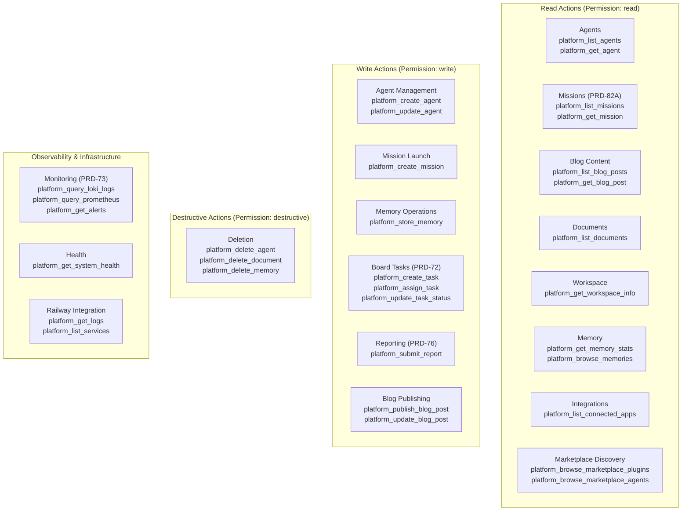
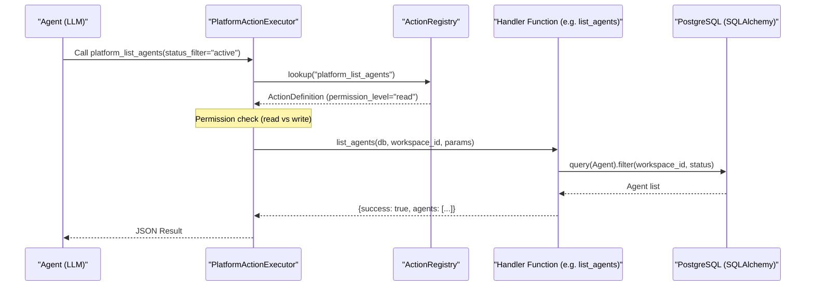

# Action Categories

Relevant source files

The following files were used as context for generating this wiki page:

- [frontend/app/workspace/page.tsx](frontend/app/workspace/page.tsx)
- [frontend/components/workspace/WorkspaceExplorer.tsx](frontend/components/workspace/WorkspaceExplorer.tsx)
- [orchestrator/alembic/versions/blog_content_to_workspace.py](orchestrator/alembic/versions/blog_content_to_workspace.py)
- [orchestrator/api/blog.py](orchestrator/api/blog.py)
- [orchestrator/api/widgets/blog.py](orchestrator/api/widgets/blog.py)
- [orchestrator/core/services/blog_service.py](orchestrator/core/services/blog_service.py)
- [orchestrator/core/services/notification_service.py](orchestrator/core/services/notification_service.py)
- [orchestrator/modules/tools/discovery/actions_agents.py](orchestrator/modules/tools/discovery/actions_agents.py)
- [orchestrator/modules/tools/discovery/actions_assignments.py](orchestrator/modules/tools/discovery/actions_assignments.py)
- [orchestrator/modules/tools/discovery/actions_blog.py](orchestrator/modules/tools/discovery/actions_blog.py)
- [orchestrator/modules/tools/discovery/actions_board_tasks.py](orchestrator/modules/tools/discovery/actions_board_tasks.py)
- [orchestrator/modules/tools/discovery/actions_documents.py](orchestrator/modules/tools/discovery/actions_documents.py)
- [orchestrator/modules/tools/discovery/actions_marketplace.py](orchestrator/modules/tools/discovery/actions_marketplace.py)
- [orchestrator/modules/tools/discovery/actions_missions.py](orchestrator/modules/tools/discovery/actions_missions.py)
- [orchestrator/modules/tools/discovery/actions_monitoring.py](orchestrator/modules/tools/discovery/actions_monitoring.py)
- [orchestrator/modules/tools/discovery/actions_playbooks.py](orchestrator/modules/tools/discovery/actions_playbooks.py)
- [orchestrator/modules/tools/discovery/actions_reports.py](orchestrator/modules/tools/discovery/actions_reports.py)
- [orchestrator/modules/tools/discovery/actions_scheduling.py](orchestrator/modules/tools/discovery/actions_scheduling.py)
- [orchestrator/modules/tools/discovery/actions_search.py](orchestrator/modules/tools/discovery/actions_search.py)
- [orchestrator/modules/tools/discovery/actions_workspace.py](orchestrator/modules/tools/discovery/actions_workspace.py)
- [orchestrator/modules/tools/discovery/handlers_agents.py](orchestrator/modules/tools/discovery/handlers_agents.py)
- [orchestrator/modules/tools/discovery/handlers_blog.py](orchestrator/modules/tools/discovery/handlers_blog.py)
- [orchestrator/modules/tools/discovery/handlers_board_tasks.py](orchestrator/modules/tools/discovery/handlers_board_tasks.py)
- [orchestrator/modules/tools/discovery/handlers_reports.py](orchestrator/modules/tools/discovery/handlers_reports.py)

Platform actions in Automatos AI are organized into **13 distinct categories** that group related self-management operations. These categories enable agents to introspect, query, configure, and control the platform itself, providing full operational autonomy without requiring external tools or human intervention.

For the overall platform action system architecture, see [Platform Action System](). For execution mechanics and permissions, see [Confirmation & Rate Limiting]().

---

## Overview

Platform actions follow a structured taxonomy with three layers:
1.  **Permission tiers** (read, write, destructive) — control risk and require confirmation [orchestrator/modules/tools/discovery/actions_agents.py:30-137]().
2.  **Functional categories** — group actions by domain (agents, blog, missions, tasks, etc.) [orchestrator/modules/tools/discovery/actions_agents.py:18-18]().
3.  **Individual actions** — 47+ discrete operations like `platform_list_agents`, `platform_create_mission` [orchestrator/modules/tools/discovery/actions_agents.py:12-152]().

This organization allows:
-   **Intelligent discovery** — `AutoBrain` can suggest relevant actions based on user intent.
-   **Progressive access control** — read operations are unrestricted, while write/destructive require confirmation [orchestrator/modules/tools/discovery/actions_agents.py:143-143]().
-   **Coherent tool manifests** — agents see logically grouped capabilities, not a flat list of tools.

**Sources:** [orchestrator/modules/tools/discovery/actions_agents.py:1-190](), [orchestrator/modules/tools/discovery/actions_workspace.py:1-193]().

---

## Category Taxonomy

The following diagram maps the logical categories to the specific code-level action identifiers used by the `PlatformActionExecutor`.

### Platform Action Entity Map

**Sources:** [orchestrator/modules/tools/discovery/actions_agents.py:11-152](), [orchestrator/modules/tools/discovery/actions_workspace.py:15-170](), [orchestrator/modules/tools/discovery/actions_monitoring.py:11-152](), [orchestrator/modules/tools/discovery/actions_missions.py:9-85]().

---

## Category Breakdown

### 1. **Read Actions** — Workspace Inspection

**Purpose:** Query workspace resources without modification. No confirmation required.

| Action | Category | Description |
|--------|----------|-------------|
| `platform_list_agents` | agents | List all agents in workspace [orchestrator/modules/tools/discovery/actions_agents.py:12-38]() |
| `platform_get_agent` | agents | Get detailed agent config by ID/name [orchestrator/modules/tools/discovery/actions_agents.py:40-69]() |
| `platform_get_workspace_info` | workspace | Get workspace metadata and config summary [orchestrator/modules/tools/discovery/actions_workspace.py:15-34]() |
| `platform_get_memory_stats` | memory | Total memories and storage usage [orchestrator/modules/tools/discovery/actions_workspace.py:38-58]() |
| `platform_browse_memories` | memory | Paginated search of stored facts [orchestrator/modules/tools/discovery/actions_workspace.py:91-121]() |
| `platform_list_connected_apps` | integrations | List Composio apps (Slack, GitHub, etc.) [orchestrator/modules/tools/discovery/actions_workspace.py:145-165]() |
| `platform_list_blog_posts` | blog | List titles, slugs, and statuses [orchestrator/modules/tools/discovery/actions_blog.py:64-99]() |
| `platform_get_mission` | missions | Get full task DAG and step results [orchestrator/modules/tools/discovery/actions_missions.py:85-109]() |

**Sources:** [orchestrator/modules/tools/discovery/actions_agents.py:12-69](), [orchestrator/modules/tools/discovery/actions_workspace.py:15-165](), [orchestrator/modules/tools/discovery/actions_blog.py:64-131]().

---

### 2. **Write Actions** — Resource Creation & Content

**Purpose:** Create or update platform resources.

#### 2.1 Agent & Mission Management
| Action | Purpose |
|--------|---------|
| `platform_create_agent` | Create new agent with persona and model config [orchestrator/modules/tools/discovery/actions_agents.py:73-150]() |
| `platform_update_agent` | Modify existing agent fields (status, model, prompt) [orchestrator/modules/tools/discovery/actions_agents.py:152-190]() |
| `platform_create_mission` | Launch autonomous multi-agent mission (PRD-82A) [orchestrator/modules/tools/discovery/actions_missions.py:9-50]() |

**Sources:** [orchestrator/modules/tools/discovery/actions_agents.py:73-190](), [orchestrator/modules/tools/discovery/actions_missions.py:9-50]().

#### 2.2 Content & Reporting (PRD-76)
| Action | Purpose |
|--------|---------|
| `platform_publish_blog_post` | Write markdown post to workspace blog [orchestrator/modules/tools/discovery/actions_blog.py:9-62]() |
| `platform_submit_report` | Save structured deliverables (research, audits) [orchestrator/modules/tools/discovery/actions_reports.py:9-76]() |
| `platform_store_memory` | Store curated facts in long-term memory [orchestrator/modules/tools/discovery/actions_workspace.py:60-87]() |

**Sources:** [orchestrator/modules/tools/discovery/actions_blog.py:9-183](), [orchestrator/modules/tools/discovery/actions_reports.py:9-76](), [orchestrator/modules/tools/discovery/actions_workspace.py:60-87]().

---

### 3. **Board Tasks** (PRD-72)

Enables agents to manage a shared task board, allowing for asynchronous task assignment and tracking.

| Action | Description |
|--------|-------------|
| `platform_create_task` | Raise work items for self or others [orchestrator/modules/tools/discovery/actions_board_tasks.py:9-70]() |
| `platform_list_tasks` | List tasks with filters (status, priority) [orchestrator/modules/tools/discovery/actions_board_tasks.py:74-114]() |
| `platform_assign_task` | Assign task to agent to trigger heartbeat pick-up [orchestrator/modules/tools/discovery/actions_board_tasks.py:170-186]() |
| `platform_board_summary` | Daily standup/overview of team workload [orchestrator/modules/tools/discovery/actions_board_tasks.py:116-140]() |

**Sources:** [orchestrator/modules/tools/discovery/actions_board_tasks.py:1-186](), [orchestrator/modules/tools/discovery/handlers_board_tasks.py:13-161]().

---

### 4. **Monitoring & Infrastructure** (PRD-73)

Enables agents to perform system-level observability. **Admin only** actions are restricted to system roles.

| Action | Source | Integration |
|--------|--------|-------------|
| `platform_query_loki_logs` | Loki | Search application logs across all services [orchestrator/modules/tools/discovery/actions_monitoring.py:11-63]() |
| `platform_query_prometheus` | Prometheus | Real-time metrics via PromQL [orchestrator/modules/tools/discovery/actions_monitoring.py:67-107]() |
| `platform_get_alerts` | Alertmanager | Firing and resolved infrastructure alerts [orchestrator/modules/tools/discovery/actions_monitoring.py:111-147]() |
| `platform_get_system_health` | System | Core service status (DB, Redis, API) [orchestrator/modules/tools/discovery/actions_workspace.py:169-192]() |
| `platform_get_logs` | Railway | Fetch deployment logs for specific service [orchestrator/modules/tools/discovery/actions_monitoring.py:151-169]() |

**Sources:** [orchestrator/modules/tools/discovery/actions_monitoring.py:1-169](), [orchestrator/modules/tools/discovery/actions_workspace.py:169-192]().

---

## Execution Flow

The platform action system uses a dispatcher pattern where `platform_*` tool calls are routed to specialized handlers.

### Code Entity Interaction Map

**Sources:** [orchestrator/modules/tools/discovery/handlers_agents.py:13-64](), [orchestrator/modules/tools/discovery/actions_agents.py:11-38](), [orchestrator/modules/tools/discovery/actions_workspace.py:3-12]().

### Key Implementation Entities

1.  **`ActionDefinition`**: Defines the schema, description, permission level, and examples for an action [orchestrator/modules/tools/discovery/actions_agents.py:11-38]().
2.  **`ActionRegistry`**: A singleton that holds the map of registered actions [orchestrator/modules/tools/discovery/actions_workspace.py:3-6]().
3.  **`BlogService`**: Backend service used by blog handlers to manage markdown files and DB records [orchestrator/modules/tools/discovery/handlers_blog.py:45-59]().
4.  **`ReportService`**: Backend service used to store deliverables and trigger knowledge graph updates [orchestrator/modules/tools/discovery/handlers_reports.py:15-87]().

### Handler Logic
-   **Blog Post Normalization**: The `_normalize_tags` function handles messy LLM input (JSON strings vs lists) before database insertion [orchestrator/modules/tools/discovery/handlers_blog.py:13-40]().
-   **Board Task Auto-Approval**: Tasks with `approval_action` can skip human review if `auto_approve=True`, immediately executing services like `BlogService.publish_post` [orchestrator/modules/tools/discovery/handlers_board_tasks.py:63-83]().
-   **Agent Creation**: The `create_agent` handler automatically infers the LLM provider (e.g., `anthropic`, `google`) based on the `model_id` string [orchestrator/modules/tools/discovery/handlers_agents.py:145-153]().

**Sources:** [orchestrator/modules/tools/discovery/handlers_blog.py:13-183](), [orchestrator/modules/tools/discovery/handlers_board_tasks.py:13-104](), [orchestrator/modules/tools/discovery/handlers_agents.py:120-190]().

---