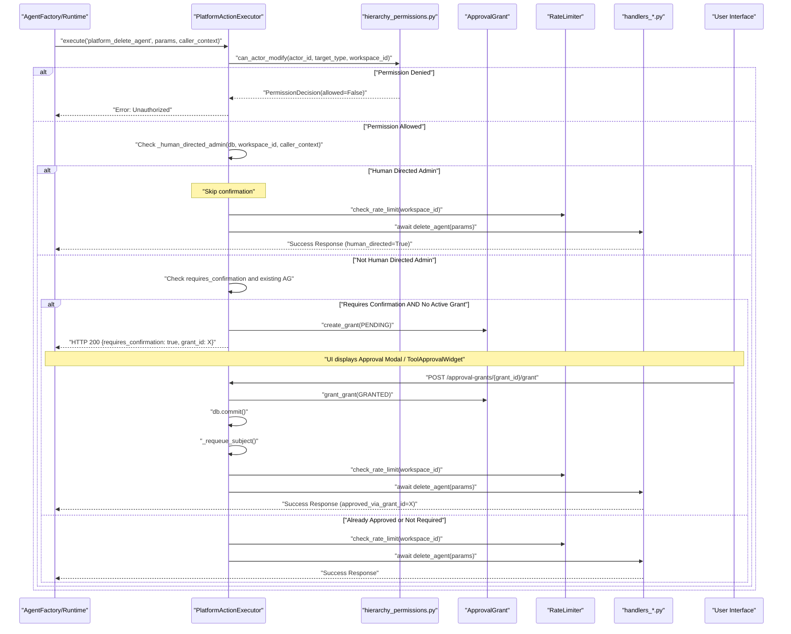
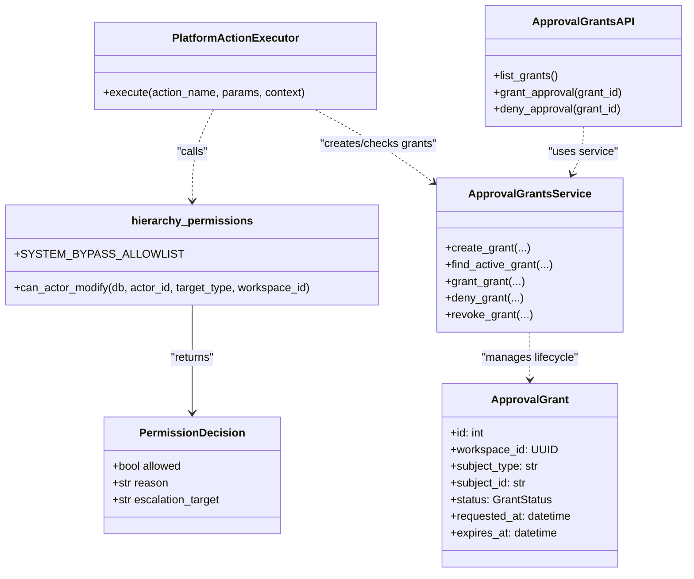
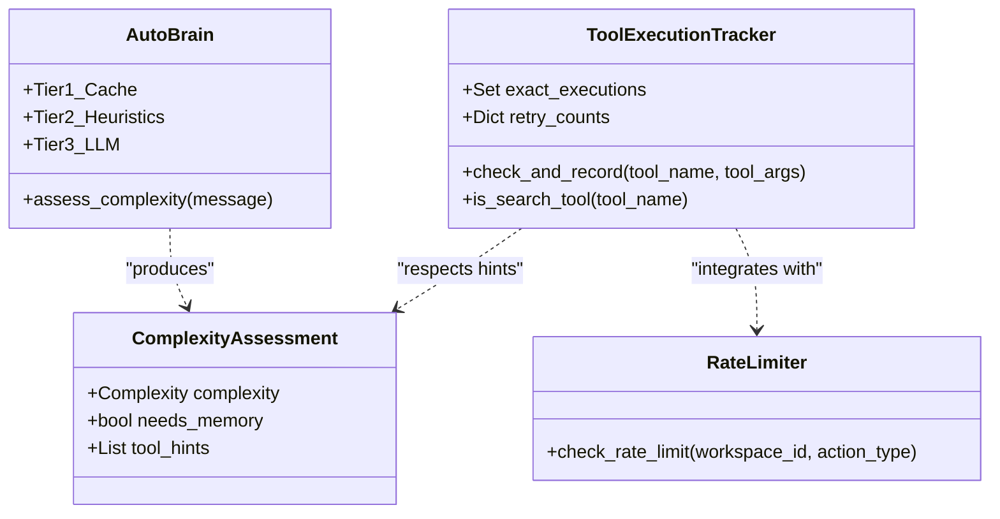

# Confirmation, Approvals & Rate Limiting

Relevant source files

The following files were used as context for generating this wiki page:

- [docs/compliance/EU-AI-ACT-ANNEX-IV.md](docs/compliance/EU-AI-ACT-ANNEX-IV.md)
- [frontend/components/widgets/WidgetWrapper.tsx](frontend/components/widgets/WidgetWrapper.tsx)
- [frontend/components/widgets/__tests__/registration-manifest.test.ts](frontend/components/widgets/__tests__/registration-manifest.test.ts)
- [orchestrator/alembic/versions/prd140_permission_bypass_log.py](orchestrator/alembic/versions/prd140_permission_bypass_log.py)
- [orchestrator/alembic/versions/prd140_team_lead_enabled.py](orchestrator/alembic/versions/prd140_team_lead_enabled.py)
- [orchestrator/alembic/versions/prd181_s2_approval_grants.py](orchestrator/alembic/versions/prd181_s2_approval_grants.py)
- [orchestrator/api/approval_grants.py](orchestrator/api/approval_grants.py)
- [orchestrator/core/models/approval_grants.py](orchestrator/core/models/approval_grants.py)
- [orchestrator/core/security/__init__.py](orchestrator/core/security/__init__.py)
- [orchestrator/core/security/bypass_audit.py](orchestrator/core/security/bypass_audit.py)
- [orchestrator/core/security/hierarchy_permissions.py](orchestrator/core/security/hierarchy_permissions.py)
- [orchestrator/core/security/url_validator.py](orchestrator/core/security/url_validator.py)
- [orchestrator/core/services/approval_grants.py](orchestrator/core/services/approval_grants.py)
- [orchestrator/core/services/auto_cadence.py](orchestrator/core/services/auto_cadence.py)
- [orchestrator/modules/policy/ai_act.py](orchestrator/modules/policy/ai_act.py)
- [orchestrator/modules/tools/execution/exec_platform.py](orchestrator/modules/tools/execution/exec_platform.py)
- [orchestrator/scripts/check_hierarchy_gate.py](orchestrator/scripts/check_hierarchy_gate.py)
- [orchestrator/services/board_approval.py](orchestrator/services/board_approval.py)
- [orchestrator/services/budget_ceiling.py](orchestrator/services/budget_ceiling.py)
- [orchestrator/tests/security/test_hierarchy_permissions.py](orchestrator/tests/security/test_hierarchy_permissions.py)
- [orchestrator/tests/test_grant_approve_commit_ordering.py](orchestrator/tests/test_grant_approve_commit_ordering.py)
- [orchestrator/tests/test_human_directed_gate.py](orchestrator/tests/test_human_directed_gate.py)
- [orchestrator/tests/test_p2w2_grant_mutation_admin_gate.py](orchestrator/tests/test_p2w2_grant_mutation_admin_gate.py)
- [orchestrator/tests/test_p2w2_grant_resume.py](orchestrator/tests/test_p2w2_grant_resume.py)
- [orchestrator/tests/test_prd181_ai_act.py](orchestrator/tests/test_prd181_ai_act.py)

This page documents the confirmation workflow, permission enforcement, and rate limiting mechanisms for platform actions and tool execution. These systems provide safety guardrails when agents attempt to modify workspace resources or access sensitive infrastructure tools.

---

## Overview

Platform actions are protected by a multi-layered security and governance stack. When an agent or the orchestrator attempts to execute an action, the system evaluates it against four primary gates:

1.  **Hierarchy Permissions**: A chokepoint ensuring the actor has the authority to modify the target resource based on the organizational tree [orchestrator/core/security/hierarchy_permissions.py:1-36]().
2.  **Confirmation Gate**: Actions marked with `requires_confirmation=True` return a special response prompting the user for approval via the UI [orchestrator/modules/tools/discovery/platform_executor.py:174-230]().
3.  **Rate Limiting**: Write and destructive actions are throttled to prevent autonomous loops from exhausting resources or causing mass data loss [orchestrator/consumers/chatbot/service.py:155-162]().
4.  **Tool Loop Prevention**: Tracking sequential calls within a conversation turn to block semantic or exact duplicates [orchestrator/consumers/chatbot/service.py:155-162]().

**Sources:** [orchestrator/core/security/hierarchy_permissions.py:1-36](), [orchestrator/modules/tools/execution/exec_platform.py:29-94](), [orchestrator/consumers/chatbot/service.py:155-162]()

---

## Permission & Access Control

### Hierarchy Permissions (PRD-140)
The system uses a "deny-by-default" security model bound to the workspace. Every mutation request is validated by `can_actor_modify` [orchestrator/core/security/hierarchy_permissions.py:116-125]().

*   **Actor Validation**: The system denies requests if there is no explicit actor ID, if the actor is not found, or if the actor belongs to a different workspace [orchestrator/core/security/hierarchy_permissions.py:135-148]().
*   **System Bypass**: Only a specific allowlist of platform-seeded agents (e.g., "Auto", "Auto CTO", "HARNESS") can bypass hierarchy checks [orchestrator/core/security/hierarchy_permissions.py:68-78]().
*   **Subtree Authority**: An agent may modify resources (tasks, playbooks, other agents) only if they are within its `reports_to_id` subtree [orchestrator/core/security/hierarchy_permissions.py:24-27]().

**Sources:** [orchestrator/core/security/hierarchy_permissions.py:1-36](), [orchestrator/core/security/hierarchy_permissions.py:68-78](), [orchestrator/core/security/hierarchy_permissions.py:116-148]()

### Permission Levels
Actions are categorized into tiers, which determines confirmation requirements:

| Permission Level | Description | Confirmation |
| :--- | :--- | :--- |
| `read` | Non-mutating queries (e.g., `list_agents`) | No |
| `write` | Resource modification (e.g., `create_agent`) | Configurable |
| `destructive` | Data deletion (e.g., `delete_document`) | **Mandatory** |

**Sources:** [orchestrator/core/security/hierarchy_permissions.py:51-61](), [orchestrator/tests/security/test_hierarchy_permissions.py:1-17](), [orchestrator/modules/tools/execution/exec_platform.py:29-94]()

---

## Confirmation Flow Architecture

The `PlatformActionExecutor` acts as a thin dispatcher routing actions to domain-specific handlers [orchestrator/modules/tools/execution/exec_platform.py:84-85](). If an action requires confirmation and has not yet been approved by the user, the execution is halted.

### Approval Grants (PRD-181 S2)
The system introduces durable, scoped, expiring, and revocable approval grants via the `ApprovalGrant` model [orchestrator/core/models/approval_grants.py:1-22](). These grants are first-class records that enable a real approval workflow for non-chat agents like board tasks, playbook runs, and scheduled/webhook agents.

A grant can be in one of several states defined by `GrantStatus` [orchestrator/core/models/approval_grants.py:35-50]():
*   `PENDING`: Awaiting human decision, subject is blocked.
*   `GRANTED`: Approved by a human, authorizes the subject until `expires_at`.
*   `REVOKED`: Retracted before expiry.
*   `EXPIRED`: `expires_at` passed.
*   `DENIED`: Explicitly refused by a human.

The `approval_grants.py` API handles listing, granting, and revoking these approvals [orchestrator/api/approval_grants.py:39-166](). All state changes are audited [orchestrator/api/approval_grants.py:81-103]().

### Human-Directed Gate
For actions initiated by a human administrator in an interactive chat, the confirmation gate can be skipped. This is determined by checking if the call is from an interactive chat lane and the driving user is an owner/admin in `workspace_members` [orchestrator/tests/test_human_directed_gate.py:1-19](). This prevents unnecessary confirmation prompts for actions explicitly instructed by an authorized human. The execution is then stamped as `human_directed` for audit purposes [orchestrator/tests/test_human_directed_gate.py:100-113]().

### Platform Action Safety Sequence

**Sources:** [orchestrator/modules/tools/execution/exec_platform.py:29-94](), [orchestrator/core/security/hierarchy_permissions.py:116-125](), [orchestrator/core/models/approval_grants.py:1-22](), [orchestrator/api/approval_grants.py:39-166](), [orchestrator/tests/test_human_directed_gate.py:1-19](), [orchestrator/tests/test_grant_approve_commit_ordering.py:1-19]()

---

## Rate Limiting & Loop Prevention

### Rate Limiting per Workspace
The system implements rate limiting per workspace to prevent abuse and ensure fair resource allocation. The `check_rate_limit` function [orchestrator/core/security/rate_limiter.py:1-1] is used to enforce these limits.

### Tool Execution Tracker
The `ToolExecutionTracker` manages tool calls within a single conversation turn to prevent infinite loops and redundant processing [orchestrator/consumers/chatbot/service.py:155-162]().

*   **Exact Deduplication**: Tracks `(tool_name, args_hash)` to block identical calls [orchestrator/consumers/chatbot/service.py:159-160]().
*   **Semantic Deduplication**: For search tools (e.g., `search_knowledge`, `query_database`), it normalizes queries and uses `SequenceMatcher` to block semantically similar requests [orchestrator/consumers/chatbot/service.py:164-171]().
*   **Retry Limits**: Enforces hard caps on specific tools per turn [orchestrator/consumers/chatbot/service.py:173-189]():
    *   `read_file`: 8 attempts.
    *   `write_file`: 5 attempts.
    *   `query_database`: 2 attempts (internal self-correction matched).
    *   `platform_default`: 25 attempts.

### Complexity-Based Routing
The `AutoBrain` (Complexity Assessor) performs a 3-tier assessment (Cache, Regex, LLM) to determine if a request needs tools or memory at all [orchestrator/consumers/chatbot/auto.py:14-22](). This prevents unnecessary execution of expensive or destructive platform actions for simple "Atom" level requests (e.g., greetings) [orchestrator/consumers/chatbot/auto.py:47-54]().

**Sources:** [orchestrator/consumers/chatbot/service.py:155-191](), [orchestrator/consumers/chatbot/auto.py:5-22](), [orchestrator/consumers/chatbot/auto.py:97-119](), [orchestrator/core/security/rate_limiter.py:1-1]()

---

## Code Entity Mapping

The following diagrams bridge safety concepts to specific code entities.

### Permission and Hierarchy Entities

**Sources:** [orchestrator/core/security/hierarchy_permissions.py:68-112](), [orchestrator/core/security/hierarchy_permissions.py:116-131](), [orchestrator/modules/tools/execution/exec_platform.py:84-85](), [orchestrator/core/models/approval_grants.py:64-114](), [orchestrator/api/approval_grants.py:106-166](), [orchestrator/core/services/approval_grants.py:43-176]()

### Loop Prevention Entities

**Sources:** [orchestrator/consumers/chatbot/service.py:155-191](), [orchestrator/consumers/chatbot/auto.py:14-31](), [orchestrator/consumers/chatbot/auto.py:65-88](), [orchestrator/core/security/rate_limiter.py:1-1]()

---

## Technical Summary

| Logic Step | Code Entity | File Reference |
| :--- | :--- | :--- |
| **Identity Resolution** | `get_user_id` | [orchestrator/api/chat.py:84-132]() |
| **Complexity Assessment** | `AutoBrain` | [orchestrator/consumers/chatbot/auto.py:5-22]() |
| **Authority Check** | `can_actor_modify` | [orchestrator/core/security/hierarchy_permissions.py:116-131]() |
| **Approval Grant Management** | `ApprovalGrant`, `ApprovalGrantsService` | [orchestrator/core/models/approval_grants.py:64-114](), [orchestrator/core/services/approval_grants.py:43-176]() |
| **Human-Directed Check** | `_human_directed_admin` | [orchestrator/tests/test_human_directed_gate.py:61-65]() |
| **Rate Limiting** | `check_rate_limit` | [orchestrator/core/security/rate_limiter.py:1-1]() |
| **Loop Prevention** | `ToolExecutionTracker` | [orchestrator/consumers/chatbot/service.py:155-191]() |
| **Platform Dispatch** | `PlatformActionExecutor` | [orchestrator/modules/tools/execution/exec_platform.py:84-85]() |

**Sources:** [orchestrator/api/chat.py:84-132](), [orchestrator/consumers/chatbot/auto.py:5-22](), [orchestrator/core/security/hierarchy_permissions.py:116-131](), [orchestrator/consumers/chatbot/service.py:155-191](), [orchestrator/modules/tools/execution/exec_platform.py:84-85](), [orchestrator/core/models/approval_grants.py:64-114](), [orchestrator/core/services/approval_grants.py:43-176](), [orchestrator/tests/test_human_directed_gate.py:61-65](), [orchestrator/core/security/rate_limiter.py:1-1]()

---