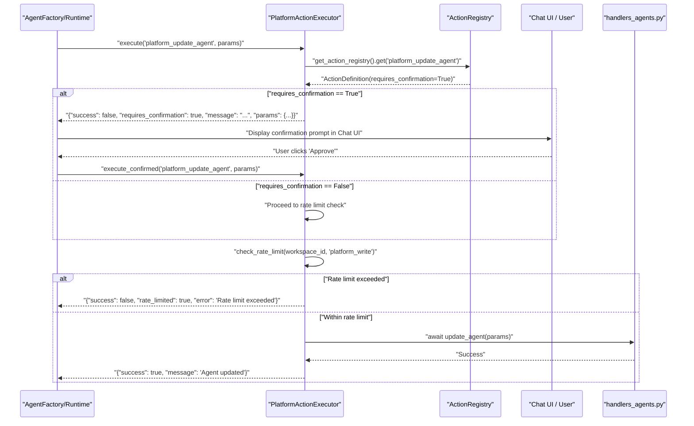
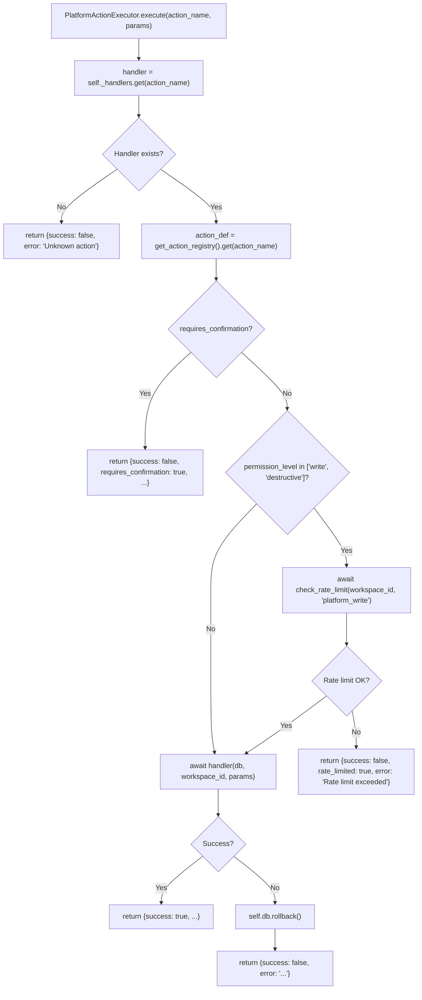

# Confirmation & Rate Limiting

<details>
<summary>Relevant source files</summary>

The following files were used as context for generating this wiki page:

- [orchestrator/modules/tools/discovery/actions_agents.py](orchestrator/modules/tools/discovery/actions_agents.py)
- [orchestrator/modules/tools/discovery/actions_assignments.py](orchestrator/modules/tools/discovery/actions_assignments.py)
- [orchestrator/modules/tools/discovery/actions_documents.py](orchestrator/modules/tools/discovery/actions_documents.py)
- [orchestrator/modules/tools/discovery/actions_marketplace.py](orchestrator/modules/tools/discovery/actions_marketplace.py)
- [orchestrator/modules/tools/discovery/actions_missions.py](orchestrator/modules/tools/discovery/actions_missions.py)
- [orchestrator/modules/tools/discovery/actions_monitoring.py](orchestrator/modules/tools/discovery/actions_monitoring.py)
- [orchestrator/modules/tools/discovery/actions_playbooks.py](orchestrator/modules/tools/discovery/actions_playbooks.py)
- [orchestrator/modules/tools/discovery/actions_reports.py](orchestrator/modules/tools/discovery/actions_reports.py)
- [orchestrator/modules/tools/discovery/actions_scheduling.py](orchestrator/modules/tools/discovery/actions_scheduling.py)
- [orchestrator/modules/tools/discovery/actions_search.py](orchestrator/modules/tools/discovery/actions_search.py)
- [orchestrator/modules/tools/discovery/actions_workspace.py](orchestrator/modules/tools/discovery/actions_workspace.py)
- [orchestrator/modules/tools/discovery/handlers_agents.py](orchestrator/modules/tools/discovery/handlers_agents.py)
- [orchestrator/modules/tools/discovery/handlers_reports.py](orchestrator/modules/tools/discovery/handlers_reports.py)

</details>


This page documents the confirmation workflow and rate limiting mechanisms for platform actions (PRD-64), which provide safety guardrails when agents attempt to modify workspace resources. For general information about platform actions, see [13.1 Platform Action System](). For the action catalog, see [13.2 Action Categories]().

---

## Overview

When an agent attempts to execute a write or destructive platform action (such as `platform_create_agent`, `platform_delete_document`, or `platform_delete_memory`), the system applies two layers of protection:

1.  **Confirmation Gate**: Actions marked with `requires_confirmation=True` return a special response prompting the user for approval instead of executing immediately.
2.  **Rate Limiting**: All write/destructive actions are throttled to prevent abuse (default: 10 actions per minute per workspace).

This fail-safe design ensures agents cannot make unintended changes to the platform without user oversight, while still allowing autonomous operation for read-only queries and explicitly approved write operations.

**Sources:** [orchestrator/modules/tools/discovery/actions_workspace.py:123-141](), [orchestrator/modules/tools/discovery/actions_agents.py:73-150]()

---

## Permission Levels

Platform actions are categorized into three permission tiers that determine confirmation requirements and rate limiting behavior. These are defined within the `ActionDefinition` objects stored in the `ActionRegistry`.

| Permission Level | Description | Requires Confirmation | Rate Limited | Examples |
| :--- | :--- | :--- | :--- | :--- |
| `read` | Read-only queries | No | No | `platform_list_agents`, `platform_get_workspace_info`, `platform_browse_memories` |
| `write` | Modifies workspace resources | Configurable (default: No) | Yes | `platform_create_agent`, `platform_store_memory`, `platform_submit_report` |
| `destructive` | Deletes or irreversibly modifies data | Configurable (default: Yes) | Yes | `platform_delete_memory`, `platform_delete_document` |

The `requires_confirmation` flag on each `ActionDefinition` controls whether the action triggers the confirmation workflow. For example, `platform_store_memory` is a `write` action but has `requires_confirmation=False` to allow agents to learn from conversations autonomously [orchestrator/modules/tools/discovery/actions_workspace.py:60-87]().

**Sources:** [orchestrator/modules/tools/discovery/actions_workspace.py:123-141](), [orchestrator/modules/tools/discovery/actions_agents.py:11-38](), [orchestrator/modules/tools/discovery/actions_reports.py:9-76]()

---

## Confirmation Flow Architecture

The following diagram illustrates how the `PlatformActionExecutor` intercepts requests before they reach domain-specific handlers like `create_agent` or `submit_report`.

### Platform Action Safety Sequence


**Confirmation Response Format**
When an action requires confirmation, the executor returns a special response structure:

```json
{
  "success": false,
  "requires_confirmation": true,
  "action": "platform_delete_memory",
  "permission_level": "destructive",
  "message": "This action (destructive) requires confirmation. Action: platform_delete_memory — Permanently delete a specific memory by ID...",
  "params": {
    "memory_id": "abc-123"
  }
}
```

**Sources:** [orchestrator/modules/tools/discovery/actions_workspace.py:123-141](), [orchestrator/modules/tools/discovery/actions_agents.py:152-180]()

---

## Rate Limiting Implementation

### Rate Limit Configuration
The rate limiter enforces a **10 actions per minute** ceiling for write/destructive platform actions, scoped by `workspace_id`. This prevents agents from exhausting resources or making rapid destructive changes during autonomous operation.

| Limit Type | Scope | Threshold | Window | Enforcement |
| :--- | :--- | :--- | :--- | :--- |
| `platform_write` | Per workspace | 10 requests | 60 seconds | `HTTP 429` / Error JSON |

### Execution Logic in PlatformActionExecutor
The `PlatformActionExecutor` class handles the logic for dispatching actions and enforcing limits.



**Sources:** [orchestrator/modules/tools/discovery/actions_workspace.py:137-138](), [orchestrator/modules/tools/discovery/actions_documents.py:53-55]()

---

## Implementation Details

### Confirmation Check (Fail-Closed)
The system is **fail-closed**: if registry lookup fails or an action is unknown, the platform assumes confirmation is required or returns an error rather than allowing unrestricted execution. Actions like `platform_delete_memory` [orchestrator/modules/tools/discovery/actions_workspace.py:138]() and `platform_delete_document` [orchestrator/modules/tools/discovery/actions_documents.py:55]() explicitly set `requires_confirmation=True`.

### Rate Limiting (Write/Destructive Only)
Read actions bypass rate limiting entirely, enabling agents to query workspace state (e.g., `platform_list_agents` [orchestrator/modules/tools/discovery/actions_agents.py:12-38]()) without throttling. Write actions like `platform_create_agent` [orchestrator/modules/tools/discovery/actions_agents.py:74-150]() or `platform_submit_report` [orchestrator/modules/tools/discovery/actions_reports.py:9-76]() are subject to the `platform_write` quota.

---

## ActionDefinition Schema

Each platform action is registered with an `ActionDefinition` that specifies its permission level and confirmation requirements. These definitions are registered in various `register_*_actions` functions.

**Key Fields:**
*   `permission_level`: One of `"read"`, `"write"`, or `"destructive"`.
*   `requires_confirmation`: Boolean flag.
*   `category`: Logical grouping (e.g., `"agents"`, `"memory"`, `"reports"`, `"missions"`).

**Sources:** [orchestrator/modules/tools/discovery/actions_workspace.py:15-34](), [orchestrator/modules/tools/discovery/actions_missions.py:9-50](), [orchestrator/modules/tools/discovery/actions_playbooks.py:11-38]()

---

## Summary Table

| Component | Purpose | Key Behavior |
| :--- | :--- | :--- |
| `PlatformActionExecutor` | Main entry point for action execution | Checks confirmation → rate limit → handler |
| `ActionRegistry` | Metadata store for actions | Stores `requires_confirmation` and `permission_level` |
| `handlers_reports.py` | Logic for report actions | Implements `submit_report` [orchestrator/modules/tools/discovery/handlers_reports.py:13-87]() |
| `handlers_agents.py` | Logic for agent CRUD | Implements `create_agent` [orchestrator/modules/tools/discovery/handlers_agents.py:120-206]() |

**Sources:** [orchestrator/modules/tools/discovery/handlers_reports.py:13-106](), [orchestrator/modules/tools/discovery/handlers_agents.py:13-117]()

---