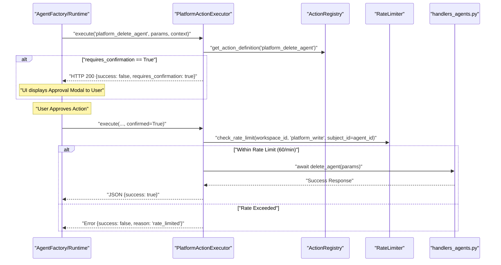
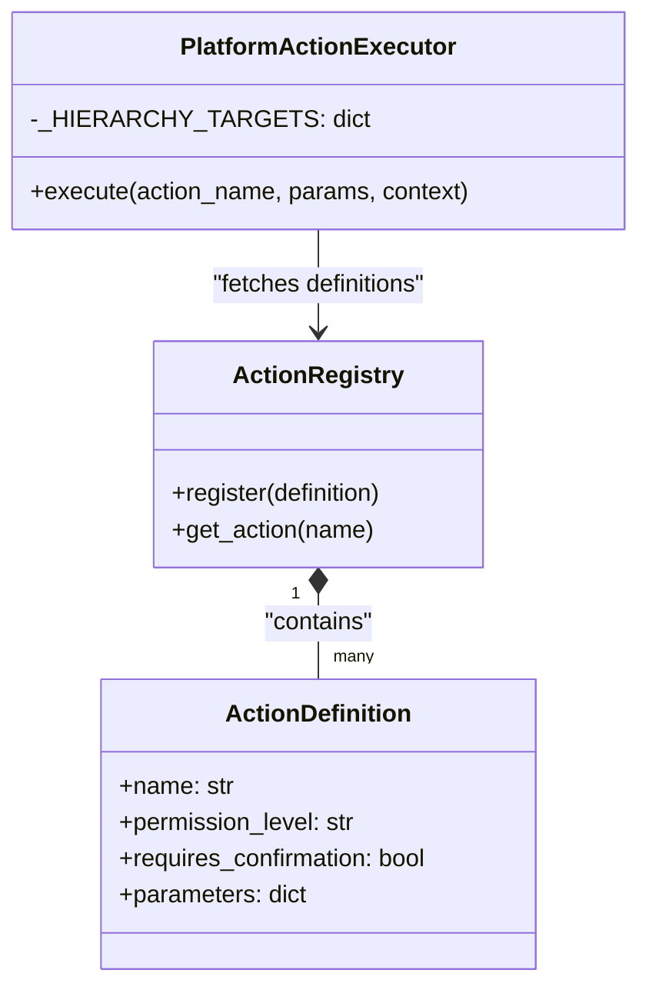

# Confirmation & Rate Limiting

<details>
<summary>Relevant source files</summary>

The following files were used as context for generating this wiki page:

- [orchestrator/consumers/chatbot/auto.py](orchestrator/consumers/chatbot/auto.py)
- [orchestrator/core/security/rate_limiter.py](orchestrator/core/security/rate_limiter.py)
- [orchestrator/core/services/auto_reporting.py](orchestrator/core/services/auto_reporting.py)
- [orchestrator/core/services/notification_dispatcher.py](orchestrator/core/services/notification_dispatcher.py)
- [orchestrator/modules/tools/discovery/actions_auto_reporting.py](orchestrator/modules/tools/discovery/actions_auto_reporting.py)
- [orchestrator/modules/tools/discovery/handlers_auto_reporting.py](orchestrator/modules/tools/discovery/handlers_auto_reporting.py)
- [orchestrator/modules/tools/discovery/platform_actions.py](orchestrator/modules/tools/discovery/platform_actions.py)
- [orchestrator/modules/tools/discovery/platform_executor.py](orchestrator/modules/tools/discovery/platform_executor.py)
- [orchestrator/tests/test_prd128_notification_dispatcher.py](orchestrator/tests/test_prd128_notification_dispatcher.py)

</details>


This page documents the confirmation workflow, permission enforcement, and rate limiting mechanisms for platform actions. These systems provide safety guardrails when agents attempt to modify workspace resources or access sensitive infrastructure tools.

---

## Overview

Platform actions (PRD-64) are protected by a multi-layered security and governance stack. When an agent attempts to execute an action, the system evaluates it against four primary gates:

1.  **Admin Enforcement**: Gating infrastructure-level tools (e.g., log querying, system health) to users with `admin` or `owner` roles.
2.  **Confirmation Gate**: Actions marked with `requires_confirmation=True` return a special response prompting the user for approval via the UI.
3.  **Rate Limiting**: Write and destructive actions are throttled to **60 actions per minute** per subject (agent) to prevent autonomous loops from exhausting resources.
4.  **Hierarchy Permissions**: A recursive check ensuring an agent has the authority to modify a specific target (e.g., another agent or a playbook).

**Sources:** [orchestrator/modules/tools/discovery/platform_executor.py:1-9](), [orchestrator/modules/tools/discovery/platform_actions.py:1-10](), [orchestrator/core/security/rate_limiter.py:52-57]()

---

## Permission & Access Control

### Permission Levels
Actions are categorized into tiers within their `ActionDefinition` [orchestrator/modules/tools/discovery/platform_actions.py:12-35](). This categorization determines whether the execution requires explicit user confirmation or is subject to rate limiting.

| Permission Level | Description | Confirmation | Rate Limited |
| :--- | :--- | :--- | :--- |
| `read` | Non-mutating queries (e.g., `platform_list_agents`) | No | No |
| `write` | Resource modification (e.g., `platform_create_agent`) | Configurable | Yes |
| `destructive` | Data deletion (e.g., `platform_delete_document`) | **Mandatory** | Yes |

### Hierarchy Permissions (PRD-140)
The system implements a `_HIERARCHY_TARGETS` map that associates mutating actions with specific target types such as `TARGET_AGENT`, `TARGET_PLAYBOOK`, or `TARGET_TASK` [orchestrator/modules/tools/discovery/platform_executor.py:209-226](). The `can_actor_modify` utility is called to ensure that the calling agent has sufficient hierarchy depth to perform the operation.

**Sources:** [orchestrator/modules/tools/discovery/platform_executor.py:182-207](), [orchestrator/modules/tools/discovery/platform_actions.py:85-86]()

---

## Confirmation Flow Architecture

The `PlatformActionExecutor` intercepts requests before they reach domain handlers. If an action requires confirmation (defined in `ActionDefinition.requires_confirmation`), it halts execution and returns a structured request for user intervention.

### Platform Action Safety Sequence


**Sources:** [orchestrator/modules/tools/discovery/platform_executor.py:5-28](), [orchestrator/core/security/rate_limiter.py:72-85](), [orchestrator/modules/tools/discovery/actions_auto_reporting.py:85-86]()

---

## Rate Limiting & Loop Prevention

### Per-Subject Throttling
The system uses Redis sliding window counters to enforce limits. While the legacy behavior was workspace-wide, the current implementation supports `subject_id` scoping (typically the `agent_id`) [orchestrator/core/security/rate_limiter.py:19-21]().

*   **Platform Write Limit**: Defaulted to **60 requests per 60 seconds** [orchestrator/core/security/rate_limiter.py:56-57]().
*   **Implementation**: Uses Redis sorted sets (`zadd`, `zremrangebyscore`, `zcard`) to track request timestamps within the window [orchestrator/core/security/rate_limiter.py:101-110]().
*   **Fail-Open**: If Redis is unavailable, the system logs a warning but allows the request to proceed to ensure high availability [orchestrator/core/security/rate_limiter.py:130-133]().

### Complexity Assessment (AutoBrain)
The `AutoBrain` service performs a 3-tier assessment of incoming messages to determine complexity levels (ATOM to ORGANISM) [orchestrator/consumers/chatbot/auto.py:14-17](). This prevents simple "chitchat" from triggering expensive tool-heavy workflows.
*   **Tier 1**: Redis cache lookup [orchestrator/consumers/chatbot/auto.py:15]().
*   **Tier 2**: Regex fast-paths for greetings and platform keywords [orchestrator/consumers/chatbot/auto.py:16](), [orchestrator/consumers/chatbot/auto.py:92-114]().
*   **Tier 3**: LLM classification [orchestrator/consumers/chatbot/auto.py:17]().

**Sources:** [orchestrator/core/security/rate_limiter.py:45-57](), [orchestrator/consumers/chatbot/auto.py:5-22]()

---

## Code Entity Mapping

### Tool Discovery & Permission Filtering

**Sources:** [orchestrator/modules/tools/discovery/platform_actions.py:38-66](), [orchestrator/modules/tools/discovery/platform_executor.py:209-226]()

### Execution Guardrail Logic
```mermaid
stateDiagram-v2
    [*] --> "PlatformActionExecutor.execute"
    "PlatformActionExecutor.execute" --> HierarchyCheck: "Verify can_actor_modify"
    HierarchyCheck --> CheckConfirmation: "Authorized"
    HierarchyCheck --> Denied: "Permission Denied"
    
    CheckConfirmation --> ReturnConfirmation: "requires_confirmation=True AND confirmed=False"
    CheckConfirmation --> CheckRateLimit: "confirmed=True"
    
    CheckRateLimit --> ExecuteHandler: "Within 60/min per agent"
    CheckRateLimit --> RateLimited: "429 Too Many Requests"
    
    ExecuteHandler --> [*]
```
**Sources:** [orchestrator/modules/tools/discovery/platform_executor.py:182-207](), [orchestrator/core/security/rate_limiter.py:72-127]()

---

## Technical Summary

| Logic Step | Code Entity | File Reference |
| :--- | :--- | :--- |
| **Complexity Check** | `AutoBrain` | [orchestrator/consumers/chatbot/auto.py:2-22]() |
| **Tool Dispatch** | `PlatformActionExecutor` | [orchestrator/modules/tools/discovery/platform_executor.py:5-9]() |
| **Rate Limiting** | `check_rate_limit` | [orchestrator/core/security/rate_limiter.py:72-78]() |
| **Action Definition** | `ActionDefinition` | [orchestrator/modules/tools/discovery/action_registry.py:1-20]() |
| **Hierarchy Check** | `can_actor_modify` | [orchestrator/modules/tools/discovery/platform_executor.py:199-207]() |

**Sources:** [orchestrator/modules/tools/discovery/platform_executor.py:1-226](), [orchestrator/core/security/rate_limiter.py:45-57](), [orchestrator/consumers/chatbot/auto.py:59-84]()

---