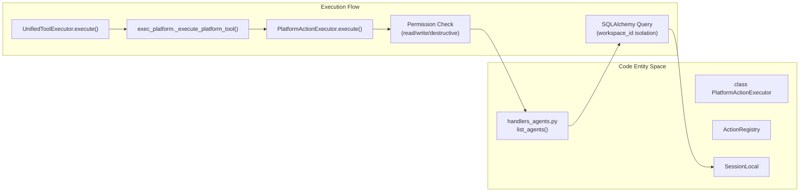
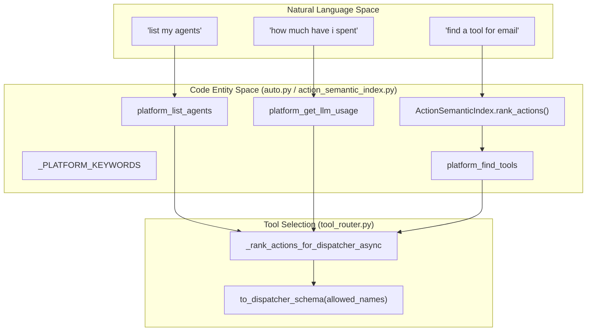

# Platform Action System

Relevant source files

The following files were used as context for generating this wiki page:

- [orchestrator/api/chat.py](orchestrator/api/chat.py)
- [orchestrator/api/routing.py](orchestrator/api/routing.py)
- [orchestrator/consumers/chatbot/auto.py](orchestrator/consumers/chatbot/auto.py)
- [orchestrator/consumers/chatbot/service.py](orchestrator/consumers/chatbot/service.py)
- [orchestrator/consumers/chatbot/tool_router.py](orchestrator/consumers/chatbot/tool_router.py)
- [orchestrator/core/llm/manager.py](orchestrator/core/llm/manager.py)
- [orchestrator/core/routing/engine.py](orchestrator/core/routing/engine.py)
- [orchestrator/modules/agents/factory/agent_factory.py](orchestrator/modules/agents/factory/agent_factory.py)
- [orchestrator/modules/context/sections/platform_actions.py](orchestrator/modules/context/sections/platform_actions.py)
- [orchestrator/modules/context/sections/tools.py](orchestrator/modules/context/sections/tools.py)
- [orchestrator/modules/tools/discovery/action_registry.py](orchestrator/modules/tools/discovery/action_registry.py)
- [orchestrator/modules/tools/discovery/action_semantic_index.py](orchestrator/modules/tools/discovery/action_semantic_index.py)
- [orchestrator/modules/tools/discovery/platform_actions.py](orchestrator/modules/tools/discovery/platform_actions.py)
- [orchestrator/modules/tools/discovery/platform_executor.py](orchestrator/modules/tools/discovery/platform_executor.py)
- [orchestrator/modules/tools/execution/unified_executor.py](orchestrator/modules/tools/execution/unified_executor.py)
- [orchestrator/modules/tools/registry/tool_registry.py](orchestrator/modules/tools/registry/tool_registry.py)
- [orchestrator/modules/tools/services/composio_hint_service.py](orchestrator/modules/tools/services/composio_hint_service.py)
- [orchestrator/modules/tools/services/composio_tool_service.py](orchestrator/modules/tools/services/composio_tool_service.py)
- [orchestrator/modules/tools/tool_router.py](orchestrator/modules/tools/tool_router.py)
- [orchestrator/scripts/setup_jira_trigger.py](orchestrator/scripts/setup_jira_trigger.py)
- [orchestrator/services/heartbeat_service.py](orchestrator/services/heartbeat_service.py)
- [orchestrator/services/page_context.py](orchestrator/services/page_context.py)
- [orchestrator/tests/test_action_registry_filtered.py](orchestrator/tests/test_action_registry_filtered.py)
- [orchestrator/tests/test_action_semantic_index.py](orchestrator/tests/test_action_semantic_index.py)
- [orchestrator/tests/test_platform_actions_section.py](orchestrator/tests/test_platform_actions_section.py)
- [orchestrator/tests/test_prd221_page_context.py](orchestrator/tests/test_prd221_page_context.py)
- [orchestrator/tests/test_prd221_page_prior_tools.py](orchestrator/tests/test_prd221_page_prior_tools.py)
- [orchestrator/tests/test_tool_router_semantic.py](orchestrator/tests/test_tool_router_semantic.py)

The Platform Action System enables AI agents to introspect and manage the Automatos platform itself through structured, permission-controlled actions. This self-management capability allows agents to list resources, create agents, query data, manage workflows, and monitor system health without requiring direct database access or API knowledge.

## Architecture Overview

The platform action system consists of three core layers: **Action Definitions** (the catalog), **Detection & Routing** (AutoBrain and Semantic Indexing), and **Execution** (PlatformActionExecutor with direct database queries).

Title: Platform Action System Architecture

```mermaid
graph TB
    subgraph "1. Action Definition Layer"
        Registry["ActionRegistry<br/>(action_registry.py)"]
        Def1["ActionDefinition<br/>name: platform_list_agents<br/>promoted: true<br/>admin_only: false"]
        Def2["ActionDefinition<br/>name: platform_get_logs<br/>promoted: false<br/>admin_only: true"]
        
        Registry -->|"register()"| Def1
        Registry -->|"register()"| Def2
    end
    
    subgraph "2. Discovery & Routing"
        AutoBrain["AutoBrain<br/>(auto.py)"]
        SemIndex["ActionSemanticIndex<br/>(action_semantic_index.py)"]
        Keywords["_PLATFORM_KEYWORDS<br/>phrase → action mapping"]
        ToolRouter["ToolRouter<br/>(tool_router.py)"]
        
        AutoBrain -->|"_match_platform_query()"| Keywords
        ToolRouter -->|"_rank_actions_for_dispatcher_async()"| SemIndex
    end
    
    subgraph "3. Execution Layer"
        UnifiedExec["UnifiedToolExecutor<br/>(unified_executor.py)"]
        Executor["PlatformActionExecutor<br/>(platform_executor.py)"]
        Handlers["handlers_*.py<br/>Domain Handlers"]
        DB[("PostgreSQL<br/>workspace-scoped")]
        
        UnifiedExec -->|"execute_tool()"| Executor
        Executor -->|"Permission Check"| Handlers
        Handlers -->|"SQLAlchemy"| DB
    end
```

**Key insight:** Platform actions bypass the external tool integration layer (Composio) entirely. They use direct database queries via specialized handlers for speed and security, as the orchestrator owns the schema [orchestrator/modules/tools/discovery/platform_executor.py:5-9]().

**Sources:**
- [orchestrator/modules/tools/discovery/platform_executor.py:5-9]()
- [orchestrator/consumers/chatbot/auto.py:1-149]()
- [orchestrator/modules/tools/discovery/action_registry.py:59-78]()

---

## Core Components

### ActionRegistry & ActionDefinition

The `ActionRegistry` maintains a catalog of all available platform actions. It stores `ActionDefinition` objects indexed by action name. These definitions are split into domain-specific files (e.g., `actions_agents.py`, `actions_playbooks.py`) and aggregated in the `register_all_actions` entry point [orchestrator/modules/tools/discovery/platform_actions.py:53-99]().

| Field | Type | Purpose |
|-------|------|---------|
| `name` | `str` | Unique identifier (e.g. `platform_list_agents`) [orchestrator/modules/tools/discovery/action_registry.py:31](). |
| `permission_level` | `str` | `read`, `write`, or `destructive` [orchestrator/modules/tools/discovery/action_registry.py:35](). |
| `admin_only` | `bool` | If true, only workspace owners/admins can execute [orchestrator/modules/tools/discovery/action_registry.py:38](). |
| `super_admin_only` | `bool` | Fail-closed observability tier for operators [orchestrator/modules/tools/discovery/action_registry.py:42](). |
| `promoted` | `bool` | Exposed as a first-class tool schema instead of inside the dispatcher [orchestrator/modules/tools/discovery/action_registry.py:43](). |

**Sources:**
- [orchestrator/modules/tools/discovery/action_registry.py:28-56]()
- [orchestrator/modules/tools/discovery/platform_actions.py:53-99]()

### PlatformActionExecutor

The `PlatformActionExecutor` routes platform actions to domain-specific handler modules. Each handler is a standalone async function (e.g., `list_agents`, `create_mission`) that performs workspace-scoped operations [orchestrator/modules/tools/discovery/platform_executor.py:5-9](). The `UnifiedToolExecutor` [orchestrator/modules/tools/execution/unified_executor.py:58-64]() is responsible for dispatching to the correct executor, including `exec_platform` [orchestrator/modules/tools/execution/unified_executor.py:28]() which then calls `PlatformActionExecutor`.

Title: Execution Logic and Workspace Isolation

**Sources:**
- [orchestrator/modules/tools/discovery/platform_executor.py:19-231]()
- [orchestrator/modules/tools/execution/unified_executor.py:98]()
- [orchestrator/modules/tools/execution/unified_executor.py:28]()

---

## Permission & Security Model

Platform actions use a multi-tier security model enforced at the execution layer to prevent unauthorized access to system internals or cross-tenant data.

### Permission Levels
- **Read**: Non-mutating queries (e.g., `platform_list_agents`).
- **Write**: Mutates state (e.g., `platform_create_agent`).
- **Destructive**: Permanent deletion. These actions, such as `platform_delete_agent`, may require explicit confirmation (`requires_confirmation=True`) [orchestrator/modules/tools/discovery/action_registry.py:36]().

### Administrative Gating
- **Admin-Only**: Infrastructure and observability tools restricted to workspace admins [orchestrator/modules/tools/discovery/action_registry.py:38]().
- **Super-Admin-Only**: PRD-143 oversight tier for operators. Fail-closed; these are excluded from all listings unless `include_super_admin=True` is explicitly passed [orchestrator/modules/tools/discovery/action_registry.py:39-42]().

**Sources:**
- [orchestrator/modules/tools/discovery/action_registry.py:35-43]()
- [orchestrator/modules/tools/discovery/action_registry.py:111-131]()

---

## Detection & Discovery

Platform actions are discovered via three mechanisms:

1. **AutoBrain Keywords**: Heuristic regex matching for fast detection of platform intent (e.g., "list my agents" -> `platform_list_agents`) [orchestrator/consumers/chatbot/auto.py:74-76]().
2. **Semantic Indexing**: `ActionSemanticIndex` embeds action descriptions and examples, ranking them by cosine similarity to the user query [orchestrator/modules/tools/discovery/action_semantic_index.py:5-8]().
3. **Promoted Tools**: High-frequency actions are marked as `promoted` and included as first-class schemas in the LLM prompt, bypassing the `platform_execute` dispatcher [orchestrator/modules/tools/discovery/action_registry.py:138-161]().

Title: Natural Language to Platform Action Mapping

**Sources:**
- [orchestrator/consumers/chatbot/auto.py:74-76]()
- [orchestrator/modules/tools/discovery/action_semantic_index.py:5-8]()
- [orchestrator/modules/tools/discovery/action_registry.py:138-161]()

---

## Execution Flow

When a platform action is triggered, the system follows a specific sequence:

1. **Intent Analysis**: `AutoBrain` identifies platform keywords and injects `tool_hints` [orchestrator/consumers/chatbot/auto.py:74-76]().
2. **Semantic Narrowing**: If `SEMANTIC_TOOL_ROUTING` is enabled, the system ranks platform actions and narrows the `platform_execute` enum to the Top-K relevant items [orchestrator/modules/tools/tool_router.py:54-55]().
3. **Execution Dispatch**: `UnifiedToolExecutor` routes the call to `exec_platform._execute_platform_tool()` [orchestrator/modules/tools/execution/unified_executor.py:98]() which then calls `PlatformActionExecutor.execute()` [orchestrator/modules/tools/discovery/platform_executor.py:252-270]().
4. **Workspace Isolation**: The handler function executes using a workspace-scoped SQLAlchemy session [orchestrator/modules/tools/discovery/platform_executor.py:8-9]().
5. **Telemetry**: The action name and result are resolved and recorded for platform analytics [orchestrator/consumers/chatbot/service.py:36-37]() via `resolve_action_name` [orchestrator/consumers/chatbot/service.py:36]().

**Sources:**
- [orchestrator/consumers/chatbot/auto.py:74-76]()
- [orchestrator/modules/tools/tool_router.py:54-55]()
- [orchestrator/modules/tools/execution/unified_executor.py:98]()
- [orchestrator/modules/tools/discovery/platform_executor.py:252-270]()
- [orchestrator/modules/tools/discovery/platform_executor.py:8-9]()
- [orchestrator/consumers/chatbot/service.py:36-37]()

---