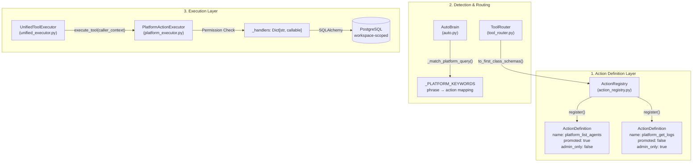
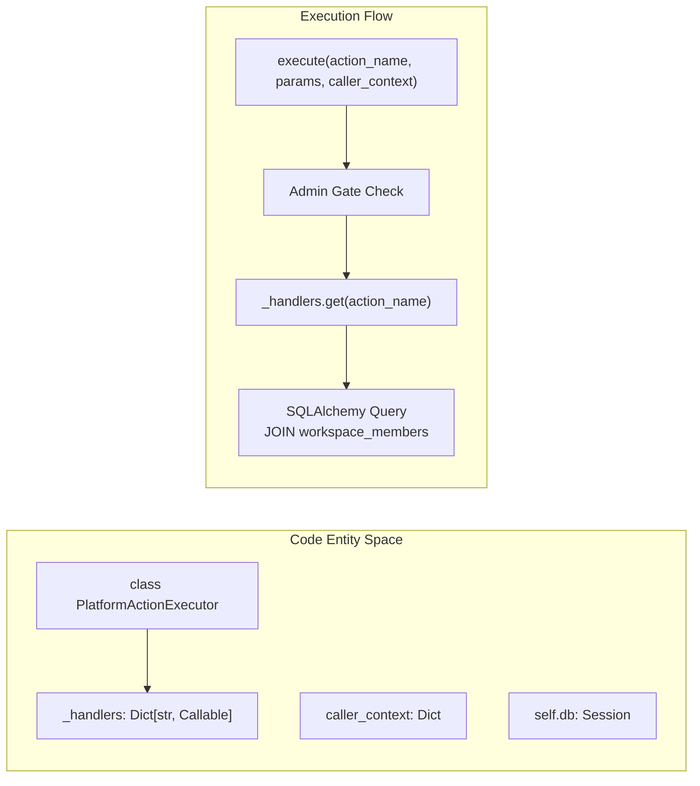
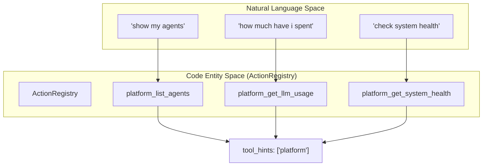

# Platform Action System

Relevant source files

The following files were used as context for generating this wiki page:

- [orchestrator/alembic/versions/prd123_checkpoint_count.py](orchestrator/alembic/versions/prd123_checkpoint_count.py)
- [orchestrator/api/missions.py](orchestrator/api/missions.py)
- [orchestrator/config.py](orchestrator/config.py)
- [orchestrator/core/context_guard.py](orchestrator/core/context_guard.py)
- [orchestrator/core/models/orchestration.py](orchestrator/core/models/orchestration.py)
- [orchestrator/core/models/orchestration_enums.py](orchestrator/core/models/orchestration_enums.py)
- [orchestrator/main.py](orchestrator/main.py)
- [orchestrator/modules/coordination/dispatcher.py](orchestrator/modules/coordination/dispatcher.py)
- [orchestrator/modules/coordination/planner.py](orchestrator/modules/coordination/planner.py)
- [orchestrator/modules/coordination/reconciler.py](orchestrator/modules/coordination/reconciler.py)
- [orchestrator/modules/memory/context_router.py](orchestrator/modules/memory/context_router.py)
- [orchestrator/modules/memory/unified_memory_service.py](orchestrator/modules/memory/unified_memory_service.py)
- [orchestrator/modules/tools/discovery/action_registry.py](orchestrator/modules/tools/discovery/action_registry.py)
- [orchestrator/modules/tools/discovery/actions_agents.py](orchestrator/modules/tools/discovery/actions_agents.py)
- [orchestrator/modules/tools/discovery/actions_assignments.py](orchestrator/modules/tools/discovery/actions_assignments.py)
- [orchestrator/modules/tools/discovery/actions_documents.py](orchestrator/modules/tools/discovery/actions_documents.py)
- [orchestrator/modules/tools/discovery/actions_marketplace.py](orchestrator/modules/tools/discovery/actions_marketplace.py)
- [orchestrator/modules/tools/discovery/actions_missions.py](orchestrator/modules/tools/discovery/actions_missions.py)
- [orchestrator/modules/tools/discovery/actions_monitoring.py](orchestrator/modules/tools/discovery/actions_monitoring.py)
- [orchestrator/modules/tools/discovery/actions_playbooks.py](orchestrator/modules/tools/discovery/actions_playbooks.py)
- [orchestrator/modules/tools/discovery/actions_reports.py](orchestrator/modules/tools/discovery/actions_reports.py)
- [orchestrator/modules/tools/discovery/actions_scheduling.py](orchestrator/modules/tools/discovery/actions_scheduling.py)
- [orchestrator/modules/tools/discovery/actions_search.py](orchestrator/modules/tools/discovery/actions_search.py)
- [orchestrator/modules/tools/discovery/actions_workspace.py](orchestrator/modules/tools/discovery/actions_workspace.py)
- [orchestrator/modules/tools/discovery/handlers_agents.py](orchestrator/modules/tools/discovery/handlers_agents.py)
- [orchestrator/modules/tools/discovery/handlers_reports.py](orchestrator/modules/tools/discovery/handlers_reports.py)
- [orchestrator/modules/tools/execution/concurrency.py](orchestrator/modules/tools/execution/concurrency.py)
- [orchestrator/services/checkpoint_service.py](orchestrator/services/checkpoint_service.py)
- [orchestrator/services/coordinator_service.py](orchestrator/services/coordinator_service.py)
- [orchestrator/services/orchestration_state.py](orchestrator/services/orchestration_state.py)
- [orchestrator/tests/test_budget_gate.py](orchestrator/tests/test_budget_gate.py)
- [orchestrator/tests/test_dispatcher_parallel.py](orchestrator/tests/test_dispatcher_parallel.py)
- [orchestrator/tests/test_unified_memory.py](orchestrator/tests/test_unified_memory.py)
- [scripts/ralph/IMPLEMENTATION_PLAN.md](scripts/ralph/IMPLEMENTATION_PLAN.md)
- [scripts/ralph/progress.txt](scripts/ralph/progress.txt)

The Platform Action System enables AI agents to introspect and manage the Automatos platform itself through structured, permission-controlled actions. This self-management capability allows agents to list resources, create agents, query data, manage workflows, and monitor system health without requiring direct database access or API knowledge.

## Architecture Overview

The platform action system consists of three core layers: **Action Definitions** (the catalog), **Detection & Routing** (AutoBrain keyword matching), and **Execution** (PlatformActionExecutor with direct database queries). Recent updates in **PRD-122** have introduced "Promoted Actions," allowing high-value platform tools to be exposed as first-class OpenAI tool schemas rather than being hidden behind a single dispatcher [scripts/ralph/IMPLEMENTATION_PLAN.md:1-15]().

Title: Platform Action System Architecture

**Key insight:** Platform actions bypass the Composio integration layer entirely. They use direct database queries for speed and simplicity, as the orchestrator owns the schema.

**Sources:**
- [orchestrator/modules/tools/discovery/action_registry.py:55-74]()
- [scripts/ralph/IMPLEMENTATION_PLAN.md:9-19]()
- [scripts/ralph/progress.txt:11-20]()

---

## Core Components

### ActionRegistry & ActionDefinition

The `ActionRegistry` maintains a catalog of all available platform actions. It stores `ActionDefinition` objects indexed by action name. These definitions are split into domain-specific files (e.g., `actions_agents.py`, `actions_marketplace.py`) and aggregated in the main registration entry point [orchestrator/modules/tools/discovery/action_registry.py:67-74]().

| Field | Type | Purpose |
|-------|------|---------|
| `name` | `str` | Unique identifier (e.g. `platform_list_agents`) [orchestrator/modules/tools/discovery/action_registry.py:31]() |
| `permission_level` | `str` | `read`, `write`, or `destructive` [orchestrator/modules/tools/discovery/action_registry.py:35]() |
| `admin_only` | `bool` | If true, only workspace owners/admins can execute [orchestrator/modules/tools/discovery/action_registry.py:38]() |
| `promoted` | `bool` | If true, exposed as a first-class tool schema to LLMs [orchestrator/modules/tools/discovery/action_registry.py:39]() |

**Sources:**
- [orchestrator/modules/tools/discovery/action_registry.py:27-52]()
- [scripts/ralph/IMPLEMENTATION_PLAN.md:23-35]()
- [scripts/ralph/progress.txt:49-56]()

### PlatformActionExecutor

The `PlatformActionExecutor` class handles actual execution. It is initialized with a database session and a `workspace_id` to ensure all operations are strictly isolated to the current tenant.

Title: Execution Logic and Workspace Isolation

**Sources:**
- [scripts/ralph/IMPLEMENTATION_PLAN.md:26]()
- [scripts/ralph/progress.txt:21-32]()

---

## Permission & Security Model

Platform actions use a multi-tier security model enforced at the execution layer to prevent unauthorized access to system internals or cross-tenant data.

### Permission Levels
- **Read**: Non-mutating queries (e.g., `platform_list_agents`).
- **Write**: Mutates state (e.g., `platform_create_agent`).
- **Destructive**: Permanent deletion (e.g., `platform_delete_agent`). If an action is marked `destructive` but `requires_confirmation` is false, the system rejects it as a misconfiguration [scripts/ralph/progress.txt:28-31]().

### Admin Gating (PRD-122)
Certain infrastructure tools (e.g., `platform_query_loki_logs`, `platform_query_prometheus`, `platform_get_system_health`) are marked `admin_only=True` [scripts/ralph/progress.txt:3-8]().
- **Enforcement**: The `PlatformActionExecutor` checks the `caller_context`. Access is granted only if the user has a `workspace_role` of `owner` or `admin`, or a `system_role` == `admin` [scripts/ralph/progress.txt:21-27]().
- **Fail-Closed**: If no `caller_context` is provided (no identity), admin-only actions are denied [scripts/ralph/progress.txt:25]().

**Sources:**
- [scripts/ralph/progress.txt:3-32]()
- [orchestrator/modules/tools/discovery/action_registry.py:35-38]()

---

## Detection & Discovery

Platform actions are detected by **AutoBrain** during complexity assessment using keyword pattern matching. When a user query matches a platform keyword, AutoBrain sets `tool_hints` accordingly to include platform capabilities.

Title: Natural Language to Platform Action Mapping

High-value actions marked as `promoted=True` bypass the generic `platform_execute` dispatcher and are presented to the LLM as distinct tools. These include:
- **Agents:** `platform_list_agents`, `platform_create_agent`, `platform_update_agent` [scripts/ralph/progress.txt:69-70]()
- **Marketplace:** `platform_browse_marketplace_agents`, `platform_install_skill` [scripts/ralph/progress.txt:70-71]()
- **Memory:** `platform_store_memory`, `platform_search_memory` [scripts/ralph/progress.txt:71-73]()

**Sources:**
- [scripts/ralph/progress.txt:68-76]()
- [orchestrator/modules/tools/discovery/action_registry.py:114-134]()

---

## Execution Flow

When a platform action is triggered, the system follows a specific sequence to ensure security and context-awareness.

1. **Schema Generation**: `ActionRegistry.to_first_class_schemas()` generates OpenAI function schemas for promoted actions [orchestrator/modules/tools/discovery/action_registry.py:119-134]().
2. **Unified Execution**: `UnifiedToolExecutor.execute_tool()` receives the request and forwards the `caller_context` to the specific executor [scripts/ralph/progress.txt:11-19]().
3. **Permission Gate**: `PlatformActionExecutor` verifies `admin_only` and `destructive` constraints before proceeding [scripts/ralph/progress.txt:21-31]().
4. **Database Query**: The action handler is called with the active SQLAlchemy session. Multi-tenancy is enforced via `workspace_id` filtering [scripts/ralph/progress.txt:42-46]().
5. **Logging**: All permission denials are logged at the `WARNING` level with the action name and sanitized context [scripts/ralph/progress.txt:27]().

**Sources:**
- [orchestrator/modules/tools/discovery/action_registry.py:119-150]()
- [scripts/ralph/progress.txt:11-46]()
- [scripts/ralph/IMPLEMENTATION_PLAN.md:41-45]()

---