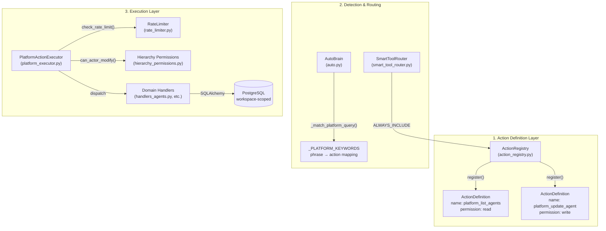
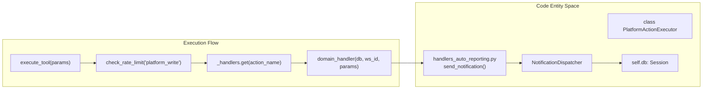
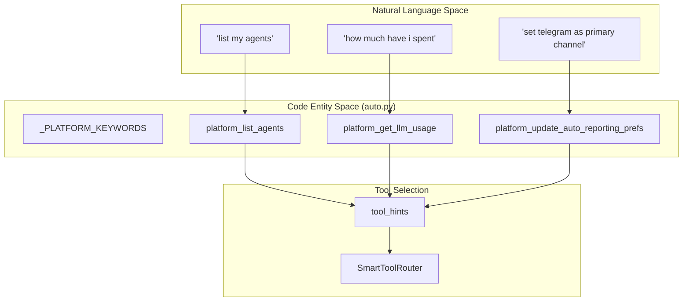

# Platform Action System

Relevant source files

The following files were used as context for generating this wiki page:

- [orchestrator/consumers/chatbot/auto.py](orchestrator/consumers/chatbot/auto.py)
- [orchestrator/core/security/rate_limiter.py](orchestrator/core/security/rate_limiter.py)
- [orchestrator/core/services/auto_reporting.py](orchestrator/core/services/auto_reporting.py)
- [orchestrator/core/services/notification_dispatcher.py](orchestrator/core/services/notification_dispatcher.py)
- [orchestrator/modules/tools/discovery/actions_auto_reporting.py](orchestrator/modules/tools/discovery/actions_auto_reporting.py)
- [orchestrator/modules/tools/discovery/handlers_auto_reporting.py](orchestrator/modules/tools/discovery/handlers_auto_reporting.py)
- [orchestrator/modules/tools/discovery/platform_actions.py](orchestrator/modules/tools/discovery/platform_actions.py)
- [orchestrator/modules/tools/discovery/platform_executor.py](orchestrator/modules/tools/discovery/platform_executor.py)
- [orchestrator/tests/test_prd128_notification_dispatcher.py](orchestrator/tests/test_prd128_notification_dispatcher.py)

The Platform Action System enables AI agents to introspect and manage the Automatos platform itself through structured, permission-controlled actions. This self-management capability allows agents to list resources, create agents, query data, manage workflows, and monitor system health without requiring direct database access or API knowledge.

## Architecture Overview

The platform action system consists of three core layers: **Action Definitions** (the catalog), **Detection & Routing** (AutoBrain keyword matching), and **Execution** (PlatformActionExecutor with direct domain handlers).

Title: Platform Action System Architecture

**Key insight:** Platform actions bypass the external tool integration layer (Composio) entirely. They use direct database queries via specialized handlers for speed and security, as the orchestrator owns the schema [orchestrator/modules/tools/discovery/platform_executor.py:5-9]().

**Sources:**
- [orchestrator/modules/tools/discovery/platform_executor.py:1-9]()
- [orchestrator/consumers/chatbot/auto.py:116-127]()
- [orchestrator/core/security/rate_limiter.py:45-57]()

---

## Core Components

### ActionRegistry & ActionDefinition

The `ActionRegistry` maintains a catalog of all available platform actions. It stores `ActionDefinition` objects indexed by action name. These definitions are split into domain-specific files and aggregated in the `register_all_actions` entry point [orchestrator/modules/tools/discovery/platform_actions.py:38-66]().

| Field | Type | Purpose |
|-------|------|---------|
| `name` | `str` | Unique identifier (e.g. `platform_list_agents`). |
| `permission_level` | `str` | `read`, `write`, or `destructive`. |
| `requires_confirmation` | `bool` | If true, UI forces user approval before execution. |
| `category` | `str` | Logical grouping (e.g., `settings`, `agents`, `analytics`). |

**Sources:**
- [orchestrator/modules/tools/discovery/platform_actions.py:1-66]()
- [orchestrator/modules/tools/discovery/actions_auto_reporting.py:14-154]()

### PlatformActionExecutor

The `PlatformActionExecutor` class handles actual execution. It is initialized with a database session and a `workspace_id` to ensure all operations are strictly isolated to the current tenant [orchestrator/modules/tools/discovery/platform_executor.py:8-9](). It maintains a mapping of action names to their respective handler functions across 20+ domain modules [orchestrator/modules/tools/discovery/platform_executor.py:19-177]().

Title: Execution Logic and Entity Association

**Sources:**
- [orchestrator/modules/tools/discovery/platform_executor.py:19-177]()
- [orchestrator/modules/tools/discovery/handlers_auto_reporting.py:57-104]()
- [orchestrator/core/services/notification_dispatcher.py:76-111]()

---

## Permission & Security Model

Platform actions use a multi-tier security model enforced at the execution layer to prevent unauthorized access or resource exhaustion.

### Permission Levels & Rate Limiting
- **Read**: Non-mutating queries (e.g., `platform_get_auto_reporting_prefs`) [orchestrator/modules/tools/discovery/actions_auto_reporting.py:28]().
- **Write/Destructive**: Mutates state. These actions are governed by the `platform_write` rate limit, which allows 60 operations per minute per subject (agent) [orchestrator/core/security/rate_limiter.py:56-57]().
- **Confirmation**: Destructive or high-impact actions like `platform_update_auto_reporting_prefs` require explicit confirmation (`requires_confirmation=True`) [orchestrator/modules/tools/discovery/actions_auto_reporting.py:86]().

### Hierarchy Permissions (PRD-140)
Mutating actions targeting specific entities (agents, playbooks, tasks) undergo a hierarchy check via `can_actor_modify`. The `_HIERARCHY_TARGETS` map associates action names with their target types (e.g., `TARGET_AGENT`, `TARGET_PLAYBOOK`) and the parameter key containing the ID [orchestrator/modules/tools/discovery/platform_executor.py:199-230]().

**Sources:**
- [orchestrator/core/security/rate_limiter.py:45-57]()
- [orchestrator/modules/tools/discovery/platform_executor.py:182-230]()
- [orchestrator/modules/tools/discovery/actions_auto_reporting.py:85-86]()

---

## Detection & Discovery

Platform actions are detected by **AutoBrain** during complexity assessment using keyword pattern matching. When a user query matches a platform keyword, the system identifies the appropriate tool hints.

Title: Natural Language to Platform Action Mapping

**AutoBrain** maintains a comprehensive mapping in `_PLATFORM_KEYWORDS`, covering agents, recipes, usage, documents, workspace info, tools, and auto-reporting [orchestrator/consumers/chatbot/auto.py:116-184]().

**Sources:**
- [orchestrator/consumers/chatbot/auto.py:116-184]()
- [orchestrator/modules/tools/discovery/actions_auto_reporting.py:30-34]()

---

## Unified Notification Integration

A key subset of platform actions facilitates communication through the **Unified Notification System**. The `platform_send_notification` tool allows agents to fire events that honor workspace-specific routing rules, quiet hours, and channel preferences [orchestrator/modules/tools/discovery/actions_auto_reporting.py:96-103]().

### Auto-Reporting Configuration
Agents can introspect and modify how the platform communicates via:
- `platform_get_auto_reporting_prefs`: Reads `primary_channel`, `quiet_hours`, and `routes` [orchestrator/modules/tools/discovery/actions_auto_reporting.py:15-22]().
- `platform_update_auto_reporting_prefs`: Merges partial updates into `workspace.settings.auto_reporting` [orchestrator/modules/tools/discovery/actions_auto_reporting.py:38-44]().

**Sources:**
- [orchestrator/modules/tools/discovery/handlers_auto_reporting.py:14-108]()
- [orchestrator/core/services/auto_reporting.py:42-55]()
- [orchestrator/core/services/notification_dispatcher.py:87-111]()

---