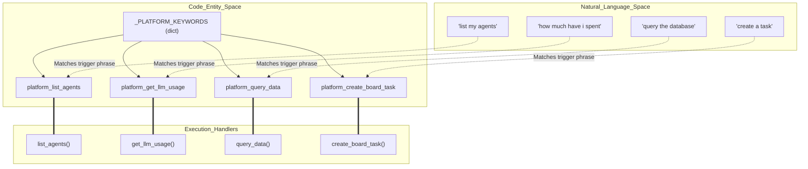
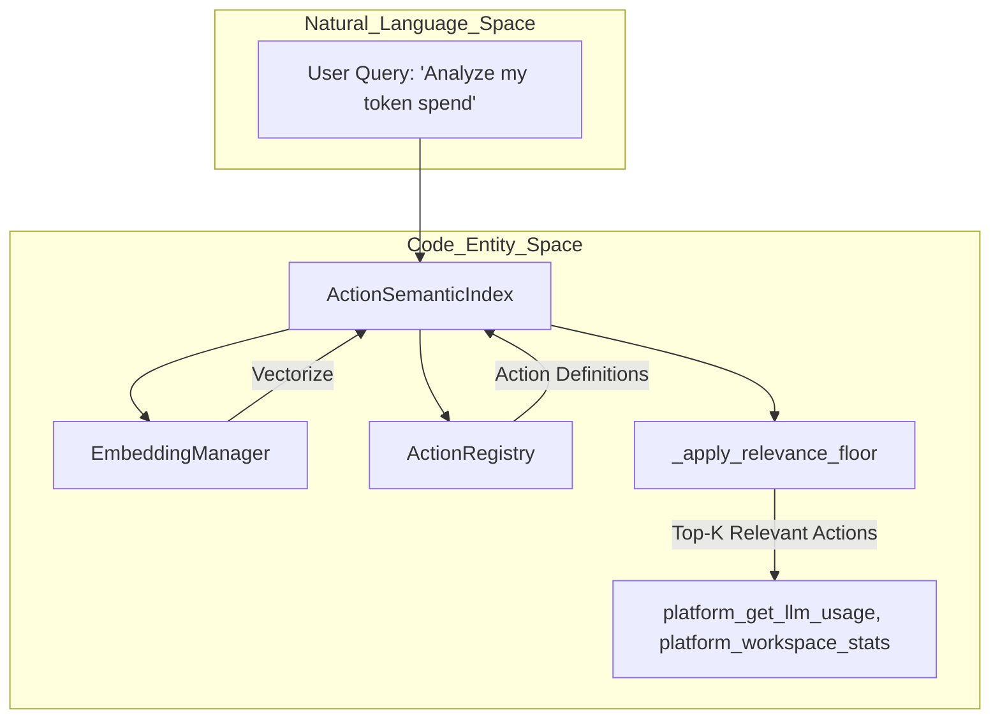
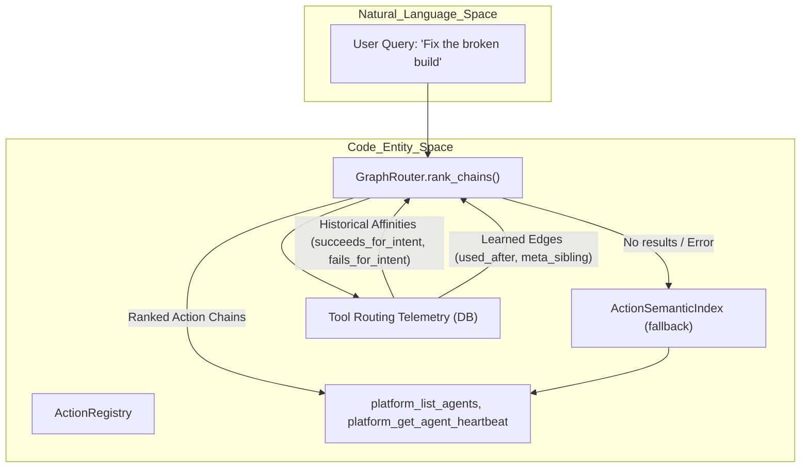

# Platform Actions Discovery

Relevant source files

The following files were used as context for generating this wiki page:

- [orchestrator/consumers/chatbot/tool_router.py](orchestrator/consumers/chatbot/tool_router.py)
- [orchestrator/core/services/edge_builder.py](orchestrator/core/services/edge_builder.py)
- [orchestrator/core/services/intent_clustering.py](orchestrator/core/services/intent_clustering.py)
- [orchestrator/modules/context/sections/platform_actions.py](orchestrator/modules/context/sections/platform_actions.py)
- [orchestrator/modules/context/sections/tools.py](orchestrator/modules/context/sections/tools.py)
- [orchestrator/modules/tools/discovery/action_registry.py](orchestrator/modules/tools/discovery/action_registry.py)
- [orchestrator/modules/tools/discovery/action_semantic_index.py](orchestrator/modules/tools/discovery/action_semantic_index.py)
- [orchestrator/modules/tools/discovery/graph_router.py](orchestrator/modules/tools/discovery/graph_router.py)
- [orchestrator/modules/tools/discovery/signal_recorder.py](orchestrator/modules/tools/discovery/signal_recorder.py)
- [orchestrator/modules/tools/execution/unified_executor.py](orchestrator/modules/tools/execution/unified_executor.py)
- [orchestrator/modules/tools/registry/tool_registry.py](orchestrator/modules/tools/registry/tool_registry.py)
- [orchestrator/modules/tools/services/composio_hint_service.py](orchestrator/modules/tools/services/composio_hint_service.py)
- [orchestrator/modules/tools/services/composio_tool_service.py](orchestrator/modules/tools/services/composio_tool_service.py)
- [orchestrator/modules/tools/tool_router.py](orchestrator/modules/tools/tool_router.py)
- [orchestrator/scripts/seed_tool_routing_graph.py](orchestrator/scripts/seed_tool_routing_graph.py)
- [orchestrator/tests/test_action_registry_filtered.py](orchestrator/tests/test_action_registry_filtered.py)
- [orchestrator/tests/test_action_semantic_index.py](orchestrator/tests/test_action_semantic_index.py)
- [orchestrator/tests/test_graph_router.py](orchestrator/tests/test_graph_router.py)
- [orchestrator/tests/test_graph_router_negative.py](orchestrator/tests/test_graph_router_negative.py)
- [orchestrator/tests/test_platform_actions_section.py](orchestrator/tests/test_platform_actions_section.py)
- [orchestrator/tests/test_platform_actions_section_graph.py](orchestrator/tests/test_platform_actions_section_graph.py)
- [orchestrator/tests/test_prd139_edge_builder.py](orchestrator/tests/test_prd139_edge_builder.py)
- [orchestrator/tests/test_prd143_graph_seed.py](orchestrator/tests/test_prd143_graph_seed.py)
- [orchestrator/tests/test_prd143_selection_at_scale.py](orchestrator/tests/test_prd143_selection_at_scale.py)
- [orchestrator/tests/test_prd143_su_surface.py](orchestrator/tests/test_prd143_su_surface.py)
- [orchestrator/tests/test_prd177_graph_router_tenant.py](orchestrator/tests/test_prd177_graph_router_tenant.py)
- [orchestrator/tests/test_tool_router_semantic.py](orchestrator/tests/test_tool_router_semantic.py)
- [orchestrator/tests/test_tool_routing_hardening.py](orchestrator/tests/test_tool_routing_hardening.py)

This page explains how platform actions are automatically detected and made available to agents based on user intent. Platform action discovery enables agents to introspect and manage the Automatos platform without manual tool configuration, bridging natural language requests to specific system management capabilities.

For the overall platform action system architecture, see [13.1 Platform Action System](). For confirmation and rate limiting of write actions, see [13.3 Confirmation & Rate Limiting]().

---

## Overview

Platform actions discovery is the process by which the system detects when a user message requires platform management capabilities (e.g., "list my agents", "show workspace stats") and automatically makes the relevant `platform_*` actions available to the responding agent.

Discovery happens in three primary phases:

1.  **AutoBrain Detection Phase**: Fast keyword matching identifies platform-related queries during complexity assessment [orchestrator/consumers/chatbot/auto.py:115-180]().
2.  **Semantic Narrowing**: If `SEMANTIC_TOOL_ROUTING` is enabled, the system uses an embedding-based index to rank the most relevant platform actions for the specific query [orchestrator/modules/tools/tool_router.py:88-104]().
3.  **Context Assembly**: The `PlatformActionsSection` in the `ContextService` injects either the full action enum or a narrowed subset into the LLM's system prompt [orchestrator/modules/tools/discovery/action_registry.py:163-185]().

Sources: [orchestrator/consumers/chatbot/auto.py:1-22](), [orchestrator/modules/tools/tool_router.py:1-15](), [orchestrator/modules/tools/discovery/action_registry.py:5-13]()

---

## AutoBrain Keyword Detection

### Platform Keywords Dictionary

AutoBrain maintains a curated dictionary `_PLATFORM_KEYWORDS` mapping each platform action name to natural language trigger phrases. This enables O(1) keyword matching during Tier 2 heuristic assessment [orchestrator/consumers/chatbot/auto.py:121-180]().

**Natural Language to Code Entity Mapping: Keyword Discovery**

Sources: [orchestrator/consumers/chatbot/auto.py:121-180](), [orchestrator/modules/tools/discovery/platform_executor.py:19-152]()

---

## Semantic Discovery (ActionSemanticIndex)

When queries are complex or don't match static keywords, the system utilizes the `ActionSemanticIndex`. This component embeds `ActionDefinition` records and ranks them by cosine similarity to the user's query [orchestrator/modules/tools/discovery/action_semantic_index.py:2-8]().

### Semantic Discovery Pipeline

Sources: [orchestrator/modules/tools/discovery/action_semantic_index.py:67-78](), [orchestrator/modules/tools/discovery/action_semantic_index.py:150-167]()

### Relevance Filtering
The system applies a "relevance floor" to semantic results using `SEMANTIC_TOOL_ROUTING_FLOOR`. This prevents the agent from seeing irrelevant platform actions if the similarity score is too low [orchestrator/modules/tools/discovery/action_semantic_index.py:62-71]().

Sources: [orchestrator/modules/tools/discovery/action_semantic_index.py:62-71]()

---

## Graph-Based Ranking

In addition to semantic similarity, the system can leverage a graph-based ranking approach when `TOOL_ROUTING_GRAPH` is enabled. This method uses historical success/failure data and learned relationships between actions to provide more intelligent recommendations.

The `PlatformActionsSection` first attempts to use graph routing via `_build_graph_filtered` [orchestrator/modules/context/sections/platform_actions.py:74-81](). If graph routing is enabled and returns results, these are prioritized. If it fails or returns no results, the system falls back to the embedding-based semantic ranking [orchestrator/modules/context/sections/platform_actions.py:82-86]().

The `GraphRouter`'s `rank_chains` method considers affinities (positive boosts for successful actions, negative penalties for failures) and edge expansions to score potential action sequences [orchestrator/tests/test_graph_router_negative.py:5-13](). This allows the system to learn which actions are most likely to succeed for a given intent.

Sources: [orchestrator/modules/context/sections/platform_actions.py:74-86](), [orchestrator/tests/test_graph_router_negative.py:5-13]()

---

## Tool Injection & Dispatcher Schema

Platform actions are primarily exposed to the LLM via a single "Dispatcher" tool called `platform_execute`. This keeps the agent's tool surface lean while allowing access to over 47+ management actions [orchestrator/modules/tools/discovery/action_registry.py:163-185]().

### Dispatcher Schema Construction
The `ActionRegistry.to_dispatcher_schema` method builds the OpenAI function schema for `platform_execute`. It dynamically populates the `action` parameter's `enum` field based on:
1.  **Admin Status**: Excludes `admin_only` actions for non-admin users [orchestrator/modules/tools/discovery/action_registry.py:175-177]().
2.  **Discovery Results**: If AutoBrain or Semantic Discovery identifies specific actions, only those are included in the `allowed_names` list [orchestrator/modules/tools/discovery/action_registry.py:180-185]().

### Always-Included "Promoted" Actions
Certain high-frequency actions are marked as `promoted=True`. These bypass the `platform_execute` dispatcher and are injected as first-class tools (e.g., `read_file`, `write_file`) to ensure the LLM uses them with maximum reliability [orchestrator/modules/tools/discovery/action_registry.py:133-161]().

Sources: [orchestrator/modules/tools/discovery/action_registry.py:133-161](), [orchestrator/modules/tools/discovery/action_registry.py:163-185]()

---

## `PlatformActionsSection` Rendering

The `PlatformActionsSection` is responsible for generating the markdown catalog of available platform actions that gets injected into the LLM's system prompt. This section has a `priority` of 5 and its `render` method determines which actions to display based on the configured routing strategy [orchestrator/modules/context/sections/platform_actions.py:39-40]().

The `render` method implements a decision tree:
- If `SEMANTIC_TOOL_ROUTING` is disabled or no query is provided, it defaults to a full dump of all actions [orchestrator/modules/context/sections/platform_actions.py:71-72]().
- If `SEMANTIC_TOOL_ROUTING` is enabled and a query is present:
    - It first attempts `_build_graph_filtered` if `TOOL_ROUTING_GRAPH` is also enabled [orchestrator/modules/context/sections/platform_actions.py:74-81]().
    - If graph routing fails or yields no results, it falls back to `_build_filtered` using the `ActionSemanticIndex` [orchestrator/modules/context/sections/platform_actions.py:82-91]().
- If semantic filtering (either graph or embedding-based) yields no results, and `_fallback_mode_closed()` is true, it renders only "pinned" actions [orchestrator/modules/context/sections/platform_actions.py:94-100]().
- Otherwise, it falls back to `_build()` which provides a full catalog of actions [orchestrator/modules/context/sections/platform_actions.py:102]().

The `_PREAMBLE` constant provides introductory text for the platform actions section, instructing the LLM on how to use `platform_execute` [orchestrator/modules/context/sections/platform_actions.py:113-119]().

Sources: [orchestrator/modules/context/sections/platform_actions.py:39-40](), [orchestrator/modules/context/sections/platform_actions.py:71-102](), [orchestrator/modules/context/sections/platform_actions.py:113-119]()

---

## `tool_hints` Injection

`tool_hints` are keywords or phrases extracted from the user's prompt that suggest relevant tools or applications. These hints are crucial for narrowing down the search space for Composio tools and platform actions.

The `ComposioHintService` uses a three-tier strategy to generate hints for Composio actions [orchestrator/modules/tools/services/composio_hint_service.py:12-16]():
1.  **Capability-based**: Matches prompt analysis to known tool capabilities [orchestrator/modules/tools/services/composio_hint_service.py:163-166]().
2.  **Token-filtered**: Uses prompt tokens to filter actions from the `ComposioActionCache` [orchestrator/modules/tools/services/composio_hint_service.py:167-170]().
3.  **Top-N fallback**: If the above fail, it provides a general list of safe actions [orchestrator/modules/tools/services/composio_hint_service.py:171-174]().

For platform actions, `tool_hints` can influence the semantic ranking process, guiding the `ActionSemanticIndex` towards more relevant actions. The `ComposioToolService` also uses `tool_hints` to scope its SDK search for Composio actions, mapping hints like "email" to apps like "gmail" [orchestrator/modules/tools/services/composio_tool_service.py:78-95]().

Sources: [orchestrator/modules/tools/services/composio_hint_service.py:12-16](), [orchestrator/modules/tools/services/composio_hint_service.py:163-174](), [orchestrator/modules/tools/services/composio_tool_service.py:78-95]()

---

## CHATBOT Mode Integration

In `CHATBOT` mode, the system optimizes for platform management. The `StreamingChatService` utilizes `AutoBrain` to assess complexity and determine if `tool_hints` should include the `platform` category [orchestrator/consumers/chatbot/service.py:43-46]().

### Execution Routing
When the LLM calls `platform_execute`, the request is routed through `PlatformActionExecutor`. This thin dispatcher maps the action name to domain-specific handler modules [orchestrator/modules/tools/execution/exec_platform.py:5-9]().

| Category | Primary Handlers |
| :--- | :--- |
| **Agents** | `list_agents`, `create_agent`, `get_agent_heartbeat` [orchestrator/modules/tools/execution/exec_platform.py:19-28]() |
| **Analytics** | `get_llm_usage`, `get_cost_breakdown`, `workspace_stats` [orchestrator/modules/tools/execution/exec_platform.py:42-47]() |
| **Workspace** | `get_workspace_info`, `store_memory`, `update_workspace_settings` [orchestrator/modules/tools/execution/exec_platform.py:69-79]() |
| **Tasks** | `create_board_task`, `list_board_tasks`, `update_board_task_status` [orchestrator/modules/tools/execution/exec_platform.py:94]() |

Sources: [orchestrator/consumers/chatbot/service.py:43-46](), [orchestrator/modules/tools/execution/exec_platform.py:5-9](), [orchestrator/modules/tools/execution/exec_platform.py:19-94]()

---

## Performance and Maintenance

### Detection Latency
*   **Tier 1 (Cache)**: <5ms via Redis lookup [orchestrator/consumers/chatbot/auto.py:15]().
*   **Tier 2 (Heuristics)**: <5ms via Regex matching [orchestrator/consumers/chatbot/auto.py:16]().
*   **Tier 3 (Semantic/LLM)**: ~200ms fallback using embeddings or cheap LLM classification [orchestrator/consumers/chatbot/auto.py:17]().

### Adding New Discovery Keywords
To enable discovery for a new platform feature:
1.  Register the action in `orchestrator/modules/tools/discovery/platform_actions.py` [orchestrator/modules/tools/discovery/action_registry.py:74-84]().
2.  Add the handler to `PlatformActionExecutor` in `exec_platform.py` [orchestrator/modules/tools/execution/exec_platform.py:19-94]().
3.  Add trigger phrases to `_PLATFORM_KEYWORDS` in `auto.py` to support fast heuristic discovery [orchestrator/consumers/chatbot/auto.py:121-180]().

Sources: [orchestrator/consumers/chatbot/auto.py:14-17](), [orchestrator/modules/tools/execution/exec_platform.py:19-94](), [orchestrator/modules/tools/discovery/action_registry.py:74-84]()

---