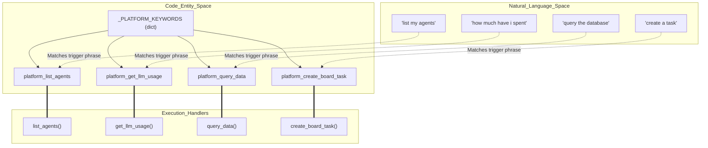
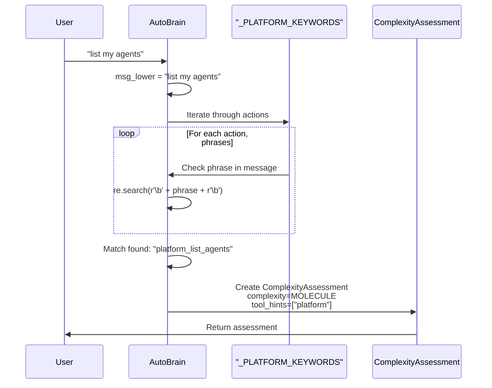
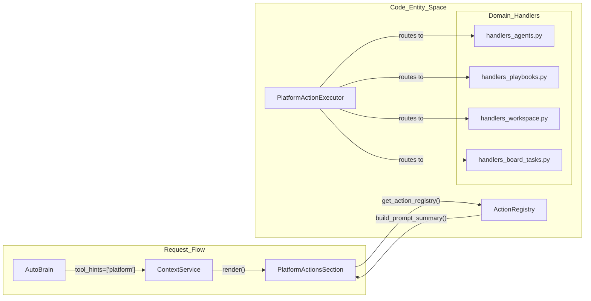

# Platform Actions Discovery

Relevant source files

The following files were used as context for generating this wiki page:

- [docs/PRDS/123-HARNESS-PATTERN-ADOPTION.md](docs/PRDS/123-HARNESS-PATTERN-ADOPTION.md)
- [docs/reviews/COMPOSIO-TOOL-REGRESSION-REVIEW.md](docs/reviews/COMPOSIO-TOOL-REGRESSION-REVIEW.md)
- [orchestrator/api/chat.py](orchestrator/api/chat.py)
- [orchestrator/api/chat_voice.py](orchestrator/api/chat_voice.py)
- [orchestrator/consumers/chatbot/auto.py](orchestrator/consumers/chatbot/auto.py)
- [orchestrator/consumers/chatbot/integration.py](orchestrator/consumers/chatbot/integration.py)
- [orchestrator/consumers/chatbot/intent_classifier.py](orchestrator/consumers/chatbot/intent_classifier.py)
- [orchestrator/consumers/chatbot/personality.py](orchestrator/consumers/chatbot/personality.py)
- [orchestrator/consumers/chatbot/prompt_analyzer.py](orchestrator/consumers/chatbot/prompt_analyzer.py)
- [orchestrator/consumers/chatbot/service.py](orchestrator/consumers/chatbot/service.py)
- [orchestrator/consumers/chatbot/smart_orchestrator.py](orchestrator/consumers/chatbot/smart_orchestrator.py)
- [orchestrator/consumers/chatbot/smart_tool_router.py](orchestrator/consumers/chatbot/smart_tool_router.py)
- [orchestrator/core/llm/manager.py](orchestrator/core/llm/manager.py)
- [orchestrator/core/routing/engine.py](orchestrator/core/routing/engine.py)
- [orchestrator/modules/agents/queries.py](orchestrator/modules/agents/queries.py)
- [orchestrator/modules/context/sections/identity.py](orchestrator/modules/context/sections/identity.py)
- [orchestrator/modules/context/sections/memory.py](orchestrator/modules/context/sections/memory.py)
- [orchestrator/modules/context/sections/platform_actions.py](orchestrator/modules/context/sections/platform_actions.py)
- [orchestrator/modules/context/sections/skills.py](orchestrator/modules/context/sections/skills.py)
- [orchestrator/modules/context/sections/task_context.py](orchestrator/modules/context/sections/task_context.py)
- [orchestrator/modules/context/sections/tools.py](orchestrator/modules/context/sections/tools.py)
- [orchestrator/modules/orchestrator/service.py](orchestrator/modules/orchestrator/service.py)
- [orchestrator/modules/tools/discovery/actions_analytics_enhanced.py](orchestrator/modules/tools/discovery/actions_analytics_enhanced.py)
- [orchestrator/modules/tools/discovery/handlers_analytics_enhanced.py](orchestrator/modules/tools/discovery/handlers_analytics_enhanced.py)
- [orchestrator/modules/tools/discovery/handlers_search.py](orchestrator/modules/tools/discovery/handlers_search.py)
- [orchestrator/modules/tools/discovery/platform_actions.py](orchestrator/modules/tools/discovery/platform_actions.py)
- [orchestrator/modules/tools/discovery/platform_executor.py](orchestrator/modules/tools/discovery/platform_executor.py)
- [orchestrator/modules/tools/tool_router.py](orchestrator/modules/tools/tool_router.py)

This page explains how platform actions are automatically discovered and made available to agents based on user intent. Platform action discovery enables agents to introspect and manage the Automatos platform without manual tool configuration.

For the overall platform action system architecture, see [13.1 Platform Action System](). For confirmation and rate limiting of write actions, see [13.3 Confirmation & Rate Limiting]().

---

## Overview

Platform actions discovery is the process by which the system detects when a user message requires platform management capabilities (e.g., "list my agents", "show workspace stats") and automatically makes the relevant `platform_*` actions available to the responding agent.

Discovery happens in three phases:

1.  **AutoBrain Detection Phase**: Fast keyword matching identifies platform-related queries during complexity assessment [consumers/chatbot/auto.py:115-180]().
2.  **Intent Classification**: The `SmartIntentClassifier` detects `DATA_QUERY` or `EXTERNAL_ACTION` intents using regex patterns [consumers/chatbot/intent_classifier.py:78-131]().
3.  **Tool Loading Phase**: The `ContextService` injects platform actions into the agent's tool set based on detection signals and `tool_hints` [modules/context/sections/platform_actions.py:23-34]().

This decoupling allows lightweight detection (Tier 2 heuristics, <5ms) while deferring the heavier tool loading until agent execution.

**Sources**: [consumers/chatbot/auto.py:1-22](), [modules/tools/discovery/platform_executor.py:1-9](), [consumers/chatbot/intent_classifier.py:1-12]()

---

## AutoBrain Keyword Detection

### Platform Keywords Dictionary

AutoBrain maintains a curated dictionary `_PLATFORM_KEYWORDS` mapping each platform action name to natural language trigger phrases. This enables O(1) keyword matching during Tier 2 heuristic assessment [consumers/chatbot/auto.py:115-180]().

**Natural Language to Code Entity Mapping: Keyword Discovery**

**Sources**: [consumers/chatbot/auto.py:115-180](), [modules/tools/discovery/platform_executor.py:19-152]()

### Match Detection Flow

The detection logic performs word-boundary matching to avoid false positives. This ensures that "list my agents" matches while "agentslist" does not [consumers/chatbot/auto.py:182-195]().

**Sources**: [consumers/chatbot/auto.py:59-82](), [consumers/chatbot/auto.py:115-180]()

---

## Tool Hint Injection

### Complexity Assessment with Platform Hints

When AutoBrain detects a platform keyword, it sets `tool_hints=["platform"]` in the `ComplexityAssessment` [consumers/chatbot/auto.py:70](). This signal propagates through the `SmartChatOrchestrator` to control tool loading and memory decisions [consumers/chatbot/smart_orchestrator.py:181-186]().

**Key effects of platform hints**:
1.  **System LLM Selection**: Ensuring the orchestrator's primary model handles the management task rather than a specialized sub-agent [api/chat.py:38-60]().
2.  **Action Override**: Forcing the action to `RESPOND` directly (Auto responds) rather than delegating to another agent [consumers/chatbot/auto.py:51-57]().
3.  **Context Inclusion**: Signaling the `ContextService` to include platform-specific sections in the final prompt [modules/context/sections/platform_actions.py:1-11]().

**Sources**: [consumers/chatbot/auto.py:58-82](), [consumers/chatbot/smart_orchestrator.py:181-186](), [api/chat.py:38-60]()

---

## CHATBOT Mode Integration

### PlatformActionsSection Loading

When `ContextService` builds context for agent execution (specifically in `CHATBOT` mode), it includes the `PlatformActionsSection` [modules/context/sections/platform_actions.py:23-34](). This section fetches definitions from the `ActionRegistry` [modules/tools/discovery/platform_actions.py:35-55]().

**Platform Action Dispatcher Architecture**

**Sources**: [modules/tools/discovery/platform_executor.py:157-220](), [modules/tools/discovery/platform_actions.py:35-59]()

---

## Tool Loop Prevention

The `ToolExecutionTracker` ensures that platform discovery doesn't lead to infinite execution loops. It implements semantic deduplication and per-tool retry limits (e.g., `query_database` is limited to 2 retries) [consumers/chatbot/service.py:78-105]().

| Tool Name | Retry Limit |
| :--- | :--- |
| `query_database` | 2 |
| `read_file` | 3 |
| `write_file` | 2 |
| `default` | 3 |

**Sources**: [consumers/chatbot/service.py:93-104]()

---

## End-to-End Discovery Flow

The following sequence describes the transition from a natural language request to a database-backed platform action execution:

1.  **Ingestion**: A chat request is received at `/api/chat` [api/chat.py:63]().
2.  **Assessment**: `AutoBrain` performs Tier 2 heuristic matching against `_PLATFORM_KEYWORDS` [consumers/chatbot/auto.py:115-180]().
3.  **Hinting**: Assessment returns `tool_hints=["platform"]` [consumers/chatbot/auto.py:70]().
4.  **Orchestration**: `SmartChatOrchestrator` receives hints and calls `ContextService.build_context` [consumers/chatbot/smart_orchestrator.py:181-194]().
5.  **Context Assembly**: `ContextService` uses `PlatformActionsSection` to load 47+ `platform_*` action definitions into the system prompt [modules/tools/discovery/platform_executor.py:173-220]().
6.  **Execution**: The LLM emits a tool call (e.g., `platform_list_agents`). `PlatformActionExecutor` receives the call and invokes the specific domain handler [modules/tools/discovery/platform_executor.py:166-220]().

**Sources**: [consumers/chatbot/auto.py:115-180](), [consumers/chatbot/smart_orchestrator.py:181-194](), [modules/tools/discovery/platform_executor.py:157-220]()

---

## Performance and Maintenance

### Detection Latency
*   **Tier 1 (Cache)**: <5ms via Redis lookup [consumers/chatbot/auto.py:15]().
*   **Tier 2 (Heuristics)**: <5ms via Regex matching [consumers/chatbot/auto.py:16]().
*   **Tier 3 (LLM)**: ~200ms fallback for ambiguous queries [consumers/chatbot/auto.py:17]().

### Adding New Discovery Keywords
To enable discovery for a new platform feature:
1.  Register the action in `modules/tools/discovery/platform_actions.py` [modules/tools/discovery/platform_actions.py:35-59]().
2.  Add the handler to `PlatformActionExecutor._handlers` in `platform_executor.py` [modules/tools/discovery/platform_executor.py:166-220]().
3.  Add trigger phrases to `_PLATFORM_KEYWORDS` in `auto.py` [consumers/chatbot/auto.py:115-180]().

**Sources**: [consumers/chatbot/auto.py:14-17](), [modules/tools/discovery/platform_executor.py:166-220](), [modules/tools/discovery/platform_actions.py:35-59]()

---