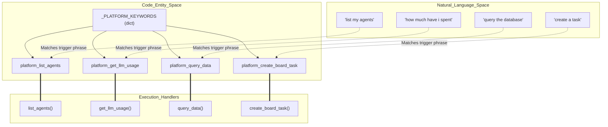
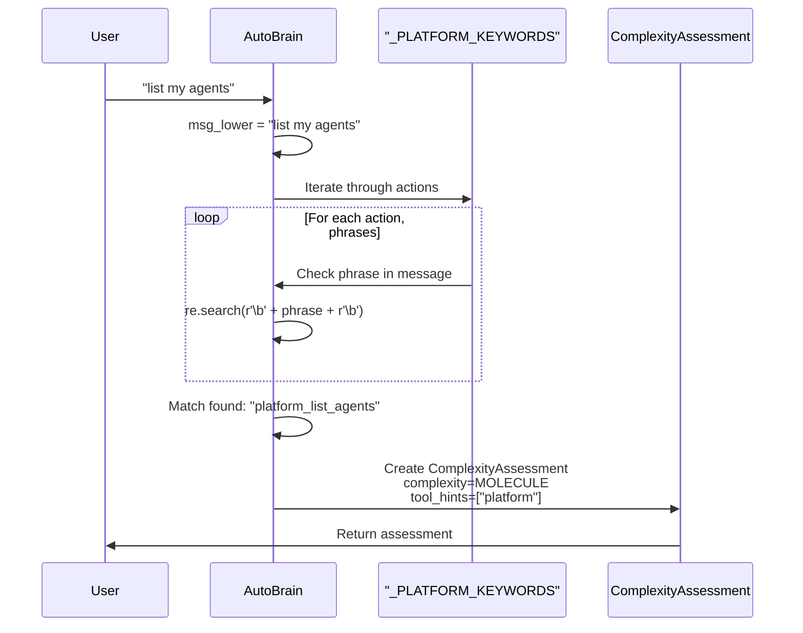
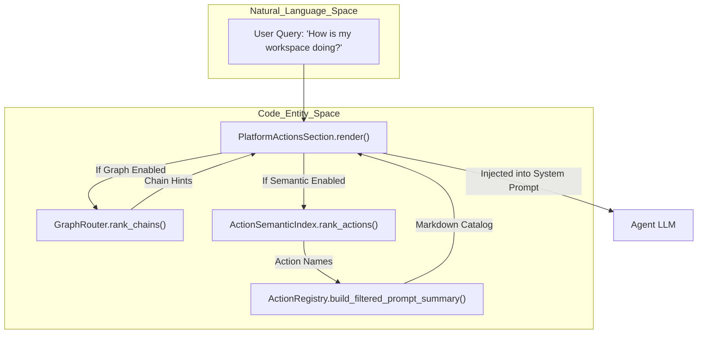
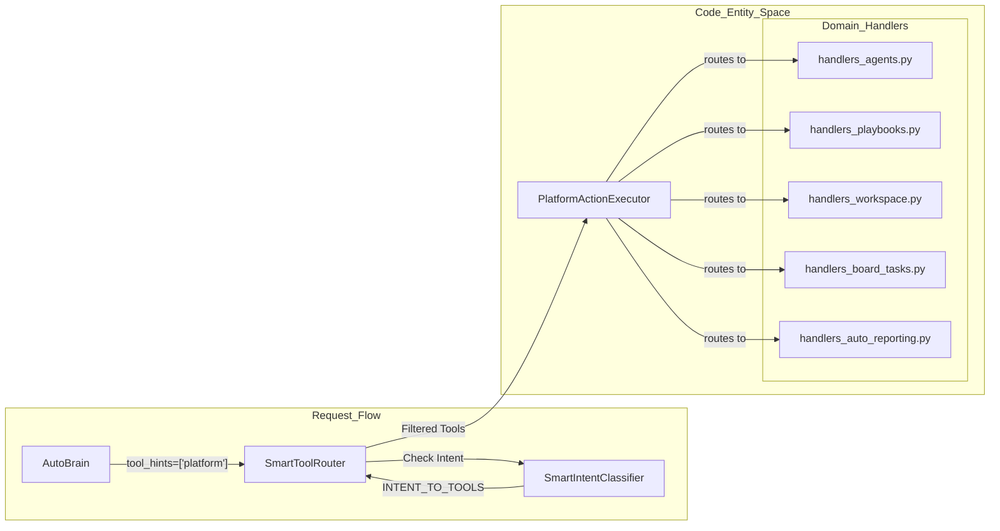

# Platform Actions Discovery

Relevant source files

The following files were used as context for generating this wiki page:

- [docs/PRDS/123-HARNESS-PATTERN-ADOPTION.md](docs/PRDS/123-HARNESS-PATTERN-ADOPTION.md)
- [orchestrator/consumers/chatbot/auto.py](orchestrator/consumers/chatbot/auto.py)
- [orchestrator/core/security/rate_limiter.py](orchestrator/core/security/rate_limiter.py)
- [orchestrator/core/services/auto_reporting.py](orchestrator/core/services/auto_reporting.py)
- [orchestrator/core/services/notification_dispatcher.py](orchestrator/core/services/notification_dispatcher.py)
- [orchestrator/modules/context/sections/composio.py](orchestrator/modules/context/sections/composio.py)
- [orchestrator/modules/context/sections/memory.py](orchestrator/modules/context/sections/memory.py)
- [orchestrator/modules/context/sections/platform_actions.py](orchestrator/modules/context/sections/platform_actions.py)
- [orchestrator/modules/context/sections/playbook_context.py](orchestrator/modules/context/sections/playbook_context.py)
- [orchestrator/modules/context/sections/plugins.py](orchestrator/modules/context/sections/plugins.py)
- [orchestrator/modules/tools/discovery/actions_auto_reporting.py](orchestrator/modules/tools/discovery/actions_auto_reporting.py)
- [orchestrator/modules/tools/discovery/handlers_auto_reporting.py](orchestrator/modules/tools/discovery/handlers_auto_reporting.py)
- [orchestrator/modules/tools/discovery/platform_actions.py](orchestrator/modules/tools/discovery/platform_actions.py)
- [orchestrator/modules/tools/discovery/platform_executor.py](orchestrator/modules/tools/discovery/platform_executor.py)
- [orchestrator/scripts/eval/tool_routing/seed_telemetry.py](orchestrator/scripts/eval/tool_routing/seed_telemetry.py)
- [orchestrator/tests/test_platform_actions_section.py](orchestrator/tests/test_platform_actions_section.py)
- [orchestrator/tests/test_platform_actions_section_graph.py](orchestrator/tests/test_platform_actions_section_graph.py)
- [orchestrator/tests/test_prd128_notification_dispatcher.py](orchestrator/tests/test_prd128_notification_dispatcher.py)

This page explains how platform actions are automatically detected and made available to agents based on user intent. Platform action discovery enables agents to introspect and manage the Automatos platform without manual tool configuration, bridging natural language requests to specific system management capabilities.

For the overall platform action system architecture, see [13.1 Platform Action System](). For confirmation and rate limiting of write actions, see [13.3 Confirmation & Rate Limiting]().

---

## Overview

Platform actions discovery is the process by which the system detects when a user message requires platform management capabilities (e.g., "list my agents", "show workspace stats") and automatically makes the relevant `platform_*` actions available to the responding agent.

Discovery happens in three primary phases:

1.  **AutoBrain Detection Phase**: Fast keyword matching identifies platform-related queries during complexity assessment [orchestrator/consumers/chatbot/auto.py:115-180]().
2.  **Semantic Context Injection**: The `PlatformActionsSection` in the `ContextService` renders a markdown catalog of available actions, optionally filtered by semantic similarity to the user's query [orchestrator/modules/context/sections/platform_actions.py:48-83]().
3.  **Tool Loading Phase**: The `SmartToolRouter` injects platform actions into the agent's tool set based on detection signals, often forcing the use of the system LLM for management tasks via `CHATBOT` mode [orchestrator/consumers/chatbot/smart_tool_router.py:89-109]().

**Sources**: [orchestrator/consumers/chatbot/auto.py:1-22](), [orchestrator/modules/context/sections/platform_actions.py:1-18](), [orchestrator/consumers/chatbot/smart_tool_router.py:40-51]()

---

## AutoBrain Keyword Detection

### Platform Keywords Dictionary

AutoBrain maintains a curated dictionary `_PLATFORM_KEYWORDS` mapping each platform action name to natural language trigger phrases. This enables O(1) keyword matching during Tier 2 heuristic assessment [orchestrator/consumers/chatbot/auto.py:115-180]().

**Natural Language to Code Entity Mapping: Keyword Discovery**

**Sources**: [orchestrator/consumers/chatbot/auto.py:115-180](), [orchestrator/modules/tools/discovery/platform_executor.py:19-152]()

### Match Detection Flow

The detection logic performs word-boundary matching to avoid false positives. This ensures that "list my agents" matches while "agentslist" does not [orchestrator/consumers/chatbot/auto.py:115-180]().

**Sources**: [orchestrator/consumers/chatbot/auto.py:59-82](), [orchestrator/consumers/chatbot/auto.py:115-180]()

---

## Semantic Discovery & Context Injection

### PlatformActionsSection
The `PlatformActionsSection` (Priority 5) is responsible for injecting the catalog of available `platform_execute` actions into the system prompt [orchestrator/modules/context/sections/platform_actions.py:30-40](). It replaces the legacy inline injection found in `smart_orchestrator.py` and `agent_factory.py` [orchestrator/modules/context/sections/platform_actions.py:14-18]().

### Semantic Tool Routing (PRD-138)
When `SEMANTIC_TOOL_ROUTING` is enabled, the section uses `ActionSemanticIndex` to rank actions by similarity to the user's query [orchestrator/modules/context/sections/platform_actions.py:7-10](). This prevents prompt bloat by only showing the Top-K relevant actions [orchestrator/modules/context/sections/platform_actions.py:109-116]().

### Graph-Based Discovery (PRD-138 US-004)
If `TOOL_ROUTING_GRAPH` is enabled, the system attempts to rank action "chains" [orchestrator/modules/context/sections/platform_actions.py:68-70](). This provides the LLM with hints about likely multi-action sequences, such as `platform_list_agents` followed by `platform_get_agent` [orchestrator/modules/context/sections/platform_actions.py:188-192]().

**Discovery Context Pipeline**

**Sources**: [orchestrator/modules/context/sections/platform_actions.py:48-83](), [orchestrator/modules/context/sections/platform_actions.py:134-170](), [orchestrator/modules/context/sections/platform_actions.py:188-192]()

---

## CHATBOT Mode Integration

### Tool Hint Injection
When AutoBrain detects a platform keyword, it sets `tool_hints=["platform"]` in the `ComplexityAssessment` [orchestrator/consumers/chatbot/auto.py:70-71](). This signal propagates through the chat pipeline to ensure the orchestrator's primary model (Auto-CTO) handles the management task [orchestrator/api/chat.py:42-45]().

### Platform Action Dispatcher Architecture
The `PlatformActionExecutor` acts as a thin dispatcher, routing calls to specific domain handlers like `handlers_agents.py` or `handlers_analytics.py` [orchestrator/modules/tools/discovery/platform_executor.py:1-9]().

**Sources**: [orchestrator/modules/tools/discovery/platform_executor.py:19-152](), [orchestrator/consumers/chatbot/smart_tool_router.py:112-125](), [orchestrator/modules/tools/discovery/platform_actions.py:35-59]()

---

## Performance and Maintenance

### Detection Latency
*   **Tier 1 (Cache)**: <5ms via Redis lookup [orchestrator/consumers/chatbot/auto.py:15]().
*   **Tier 2 (Heuristics)**: <5ms via Regex matching [orchestrator/consumers/chatbot/auto.py:16]().
*   **Tier 3 (LLM)**: ~200ms fallback for ambiguous queries [orchestrator/consumers/chatbot/auto.py:17]().

### Telemetry & Cold-Start
For cold-start pipeline validation, the system uses synthetic telemetry generated from eval training queries [orchestrator/scripts/eval/tool_routing/seed_telemetry.py:1-8](). This seeds `ToolExecutionLog` rows with realistic agent bias and multi-action turn grouping to train the discovery index [orchestrator/scripts/eval/tool_routing/seed_telemetry.py:40-48]().

### Adding New Discovery Keywords
To enable discovery for a new platform feature:
1.  Register the action in `orchestrator/modules/tools/discovery/platform_actions.py` [orchestrator/modules/tools/discovery/platform_actions.py:35-59]().
2.  Add the handler to `PlatformActionExecutor` in `platform_executor.py` [orchestrator/modules/tools/discovery/platform_executor.py:19-152]().
3.  Add trigger phrases to `_PLATFORM_KEYWORDS` in `auto.py` [orchestrator/consumers/chatbot/auto.py:115-180]().

**Sources**: [orchestrator/consumers/chatbot/auto.py:14-17](), [orchestrator/modules/tools/discovery/platform_executor.py:19-152](), [orchestrator/modules/tools/discovery/platform_actions.py:35-59](), [orchestrator/scripts/eval/tool_routing/seed_telemetry.py:1-8]()

---