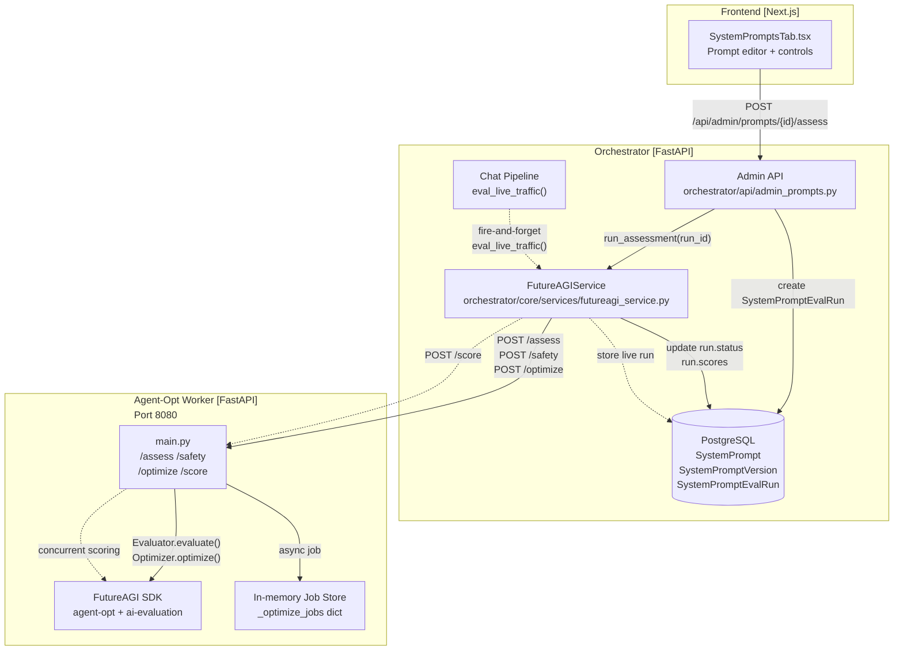
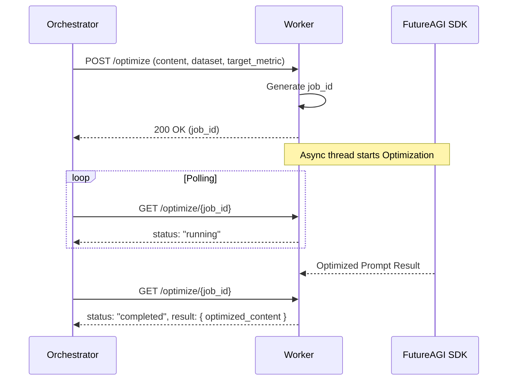

# Prompt Optimization

Relevant source files

The following files were used as context for generating this wiki page:

- [frontend/components/settings/SystemPromptsTab.tsx](frontend/components/settings/SystemPromptsTab.tsx)
- [orchestrator/core/services/futureagi_service.py](orchestrator/core/services/futureagi_service.py)
- [services/agent-opt-worker/Dockerfile](services/agent-opt-worker/Dockerfile)
- [services/agent-opt-worker/automatos_logging.py](services/agent-opt-worker/automatos_logging.py)
- [services/agent-opt-worker/automatos_metrics.py](services/agent-opt-worker/automatos_metrics.py)
- [services/agent-opt-worker/main.py](services/agent-opt-worker/main.py)
- [services/agent-opt-worker/requirements.txt](services/agent-opt-worker/requirements.txt)
- [services/shared/automatos_logging.py](services/shared/automatos_logging.py)
- [services/shared/automatos_metrics.py](services/shared/automatos_metrics.py)
- [services/workspace-worker/automatos_logging.py](services/workspace-worker/automatos_logging.py)
- [services/workspace-worker/automatos_metrics.py](services/workspace-worker/automatos_metrics.py)

The prompt optimization system provides FutureAGI-powered assessment, safety checking, and optimization for system prompts. This system evaluates prompt quality using structured metric templates, runs safety scans to detect harmful content, and optimizes prompts using algorithms like meta-prompt learning and Bayesian search. The architecture isolates the FutureAGI SDK in a dedicated worker service to avoid dependency conflicts with the main orchestrator.

For agent-specific prompt assembly and context building, see [Context Service](#4). For general system configuration, see [Authentication & Multi-Tenancy](#17).

---

## Architecture Overview

The prompt optimization system uses a two-service architecture to isolate FutureAGI SDK dependencies from the main orchestrator. The `FutureAGIService` in the orchestrator acts as a thin client, routing all heavy computation to the `agent-opt-worker`.

### System Interaction Diagram

**Sources:** [orchestrator/core/services/futureagi_service.py:5-10](), [orchestrator/core/services/futureagi_service.py:45-112](), [services/agent-opt-worker/main.py:1-16]()

---

## System Prompt Management

System prompts are versioned content templates stored in the database. Each prompt has multiple versions, with one marked as `active`. The system tracks evaluation scores per version and supports rollback. The `futureagi_eval_enabled` flag determines if live traffic scoring is active for a specific prompt.

For details, see [System Prompt Management](#15.1).

### Database Entities

| Interface | Purpose | Key Fields |
|-----------|---------|------------|
| `SystemPrompt` | Metadata & Settings | `slug`, `display_name`, `futureagi_eval_enabled`, `active_version_number` |
| `PromptVersion` | Versioned content | `version_number`, `content`, `change_note`, `eval_scores` |
| `AssessmentRun` | Job tracking | `run_type`, `status`, `scores`, `error_message` |

**Sources:** [frontend/components/settings/SystemPromptsTab.tsx:34-73]()

---

## Prompt Evaluation

Prompt evaluation assesses quality using structured metric templates. The `FutureAGIService` collects real chat exchanges (input/output pairs) from the `chat_messages` table to ensure scoring is grounded in real-world usage rather than just synthetic outputs.

For details, see [Prompt Evaluation](#15.2).

### Assessment Flow

1.  **Trigger:** User initiates assessment via `SystemPromptsTab.tsx`.
2.  **Data Collection:** `FutureAGIService` pulls the most recent chat exchange for that prompt [orchestrator/core/services/futureagi_service.py:136-141]().
3.  **Worker Dispatch:** Orchestrator calls `/assess` on the worker with `prompt_content` and `test_cases` [orchestrator/core/services/futureagi_service.py:145]().
4.  **SDK Execution:** Worker uses `fi.evals.Evaluator` to run templates like `completeness` or `is_helpful` [services/agent-opt-worker/main.py:63-74]().

**Sources:** [orchestrator/core/services/futureagi_service.py:118-145](), [services/agent-opt-worker/main.py:223-245]()

---

## Live Traffic Scoring

Live traffic scoring provides continuous quality monitoring by scoring every exchange in a chat session when enabled. This is implemented as a fire-and-forget background task to ensure it never blocks the user's chat response.

For details, see [Live Traffic Scoring](#15.3).

### Scoring Templates

| Template | Model | Purpose |
|----------|-------|---------|
| `completeness` | `turing_large` | Checks if the response addresses all parts of the input. |
| `groundedness` | `turing_large` | Verifies the output is based on the provided context. |
| `toxicity` | `protect` | Safety check for harmful content. |
| `bias_detection` | `protect_flash` | Scans for biased language. |

**Sources:** [services/agent-opt-worker/main.py:129-141]()

---

## Prompt Optimization

Prompt optimization uses the `agent-opt` library to iteratively improve prompt content based on a target metric (e.g., `is_helpful`). Because optimization involves multiple LLM "teacher" rounds, it is handled as an asynchronous job.

For details, see [Prompt Optimization Jobs](#15.4).

### Optimization Job Pattern

**Sources:** [services/agent-opt-worker/main.py:164-196](), [orchestrator/core/services/futureagi_service.py:161-182]()

---

## Agent-Opt Worker Service

The `agent-opt-worker` is a standalone FastAPI service containerized to house the `agent-opt` and `ai-evaluation` dependencies. It utilizes a `ThreadPoolExecutor` to handle concurrent scoring requests efficiently.

For details, see [Agent-Opt Worker Service](#15.5).

### Key Components

-   **FastAPI Application:** Defined in `services/agent-opt-worker/main.py` [services/agent-opt-worker/main.py:37]().
-   **Metrics & Logging:** Integrates `add_fastapi_metrics` and `setup_logging` for platform-wide observability [services/agent-opt-worker/main.py:34-40](). These shared modules are located at [services/agent-opt-worker/automatos_logging.py:1-191]() and [services/agent-opt-worker/automatos_metrics.py:1-130]().
-   **Dependency Management:** Uses `python:3.11-slim` with specific SDK versions including `agent-opt==0.0.1` [services/agent-opt-worker/requirements.txt:1-7]().

**Sources:** [services/agent-opt-worker/Dockerfile:1-15](), [services/agent-opt-worker/main.py:26-35](), [services/agent-opt-worker/automatos_logging.py:1-191](), [services/agent-opt-worker/automatos_metrics.py:1-130]()

---